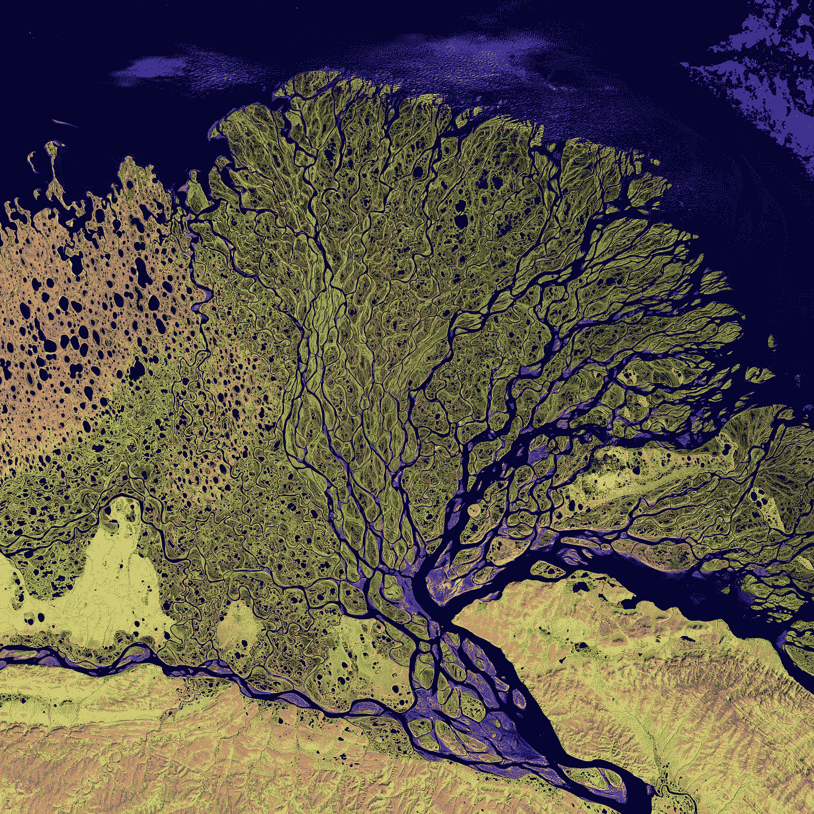
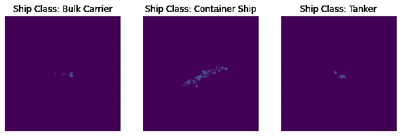
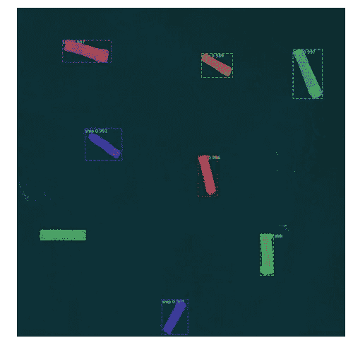
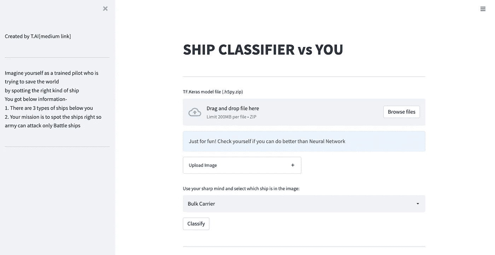

# 关于卫星图像的激动人心的机器学习项目

> 原文：<https://towardsdatascience.com/exciting-machine-learning-project-on-satellite-images-a4214e275863?source=collection_archive---------9----------------------->

## 使用机器学习从卫星图像中检测和分类船只，并在 Web 应用程序中部署该模型



美国地质勘探局在 [Unsplash](https://unsplash.com?utm_source=medium&utm_medium=referral) 上拍摄的照片

## 介绍

处理卫星图像很有意思。就我个人而言，如果有人问我为什么选择在数据科学领域。我必须告诉你，在数据科学中有太多的选项可供你选择。简而言之，基本的咒语是-

> 因为数据无处不在，你可以选择成为任何东西。

我觉得数据科学比其他领域给你更多的自由。例如，从卫星上获得的图像，如果我必须戴上太空研究科学家的帽子来识别海里的船只，我可以做到。在数据科学领域，如果我得到正确的数据，我肯定可以成为一名太空研究科学家。

当我偶然发现来自[欧洲航天局](https://www.esa.int/)的数据集时，我很好奇将机器学习应用到真实的卫星图像上，看看我能从中获得什么。

这是一个简单的项目，获取图像，可视化的图像和训练神经网络模型。我们将使用哨兵 2 号的卫星图像。

在这个项目中，你不仅要建立一个模型来分类船只，还要部署这个模型并围绕它建立一个有趣的网络应用程序。

如果你好奇，下面是用来跟踪地球的主要卫星

> 哥白尼哨兵 1 号卫星——监测海冰、海风、石油泄漏和海上航行。
> 
> 哥白尼哨兵 2 号卫星——监测海洋和沿海地区
> 
> 哥白尼哨兵 3 号——收集海洋颜色和表面温度
> 
> 哥白尼哨兵 6 号和杰森 3 号卫星——用于监测气候

现在对于这个项目，我们将使用来自 Sentinal-1 的图像，我们将尝试检测和分类船只类型。这个项目有许多用例。例如，您可以随时估计海上交通，从而以更好的方式设计海上导航系统。

[深蓝全球](https://www.eumetsat.int/science-blog/inspiring-ocean-projects-developed-copernicus-hackathon-weekend)是一家初创公司，在哥白尼黑客马拉松[1]中做了类似的工作。

# 戏弄者

如果你想知道最终会是什么样子，请看下面的视频，完整的代码可以在 Github 上找到

Wedapp 跑步视频

# 数据

来自 sentinal-1 卫星的图像已经收集并作为 OPENSAR 船舶数据集公开。你可以从 Wekeo [链接这里](https://jupyterhub-wekeo.apps.eumetsat.dpi.wekeo.eu/user/tejeshbat/lab?ticket=ST-e80602ca69dc4bd781c044cdb770db67-identity.apps.mercator.dpi.wekeo.eu)下载数据集。(您可能需要注册才能访问数据)

## 数据存取

“哥白尼提供的绝大多数数据/信息都是免费、完整和开放的，任何公民和世界各地的任何组织**都可以获得。”【** [**哥白尼官网**](https://www.copernicus.eu/en/access-data)**】**

您可以前往[此链接](https://www.copernicus.eu/en/access-data)查看如何访问打开的数据集。由于卫星每天产生万亿字节的数据，你可以去 [Wekeo 网站](https://jupyterhub-wekeo.apps.eumetsat.dpi.wekeo.eu/user/tejeshbat/lab?ticket=ST-e80602ca69dc4bd781c044cdb770db67-identity.apps.mercator.dpi.wekeo.eu)注册获取这个项目的处理和压缩图像。

该数据集由 2805 幅图像组成，其中每幅图像都被标记为下面三艘船中的一艘。

1.  散装货轮
2.  货柜船
3.  邮轮；罐车；坦克手

样本图像可以在下面看到。虽然看起来图像中只有细微的差别，但我们希望我们的 ML 模型能够比人类更准确地检测和分类船只。



样本图像——来自 Sentinal-1 的真实卫星图像[ [来源](https://jupyterhub-wekeo.apps.eumetsat.dpi.wekeo.eu/user/tejeshbat/lab?ticket=ST-e80602ca69dc4bd781c044cdb770db67-identity.apps.mercator.dpi.wekeo.eu)

如果你在寻找类似的项目和不同的数据集，你可以看看 [Kaggle 数据集](https://www.kaggle.com/c/airbus-ship-detection/data)。



分割和船只检测[ [来源](/deep-learning-for-ship-detection-and-segmentation-71d223aca649)

Abhinav Sagar 发布了一个卫星图像模型，你可以通过分割技术检测卫星图像中的船只。

[](/deep-learning-for-ship-detection-and-segmentation-71d223aca649) [## 用于船只检测和分割的深度学习

### 卫星图像深度学习的端到端管道

towardsdatascience.com](/deep-learning-for-ship-detection-and-segmentation-71d223aca649) 

但是在这个项目中，我们不仅要检测船只，还要对船只进行分类。这是可能的，因为我们这里有一个带标签的数据集，因此我们将实现一个监督模型。

# 履行

该项目的实施分为两个部分

1.  分类
2.  Web 应用程序

在分类中，我们将研究分类神经网络模型的代码和实现技术，在 web 应用程序部分，我们将研究基于 streamlit 的 web 应用程序的构建，用户可以在该应用程序中与我们开发的 ML 模型进行对比，从卫星图像中检测船只。

您可以通过点击这里的直接跳转到 Colab 文件中的实现

[](https://github.com/tejeshb/Satellite_Imagery_ML/blob/main/Satellite_imagery.ipynb) [## Satellite _ Imagery _ ML/Satellite _ Imagery . ipynb at main tejeshb/Satellite _ Imagery _ ML

### 从卫星图像中检测和分类船只-Satellite _ Imagery _ ML/Satellite _ Imagery . ipynb at main…

github.com](https://github.com/tejeshb/Satellite_Imagery_ML/blob/main/Satellite_imagery.ipynb) 

我使用 VGG16 模型进行迁移学习，该模型已经在图像上进行了预训练。在导入必要的库之后，您可以跳到 ML 模型的实现，因为所提供的数据集中的数据已经被清理，并且所有图像都是大小为(128，128)的 numpy 格式

要实例化 VGG16，请确保设置了以下参数

```
vgg = VGG16(include_top=False,weights=None,
            input_tensor=inputs,pooling='avg')
```

由于图像是(128，128)形状，将输入设置为如下

```
inputs = tf.keras.layers.Input(shape=(128,128,1))
```

之后，确保创建 2 密集和辍学层如下

```
dense1 = tf.keras.layers.Dense(512, activation='relu')(vgg.output)dropout1 = tf.keras.layers.Dropout(0.5)(dense1)dense2 = tf.keras.layers.Dense(128, activation='relu')(dropout1)dropout2 = tf.keras.layers.Dropout(0.5)(dense2)pred = tf.keras.layers.Dense(3, activation='softmax')(dropout2)
```

对于密集层，使用“relu”激活函数，而对于预测或输出的最后一层，使用“softmax”激活函数。

请参见下面的完整型号摘要

```
Model: "model" _________________________________________________________________  Layer (type)                Output Shape              Param #    =================================================================  input_1 (InputLayer)        [(None, 128, 128, 1)]     0                                                                             block1_conv1 (Conv2D)       (None, 128, 128, 64)      640                                                                           block1_conv2 (Conv2D)       (None, 128, 128, 64)      36928                                                                         block1_pool (MaxPooling2D)  (None, 64, 64, 64)        0                                                                             block2_conv1 (Conv2D)       (None, 64, 64, 128)       73856                                                                         block2_conv2 (Conv2D)       (None, 64, 64, 128)       147584                                                                        block2_pool (MaxPooling2D)  (None, 32, 32, 128)       0                                                                             block3_conv1 (Conv2D)       (None, 32, 32, 256)       295168                                                                        block3_conv2 (Conv2D)       (None, 32, 32, 256)       590080                                                                        block3_conv3 (Conv2D)       (None, 32, 32, 256)       590080                                                                        block3_pool (MaxPooling2D)  (None, 16, 16, 256)       0                                                                             block4_conv1 (Conv2D)       (None, 16, 16, 512)       1180160                                                                       block4_conv2 (Conv2D)       (None, 16, 16, 512)       2359808                                                                       block4_conv3 (Conv2D)       (None, 16, 16, 512)       2359808                                                                       block4_pool (MaxPooling2D)  (None, 8, 8, 512)         0                                                                             block5_conv1 (Conv2D)       (None, 8, 8, 512)         2359808                                                                       block5_conv2 (Conv2D)       (None, 8, 8, 512)         2359808                                                                       block5_conv3 (Conv2D)       (None, 8, 8, 512)         2359808                                                                       block5_pool (MaxPooling2D)  (None, 4, 4, 512)         0                                                                             global_average_pooling2d (G  (None, 512)              0           lobalAveragePooling2D)                                                                                                              dense (Dense)               (None, 512)               262656                                                                        dropout (Dropout)           (None, 512)               0                                                                             dense_1 (Dense)             (None, 128)               65664                                                                         dropout_1 (Dropout)         (None, 128)               0                                                                             dense_2 (Dense)             (None, 3)                 387                                                                          ================================================================= Total params: 15,042,243 Trainable params: 15,042,243 Non-trainable params: 0 _________________________________________________________________
```

使用下面的代码训练模型

```
import multiprocessing
from timeit import default_timer as timerstart = timer()cpu_count = multiprocessing.cpu_count()
print(f"cpu: {cpu_count} found")
      model.fit(X_train, y_train,
      batch_size=12,
      epochs=50,
      verbose=1,
      validation_data=(X_test, y_test),
      steps_per_epoch = 25,
      max_queue_size=10,
      workers=cpu_count,
      use_multiprocessing=cpu_count > 1,
      callbacks=[check, log])end = timer()
print('Elapsed time: ' + str(end - start))
```

在模型训练之后，确保下载模型— vgg.h5。

为了测试模型是如何工作和执行的，我们必须检查模型指标，比如准确性。但是我现在不在这个项目中讨论它，因为 1。主要的想法不是得到最好的模型，而是学习过程。2.我有一个更好更有趣的想法来测试这个模型。

# 有趣的部分—网络应用

想象你自己是一名**数据科学家，必须帮助飞行员**，他试图通过发现正确的船只种类来拯救世界
你得到以下信息-

> 1.图片中有 3 种类型的船
> 2。你的任务是正确发现船只，这样飞行员就可以只攻击战列舰。

现在，你认为什么是最好的主意？使用你建立的模型或者依靠人类的专业知识。

让我们使用一个 web 应用程序来测试一下，您可以上传模型和您想要检查的图像。

允许用户猜测图像中的船是哪一种，然后运行模型来检查谁是正确的。

为这项有趣的活动设计的网络应用程序如下所示



Web 应用程序—船舶分类器

为了构建和部署 web 应用程序，我使用了 Streamlit 库，实现代码如下所示。

在这里，我上传了一个 h5 格式的模型压缩文件，并对文件进行了解压缩。使用`load_model()`加载模型

之后，使用下面的代码完成图像上传后的模型预测。在这里，调整图像的大小非常重要，因为我们有模型的输入形状(128，128)，你需要确保模型预测的图像应该是准确的形状。

让我们来测试这个模型，你可以在这个视频中看到最终的结果

Wedapp 跑步视频

我希望你有这个有趣的项目建设的乐趣，如果你对此有任何问题，请随时留下评论。

# 参考:

1.  [https://www . eumetsat . int/science-blog/inspiring-ocean-projects-developed-Copernicus-hackathon-weekend](https://www.eumetsat.int/science-blog/inspiring-ocean-projects-developed-copernicus-hackathon-weekend)
2.  数据来源—[https://www.copernicus.eu/en/access-data](https://www.copernicus.eu/en/access-data)
3.  数据集使用许可-[https://www.copernicus.eu/en/access-data/dias](https://www.copernicus.eu/en/access-data/dias)