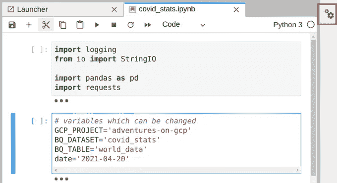

# 在无服务器 GCP 产品上运行 Jupyter 笔记本

> 原文：<https://towardsdatascience.com/executing-jupyter-notebooks-on-serverless-gcp-products-23d1e35eb150?source=collection_archive---------22----------------------->


亚历杭德罗·埃斯卡米拉在 [Unsplash](https://unsplash.com?utm_source=medium&utm_medium=referral) 上的照片

Jupyter 笔记本是数据科学和分析的绝佳工具。它们是在 Jupyter 笔记本服务器上开发的，这些服务器可以在本地安装和运行以进行开发。它通常始于探索、开发、制作原型、摆弄数据。例如，探索 Covid 数据加载为 CSV 文件，来自[我们的世界数据](https://ourworldindata.org/coronavirus-source-data)。您会看到这里有全世界的统计数据，您希望跟踪这些数据，并每天将其写入 BigQuery 表:)这样的笔记本看起来像这样:

好了，您已经完成了开发，您已经进行了测试，它运行正常，所以现在您要设置一些日常任务来每天运行它。由于这不是一个关于计算消费的复杂任务，它可以部署在一些无服务器的服务上，如云运行或云功能，因为这些产品有按使用付费的计费和慷慨的免费层，所以我们无论如何都不会为此付费。我们将使用库 [Papermill](https://papermill.readthedocs.io/en/latest/) ，它支持 Jupyter 笔记本的执行以及输入参数的支持。

完整的 Github 库在这里是。

设置这一点需要几个步骤:

## 1.在 web 应用程序中包装执行

Jupyter Notebook 将在一个 HTTP 请求中执行，所以我添加 Flask 作为轻量级 web 框架来包装执行。使用 Papermill 执行笔记本也很简单。由于“日期”是将被更改并在笔记本中用作输入变量的东西，因此需要在“参数”变量中传递它。输入日期可以作为请求中的参数传递，如果没有输入日期，则使用“昨天”的日期。此类 web 应用程序的代码如下所示:

```
import datetime
import logging

from flask import Flask
import papermill as pm

app = Flask(__name__)

@app.route('/')
def main(request=None):
    logging.info("starting job")
    input_date = ''
    if request:
        input_date = request.args.get('input_date', '')
    if not input_date:
        input_date = (datetime.datetime.now() - datetime.timedelta(days=1)).strftime('%Y-%m-%d')

    parameters = {
        'date': input_date
    }
    pm.execute_notebook(
        'covid_stats.ipynb',
        '/tmp/covid_stats_out.ipynb',
        parameters=parameters
    )
    logging.info("job completed")
    return 'ok'

if __name__ == '__main__':
    import os

    port = os.environ.get('PORT', '8080')
    app.run(port=port)
```

paper mill**execute _ notebook**函数的输入参数为输入输出笔记本以及笔记本“参数”。我将输出笔记本保存到“/tmp”文件夹中，因为在谷歌云无服务器产品中，“/tmp”通常是唯一可以写文件的地方。

## 2.在笔记本中设置参数

为了让 Papermill 识别笔记本中的输入参数，需要创建一个包含参数的特殊单元格。需要做的第二件重要的事情是为这个单元格添加标签“参数”。根据您使用的是 Jupyter 还是 JupyterLab，这可以通过多种方式实现:

首先，选择带有输入变量的单元格

如果使用 **Jupyter，**点击**视图- >单元格工具栏- >标签。**你会看到在单元格顶部的右角文本字段中你可以输入一个标签或者在单元格左上角现有的标签。


如果你正在使用 **JupyterLab** ，点击右上角的设置，



然后点击添加标签按钮，并输入“参数”。另一种方法是以 JSON 格式直接写入单元格元数据。


## 3.部署

正如我在开始时提到的，有几个选项可以部署这些代码。由于这是一个简单的、不需要太多时间和资源消耗的任务，我们可以在 Google Cloud 上部署基本上任何无服务器的计算产品。

## 云函数

用于部署的 bash 脚本可能如下所示:

```
#!/bin/bash

# set GCP_PROJECT (env) variable
CLOUD_FUNCTION_NAME=cf-jn

gcloud functions deploy $CLOUD_FUNCTION_NAME \
  --project $GCP_PROJECT \
  --entry-point main \
  --runtime python37 \
  --trigger-http \
  --memory 512Mi \
  --timeout 180 \
  --allow-unauthenticated
```

## 云运行

部署脚本

```
#!/bin/bash

# set GCP_PROJECT (env) variable
CLOUD_RUN_NAME=cr-jn

gcloud beta run deploy $CLOUD_RUN_NAME \
  --project $GCP_PROJECT \
  --memory 512Mi \
  --source . \
  --platform managed \
  --allow-unauthenticated
```

我省略了 [**应用引擎**](https://cloud.google.com/appengine) ，因为它需要一个额外的配置文件:)但是部署命令是类似的。我在两个部署中都设置了未经认证的访问，这意味着它们可以从整个互联网上访问，当然在现实生活中，只允许某些帐户访问是件好事。

## 结论

Jupyter 笔记本通常用于处理大型数据集，因此需要大量的 RAM 内存和 CPU 资源，并为此需要专用的虚拟机。另一方面，有些情况并非如此，因此在一些 Google Cloud 无服务器计算产品上部署和执行它们非常有意义，因为它隐藏了资源供应，提供了简单的部署，并且节省了资金。

最后，在 Google Cloud 上， [Cloud Scheduler](https://cloud.google.com/scheduler) 可用于定期(每天)调用带有 HTTP 请求的已部署 web 应用程序。