# 一般期望最大化和高斯混合

> 原文：<https://towardsdatascience.com/expectation-maximization-in-general-and-for-gaussian-mixtures-bcb0a4d64d21?source=collection_archive---------25----------------------->

## [入门](https://towardsdatascience.com/tagged/getting-started)

## EM 背后的理论和直觉以及 Python 中的例子

照片由[雅各布·欧文斯](https://unsplash.com/@jakobowens1?utm_source=medium&utm_medium=referral)在 [Unsplash](https://unsplash.com?utm_source=medium&utm_medium=referral) 上拍摄

在统计推断中，我们希望找到给定观测数据的最佳模型参数。在频率主义者看来，这是关于最大化可能性(MLE)。在贝叶斯推断中，这是在最大化后验概率。当我们最大化似然性(通常是对数似然性，因为它具有单调变换和数值稳定性的优点，所以更容易优化)时，我们会问，

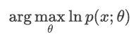

然而，如果存在潜在的变量呢？意思是如果用 *θ* 参数生成隐变量 *z* 和观测数据 *x* 的模型？我们需要解决表单的 MLE，

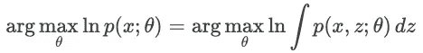

我们现在需要边缘化 z，所以我们最大化边际对数似然。让我们用一个例子来看看为什么这很难。

# **动机**

考虑下面的高斯混合，包括 *K* 高斯分布，

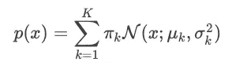

其中，π是混合系数，表示每个分量的高斯比例。 *π* 具有和等于 1 的性质，即 *∑πₖ=1* 。这确保了 *p(x)* 是一个概率密度函数。

似然函数和对数似然是，

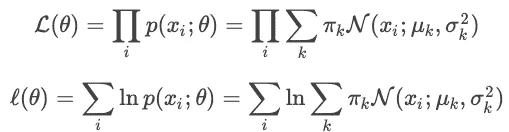

其中*θ∈{πₖ,μₖ,σ*ₖ},k∈{1*..K}*

我们可以通过求导来最大化对数可能性。让我们试试这个模型的一个参数， *μₖ* 。我们将使用*ϕₖ(xᵢ)=n(xᵢ；μₖ,σ* *ₖ)* 为了简化下面的注释，

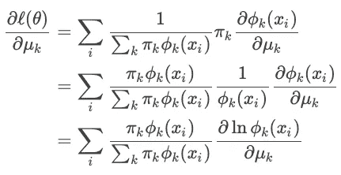

我们看到有一个问题。表达式*∂*ln*ϕₖ(xᵢ)/∂μₖ*很熟悉，它只是单高斯对数似然的导数——我们可以用它来估计模型参数。然而，现在前面有一个*权重*项 *πₖϕₖ(xᵢ)/∑ₖπₖϕₖ(xᵢ)* ，所以这就好像我们在最大化一个加权对数似然。不幸的是，这个*权重*项依赖于我们也试图估计的模型参数——这就是问题所在。

我们将以不同的方式重构高斯混合，并直观地看到我们如何潜在地估计模型参数。我们将创建一个潜在变量 *z∈{1..K}* 表示给定的数据点来自第 *k 个*高斯。我们定义，

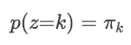

这样，条件分布、联合分布和边际分布就是，

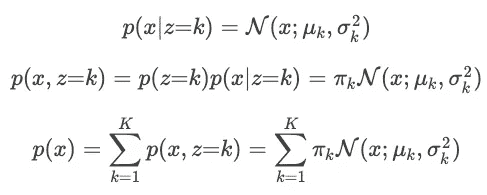

这将高斯混合分解为潜在变量 *z* 和模型参数 *θ* 。这似乎使模型更加复杂了。但是现在，有了这个公式，我们看到，如果我们知道这些变量中的一个，我们就可以推导出另一个。

**知道** *θ* :如果我们确切知道模型参数 *θ* ，就可以算出每个数据点来自哪个高斯。数据点来自第 *k 个*高斯的概率是，

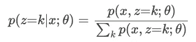

事实上，这是我们之前导数中的*权重*项，是我们的 *z* 的后验概率。

**知道 *z*** :如果我们知道 *z* ，即数据来自哪个高斯，我们不再需要对所有的 *K* 高斯(*σp(x，z)* )求和来最大化我们的边际似然。相反，我们关注来自第 *k* 高斯的 *x* 的每个子集，并且可以用 MLE 估计 *θₖ* ，

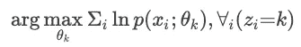

然而，由此我们看到了第 22 条军规，即。如果我们知道数据点来自哪个高斯(隐变量 *z* )，那么我们就可以最大化我们的对数似然，得到我们的模型参数的估计；如果知道了模型参数，就可以计算出 *z* 的后验概率来估计每个数据点来自哪个高斯。

事实上，这是 EM 背后的直觉，我们将在下一节中形式化它。不是同时导出最优隐藏变量 *z* 和模型参数 *θ* ，而是轮流优化每一个，直到我们收敛。

**Python 示例**

作为一个例子，让我们生成下面的两分量高斯混合，

视觉上，这看起来像

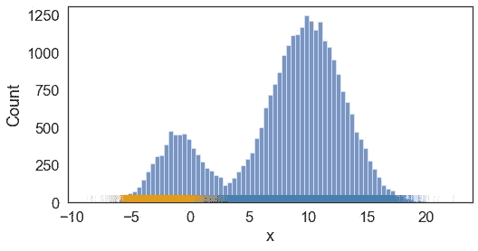

观察数据的密度直方图以蓝色显示。橙色/蓝色代码显示每个数据点来自哪个高斯分量(两个分量中的一个)。图片作者。

利用已知的 *θ* ，我们看到得到的预测标签(颜色编码)与我们预期的相匹配，

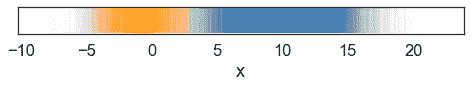

基于已知模型参数对 *z* (每个数据点来自哪个分量高斯)的估计。橙色/蓝色表示第一/第二分量高斯。图片作者。

利用已知的 *z* ，我们可以重构概率密度函数，

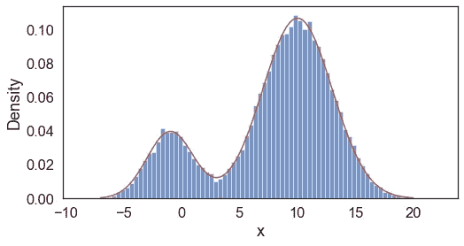

基于已知 *z* 的模型参数估计(基于红色显示的估计参数生成的 PDF)。观察数据的密度直方图以蓝色显示。图片作者。

# **EM 算法**

我们的目标是最大化具有潜在变量的模型的对数边际似然。因为这个表达式在对数变换中产生一个积分(或者如果离散的话产生一个和),所以我们在 *z* 上引入一个任意分布 *q* ,并应用詹森不等式来构造一个似然性的下界，

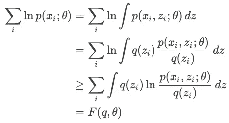

术语 *F(q，θ)* 包括，

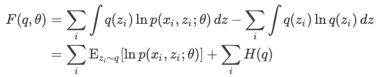

表达式 *F(q，θ)* 是我们边际可能性的一个下界，取决于我们对分布 *q* 的选择和我们对 *θ* 的估计。为了在我们当前估计的 *θ* 处有一个最紧密的界限，我们想要相对于 *q* 最大化 *F(q，θ* ⁽ᵗ⁾ *)* ，以导出分布 *q* ⁽ᵗ⁺ ⁾.可以看出，在我们当前的 *θ* 估计中，最紧密的界限是当我们用等式保持上述不等式*时，导致最优的 *q* 是给定 *x* 和 *θ* ⁽ᵗ⁾.的 *z* 的后验分布有了这个界限，我们就可以相对于 *θ* 最大化 *F(q* ⁽ᵗ⁺ ⁾ 【T36，θ】*，从而得到对 *θ* 的更好估计，这也是对我们边际似然的更好估计。这实际上是 EM 算法中的期望和最大化步骤。

在形式化每个步骤之前，我们将引入以下符号，

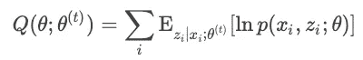

其中*Q(θ；θ* ⁽ᵗ⁾ *)* 是给定的 *θ* ⁽ᵗ⁾相对于给定的*z*x 和 *θ* ⁽ᵗ⁾.的后验分布的边际似然的下界这个表达式可以被认为是预期的完全对数似然。由于 *H(q)* 不依赖于 *θ* ，相对于 *θ* 最大化 *F(q，θ)* 相当于最大化完全对数似然。

**期望步骤**:相对于 *q* 最大化 *F(q，θ)* 。在给定 *x* 和 *θ* ⁽ᵗ⁾.的情况下，我们当前估计的 *θ* 的解(即最紧密的界限)是 *z* 的后验分布因此，在实践中，我们需要计算，

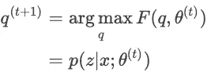

**最大化步骤**:相对于 *θ* 最大化 *F(q，θ)* 。换句话说，最大化期望的完全对数似然，

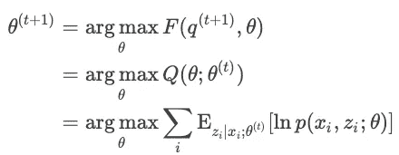

# EM 高斯混合

回到我们的高斯混合模型的例子，基于我们上面对 EM 的讨论，我们看到，

**期望步骤**:我们计算 *γ=q(z)* ，数据点 *x* 属于每个分量高斯分布的概率。 *γ* 也被称为责任，即每个 *k* 高斯对数据负责的程度。

数据点 xi 来自第 *k 个*高斯的概率是，

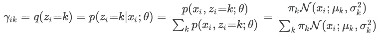

**最大化步骤**:我们最大化完全对数似然

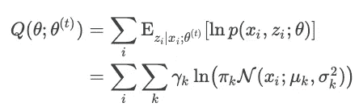

为了最大化每个参数的表达式，我们取导数，

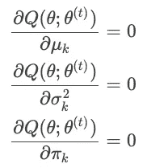

解决方法是，

其中 *n* 表示观察到的数据点的总数。

**Python 示例**

使用前面的例子，我们的 Python 实现如下，

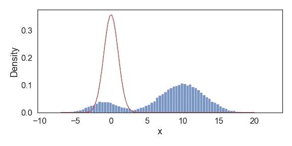

选择 EM 的迭代，直到收敛。红线表示给定迭代的估计 PDF。观察数据的密度直方图以蓝色显示。图片作者。

上面我们展示了在选择迭代直到收敛的估计 PDF 的快照。我们得到的最终近似值与用于生成该数据的原始模型参数非常接近。

# 参考资料/资源

有无数的在线资源以不同的清晰程度讨论期望最大化。下面是我发现的一些特别好的，这篇文章大致基于这些，

*   [科林(2015) CSE586 讲义](http://www.cse.psu.edu/~rtc12/CSE586/lectures/EMLectureFeb3.pdf)
*   [Ng (2019) CS229 讲义](http://cs229.stanford.edu/syllabus.html)
*   [辛格(2005)15–781 转让说明](https://www.cs.cmu.edu/~awm/15781/assignments/EM.pdf)
*   [里奇(2019)的帖子](https://www.ritchievink.com/blog/2019/05/24/algorithm-breakdown-expectation-maximization/)
*   [塔尔沃卡和史密斯(2019)10–701 讲座幻灯片](https://www.cs.cmu.edu/~lwehbe/10701_S19/files/18-EM.pdf)
*   [沙立子(2011)36–402 讲义](https://www.stat.cmu.edu/~cshalizi/402/lectures/19-mixtures/lecture-19.pdf)

*原载于 2021 年 2 月 1 日*[*https://boyangzhao . github . io*](https://boyangzhao.github.io/posts/expectation-maximization)*。*