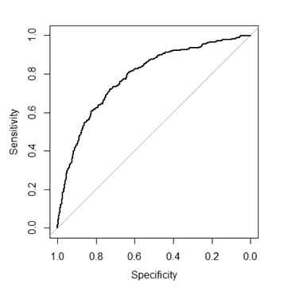
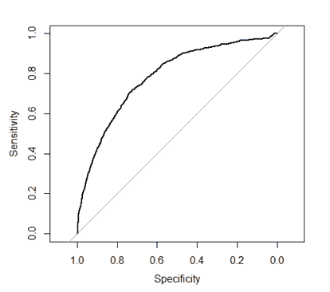
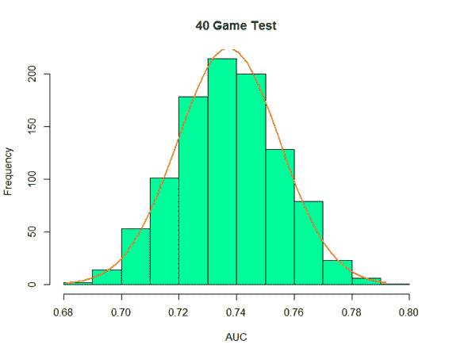

# 预期目标:黑匣子后面藏着什么？

> 原文：<https://towardsdatascience.com/expected-goals-whats-hiding-behind-the-black-box-d04f135904b2?source=collection_archive---------13----------------------->

## 一瞥专有跟踪数据能告诉我们什么。

*注:本文是我为* [*2021 大数据杯*](https://www.stathletes.com/big-data-cup/) *投稿。在我继续之前，我想感谢统计学家主办这次活动，并给我机会使用他们的数据集！*

从 10 月到 1 月，我广泛地研究了美国曲棍球联合会(NHL)的比赛数据，并建立了各种分析模型。这些包括但不限于[一个确定射门成为进球概率的预期进球模型](https://topdownhockey.medium.com/a-new-expected-goal-model-that-is-better-than-corsi-at-predicting-future-goals-ecfa44dc84e9?source=your_stories_page-------------------------------------)，一个[胜于替换模型](/wins-above-replacement-high-level-overview-63838e914395?source=your_stories_page-------------------------------------)，它提供了一个球员在一个赛季中贡献的价值的点估计，以及一个[游戏模拟模型](/2021-nhl-projection-model-high-level-overview-2366b3be5538)，我用它来预测 2021 年 NHL 赛季并获得每日获胜概率。

后两种模型严重依赖于预期目标模型，我相信这是它们最大的局限性。虽然我喜欢预期目标模型，并相信我在我可以访问的数据方面做得非常好，但它受到了 NHL PBP 数据问题的影响。这些数据不包括有价值的背景，如屏幕或射门前传球，射门坐标是众所周知的不准确，部分原因是记分员偏差，我在之前的[更长的篇幅中提到过这个问题。在我的整个工作过程中，我经常想知道，如果我能够访问一个更细粒度的数据集，使我能够建立一个更准确的预期目标模型，我的模型输出会更加准确，以及哪些球员会看到他们的估计变化最大。](/building-venue-adjusted-rapm-for-expected-goals-the-origin-the-process-and-the-results-part-1-1c12f68df0cc)

举一个让我特别困惑的模型输出的例子，我的工作发现，在同等强度下，帕特里克·凯恩在过去三个赛季对预期目标的孤立影响大致是平均的。这对于任何一个曲棍球迷来说都是一个极其难以调和的结论，因为帕特里克·凯恩被认为是世界上最好的进攻球员之一，即使在他的个人进球之外，他的 5 对 5 一级助攻率和高危险传球率(由 Corey Sznajder 手动跟踪)都接近联盟最高。我的假设是，帕特里克·凯恩一贯创造得分机会，这些机会具有某些因素，如投篮前的移动，这些因素没有被 NHL 的 PBP 数据所发现，但增加了这些投篮成为进球的概率。换句话说，帕特里克·凯恩做了一些很少 NHL 球员做的特别的事情，这一直导致黑鹰队在冰上投篮的预期目标值被低估。不过，这只是一个假设；我也接受这样一种观点，即他的估计不准确，因为我的岭回归错误地“归功于”他对其他球员的进攻影响，或者我的模型的输出实际上是准确的，我在追逐一条红鲱鱼。但是没有追踪数据，我只能假设。

当我读到大数据杯并得知我可以访问统计运动员的跟踪数据时，我毫不怀疑我所做的任何事情都将涉及预期目标。坦率地说，考虑到两个数据集之间 53 场比赛的总样本量，这个数据集可能更适合于更系统化的微观层面的分析，如“在力量比赛中从那个点投篮是理想的，还是应该总是传球？”我可能没有用我能得到的数据做“最好的”事情。但是没有什么比预期目标更让我兴奋的了，所以**我开始回答这个问题:访问统计运动员的跟踪数据会在多大程度上改善预期目标模型，以及由于它的问题，我们应该对从 NHL 的 PBP 数据中导出的预期目标模型的输出应用多大的不确定性？**

我选择专门处理潜在客户数据集，因为样本大小大约是原来的 3 倍，而且我不喜欢合并这两个数据集。我最初试图使用极端梯度提升从前景数据集建立一个预期目标模型，这是一种超高效的机器学习技术，我用于我的 NHL 预期目标模型，但我得出的结论是，40 场比赛中 3808 次未受阻投篮尝试(扇形投篮除外)的样本量不足以进行极端梯度提升，逻辑回归会表现得更好。为了避免过度拟合，对于数据集中的每一个游戏，我都从数据集中去掉一个目标游戏，用逻辑回归在另外 39 个上训练一个预期目标模型，然后在目标游戏上对它们进行测试。

以下是我用来建立模型的变量，以及对所有 40 场比赛进行逻辑回归得出的系数估计值:

影响进球概率最大的因素是是否在空门射门，这很有意义；没有守门员在网上更容易得分。虽然独家的运动员信息，如射门是否是一次性的，是在皇家道路传球后发生的，还是伴随着交通事故，都显著增加了进球概率，但这些都没有像之前的事件是否是失误射门那样增加那么多；我们仍然可以从 NHL 的 PBP 数据中得到一些东西。

这些系数可能会有点误导，因为与大多数变量不同，射击距离和角度是具有广泛观察数字的连续变量，所以这些数字减少一个只会略微增加进球概率，但这是实际上对进球概率有最大影响的两个因素，正如他们对 NHL 的 PBP 数据所做的那样。

对于在所有情况下拍摄的照片，该预期目标模型的曲线下面积(AUC)为 0.787。它看起来是这样的:

截至 1 月 31 日，我的 NHL 模型目前在 2021 赛季的所有情况下都表现出非常相似的 AUC 0.782，与前几个赛季的表现持平。曲线看起来是这样的:

这些曲线看起来几乎相同，AUC 值的差异仅为 0.005。这是否意味着跟踪数据实际上并没有改善事情？不，一点也不。这种比较本质上是不公平的，因为 NHL 预期目标模型是通过 3624 场比赛的样本量的极端梯度提升来训练的，而 OHL 预期目标模型是通过 40 场比赛的样本量的逻辑回归来训练的。NHL 模型*应该*有高得多的 AUC，而事实是*没有*告诉我们，几乎可以肯定的是*提供的额外数据*会产生很大的影响。

为了在这两个模型之间进行适当的比较，我选择在相同的基础上进行比较，从 NHL 的 PBP 数据中随机抽取 2017-2018 年至 2019-2020 年的 40 场比赛，通过对这 40 场比赛进行逻辑回归来训练和测试预期目标模型，并获得该预期目标模型的 AUC。然而，我必须确保我不只是侥幸获得了特别高或特别低的 AUC 值，所以我重复了这个过程 1000 次，每次随机选择 40 个不同的游戏。从这些测试中获得的 AUC 值最终代表了一个相当正态的分布:

平均 AUC 值为 0.737，AUC 的标准偏差为 0.018。这意味着从 Stathletes 数据集获得的 AUC 比从 NHL 的 PBP 数据获得的平均 AUC 高 7%,并且我们可以 99.73%的信心声明，从该 Stathletes 数据集获得的 AUC 高于从 NHL 数据集获得的*真实* AUC。

如果我们假设对跟踪数据集的访问将为更稳健的 NHL 预期目标模型的 AUC 提供相同的 7%的改善，该模型使用极端梯度推进在 3，624 场比赛中进行了训练，**我们预计 2021 赛季使用 Stathletes 跟踪数据构建的 NHL 模型的 AUC 约为 0.835。**然而，这个数字也有一些注意事项:

*   这些跟踪数据都来自 OHL 游戏，并正在与 NHL 游戏进行比较。有可能预测 OHL 的射门是否成为进球更容易或更难，这种差异扭曲了数据，但我怀疑如果是这样的话，差异仍然是微不足道的。
*   OHL 数据的样本量只有 40 场比赛和 3808 次未被阻挡的投篮尝试，每一场比赛都以伊利水獭队为特色。这可能只是一个好或坏的 40 场比赛。
*   Stathletes 提供的跟踪数据的粒度意味着，如果样本量足够大，以使梯度增强稳定，那么与 NHL 的 PBP 提供的粒度较小的数据相比，数据几乎肯定会从逻辑回归到梯度增强的转换中更多地受益于**，因为机器学习比逻辑回归更适合处理不同事件之间的独特关系。换句话说，**我实际上期望收益增加——而不是收益减少——通过使用这个统计数据跟踪数据**使用梯度推进来训练预期目标模型。**

尽管有这些警告，我们从那些*可以访问*跟踪数据的人那里听到的事情使得这个预测的 0.835 AUC 数字听起来是合理的。 [Alex Novet 使用 Corey Sznajder](https://hockey-graphs.com/2019/08/12/expected-goals-model-with-pre-shot-movement-part-1-the-model/) 提供的跟踪数据对预期目标模型的表现进行了更稳健的测试，并报告了 0.797 的 AUC 值，但他的测试仅使用了 1，085 场比赛的样本量；不到一整季的量。根据我的经验，在梯度推进上训练的预期目标模型在多个完整赛季的样本量下表现得更好，所以我怀疑如果这个实验在更大的样本量下重新运行，就像我使用 NHL 的 PBP 数据建立我的模型时使用的 3624 场比赛一样，AUC 数字会明显更高。在另一份报告中，保罗·莫里斯说温尼伯喷气机队有一个专有的预期目标模型，“精确到大约 85%。”我假设他只是将 AUC 值大约 0.85 解释为这个意思；我以前见过别人用 AUC 做“百分比”。“虽然我通常对 NHL 高管关于其专有模型和数据的说法持怀疑态度，但我认为温尼伯喷气机队拥有 AUC 约为 0.85 的预期目标模型是合理的。

诚然，我承担这个项目是为了给*本人*寻找可操作的信息，而不是为其他任何人。我只是想更好地了解我应该使用公共数据对预期目标模型应用多少不确定性*，答案大约与我之前应用的一样多，但现在我可以将一个有形的数字与该不确定性相匹配，并声明**根据 NHL 的 PBP 数据构建的预期目标模型比使用更准确的跟踪数据构建的预期目标模型精度低 7%左右**。然而，我的研究中仍然有一些**可操作的见解**可供他人使用:*

*   **粉丝和分析师**在引用公共预期目标模型的输出或从这些模型中得出的数据时，应注意这个不确定性数字。
*   **团队**应该注意到来自美国曲棍球联合会 PBP 的数据的不确定性，如果他们还没有这样做的话，应该投资于更准确和更精细的跟踪数据。然而，他们也应该注意到，不确定性还不足以颠覆一切；如果你的团队每晚得分超过 15-10，公众预期目标模型都说你负债累累，你的分析部门说你统治了每场比赛，那么很有可能你的分析部门是错的。
*   **教练和球员**应该注意的是，除了射空门之外，射偏后是否射门是增加进球概率最大的二元变量；不仅仅是皇家道路通行证后的镜头，一次性的镜头，或者伴随交通的镜头。球队计划制造更多的皇家道路通行证，采取更多的一次性措施，并在网前获得更多的流量，但他们中有多少人计划错过网并利用错过投篮造成的混乱？基于我的研究结果和我从 NHL 团队中看到的，我认为他们做得不够频繁。这是我想在以后用更大的样本量更深入地探索的事情。