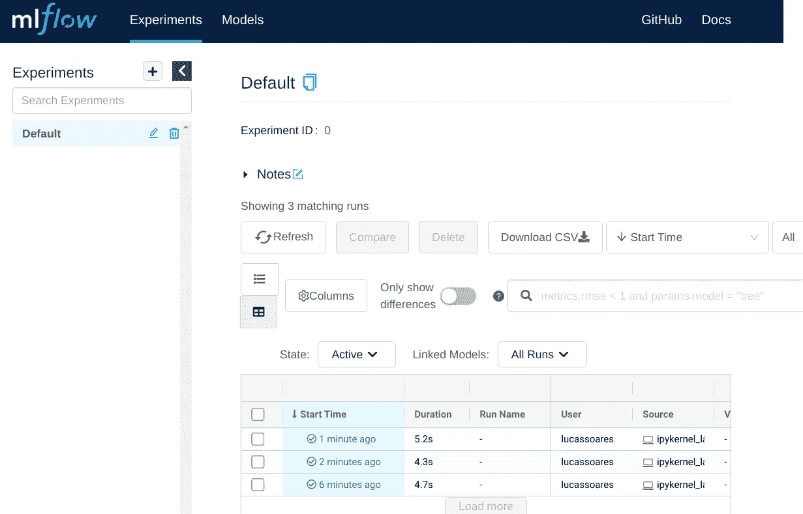
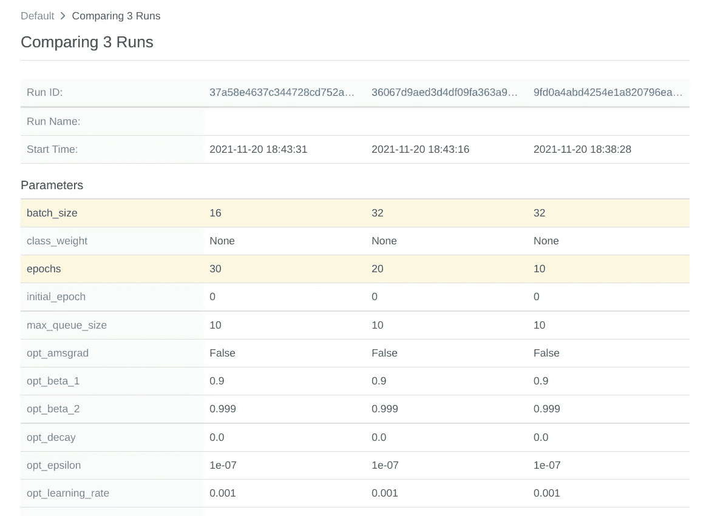
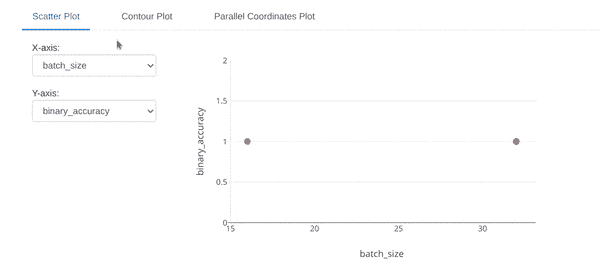

# 使用 Keras 和 Mlflow 的实验跟踪模板

> 原文：<https://towardsdatascience.com/experiment-tracking-template-with-keras-and-mlflow-36aa214896df?source=collection_archive---------16----------------------->


由[特尔纳瓦大学](https://unsplash.com/@trnavskauni?utm_source=medium&utm_medium=referral)在 [Unsplash](https://unsplash.com?utm_source=medium&utm_medium=referral) 拍摄的照片

## 使用 Keras 和 Mlflow 实现简单的实验跟踪工作流

当训练用于生产的机器学习模型时，我们都需要实现某种实验跟踪，以保证要部署的模型的质量和功效。

在本文中，我将向您展示如何使用 mlflow 和 Keras 实现一个简单的实验跟踪工作流。

**【2021 年 12 月更新】**

如果你喜欢视频，可以看看我在 Youtube 上的视频:

# 台阶

为此，我们需要:

1.  **导入依赖关系**
2.  **用 mlflow 设置自动日志**
3.  **设置要跟踪的超参数**
4.  **设置数据**
5.  **建立模型**
6.  **训练和测试**
7.  **使用 mlflow 浏览器用户界面可视化实验**

## 导入依赖项

```
import numpy as np
from tensorflow import keras
from tensorflow.keras.datasets import reuters
from tensorflow.keras.models import Sequential
from tensorflow.keras.layers import Dense, Dropout, Activation
from tensorflow.keras.preprocessing.text import Tokenizer
import mlflow.tensorflow
```

## 使用 mlflow 设置自动日志

```
mlflow.tensorflow.autolog()
```

## 设置超参数

在本例中，我们进行了一个非常简单的实验，其中我们只改变了用于训练模型的时期数和批量大小。

```
epochs = 10
batch_size = 16
```

## 设置数据

对于我们的数据集，不使用 MNIST 或其他一些经典的人工智能数据集，让我们保持简单，只使用`sklearn.datasets.make_blobs`函数创建一个假的二进制分类数据集。

```
from sklearn.datasets import make_blobs
import matplotlib.pyplot as plt

X,y = make_blobs(n_samples=1000, n_features=2, centers=2, random_state=42)

plt.scatter(X[:,0], X[:, 1], c=y, marker="o")
plt.show()
```


作者图片

现在，让我们将数据集分成训练组和测试组:

```
from sklearn.model_selection import train_test_split
X_train, X_test, y_train, y_test = train_test_split(X, y, test_size=0.33, random_state=42)
```

## 建立模型

对于模型，让我们创建一个简单的`Sequential`模型，其中一层有 128 个单元，最后一层运行 sigmoid 函数。

```
model = Sequential()
model.add(Dense(128, input_shape=(2,)))
model.add(Activation("relu"))
model.add(Dense(1))
model.add(Activation("sigmoid"))
model.compile(loss="binary_crossentropy" , optimizer="adam", metrics=["binary_accuracy"])
```

## 培训和测试

现在模型已经编译好了，让我们将它与训练数据集相匹配，为它提供最初定义的参数。

```
history = model.fit(X_train,y_train, batch_size=batch_size, epochs=epochs, verbose=1, validation_split=0.1)# Output:

Epoch 1/10
 1/38 [..............................] - ETA: 0s - loss: 4.8758e-04 - binary_accuracy: 1.0000WARNING:tensorflow:Callback method `on_train_batch_end` is slow compared to the batch time (batch time: 0.0007s vs `on_train_batch_end` time: 0.0014s). Check your callbacks.
38/38 [==============================] - 0s 2ms/step - loss: 4.3713e-04 - binary_accuracy: 1.0000 - val_loss: 1.9682e-04 - val_binary_accuracy: 1.0000
Epoch 2/30
38/38 [==============================] - 0s 1ms/step - loss: 3.7183e-04 - binary_accuracy: 1.0000 - val_loss: 1.6366e-04 - val_binary_accuracy: 1.0000
Epoch 3/30
38/38 [==============================] - 0s 1ms/step - loss: 3.2540e-04 - binary_accuracy: 1.0000 - val_loss: 1.4324e-04 - val_binary_accuracy: 1.0000
.
.
```

完美！现在让我们在测试数据集上评估模型。

```
score = model.evaluate(X_test, y_test, batch_size=batch_size, verbose=1)21/21 [==============================] - 0s 686us/step - loss: 1.2186e-05 - binary_accuracy: 1.0000print(f"Loss: {score[0]}")
print(f"Accuracy: {score[1]}")Loss: 0.002690241439267993
Accuracy: 1.0
```

由于所使用的假数据集的简单性质，我们的模型具有不寻常的高准确性。

## 使用 mlflow 浏览器用户界面可视化实验

现在我们可以对这个实验进行更多的变化。在这种情况下，我将使用不同的时期数和批次大小再做几个例子:

*   实验二:历元= 20；batch_size=32
*   实验三:历元= 30；批处理大小=16

现在我可以在终端中运行这个命令，

`mlflow ui`

并获得以下内容:

```
[2021-11-20 18:42:20 +0000] [105270] [INFO] Starting gunicorn 20.1.0
[2021-11-20 18:42:20 +0000] [105270] [INFO] Listening at: http://127.0.0.1:5000 (105270)
[2021-11-20 18:42:20 +0000] [105270] [INFO] Using worker: sync
...
```

现在，我们可以访问 mlflow 的用户界面来比较这些实验:



作者图片

我们可以选择我们的实验并点击`Compare`按钮，这将显示:



作者图片

如我们所见，mlflow 存储了不同的参数组合，我们可以探索一些简洁的可视化方式:



作者图片

我个人最喜欢的是平行坐标图，它显示了不同的参数组合如何产生给定的性能指标。

# 关于实验跟踪的最后思考

实验跟踪对于机器学习工程来说至关重要，以保证良好的监控和再训练实践，以及验证在给定手边计算能力的情况下，正在使用最佳可能的模型。

使用 jupyter 笔记本进行实验跟踪的另一个很好的参考可以在这篇博文中找到:

[](https://neptune.ai/blog/how-to-keep-track-of-deep-learning-experiments-in-notebooks) [## 如何在笔记本上记录深度学习实验- neptune.ai

### Jupyter 笔记本很酷。它们独立于语言，非常适合协作，易于定制，您可以添加…

海王星. ai](https://neptune.ai/blog/how-to-keep-track-of-deep-learning-experiments-in-notebooks) 

在本文中，我展示了如何使用开源的 Mlflow 框架实现一个简单的实验跟踪工作流，并使用`keras`框架作为我们的玩具示例，将其嵌入到您的训练代码中。

如果你喜欢这个帖子，[加入媒体](https://lucas-soares.medium.com/membership)，[关注](https://lucas-soares.medium.com/)，[订阅我的简讯](https://lucas-soares.medium.com/subscribe)。还有，在 [Twitter](https://twitter.com/LucasEnkrateia) 、 [LinkedIn](https://www.linkedin.com/in/lucas-soares-969044167/) 和 [Instagram](https://www.instagram.com/theaugmentedself/) 上和我联系！谢谢，下次再见！:)