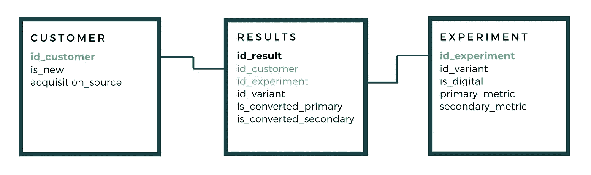

# 实验:备份

> 原文：<https://towardsdatascience.com/experimentation-backing-it-up-b7b9aa757b72?source=collection_archive---------15----------------------->

## 建立基础设施以推动有效分析的文化

里卡多·戈麦斯·安吉尔在 [Unsplash](https://unsplash.com?utm_source=medium&utm_medium=referral) 上的照片

*在之前的一篇文章***中，我概述了实验文化的驱动力，以及在整个企业中巩固这种思维转变所需的分析原则。然而，是时候改变方式了——在通过实验推动持续学习之前，我们需要回到数据捕获和转换的基础上。**

*你可能会认为，作为产品开发不可或缺的一部分，应该更加重视将实验与数据基础设施相结合。当然，你会看到像网飞和 LinkedIn 这样的公司引领着他们自己的实验平台——但是小鱼呢？我想探索更小的公司如何克服开箱即用的实验解决方案的限制，并朝着建立类似的内部平台前进。*

## ***旧买旧建格言***

*为什么对于规范分析的许多应用，我们乐于设计从原始摄取到转换的数据，但对于实验(可以说是将描述性和预测性分析结合到智能决策中的关键)，我们满足于即插即用的解决方案？为了实现将实验与内部数据基础设施相结合的力量，我们需要首先理解现有优化工具的局限性。*

*插入 Google Optimize 或 Optimizely 等现成的实验解决方案具有典型的开箱即用优势:易于设置、实施和洞察。但是，请考虑这些限制:*

*   *数据输入——开箱即用的解决方案是为跨网站和应用的客户体验数字实验而构建的。一旦您包含了任何离线发生的客户接触点(例如，通过电话转换的应用程序)，那么实现就不那么简单了。您可以通过 API 配置将离线接触点作为转换上传，尽管这开始降低这些解决方案提供的易实现性；*
*   *数据输出——现有的实验平台因其提供的见解而蓬勃发展，即主要围绕实验分析(这是正确的)。但是，只有从平台导出事件数据，才能查询实验数据以进行其他形式的高级分析和可视化。*

*坦率地说，用来自其他数据源的*输入*来设置您的实验解决方案，然后导出这些数据*输出*以供进一步分析，您还不如将实验构建到您自己的数据堆栈中。不仅如此——将你的实验数据与你客户的数据端到端地整合不仅有益于你的实验文化，而且丰富了你对客户的整体看法；实现更敏捷的分析和大规模个性化。*

## ***建立实验数据基础设施***

*因此，如果我们要为有效的实验文化培养一个迭代的、敏捷的环境，我们需要一个将实验解决方案集成到我们的数据基础设施中的框架。尽管这个框架需要与支持随机分配、运行并发实验和变体检索请求的后端一起考虑——鉴于这一点已经得到了更广泛的探索，我想把重点放在这个框架中与数据相关的组件上。有五个关键组件:*

*   *数字分析测量计划—制定关键用户参数(例如，收购来源:他们是新客户还是现有客户？他们是否被特定的营销渠道所驱动？)和发生在您的数字世界中的事件接触点。请确保您跟踪的用户 ID 可以跨多个会话连接单个用户的事件；*
*   *端到端数据蓝图—一旦实施了您的测量计划，下一步就是将您的数字环境与离线的客户接触点连接起来，使用个人 ID*或类似的东西作为您整个[服务蓝图](https://www.lucidchart.com/blog/what-is-a-service-blueprint)的唯一密钥。这将允许您为每个人规划整个旅程，实现客户的单一视图；*
*   *实验数据模型——概述要收集的数据，以了解一个人接触到的每个实验和变量，以及它们是否转换了[主要和次要指标](https://neilpatel.com/blog/secondary-goals/)。然后将其映射到数据蓝图的其余部分，并自动接收和转换这些数据以进行分析；*

**

*概述要收集和绘制的实验数据的关系图[图片由作者提供]*

*   *前端实验界面——开发一个工具，分析变量之间的统计显著差异。其中一部分包括当样本量较低且统计显著性难以实现时，浮现贝叶斯分析的[原理](https://www.linkedin.com/pulse/making-product-decisions-bayesian-analysis-john-ostrowski/)。有效地可视化这种分析对于推动实验文化也是至关重要的，这样任何人都能够理解结果并采取行动；*
*   *E2E 实验战略——与任何其他产品一样，数据产品除非被最终用户采用，否则是不成功的。培训团队如何使用实验界面，开发和维护 ideas 注册表，这些都是培养跨职能实验势头的一部分。*

*成功的实验分析为繁荣的测试和学习文化铺平了道路，它依赖于将实验数据与数据基础设施的其余部分集成的框架。将你的实验数据的收集、转换和分析与你的客户数据的其余部分整合起来，最终使得实验被植入你的组织的文化中，成为你的产品策略的关键。*

*   *在这篇文章中，我们面对的是一个真实的人，也就是有心跳的人。如果你是 B2B 交易，这可能看起来不同。*