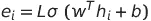
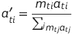
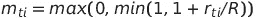
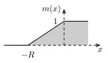
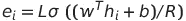
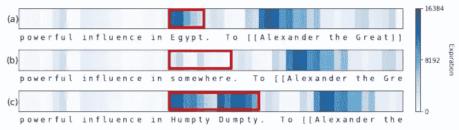
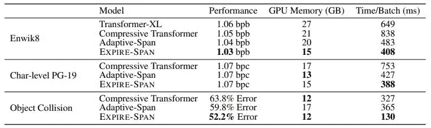

# 并非所有的记忆都是生来平等的

> 原文：<https://towardsdatascience.com/expire-span-not-all-memories-are-created-equal-explained-ffcbd9663bfd?source=collection_archive---------33----------------------->

## 通过过期学会遗忘。有时候，为了更好地完成一项任务，应该删除无关紧要的记忆？

照片由[那是她的事](https://unsplash.com/@thatsherbusiness?utm_source=unsplash&utm_medium=referral&utm_content=creditCopyText)上 [Unsplash](https://unsplash.com/s/photos/brain?utm_source=unsplash&utm_medium=referral&utm_content=creditCopyText)

# 介绍

F acebook AI Research 提出了一个名为 Expire-Span [1]的新架构，它可以删除在注意力机制中被视为无关信息的上下文数据。凭直觉，它应该工作得很好，因为我们不希望不相关的信息被建模和记忆，特别是当序列长度相当长的时候。让我们快速进入细节，因为 Expire-Span 训练更快，使用更少的内存，并且可以扩展到非常大的序列长度而不降低性能！

# 背景

注意力机制在深度学习领域掀起了风暴，发现自己出现在过多的领域，主要是 NLP 和计算机视觉。它在很好地模拟长序列方面非常出色，并且在大多数 NLP 任务中设置了基准。最近，它在计算机视觉领域取得了进展——视觉变形金刚[3]和 GANs——生成对抗变形金刚[4]和 TransGAN [5]。

这种性能是有代价的，需要大量内存和计算资源！研究现在已经从注意力机制转移到减少体系结构中注意力模块的使用，因为当用更长的序列缩放时，它在计算上二次增加。MLP 混合器向我们展示了如何摆脱计算机视觉任务中的注意力机制。我已经写了一篇关于 MLP 混合器的博客，在这里找到它。但是在 NLP 任务中去除注意力可能是灾难性的，因为注意力机制已经一次又一次地证明了它们是最好的。有几种改进的变形器，如 Adaptive-Span [7]、Compressive Transformers [8]和 Performers [9]，它们试图减少较长序列的计算和内存开销。请随意阅读。研究这项研究是如何围绕注意力机制进行的是非常有趣的。

在上面列出的体系结构中，有一点是不变的，

> 所有的记忆都被同等对待，不考虑它们对任务的重要性

Expire-Span 的作者在着手构建一个包含变压器的架构时引用了这句话，但它使架构能够忘记与特定任务无关的事情。这将显著减少存储器和计算开销，从而产生更快的架构，有时比传统的基于注意机制的变压器架构更好。他们正在比较的架构是 Transformer XL [10]，它将序列划分为块，并从一个容易获得的向量关注过去，该向量存储来自过去块的注意力信息。比较中还使用了自适应跨度和压缩变压器。

**注**:这篇文章建议好好理解一下注意力机制。

# 理念与建筑

> 这个时间步骤是否值得保留？如果不是，那么为什么不删除它，把更多的重点放在对任务更重要、更有价值的上下文上呢？

这是导致 Expire-Span 概念化的主要思想。交易破坏者不是吗？让我们试着用图表来理解这个想法。

到期跨度的概念化。图像学分—过期时间[论文](https://arxiv.org/pdf/2105.06548.pdf)

我们可以看到一些时间步 *h* 1、 *h* 1、 *h* 3 等等，直到 *h* t 和 5 个具有到期常数 *e 的令牌*这个到期值' ***e*** '表示时间步的数量，在此之后上下文信息被删除。在上图中， *e* 2 和 *e* 3 不是模型中的有效信息，在时间步长 ht 时，在该特定步长 *t* 的计算中不考虑或参与这些信息。他们只是没有进一步添加足够的上下文信息，并被删除。

传统上，变形金刚关注所有先前的上下文信息标记，对于 n 的序列长度，计算复杂度为 O(n)。如果我们考虑一个小例句“坐在地图上的狗”,我们不想携带没有添加太多信息的单词的上下文，而是记住单词 **dog** 和单词 **sitting** 的单词 **mat。**这将导致复杂度小于 O(n)，这也是时下追捧的热点。Expire-Span 就是这么做的，给单词“dog”和“sitting”比给单词“the”更多的时间步长。“the”的 *e* 值将低于“dog”的值。令牌的这种到期与固定窗口注意完全不同，固定窗口注意在序列上滑动并注意固定长度的令牌。

这与变形金刚和 LSTMs [11]都密切相关，在这两种情况下，我们关注所有的记号，而不管它们的重要性，并且聪明地分别遗忘和保留序列中的事物。我们可以称 Expire-Span 为两者的混合版本:P

到期跨度值 ***e*** 通过下面给出的公式来计算，

过期-跨度公式。作者图片

其中 *h* i 是记忆步长，w 和 b 是可训练参数，L 是最大跨度。这最终将决定我应该在上下文中保持多长时间。还有一个等式*r*ti =*e*I(t I)。每当 *r* ti 值为负时， *h* i 就过期，可以从 C *t* 中删除。它在关注层中的实现方式是通过二进制掩码。我们都知道，在训练变形金刚时，有一个注意力矩阵涉及对上三角中的值进行掩蔽。这种屏蔽也扩展到矩阵的下三角形。我们还需要屏蔽那些对于注意力矩阵中的特定令牌已经过期的单元。这个二进制掩码函数 *m* ti 的公式如下所示，

二进制掩蔽函数。作者图片

这是不可微的，并且没有梯度来训练，因此使用了软最大化函数，公式如下所示。

软屏蔽功能。作者图片

在上面的公式中，R 是一个超参数，它是由 0 到 1 限定的斜坡长度。这将确保掩码在特定时间步长到期后线性减少。这是在训练期间调整 ***e*** 值所需的梯度。

软遮罩可视化。图片致谢—过期时间[论文](https://arxiv.org/pdf/2105.06548.pdf)

还有一个 L1 惩罚加到期满跨度值 *e* 上，以减少对主任务没有贡献的存储器的跨度，这导致高度集中于相关信息的较小的存储器使用。

# 变压器现有自关注层的过跨度调节

期满-跨度机制可以被包括在自我关注层中，具有下面描述的一些小的改变。

1.  自我注意的头部共享相同的底层内存，因此可以计算每层的到期时间，并在头部间共享
2.  这里采用了一种并行块机制，该机制允许并行计算，并且隐藏状态值被缓存，并且可以被未来的块所关注
3.  当网络在序列长度上可以成千上万地扩展时，过度适应的机会很高，这通过在训练期间随机缩短记忆跨度作为正则化因素来对抗
4.  Expire-Span 公式中的 L 值可以取一个非常大的数，并且可以对 *e* 施加很大的影响。对于非常大的 L 值，如下所示修改公式以稳定训练

更新的到期跨度公式。作者图片

# **结果&基准**

该模型在各种任务上进行训练，如走廊任务、入口任务、指令任务(都是强化学习任务)、超长拷贝、字符级建模和逐帧处理:物体碰撞任务。我不会详细讨论这些任务，因为这篇文章会变得太长太详尽。相反，我将分享 Expire-Span 的一个亮点和一些数字，这些数字证明了 Expire-Span 的使用优于上述任务的其他架构。

Enwik8 人物级造型注意图。图像学分—过期-Span [论文](https://arxiv.org/pdf/2105.06548.pdf)

从上图中我们可以看到，模型可以记住专有名词“埃及”和“矮胖子”,如果“埃及”被单词“某处”代替，它不会被给予更高的关注，最终不会被未来的标记所关注(它被遗忘得更快)。

Expire-Span 在 Enwik8、PG-19 和物体碰撞任务上的性能基准。图像积分-过期-Span [论文](https://arxiv.org/pdf/2105.06548.pdf)

Expire-Span 几乎与 Transformer XL、Compressive Transformer 和 Adaptive-Span 的性能水平相当，时间/批量训练时间和 GPU 内存相对较低。同样，对于超长副本、走廊和指令任务，也给出了基准。在准确性、内存和可伸缩性方面，Expire-Span 比其他模型表现得更好。

# 我的想法

当遇到一个单词时，模型必须给出一个正确的值。expire 值可能无法有效地模拟整个文档中的第一个单词。比如说，我有一个词，它是一个名字，在文件的结尾非常重要。如果模型给出了一个有限的 expire 值，该单词的上下文信息可能会完全丢失。

有时你可能会以这样的方式推断，这个词在本文中并不那么重要。但是过了一会儿，你忘记的那个单词变得非常重要，你试图记起你第一次在哪里看到它，当时它的上下文是什么。该模型独立于未来发生的事情分配 *e* 值。

# 结论

Expire-Span 是一种架构，它可以忘记对给定数据和任务无用和不相关的信息。这导致比传统变压器更低的内存和计算要求，使架构能够扩展到数十和数千的长度！尽管消耗的内存和计算更少，但它可以匹配并且很少有情况下超过最新变压器架构的性能，如 Transformer XL、Adaptive Span 和 Compressive Transformers。该领域的研究正朝着减少或消除可伸缩性、内存和计算要求的注意机制的方向发展(训练使用注意机制的大规模语言模型所留下的碳足迹是巨大的，我们也需要考虑这一点)。

高效变形金刚:一项调查[12]是关于如何最好地跟上这些年来变形金刚领域的所有研究。我强烈推荐你阅读这份报纸。

页（page 的缩写）更多关于人工智能、物联网和生物的精彩技术博客，请访问 https://appliedsingularity.com/blog/！！！

# 参考

[1]并非所有的记忆都是平等的:通过过期学会遗忘:【https://arxiv.org/pdf/2105.06548.pdf】T2

[2]你所需要的只是关注:【https://arxiv.org/pdf/1706.03762】T4

[3] ViT(视觉变压器):[https://arxiv.org/pdf/2010.11929](https://arxiv.org/pdf/2010.11929)

[4]生成式对抗性变压器:[https://arxiv.org/pdf/2103.01209](https://arxiv.org/pdf/2103.01209)

[5]trans gan:[https://arxiv.org/pdf/2102.07074](https://arxiv.org/pdf/2102.07074)

[6]https://arxiv.org/pdf/2105.01601MLP-混频器

[7]适应跨度:[https://arxiv.org/pdf/1905.07799](https://arxiv.org/pdf/1905.07799)

[8]压缩变形金刚:[https://arxiv.org/pdf/1911.05507](https://arxiv.org/pdf/1911.05507)

[9]表演者:[https://arxiv.org/pdf/2009.14794](https://arxiv.org/pdf/2009.14794)

[10]变压器 XL:[https://arxiv.org/pdf/1901.02860](https://arxiv.org/pdf/1901.02860)

[11]https://www.bioinf.jku.at/publications/older/2604.pdf[LSTM](https://www.bioinf.jku.at/publications/older/2604.pdf)

[12]高效变形金刚:一项调查:【https://arxiv.org/pdf/2009.06732.pdf 