# 举例说明:Synapse 分析

> 原文：<https://towardsdatascience.com/explain-by-example-synapse-analytics-750cd3f074c5?source=collection_archive---------29----------------------->

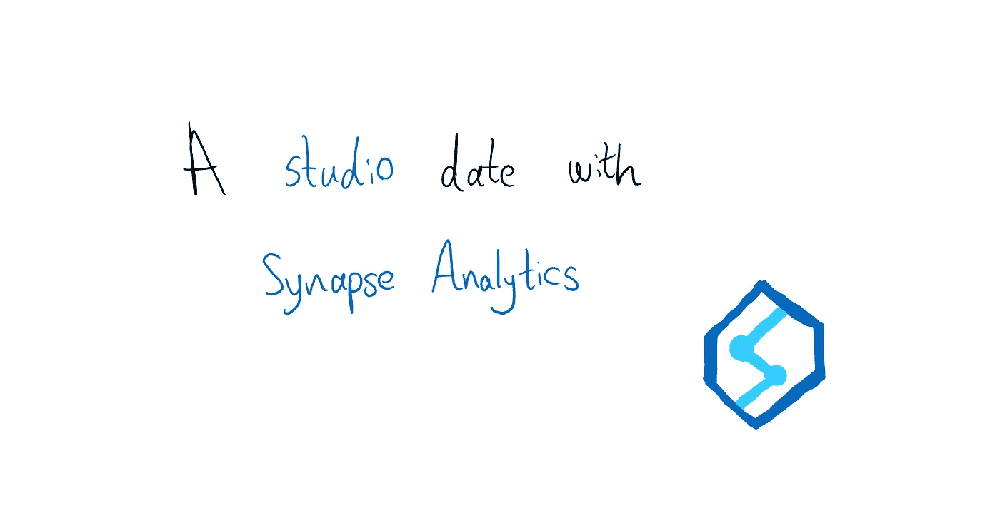

图片由米歇尔·谢提供

当我去年发布了我和 CosmosDB 的约会时，每个人都不停地问我，“下一次约会是什么时候？”但是你知道，有时候一个巴掌拍不响。Cosmos 和我决定结识新的人来扩展我们的社交网络，所以今天我决定和我们共同的朋友 Synapse Analytics 约会。

**谁是 Synapse Analytics？**

当 Cosmos 第一次告诉我他们共同的朋友 [Synapse Analytics](https://docs.microsoft.com/en-au/azure/synapse-analytics/) 时，我有点害怕。原来 Synapse 在数据世界里是一件大事。Synapse 开始做了一段时间的 SQL 数据仓库工作，但后来 Synapse 的业务真正起飞了。他们从这家名为[微软 Azure](http://portal.azure.com/) 的大型科技公司获得了大量投资，并设法与 [Apache Spark](https://docs.microsoft.com/en-au/azure/synapse-analytics/spark/apache-spark-overview) 、 [CosmosDB](https://docs.microsoft.com/en-au/azure/cosmos-db/synapse-link?toc=/azure/synapse-analytics/toc.json&bc=/azure/synapse-analytics/breadcrumb/toc.json) 、Data Factory、[机器学习](https://docs.microsoft.com/en-au/azure/synapse-analytics/machine-learning/what-is-machine-learning)和 [Azure 权限](https://docs.microsoft.com/en-au/azure/synapse-analytics/catalog-and-governance/quickstart-connect-azure-purview)建立了合作伙伴关系。无论如何，Synapse 非常忙，为大型数据项目运行所有这些大数据处理工作，因此很难安排时间进行约会。我们都同意我可以在 Synapse 的工作室见 Synapse，这样我可以更多地了解 Synapse，因为他们所做的一切都在工作室。

参观 Synapse 的工作室

由于 Synapse 业务的大规模性质，我必须先向微软 Azure 注册我的详细信息，这样他们才能在我进入 Synapse 的工作室之前发给我一个[工作区徽章](https://docs.microsoft.com/en-au/azure/synapse-analytics/get-started-create-workspace)。这花了一些时间。我必须填写一些基本信息，然后是一些安全信息和网络信息，然后他们才会发给我工作区徽章:

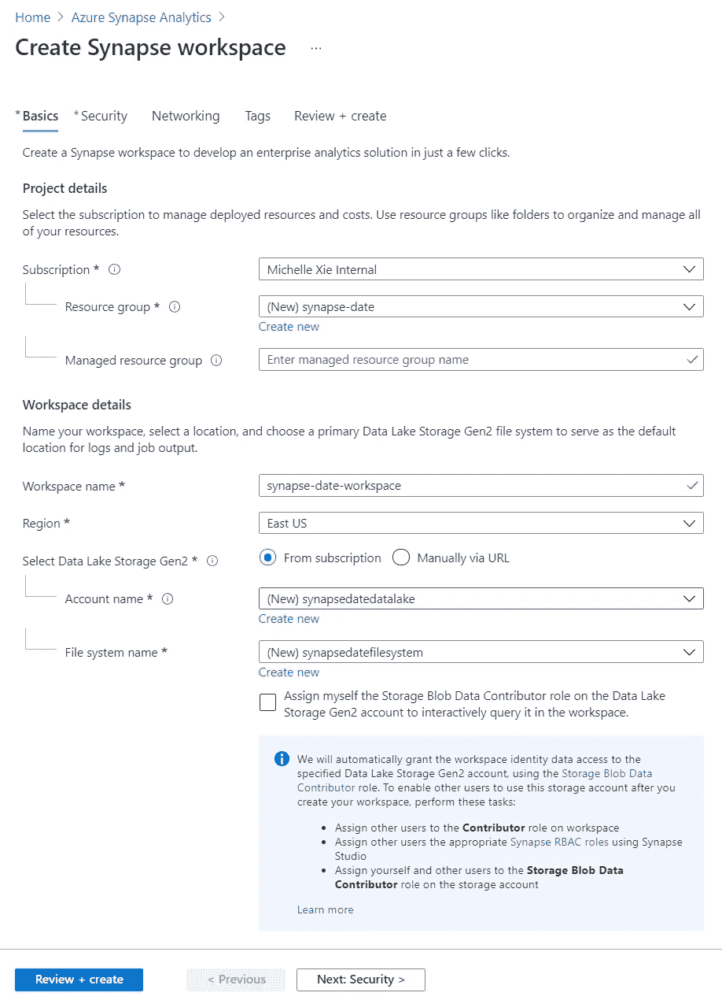

图片由米歇尔·谢提供

然后我被允许进入 Synapse 在 https://ms.web.azuresynapse.net/*的工作室，Synapse 是我工作室的导游，所以我戴上好奇的帽子，开始问很多问题。*

*我进入的第一个房间是 SQL pools 房间。在这里，我可以看到一个无服务器的 SQL 池已经设置好并准备好了。Synapse 转向我，问我:“你想设置一个专用的 SQL 池吗？”*

*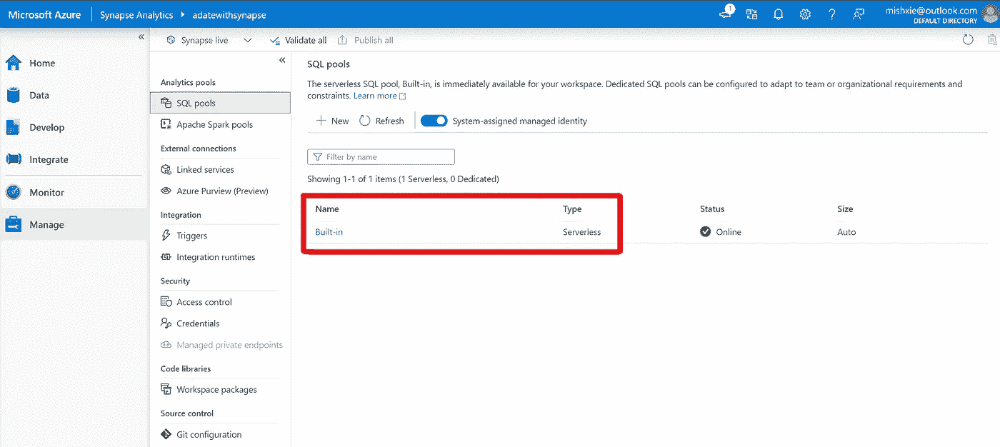*

*图片由米歇尔·谢提供*

*我不知道什么是专用 SQL 池，所以我说，“当然，为什么不呢”，并完成了创建专用 SQL 池的过程:*

*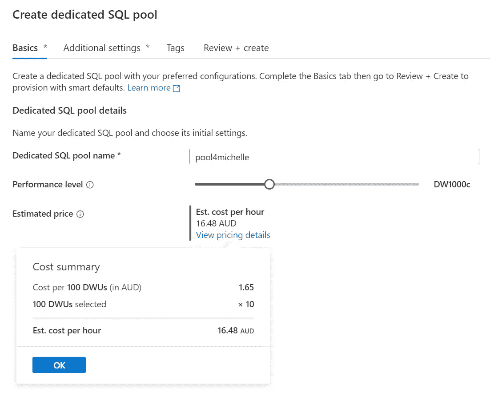*

*图片由米歇尔·谢提供*

*一旦创建了专用的 SQL 池，我决定询问一下它…*

***“专用 SQL 池和无服务器 SQL 池是什么意思？”***

*Synapse 震惊地看着我，“你是在告诉我你不知道专用 SQL 池是什么意思吗？”*

*“很公平，我们确实对其进行了重命名，因为我们经历了几次品牌重塑……总之，专用 SQL 池就是 SQL 数据仓库。专用和无服务器之间的区别实际上是用于运行 SQL 数据仓库作业的资源。*

*专用意味着您创建专用于运行您的工作的资源。无服务器意味着您可以与其他人共享您用来运行作业的资源。"*

*我点点头，“如此专用就像有一个我可以使用的私人池，而无服务器就像有一个我与他人共享的公共池？”*

*“不完全是”Synapse 开始说，“如果我们不使用您正在使用的池类比，您可以考虑专用的 SQL 池，就像在游泳池预留泳道一样。这意味着在一段时间内，你只为你的游泳活动保留那条泳道，其他人不能进入你的泳道。这并不意味着游泳池属于你，有些泳道是为你保留的。*

*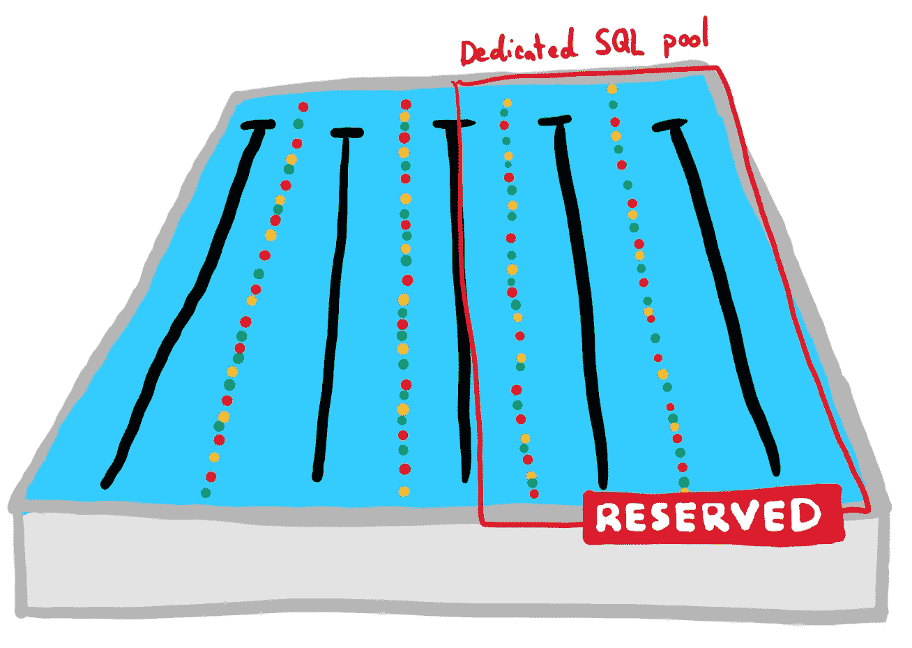*

*图片由米歇尔·谢提供*

*无服务器就像去游泳池，进入一个可用的泳道。现在，如果你开始游得非常快，他们可能会给你更多的泳道空间或者把你移到快车道，如果你开始游得慢一些，他们可能会拿走你的一些泳道空间或者把你移到慢泳道，但是没有泳道是留给你的。这有意义吗？"*

*是的，我认为这很有道理。但是这些 SQL 池是如何处理事情的呢？*

*“好问题，我们需要做的第一件事是看看 Synapse SQL 池的[架构。专用 SQL 池和无服务器 SQL 池都有控制节点和计算节点的概念。](https://docs.microsoft.com/en-us/azure/synapse-analytics/sql/overview-architecture)*

*现在，控制节点和计算节点之间的区别在于，控制节点可以控制如何使用计算节点。*

*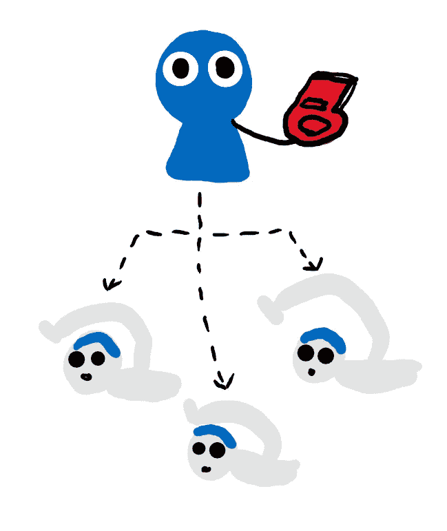*

*图片由米歇尔·谢提供*

*您可以将控制节点视为游泳教练，将计算节点视为游泳者。游泳教练不做任何游泳，但他们通常会想出一个策略来指导游泳者。*

*控制节点也是如此，他们不做任何工作，但他们知道如何让所有计算节点以最有效和高效的方式完成所有工作。"*

***好的，专用 SQL 池处理事情的方式和无服务器 SQL 池处理事情的方式有什么区别？***

*“你喜欢开门见山，不是吗？好了，既然快到午餐时间了，让我们用做三明治的比喻来描述专用 SQL 池与无服务器 SQL 池的不同之处。*

*想象一下，如果我走过来对你说，我们需要做 100 个三明治来喂一些非常饥饿的孩子。这是所有的三明治原料，还有一群三明治工人来帮你。现在，如果你是这个三明治制作请求的控制节点，你会怎么做？"*

*嗯，我会…嗯…*

*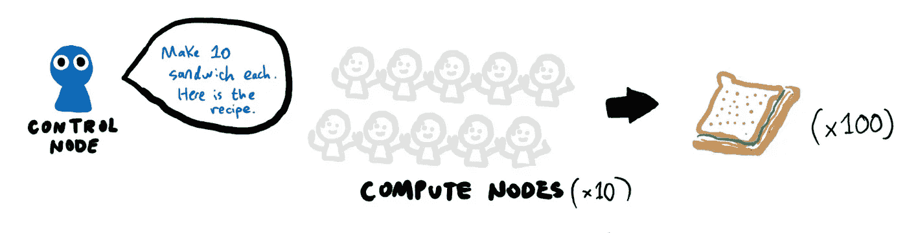*

*图片由米歇尔·谢提供*

*“如果您以类似于专用 SQL 池体系结构模型的方式运营，您可能会看到您拥有的三明治工人数量。假设这个数字是 10。*

*所以你有 10 个三明治工人。然后，你要做的是查看要求，上面说你需要做 100 个三明治。你可能会告诉你的三明治工人每人做 10 个三明治。*

*他们都开始做三明治，在做 100 个三明治的标准时间的十分之一内，你就可以同时完成 100 个三明治。这是分工的一种方式。*

*如果我们看一下专用的 SQL 池架构，它的运行方式几乎完全相同。除了三明治。我们有一个接受主请求的控制节点。控制节点运行分布式查询引擎，以确定如何在所有可用的计算节点上分发请求。然后，计算节点并行处理所有工作。"*

*哦，有道理。无服务器版呢？*

*“等一下，我正要说到这一点。*

*另一种方法是遵循无服务器 SQL 池架构模型。假设制作三明治需要完成大约 5 项任务，例如:*

*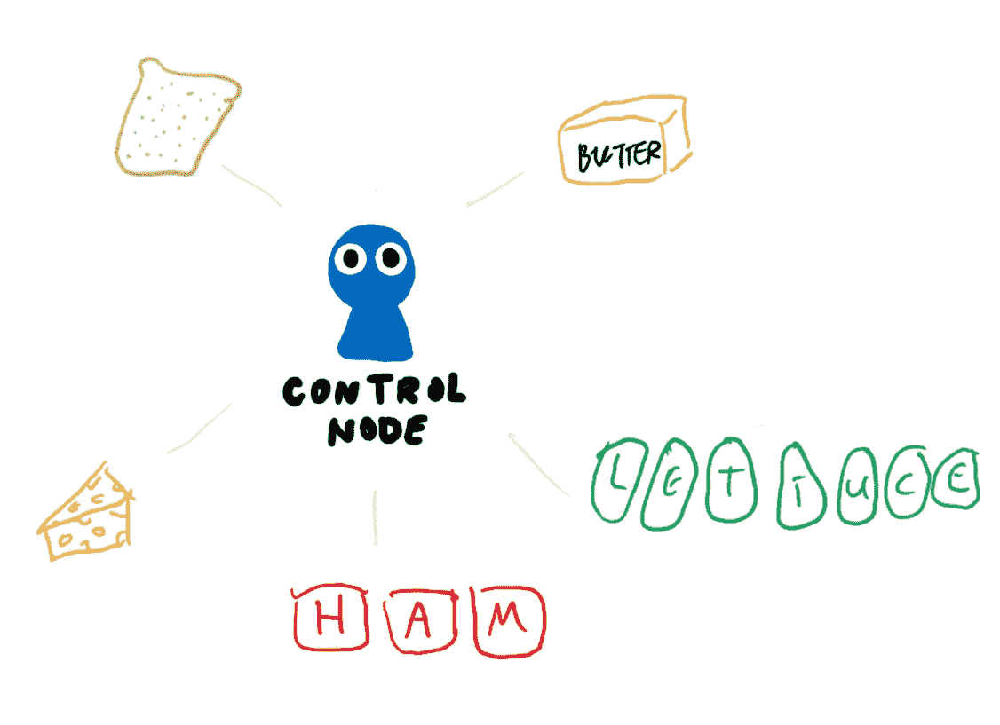*

*图片由米歇尔·谢提供*

1.  *奶油面包*
2.  *剥莴苣*
3.  *奶酪切片*
4.  *火腿切片*
5.  *把它们放在一起*

*现在，不是让一个三明治工人完成任务 1 到 5。我们可以开始给每个工人分配“专门的”任务。工人 1 和 2 可能只负责给面包涂黄油。工人 3 和 4 可能只剥生菜。工人 5 和 6 可能只切奶酪。工人 7 和 8 可能只负责切火腿。工人 9 和 10 把所有的材料放在一起。这也是我们分工的另一种方式。*

*现在，无服务器 SQL pool 以类似的方式处理请求。控制节点仍然接受主请求，但是控制节点运行分布式查询处理引擎，以找出如何将这个大请求分割成较小的任务，并将这些任务中的每一个交给计算节点来完成。一些计算节点可能需要等待其他计算节点先完成它们的工作，就像工人 9 和 10 必须等待所有其他节点完成，然后才能将它们放在一起，但在最后，我们仍然可以得到 100 个完整构建的三明治，来喂饱我们非常饥饿的孩子。*

*说到这个，我们是不是该出去吃午饭，讨论点别的？"*

*当然，说了这么多三明治的话，我真的很饿了。*

*“我相信你还有很多其他问题，比如我们为什么要在工作室与 Apache Spark 建立合作伙伴关系。”*

***嗯，是的，我做了。但是首先，什么是** [**阿帕奇火花**](https://docs.microsoft.com/en-us/dotnet/spark/what-is-spark) **我不太确定我明白你刚才说的话。？为什么有人想要建立一个数据系统来回答自己的查询？***

*" [Apache Spark](https://spark.apache.org/) 实际上是由大约 1200 人组成的大约 300 家公司创建的，他们聚集在一起构建了这个大规模分布式大数据处理引擎，他们将这个大数据处理框架整合在一起，可以大规模处理大量的内存数据，用于数据准备、数据处理和[机器学习](https://spark.apache.org/mllib/)，我认为这非常了不起。无论如何，我们决定与他们合作，让 Apache Spark 在我们的 Synapse 工作室中运行，因为 Apache Spark 需要我们工作室可以提供的强大硬件工具。他们也有一个相当大的粉丝群，因为他们最近在数据领域非常受欢迎，所以我们一起为 Synapse 开发了 [Apache Spark。”](https://docs.microsoft.com/en-us/azure/synapse-analytics/spark/apache-spark-overview)*

*“哦。嗯，我想我还没有告诉你我们为什么存在，”Synapse 说。“简而言之，我们的存在是为了帮助用户找到问题的答案。我们不是像谷歌或阿炳那样的搜索引擎，而是允许我们的用户通过使用我们的服务和他们的数据来建立他们的大数据系统。所以我们正在做的是为我们的用户提供所有必要的工具来构建他们自己的数据系统，以帮助找到他们自己的问题的答案。”*

*“好吧，想想这个。下班后你回到家，想做点晚餐，但是因为你不擅长烹饪，你不小心把晚餐烧焦了，所以你叫了外卖。当你在等食物的时候，你决定放一部电影。你怎么决定看什么？”*

*嗯，我可能会去网飞，浏览一下推荐名单。*

*“没错，但是如果网飞没有那个推荐名单呢？*

*你必须做一些调查，找一些资源来帮助回答你自己关于看哪部电影的问题。例如，你可能会去 YouTube 看电影预告片频道，或者你可能会去一个电影评论网站看一些评论，或者你可能会打电话给一个这样的朋友看如何成为百万富翁的游戏节目。*

*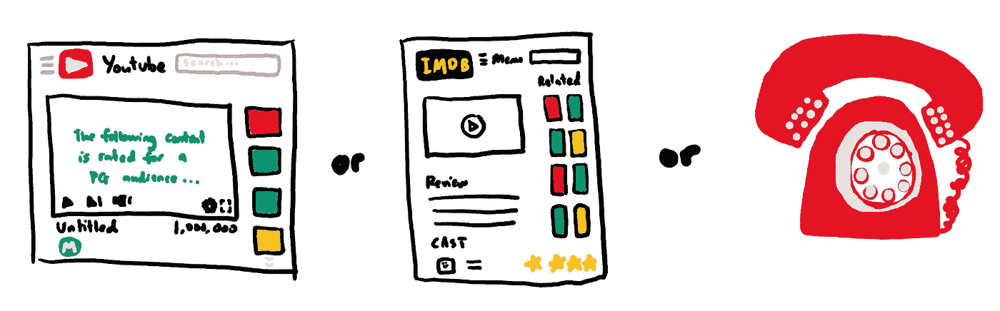*

*图片由米歇尔·谢提供*

*现在，这些都是不同形式的数据来源，帮助你解决选择看哪部电影的问题。你可能想把这些资源保存在某个地方。可以是 YouTube 视频的网址，也可以是评论的截图，或者是记下你朋友在电话中建议的电影名称。这些都是你可以收集来帮助回答你的问题的数据来源。您可能希望将这些数据源保存在某个地方。*

*但你真的想看每一部电影预告片，或者在每次想找一部新电影看的时候重读每一篇电影评论吗？"*

***号***

*“准确地说。因此，您可能希望将所有这些数据源归纳到一个电影列表中，并可能将您最感兴趣的那些放在列表的顶部。将所有数据源归纳到这个电影列表中的过程称为数据处理。*

*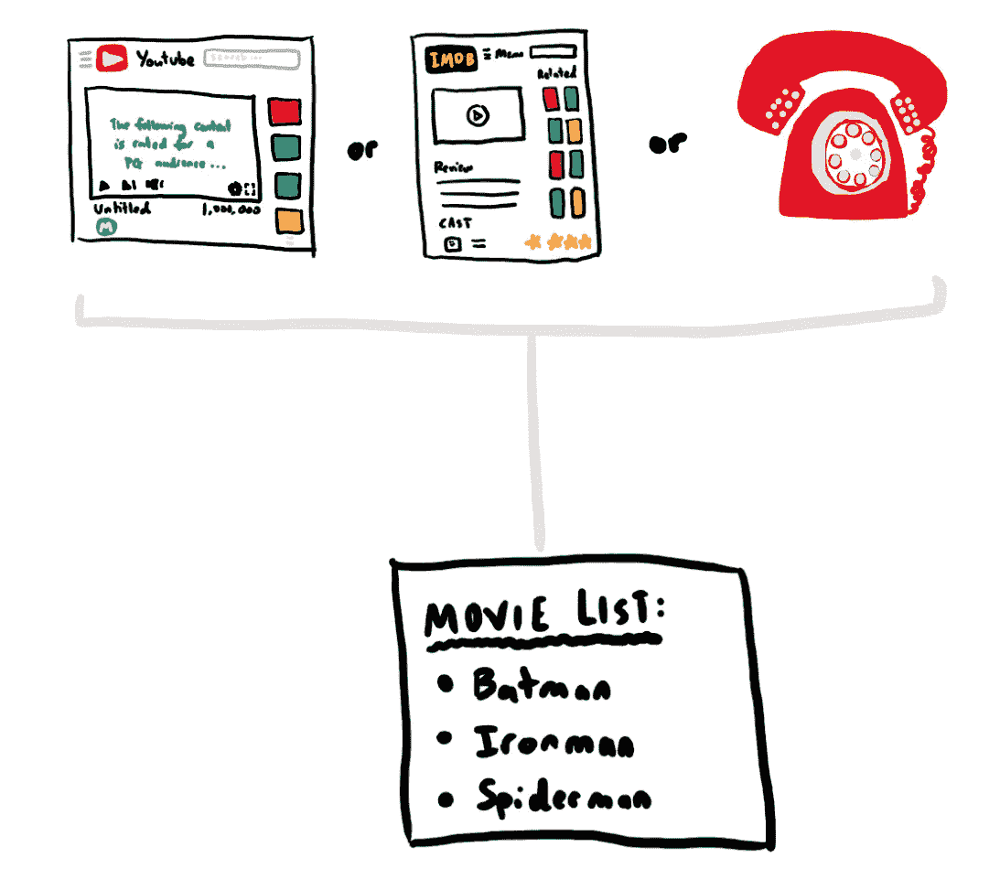*

*图片由米歇尔·谢提供*

*你基本上已经把所有的数据处理成了更有用的东西，所以下次你想找到要看的电影时，你只需查询你的总电影列表，而不是做所有的准备工作。如果你愿意，你可以扔掉所有这些网址和截图，因为你可以从你的电影列表中找到你需要的一切。这有意义吗？"*

***是啊，有道理。***

*因此，组织处理数据和建立这些数据仓库系统的原因是一样的。还没到找出接下来看哪部电影的程度，但他们建立了这些数据仓库和数据分析系统，以帮助他们找到问题的答案，并做出更好的商业决策。*

*现在，通常情况下，他们在数据系统中处理更多的数据和更复杂的查询，所以你经常会听到一些可怕的词汇，如大数据处理、大规模并行处理引擎和框架，但它们都只是帮助你构建系统来回答查询和做出更好决策的工具。"*

*啊，我明白了。*

*“好吧，回到阿帕奇火花。Apache Spark 是一个相当复杂的组织，他们做很多事情。如果你去他们的[官网](https://spark.apache.org/docs/latest/)，这是他们提供的描述:*

```
*Apache Spark is a unified analytics engine for large-scale data processing. It provides high-level APIs in Java, Scala, Python and R, and an optimized engine that supports general execution graphs. It also supports a rich set of higher-level tools including Spark SQL for SQL and structured data processing, MLlib for machine learning, GraphX for graph processing, and Structured Streaming for incremental computation and stream processing.*
```

*我知道这包含了很多技术术语，但你可以基本上把 Apache Spark 看作是一个已经提出了一个非常非常好的数据处理框架的组织，它们很受欢迎，因为它们支持相当多的流行编程语言，如 Java、Scala、Python 和 R，人们可以用它们来处理数据。他们还提出了进行[机器学习](https://spark.apache.org/docs/latest/ml-guide.html)和 g [图形处理](https://spark.apache.org/docs/latest/graphx-programming-guide.html)的框架，我甚至不想深入研究，因为就像我说的，他们做了很多。*

*在某种程度上，我们只是决定，嘿，与其试图找出我们自己的框架并与他们竞争，为什么我们不与 Apache Spark 合作，利用他们的框架并在我们的工作室中运行它。不难说服执行委员会让我们这样做，所以现在我们在 Synapse studio 中完全支持 Apache Spark。"*

***我明白了，聪明之举。***

*“是的，现在这也使我们能够扩展我们的能力，因为人们不仅可以使用我们的 studio 来构建 SQL 数据仓库，他们现在还可以使用 Apache Spark 的框架进行数据准备、数据处理，甚至构建机器学习模型。在我看来，这是世界上最好的。”*

***那么 Apache Spark 在 Synapse 中是如何工作的呢？***

*“好了，我们开始告诉我们的用户创建一个 [Apache Spark pool](https://docs.microsoft.com/en-us/azure/synapse-analytics/spark/apache-spark-concepts#spark-pools) 。这个池就像一个配置文件。它允许我们的用户指定池中将包含多少节点、这些节点的大小、何时暂停池、使用哪个 Spark 版本等等。*

*这些节点本质上是 Spark 池中的工作节点，它们将作为 Spark 作业的一部分完成分配给它们的任务。*

*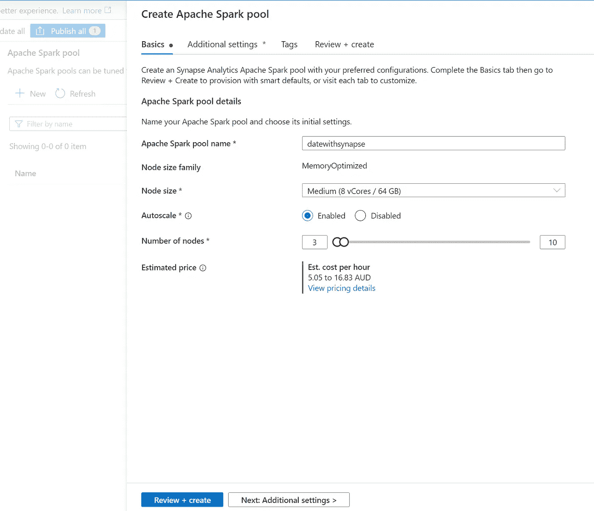*

*图片由米歇尔·谢提供*

*显然，[节点大小](https://docs.microsoft.com/en-us/azure/synapse-analytics/spark/apache-spark-pool-configurations#node-sizes)取决于用户的数据处理需求，因此我们让用户能够选择。*

*我们也给他们其他选择，比如他们是否希望我们为他们处理[自动缩放](https://docs.microsoft.com/en-us/azure/synapse-analytics/spark/apache-spark-pool-configurations#autoscale)他们的节点数，所以基本上他们可以设置一个范围。假设范围是 3 到 10，这意味着池中至少会有 3 个节点，但是如果情况开始变得有点疯狂，更多的节点会自动添加到池中，直到达到 10 个节点。"*

***我一次只能有一个游泳池吗？***

*绝对不是，您可以使用不同的配置创建任意多个池*

***但是拥有多个池的成本不是更高吗？***

*“嗯，从技术上来说不是。在你开始运行 Spark 作业之前，Spark pool 不需要任何成本，但一般来说，我们建议我们的用户从小规模开始，创建一个小池来玩它，并进行测试，直到他们发现他们需要的是什么。”*

***那么火花池的使用怎么收费呢？***

*“这个问题问得好。当您想要运行一个 Spark 作业时，您必须首先连接到 Spark 池。这就是我们所说的 [Spark 实例](https://docs.microsoft.com/en-us/azure/synapse-analytics/spark/apache-spark-concepts#spark-instances)。现在，一个池可以有多个用户的多个连接，所以我们称每个连接为一个 *Spark 实例*。*

*一旦你有了一个 Spark 实例，你的 Spark 任务就交给了一个叫做 [SparkContext](https://spark.apache.org/docs/latest/api/scala/org/apache/spark/SparkContext.html) 的东西，它位于 Spark 应用程序的主驱动程序中。把 SparkContext 想象成一个协调者，有点像之前的游泳教练。*

*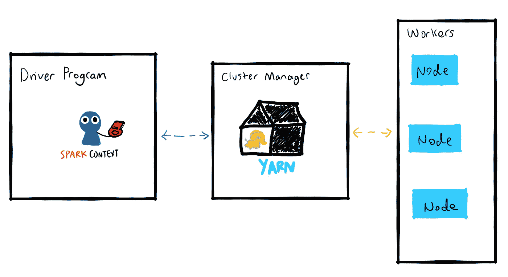*

*图片由米歇尔·谢提供*

*现在，您的 SparkContext 负责连接到一个集群管理器，您可以将这个集群管理器看作是一个游泳代理机构，它将游泳者的工作外包出去。我们称这个游泳代理为' [YARN](https://hadoop.apache.org/docs/current/hadoop-yarn/hadoop-yarn-site/YARN.html) '因为它是我们使用的集群管理器。*

*YARN 有它们自己的方式来分配或外包它们的工作节点给我们，所以为了简单起见，我们称它为 *YARN magic* 。*

*所以基本上，SparkContext 会去 YARN 并请求一些节点。然后，YARN 在幕后进行一些 YARN 魔术，然后返回 SparkContext 并说，“嘿，伙计，你可以使用节点 1 和节点 2”。*

*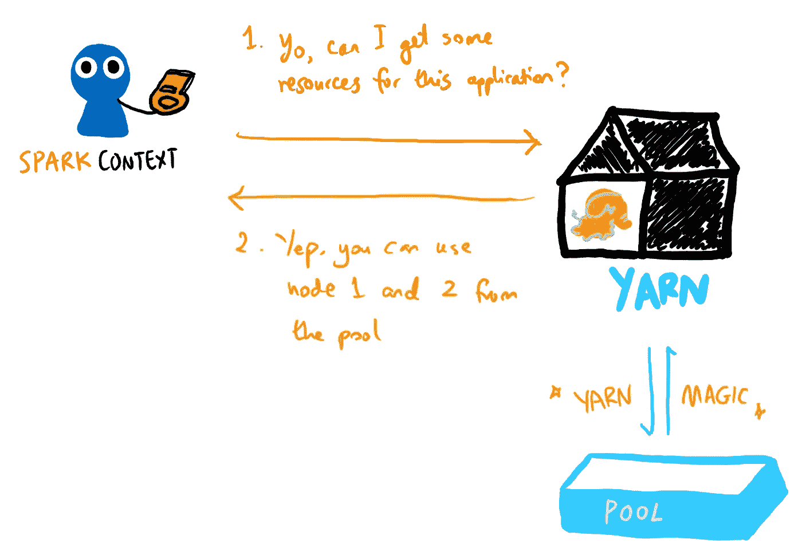*

*图片由米歇尔·谢提供*

*然后，SparkContext 将应用程序代码和分解成任务的作业发送到可用节点 1 和 2。*

**

*图片由米歇尔·谢提供*

*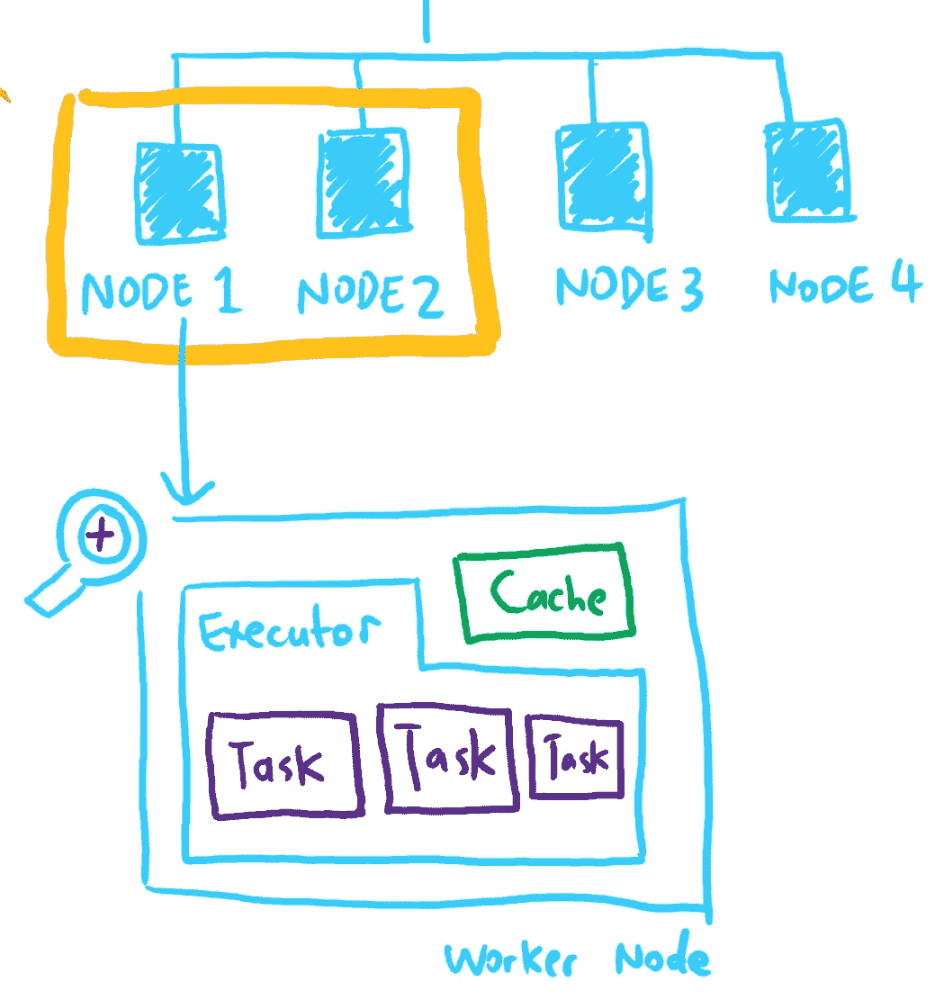*

*图片由米歇尔·谢提供*

*这些节点运行一个负责处理任务的执行器。节点还包含一个缓存，以便它可以引入数据并将其存储为 rdd(弹性分布式数据集)进行内存处理，这比典型的磁盘处理要快得多，因为您不必对磁盘进行太多的读写操作。*

*一旦任务被处理，结果就被发送回 SparkContext。*

*然后 SparkContext 将所有东西放在一起，就像那些三明治制作者一样，他们的任务是在最后将整个三明治放在一起。*

*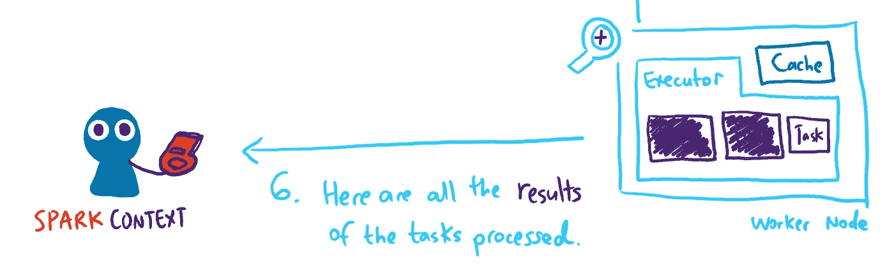*

*图片由米歇尔·谢提供*

*SparkContext 知道如何将所有东西放在一起，因为它使用有向无环图( [DAG](https://en.wikipedia.org/wiki/Directed_acyclic_graph) )来跟踪任务。*

*无论如何，这是一种非常冗长的方式来说，我们对 Spark 实例收费，而不是 Spark 池，所以除非我们的用户正在使用我们的资源来处理东西，否则我们不会向他们收取不必要的费用来为他们保留资源。"*

***那么，星火池的使用怎么收费呢？***

*"让我们结束午餐，然后回去检查管道室."*

***当然。***

*“你以前听说过 [Azure 数据工厂](https://docs.microsoft.com/en-us/azure/data-factory/introduction)吗？”*

*不，我没有。*

*“哦。如果你有，我们工作室的管道室看起来很像数据工厂，那是因为我们决定不重新发明轮子。我们决定与 data factory 合作，引入他们令人惊叹的数据移动、编排、转换和集成服务，其中一些我们在工作室的 [Synapse 管道](https://docs.microsoft.com/en-us/azure/synapse-analytics/get-started-pipelines)下提供支持。”*

***管道到底是如何工作的？***

*“假设我们想烤一批饼干，搭配我们之前做的三明治，喂我们饥饿的孩子。现在，为了烘烤一批饼干，我们需要完成一系列活动，对吗？”*

***对。***

*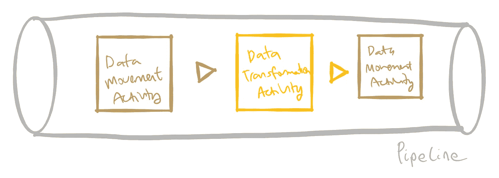*

*图片由米歇尔·谢提供*

*这组活动在数据工厂术语中称为 p [ipeline](https://docs.microsoft.com/en-us/azure/data-factory/concepts-pipelines-activities) 。管道支持 3 种类型的活动，它们是:*

*   *[运动活动](https://docs.microsoft.com/en-us/azure/data-factory/concepts-pipelines-activities#data-movement-activities)*
*   *[改造活动](https://docs.microsoft.com/en-us/azure/data-factory/concepts-pipelines-activities#data-transformation-activities)*
*   *[控制活动](https://docs.microsoft.com/en-us/azure/data-factory/concepts-pipelines-activities#control-flow-activities)。*

*通常使用的移动活动称为[复制活动](https://docs.microsoft.com/en-us/azure/data-factory/copy-activity-overview)，它负责采购制作饼干所需的所有饼干原料，并将烘焙食品分发给我们的小饼干怪兽。*

*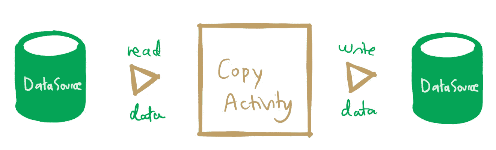*

*图片由米歇尔·谢提供*

*采购 cookie 配料是一个将数据从数据源读入数据工厂的例子，这样我们就可以将它处理成 cookie。*

*现在，为了引进饼干配料，这需要我们首先与一些饼干配料供应商联系。这在数据工厂中被称为[链接服务](https://docs.microsoft.com/en-us/azure/data-factory/concepts-linked-services)。链接的服务指定了我们希望与哪个数据源建立连接。世界上有很多饼干配料供应商，所以我们需要指定我们想要联系的供应商。链接服务还用于建立到您想要使用的[计算资源](https://docs.microsoft.com/en-us/azure/data-factory/compute-linked-services)的链接。例如，你可以在家里或者像 Azure 这样出租的商业厨房里烘烤饼干。*

*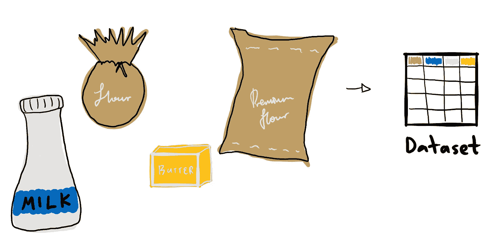*

*图片由米歇尔·谢提供*

*现在，饼干的配料可能有各种不同的类型，所以我们需要具体说明，比如所有的“白色”配料是面粉，所有的“黄色”配料是黄油，所有的“液体”配料是牛奶等等。这在数据工厂中被称为[数据集](https://docs.microsoft.com/en-us/azure/data-factory/concepts-datasets-linked-services)，因为它定义了我们引入的配料数据的结构。*

*一旦我们有了配料或我们的 cookie 数据集，我们就可以开始把它们变成真正的 cookie。这就是我们的[数据转换活动](https://docs.microsoft.com/en-us/azure/data-factory/concepts-pipelines-activities#data-transformation-activities)的用武之地。*

*如果你是一个简单的曲奇烘焙师，也就是说，你将采取的大多数步骤都是相当标准的曲奇制作技术，你可能会对[数据流](https://docs.microsoft.com/en-us/azure/data-factory/control-flow-execute-data-flow-activity)感兴趣。把数据流想象成一种烘烤饼干的视觉方式。因此，cookies 指令不是以文本形式写出来，而是以可视图表的形式画出来。这就是 data factory 中的数据流允许您对数据做的事情。您可以设计数据转换逻辑，而不必编写代码。*

*像复制活动(一种数据移动活动)或数据流(一种数据转换活动)这样的活动需要在集成运行时(IR)上运行。"*

***什么是集成运行时？***

*我就知道你会问我这个。*

*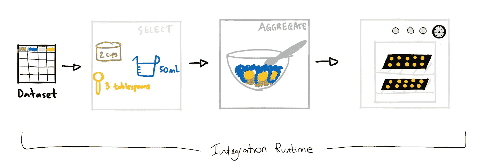*

*图片由米歇尔·谢提供*

*一个[集成运行时](https://docs.microsoft.com/en-us/azure/data-factory/concepts-integration-runtime)是执行活动的计算环境。你可以把它想象成让你做饼干的厨房基础设施。同样，这个集成运行时可以是你自己的自托管厨房或 Azure 管理的厨房。*

*好的，这里有一个问题:“如果我们有两个管道，比如说，一个三明治管道和一个饼干管道，我们想在制作饼干之前先制作三明治。你觉得我们能做什么？”*

***我们能否建立三明治管道，然后摧毁它，建立曲奇管道？***

*“不完全是。我们可以构建两条管道，然后使用我们的控制流活动来[触发](https://docs.microsoft.com/en-us/azure/data-factory/concepts-pipeline-execution-triggers#trigger-execution)cookie 管道在三明治管道之后运行。”*

***触发？***

*“是的，所以通常数据工厂中的管道在分配给它的触发器被调用时运行。您也可以手动运行管道，但触发器允许您自动运行管道。例如，您可能希望使用[调度触发器](https://docs.microsoft.com/en-us/azure/data-factory/concepts-pipeline-execution-triggers#schedule-trigger)调度管道在某个时间运行，或者您希望使用[基于事件的触发器](https://docs.microsoft.com/en-us/azure/data-factory/concepts-pipeline-execution-triggers#event-based-trigger)调用管道在某个事件之后运行。*

*嘿，说到日程安排，我还有一个会议要赶去，所以我可能不得不在这里结束我们的约会，但如果你想[了解更多](https://docs.microsoft.com/en-us/azure/synapse-analytics/overview-what-is)，就伸出手来，我们可以为下次预订更多的时间。"*

**原载于*[*https://www.linkedin.com*](https://www.linkedin.com/pulse/explain-example-synapse-analytics-michelle-xie)*。**

**作者:*谢蜜儿*