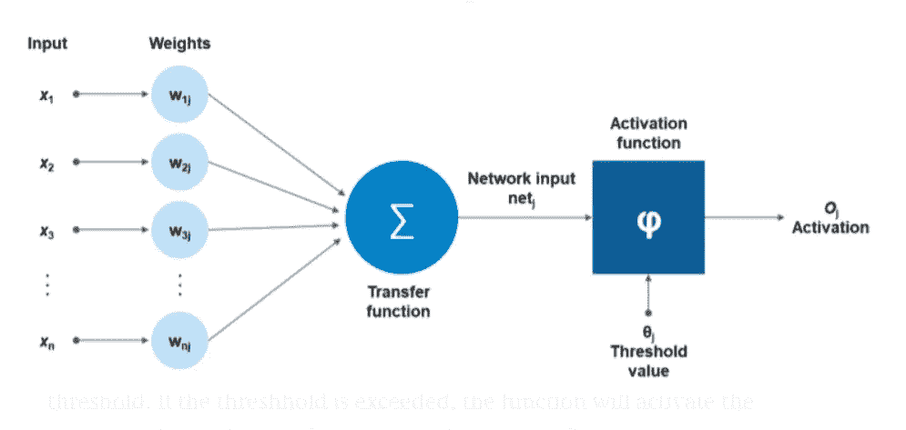
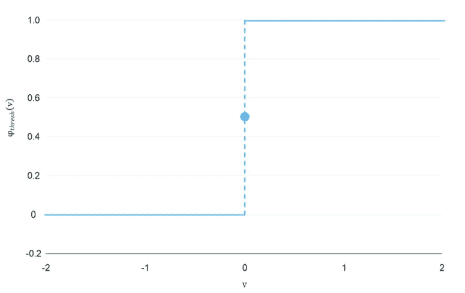
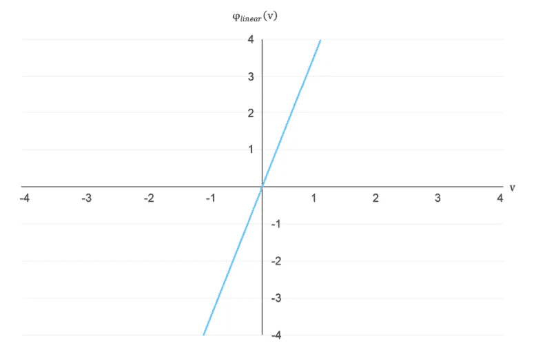
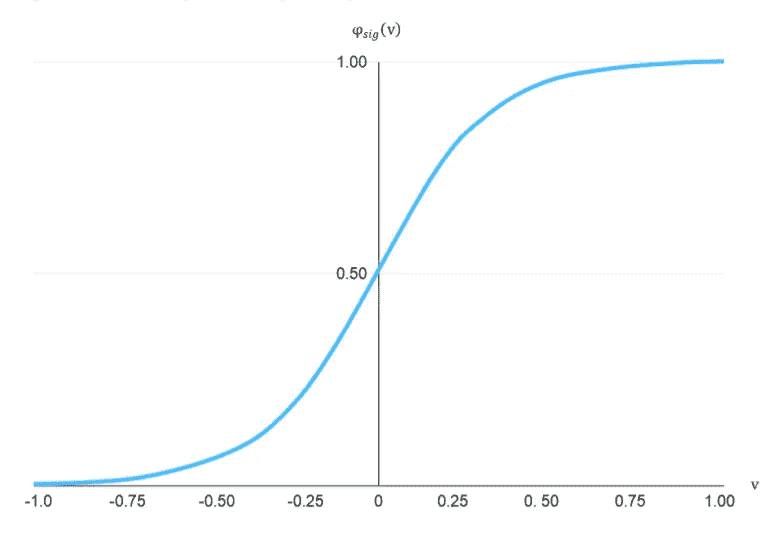
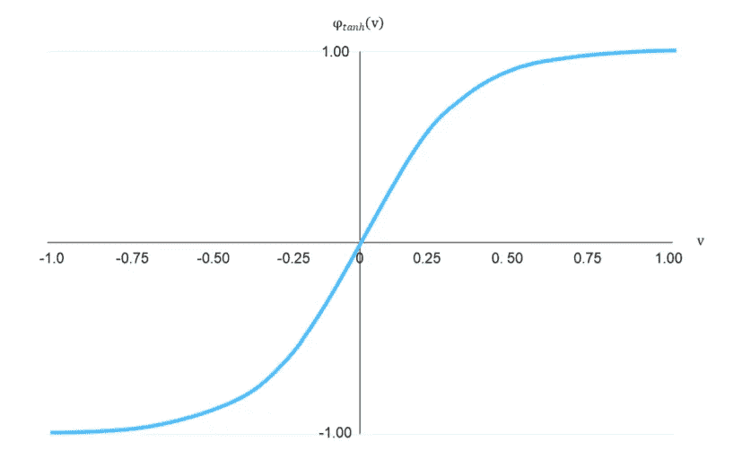
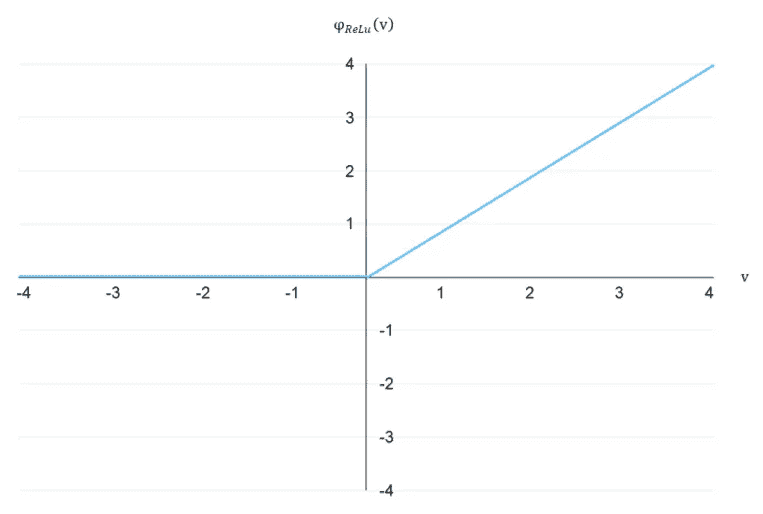
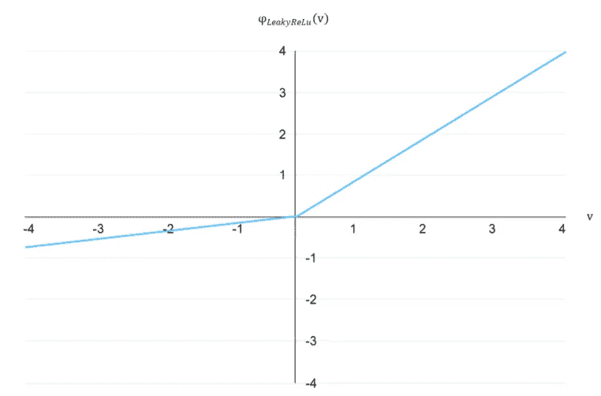

# 像我五岁一样解释:激活功能

> 原文：<https://towardsdatascience.com/explain-like-im-five-activation-functions-fb5f532dc06c?source=collection_archive---------23----------------------->

这项工程由来自 unsplash.co 的 RAEeng 完成

## 用尽可能少的数学对激活函数进行简单易懂的解释

我最近写了一篇关于[人工神经元如何工作](/explain-like-im-five-artificial-neurons-b7c475b56189)的短文，一些人问我，我是否可以对激活功能做一些类似的事情。所以在这里，我对这个话题的两个美分！

# 什么是激活功能？

人工神经元及其元素的表示。Geshenson 2003。作者插图。

如果你读过我以前的文章，你还记得生物神经元在将信号传递给下一个神经元之前是如何充电的吗？我们的每个生物细胞都有一个特定的**阈值**，它决定神经元是否“触发”并将其信号传递给下一个神经元。在一个人工神经元中，我们通过实现一个拥有特定数学阈值的**激活函数**来复制这种行为。如果我们加权输入的总和**超过激活函数阈值的值**，信号将被传递到下一个神经元。在这种情况下，人工神经元将被认为是“**激活的**”。

# 为什么激活函数如此重要？

我说过我们会尽量少用数学。因此，我们将进行一个简短的**思维实验**，而不是给你一些奇特的数学方程式:

经过漫长的一天工作，你回到家，你的另一半已经准备好了你最爱吃的菜。香味太棒了！它看起来棒极了，天哪——尝起来像天堂！你大吃大喝，吃得比你能吃的还要多，你很高兴你有如此美好的生活。

那么此刻你的大脑在发生什么呢？对，负责识别这个盘子的神经元在拼命工作。如果我们试图在人工神经元网络中复制这种行为，我们可以确定神经元的激活功能，这样每当你闻到、看到或尝到这道菜时，它们就会激活。这种行为将是**逐步的**，这意味着人工神经元要么激活，要么不激活。

但这是对的吗？你真的总是对你最喜欢的菜有同样的感觉吗？你是否只想在生命中的某个时刻品尝这道菜？让我们在思想实验中更进一步:

你刚刚吃了一大堆食物，因为你的一个同事当了爸爸，并赞助了每个人的披萨和饮料。你回到家，你的另一半会送你最喜欢的菜。你很感激这种姿态，你喜欢这道菜，但你只是不能再吃了。

这是否意味着你不喜欢你最喜欢的菜？当然不是，它闻起来仍然很香，你知道你喜欢它，但你的胃告诉你，你不能再吃了。所以你在这一刻的感觉比爱或不爱它更复杂一点，对吗？

所以我们必须调整激活函数，让老鼠能够复制这种行为。我们可以使激活函数**线性**。在这种情况下，我们的人工神经网络将能够复制出你爱你的菜 a **一点点**，但不是那么多，因为你现在已经吃饱了。

现在，线性函数有一个数学问题。如果你将一个线性函数的结果应用于另一个线性函数，该运算的输出仍然是线性的。换句话说，结果总是以相同的比例增长。就我们的小例子而言，这意味着即使你已经吃饱了，你也会对你的菜感到**完全相同的**“一点点”兴奋。这听起来对吗？让我们在思想实验上做最后一次飞跃:

*你在同事的庆功宴上吃了很多披萨，但你已经一个多月没吃你最喜欢的菜了。你吃饱了，但是你非常兴奋，因为你从对你来说最重要的人那里得到了你最喜欢的菜！*

你是因为吃饱了而对你的菜感到有点兴奋，还是对它感到更兴奋？没错，与之前的场景相比，你更喜欢这个场景。我们可以得出结论，我们对最喜欢的菜的感觉是**不成比例的**。结果，线性激活函数不再是合适的选择——我们需要切换到**非线性**激活函数。

那么为什么激活函数如此重要呢？没有它们，人工神经元的输出将等于其加权输入的总和。信号将**总是**传递到下一个神经元，并且所有神经元将一直被激活。通过使用激活函数，我们可以将**阈值**引入到我们的人工神经元中，**阻止**神经元被激活，如果它们的信息可以被认为是不相关的。激活功能还通过引入非线性使人工神经元能够解决更复杂的问题。

# 常见的激活函数是什么样子的？

本节将为您提供不同激活功能的更详细解释，以及它们的使用案例和限制。

## 逐步地

你可能已经猜到了——最简单的激活函数是所谓的**阶跃函数**。

阶跃函数。图片作者。

阶跃函数给激活函数增加了一个阈值(因此也称为“阈值函数”)。如果输入的加权和高于某个值，则该神经元被宣布为激活的。如果总和低于这个值，它就不会被激活。因此，这些功能仅限于**二元分类问题**(是或否)，但不能复制更复杂的情况。

## 线性的

那么我们能做些什么来解决这个问题呢？正确，我们可以用一个**线性函数**。线性函数可以提供**中间**激活值，如“50%激活”或“20%激活”。通过这种方式，人工神经元网络可以区分不同的输出，并决定最高的激活值。

线性函数。图片作者。

然而，如前所述，如果将几个线性函数的输出相乘，第一次乘法的输出将增加与最后一次结果相同的数量。这不一定是个问题，但是人工神经元网络通常由多层人工神经元组成。简单来说，人工神经元网络是通过在信息通过网络时错误地计算**变化**来学习的(也称为 [**梯度下降**](https://builtin.com/data-science/gradient-descent) )。当在这样的结构中使用线性函数时，在信息通过第一层后，误差的变化将总是相同的**。为什么？因为结果总是会增加**相同的**方式，因此误差总是会增加**相同的**方式。结果，使用线性激活函数使得多层网络不可能在第一层之后学习任何新的东西。**

## 逻辑乙状结肠

你可能已经猜到了:为了克服这些问题，可以使用一个**非线性**函数。非线性函数的一个例子是所谓的“**逻辑 sigmoid** 函数。由于它们的非线性性质，逻辑 sigmoid 函数能够在人工神经元网络中堆叠**无限数量的**层，这使得该函数适合于解决更加**复杂的**问题。通过给予**中间**激活，它还结合了线性函数的优点。如图所示，逻辑 sigmoid 函数呈“S”形，这意味着误差的变化随着函数向 x = 0 方向变陡而增加。因此，该区域中 x 的小变化也会带来 y 值的大变化，因此有利于基于梯度下降的训练算法。

逻辑 s 形函数。图片作者。

由于其优势，逻辑 sigmoid 函数很可能是**最常用的**激活函数之一。然而，sigmoid 函数的缺点是**在 x 定义范围的末端**非常平坦(本例中为-1 和 1)。这意味着一旦函数落在这些区域之一，梯度变得非常小。结果，梯度接近零，并且网络**不能学习**。

sigmoid 函数的另一个问题是 y 值只能是正的**因为函数不是关于原点对称的。因此，下面的神经元只能接收正值形式的输入，这(取决于问题陈述)**是不期望的**。如果一个网络将在例如具有变化的正负过程的价格数据上被训练，该网络将能够**解释**负的输入价格，但是不能**在其输出中相应地将价格表示为负。****

## 双曲正切

然而，这个问题可以通过对 sigmoid 函数进行**缩放**来解决。这种类型的激活函数称为双曲正切函数。

双曲正切函数。图片作者。

双曲正切函数的工作方式类似于 sigmoid 函数，但是它的中心相对于原点是对称的。当它的范围从-1 到 1 时，它**解决了**正输入的问题。然而，即使它具有 sigmoid 函数的所有**正面好处**，它仍然**遭受**在曲线的平坦水平上被称为“[消失梯度问题](https://en.wikipedia.org/wiki/Vanishing_gradient_problem)。

简而言之，它描述了这样一个问题，即**较高**一个输入，**较小**这个梯度。所以你的网络层数越多，你的跟随输入就越高/越小，因此你的梯度就越低。由于小梯度意味着网络**没有**学习很多，这也意味着这种函数不适合于具有**大量**层的网络。

## 热卢

双曲正切函数的替代方法是整流线性单位或“ReLu”。

ReLu 函数。图片作者。

ReLu 函数是**非线性**，这使得训练更加有效，并且使得多层神经元能够被该函数激活。然而，使用 ReLu 功能相对于其他功能的主要优势是它将所有的**负**输入转换为零。结果，网络仅激活具有正和的 nurons，这使得它的计算效率更高。然而，ReLu 函数也有消失梯度问题**和**，因为图形负侧的梯度等于零。因此，如果在激活期间梯度碰巧在这个区域，网络将**不**学习。这种现象也被称为“ [**”垂死的 ReLu**](/the-dying-relu-problem-clearly-explained-42d0c54e0d24) ”。

## 泄漏 ReLu

漏 ReLu 函数通过将负输入表示为函数输入的线性分量**来解决垂死 ReLu 问题。因此，负输入**保持**，零梯度问题**被移除**，因为图表左侧的梯度**不再**等于零。**

漏 ReLu 函数。图片作者。

# 总结时间！

激活函数在人工神经元中用于复制生物神经元的行为，方法是实现一个拥有特定数学**阈值**的**激活函数**。如果阈值**超过**，信号将传递到下一个神经元。在这种情况下，人工神经元将被视为“**激活**”。

激活功能很重要，因为它们赋予人工神经元只有在呈现的输入有意义时才被激活的能力。它们还让我们有可能调整人工神经元的学习能力，并给网络增加更多的复杂性。

有许多**不同的**激活功能，各有其优点和局限性。研究表明，没有一个通用的激活函数可以完美地解决所有问题。今天，有超过 27 种不同的标准激活函数可以在人工神经网络中使用。一般来说，人工神经元用非线性激活函数训练**更好**。然而，选择**右**激活函数高度**取决于**你试图解决的数学问题。据说 Sigmoid 和 Tanh 在**分类问题**的情况下工作得很好，尽管它们的渐变脆弱性消失。另一方面，使用 ReLu 或泄漏 ReLu 函数的神经网络已被证明在不同类型的问题上表现良好。而使用更专业的方法(即 ELUs、SELUs、SoftExponential 等)的网络可以胜过它们。)它们是**最常用的**类型的激活函数，因为它们比 sigmoid 更有优势，而且训练效率也更高。

如果你想了解更多关于激活函数、梯度下降、人工神经元网络如何学习的知识，我强烈推荐你详细看看 [**这篇文章**](https://mlfromscratch.com/activation-functions-explained/#/) 。但是要注意——这涉及到一些数学知识！；-)

# 来源

1.  鲁兰德。2004.神经网络中的 Einführung，2–13。乌尔姆:乌尔姆大学。
2.  卢哈尼瓦尔。2019.“分析神经网络中不同类型的激活函数——选择哪一种？“走向数据科学。最后修改时间 2019 年 05 月 07 日。[https://towards data science . com/analyzing-different-type-of-activation-functions-in neural-networks-one-to-preferred-e 11649256209](/analyzing-different-types-of-activation-functions-inneural-networks-which-one-to-prefer-e11649256209)
3.  古普塔。2020."深度学习的基础——激活功能和何时使用它们？"分析 Vidhya。最后修改时间 2020 年 1 月 30 日。[https://www . analyticsvidhya . com/blog/2020/01/fundamentals-deep-learning-activation-functions-when-to-use-them/](https://www.analyticsvidhya.com/blog/2020/01/fundamentals-deep-learning-activation-functions-when-to-use-them/)