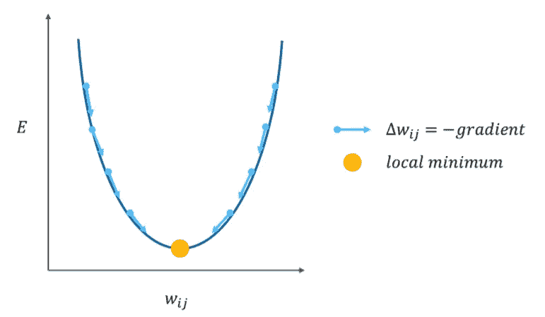
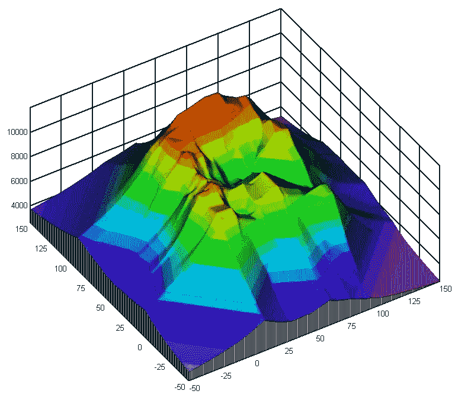

# 像我五岁一样解释:反向传播

> 原文：<https://towardsdatascience.com/explain-like-im-five-backpropagation-38d1cec94ee5?source=collection_archive---------34----------------------->

尼古拉斯·卡佩罗在 [Unsplash](https://unsplash.com/s/photos/graph?utm_source=unsplash&utm_medium=referral&utm_content=creditCopyText) 上拍摄的照片。

## 对人工智能初学者主题的温和介绍

我最近写了一篇关于[人工神经元网络如何学习](/explain-like-im-five-how-an-artificial-neuronal-network-learns-8ea4715b6f4c)的短文。虽然这篇文章为您提供了主要概念的简要概述，但它并没有向您解释学习实际上是如何工作的。本文将尝试回答一些未解决的问题，并通过简单解释人工神经网络监督学习最常用的方法，带您深入兔子洞:**“反向传播”**。

# 什么是反向传播？

反向传播是一种算法，它使人工神经网络根据它产生的预测误差进行学习。该算法可以总结为三个步骤:

1.  输入数据通过网络向前传递，人工神经网络根据其初始权重进行**预测**。
2.  然后将网络的输出与期望的结果(也称为目标值)进行比较。两者之间的差异被认为是网络的**误差**。
3.  然后误差通过网络反向传递，神经元连接的权重根据它们对误差的影响进行**调整**。

通过这种方式，反向传播算法保证了每次学习的输出都接近期望的输出。

# 我们如何测量人工神经网络误差？

反向传播解决了人工神经网络的所有错误。该误差由所谓的“**损失函数**计算，该函数有时也称为“成本函数”。损失函数将实际值与神经网络计算的值进行比较，并计算它们的差值。这种差异就表示为网络损耗。根据网络要解决的问题，必须使用不同的损失函数。

**二元分类**问题是建模问题，其中示例被分配给两个标签中的一个(即是或否)。应用于二元分类问题的流行损失函数是二元交叉熵损失、铰链损失和平方铰链损失函数。

**多类分类**问题是指将样本分配给两个以上标签中的一个(即动物的图像识别)。这类问题常用的损失函数有多类交叉熵损失、稀疏多类交叉熵损失和 Kullback Leibler 散度损失函数。

**对于回归问题**(即时间序列预测)最常用的损失函数有均方误差、均方对数误差、平均绝对误差和平均绝对百分比误差。

如果你想更深入地研究其中的任何一个，我强烈推荐你阅读杰森·布朗利关于“ [*在训练深度学习神经网络*](https://machinelearningmastery.com/how-to-choose-loss-functions-when-training-deep-learning-neural-networks/) 时如何选择损失函数”的博客。虽然博客不仅给你更详细的解释，作者还包括实际的代码片段，我总是觉得非常有帮助。

# 如何根据误差调整权重？

反向传播算法本身基于所谓的“**梯度下降**技术，这是一种旨在优化特定函数的算法。在人工神经网络的情况下，梯度下降技术用于调整人工神经网络的权重以最小化损失函数。

为了最小化损失函数，该算法测量函数的梯度并在相反方向更新权重(w *ij)* ，使得网络的损失移动到函数的平坦区域。重复该过程，直到算法通过找到损失函数的**局部最小值**而实现最低误差( *E* )。

权重以与渐变相反的方向更新。图片作者。

然而，大多数人工神经网络是多维的，这意味着它们可以有多个局部最小值。你可以想象这一点，想象一下下面的三维图中展示的风景。

红色的山顶是我们网络误差最高的起点。图形边缘的紫色区域分别代表该模型的最佳局部最小值。因此，例如，如果梯度下降，算法在损失景观最陡的山的后面向下移动，它将迅速找到一个最优的局部最小值。我们可以得出结论，无论算法朝哪个方向移动，都会找到一个最优设置——对吗？

来自 wikimedia.org[的山农鲍林的三维等高线图](https://commons.wikimedia.org/wiki/File:Contour3D.jpg)

不幸的是，它没有那么防弹。让我们假设算法选择沿着山的前面走，向图的中间移动，发现自己在一个山谷中。因此，误差将开始变平，表明算法已经找到局部最小值。由于误差将再次开始增加，当算法继续沿着山谷的山坡向上走时，看起来找到的局部最小值是最优的。然而，实际上，该算法只找到了(潜在的)**许多不代表最优的局部最小值**中的一个。

你们中的一些人现在会问:为什么不简单地告诉梯度下降，走哪条路？这是一个有效的问题，如果可能的话，这将解决安的许多问题。然而，根据所选择的损失函数、网络的规模和复杂性，我们可能**不可能**提前模拟人工神经网络的损失维度。

如您所见，使用梯度下降算法可能会有一些陷阱。根据手头的问题和您选择的设置，您可以通过调整反向传播算法本身来尝试减轻一些问题。如果你有兴趣了解更多，我可以向你推荐这篇[文章](/gradient-descent-algorithm-and-its-variants-10f652806a3)。

# 结论

简而言之，反向传播是一种技术，可用于根据人工神经元网络产生的误差，通过相应地调整网络的权重来训练人工神经元网络。

误差就是人工神经网络的预测值和给定的目标值之间的差异。误差的计算取决于用于反向传播的损失函数。损失函数的类型可以变化，这取决于人工神经网络要解决的问题。

在反向传播期间，使用所谓的梯度下降技术来调整权重，梯度下降技术是一种优化损失函数的算法。为此，该算法在相反方向上更新权重，以便网络的损耗随着每次学习而减少。重复该过程，直到找到局部最小值，这表示网络损耗被最小化到最优。然而，取决于网络的复杂性以及手头的问题，由于可能存在多个局部最小值，找到最优局部最小值可能是棘手的。

# 来源

1.  梁和海金。1991.复杂的反向传播算法，2101–2104。新泽西:电气和电子工程师协会
2.  布朗利。2019.“训练深度学习神经网络时如何选择损失函数”。最后更改 2019 年 1 月 30 日。[https://machine learning mastery . com/how-to-choose-loss-functions-when-training-deep-learning-neural-networks/](https://machinelearningmastery.com/how-to-choose-loss-functions-when-training-deep-learning-neural-networks/)
3.  金内布洛克。1994.Neuronale Netze: Grundlagen，Anwendungen，Beispiele，19–162 页。奥尔登堡:德·格鲁埃特。