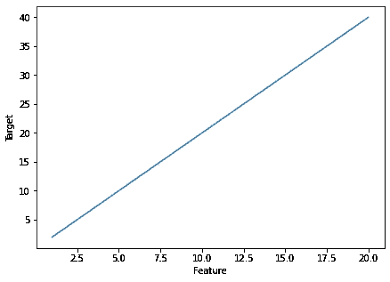
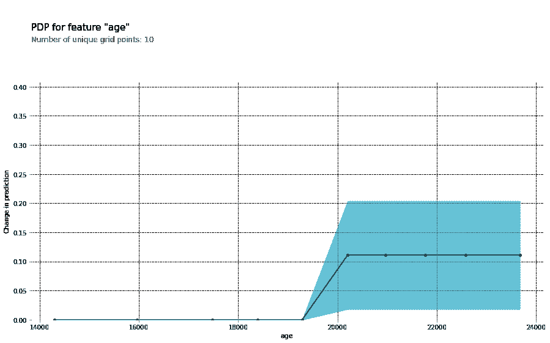
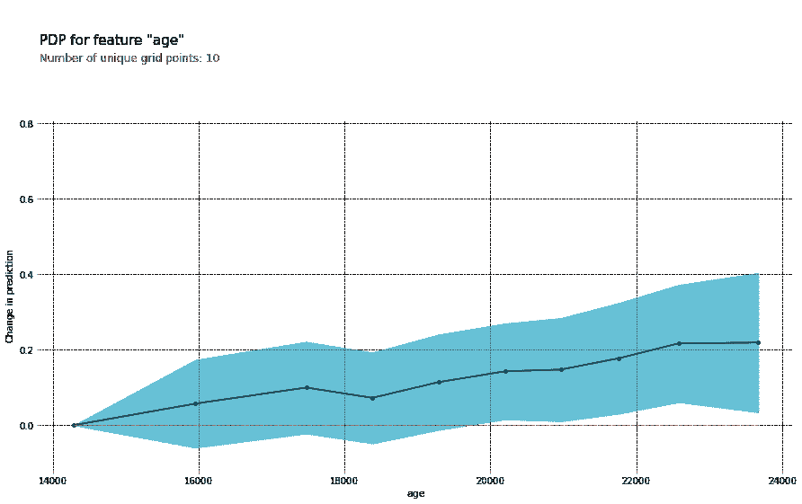
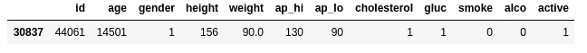
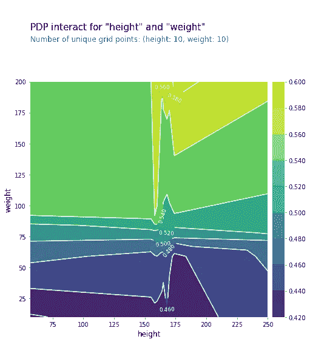

# 解释机器学习模型:部分依赖

> 原文：<https://towardsdatascience.com/explain-machine-learning-models-partial-dependence-ce6b9923034f?source=collection_archive---------14----------------------->

## [模型可解释性](https://towardsdatascience.com/tagged/model-interpretability)

## 让黑盒模型成为过去

来源( [Unsplash](https://unsplash.com/)

随着开发机器学习模型带来的所有复杂性，毫不奇怪，当用简单的英语解释时，其中一些模型翻译得不太好。模型输入进去，答案出来，没有人知道模型是如何得出这个结论的。这可能会导致在同一个团队中工作的不同成员之间出现某种程度的脱节或缺乏透明度。随着近年来机器学习的普及，使用复杂模型时这种缺乏可解释性的情况变得更加严重。在这篇文章中，我将讨论一些方法，使你的模型对普通人更容易解释，不管他们是你的非技术经理还是一个好奇的朋友。

**为什么可解释性很重要？**

随着时间的推移，机器学习模型的责任只会越来越大。他们负责从过滤你邮件中的垃圾邮件到决定你是否有资格获得你一直在寻找的新工作或贷款的一切事情。当这些模型不能用简单的英语解释时，信任的缺乏随之而来，人们变得不愿意在任何重要的决策中使用你的模型。如果你辛辛苦苦创建的模型最终没有被丢弃，因为没有人能理解它在做什么，那将是一种耻辱。在能够解释模型并展示来自模型的见解时，人们(尤其是那些没有数据科学背景的人)将更有可能信任和使用您创建的模型。

**解释系数**

在光谱的一端，我们有简单的模型，如线性回归。像这样的模型很容易解释，每个系数代表一个特性对我们目标的影响程度。

y = 2x 的简单线性回归

上图显示了由公式 *y=2x 表示的模型的曲线。*这意味着特性 *x* 增加 1，目标变量将增加 2。你可以像这样拥有多个特性；每一个都有自己的系数来表示对目标的影响。

另一方面，我们有像神经网络这样的“黑箱”模型，我们只能看到输入和输出，但从输入到输出的意义和步骤实际上被一大堆难以理解的数字所阻挡。

**部分依赖**

部分相关性显示特定特征如何影响预测。通过使所有其他特征保持不变，我们想要找出正在讨论的特征如何影响我们的结果。这类似于解释前一节中解释的系数，但部分相关性允许我们将这种解释推广到比简单线性回归更复杂的模型。

作为一个例子，我们将在 Kaggle 上的这个[心血管疾病数据集](https://www.kaggle.com/sulianova/cardiovascular-disease-dataset)上使用决策树。我们将用来绘制部分依赖关系的库是 [pdpbox](https://github.com/SauceCat/PDPbox) 。让我们训练模型，看看这一切是如何工作的。

创建部分从属图

特征年龄的部分相关性图

上图显示了特性`age`的部分相关性图。我们试图预测的目标变量是心血管疾病的存在。我们可以看到，随着`age`特征超过 19000 天(约 52 年)，它开始以积极的方式影响预测(更高的年龄意味着更高的心血管疾病概率)。当直觉地思考这种洞察力时，模型是有意义的，我们更有可能相信它的预测。

我们使用的决策树仍然相对简单，它的部分依赖图可能无法描绘出全貌。让我们再试一次，这次使用随机森林模型。

使用随机森林分类器创建部分依赖图

使用随机森林分类器的部分相关图

使用一个更复杂的模型，如随机森林，我们看到`age`特征更线性地影响我们的预测，这与我们使用更简单的决策树时看到的“阶梯式”预测效果相反。

**它是如何工作的？**

部分相关图依赖于一个模型，该模型与我们正在处理的数据相吻合。让我们以数据集的一行为例。

数据集的一行

我们这里的`age`变量的值是 14501。该模型将从这一行数据中预测心血管疾病的概率。我们实际上会多次这样做，每次做预测时都改变变量`age`的值。`age`为 12000 时，患心血管疾病的概率有多大？16000?20000?我们跟踪这些预测，看看改变这个变量如何影响预测。最后，我们对几行执行此操作，并对不同的`age`值进行平均预测。然后，我们将这些绘制出来，并得出上面看到的部分依赖图。

**更进一步**

既然我们已经看到了部分依赖是如何与单个变量一起工作的，那么让我们看看它是如何与特征交互作用一起工作的！假设我们想看看`height`和`weight`是如何相互影响我们的预测的。我们也可以使用部分依赖图来观察这种相互作用。我们将使用与上一节相同的随机森林模型。通过一点点改变我们的代码，我们将能够得出一个完全不同的外观图，帮助我们看到功能交互。

为特征交互创建部分从属图

身高和体重的部分相关图

这个图不仅看起来很漂亮，而且它也给了我们很多关于`height`和`weight`如何相互影响我们预测的信息。变量`height`的影响较小，因为当我们在 x 轴上移动时，图的颜色变化不大。`weight`似乎对心血管疾病的概率有更强的影响，因为随着我们沿 y 轴向上移动，预测会受到积极影响。再一次，直觉地认为这是有意义的。体重较高的人更有可能患心血管疾病。有了来自我们模型的这种洞察力，我们更倾向于相信它的预测。我们可以用任何两个特征来做到这一点，我们希望能够回答关于我们数据的不同假设。

**结论**

我们看到了能够向非技术观众解释机器学习模型的重要性。当一个模型被提炼为易于理解的见解时，人们更有可能相信它的预测，并长期使用它们。当试图为人们可能会持怀疑态度的机器学习项目赢得牵引力时，这可能非常有帮助。

我们看到了简单的模型，如线性回归，其中预测可以使用模型系数来解释。我们能够使用**部分依赖图在更复杂的模型中看到相同的洞察力。**我们甚至能够使用交互图来观察两个特征如何相互作用以影响预测结果。记住这些知识，让我们去掉机器学习模型变得太复杂以至于人类无法理解的污名！

感谢您的阅读！

您可以通过以下渠道与我联系:

*   [中型](https://zito-relova.medium.com/)
*   [领英](https://www.linkedin.com/in/zrelova/)。
*   [Github](https://github.com/zitorelova)
*   [卡格尔](https://www.kaggle.com/zitorelova)