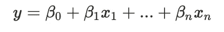
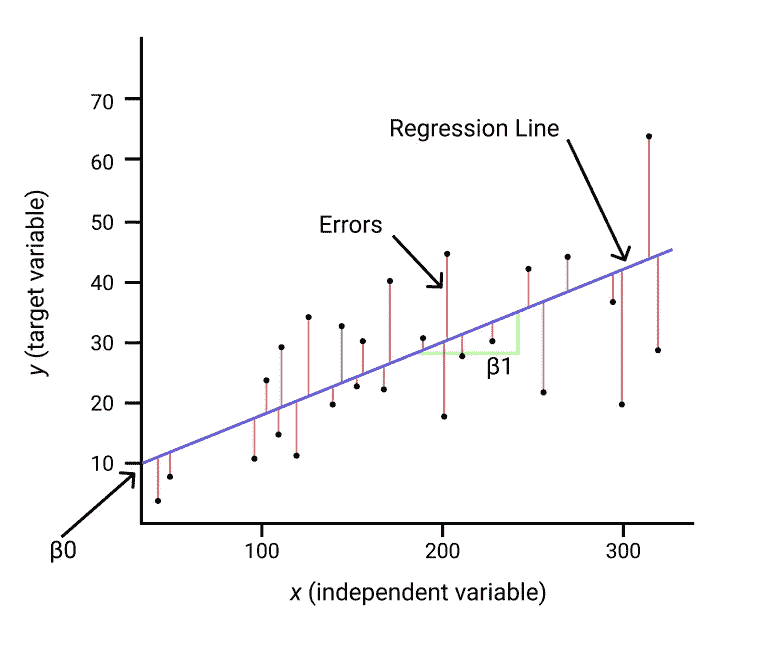
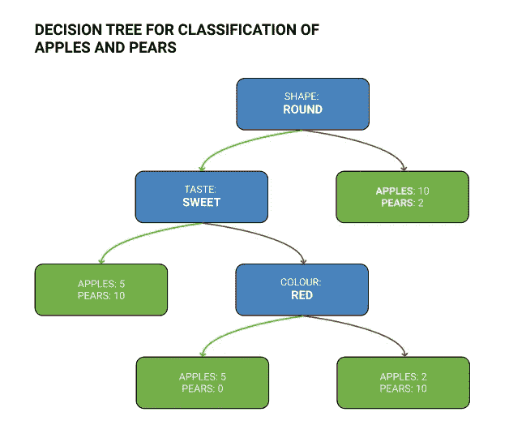
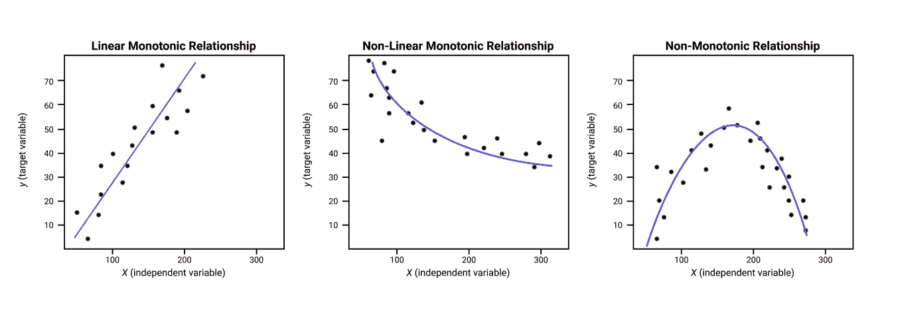
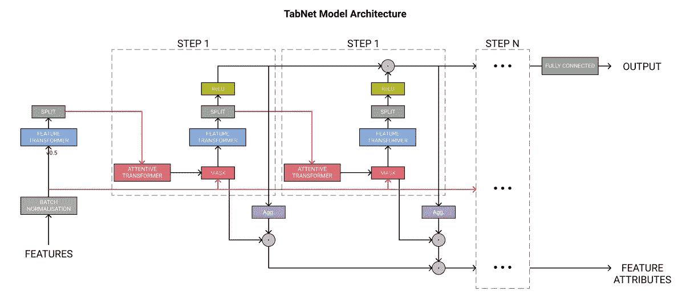
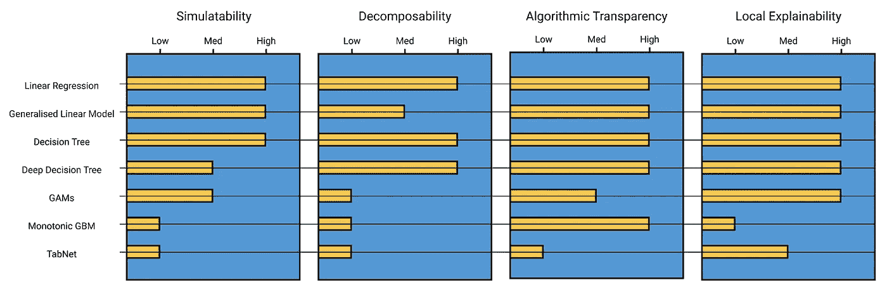

# 你应该了解的 5 个可解释的机器学习模型

> 原文：<https://towardsdatascience.com/explainable-ai-9a9af94931ff?source=collection_archive---------5----------------------->

## 当简单的方法奏效时，为什么要使用复杂的模型？


尼克·莫里森在 [Unsplash](https://unsplash.com?utm_source=medium&utm_medium=referral) 上拍摄的照片

# 介绍

众所周知，机器学习在我们的日常生活中无处不在。从亚马逊上的**产品推荐**，定向广告，看什么的**建议**，到搞笑的 **Instagram** **滤镜**。

如果这些出了问题，**大概不会毁了你的人生**。也许你不会得到完美的自拍，或者也许公司将不得不在广告上花更多的钱。

**执法中的面部识别怎么样？贷款或抵押申请？无人驾驶车辆？**

在这些**高风险**的应用中，我们不能盲目的进去。我们需要能够剖析我们的模型，我们需要能够在模型接近生产系统之前理解和解释我们的模型。

> 当我们对人们做出可能对他们的生活产生负面影响的决策时，如抵押贷款或信用评分，可解释的机器学习是必不可少的。

使用可解释的模型还允许更有效的调试，以及更好地理解模型中的**公平性、隐私**、**因果关系**和更多**信任**。

# 目录

*   [可解释的类型](#b822)
*   [可解释模型](#13ad)
    - [广义线性模型](#d2c9)
    - [决策树](#3896)
    - [广义可加模型](#26f0)
    - [单调梯度推进](#3500)-[TabNet](#8e7f)
*   [比较](#f8b3)
*   [结论](#9379)

# 可解释的类型

*   **Post-hoc:** 这是指我们在预测完成后或模型训练完成后解释模型。这很棒，因为这些方法允许我们解释高度复杂的模型。然而，这些方法可能被愚弄，在特定条件下有缺陷，并且需要额外的复杂性来产生解释。常见的例子是 SHAP 和莱姆 Python 包。
*   **固有:**有些模型可以开箱即用，无需额外的模型或库。这些通常更简单，在某些情况下可能预测能力更低——尽管[一些研究人员](https://arxiv.org/pdf/2004.14545.pdf)认为情况并不总是如此！

**本文将涵盖内在可解释的模型。**

# 内在可解释的模型

*利普顿，2016*([https://arxiv.org/abs/1606.03490](https://arxiv.org/abs/1606.03490))使用 3 个标准定义模型可解释性:

1.  **模拟能力**:人类能在“合理的”时间内完成模型的步骤吗？
2.  **可分解性**:模型的各个方面，包括它的特征、参数、权重，都可以分解吗？
3.  **算法透明性**:我们能否理解模型将如何对看不见的数据做出反应。

您可能已经知道符合这个标准的模型；*决策树*和*逻辑回归*。**只要模型没有使用太多的特征**，两者都满足所有 3 个标准。

> 即使你使用一个可解释的模型，使用太多的特性或者高度工程化的特性也会降低你的模型的可解释性。我们也需要保持我们的数据和预处理是可解释的。

然而，有几个鲜为人知的可解释模型非常适合放在您的工具箱中。这些方法比决策树和逻辑回归更有预测能力，同时仍然保持一定程度的可解释性，允许你在下一个项目中平衡可解释性和准确性。

## 广义线性模型

这是什么？它是如何工作的？

一个 **GLM** 实际上只是一种谈论**线性**或**逻辑** **回归**的花哨说法。这里的关键概念是，还有其他的线性模型使这些更加灵活。

GLM 有三个组成部分:

1.  **线性预测器**:这只是回归方程——变量和一些预测变量的线性组合。



线性回归方程。图片作者。

2.**链接功能**:将变量的线性组合链接到概率分布。在线性回归中，这只是**恒等式**的链接函数。

3.**概率分布**:我们的 y 变量就是这样产生的。在线性回归中，这是一个**正态**分布。

通过改变这些，我们可以得到不同的模型。使用具有**伯努利**分布的 **Logit** 链接函数，我们得到了一个逻辑回归。

一个不太为人所知的版本是泊松回归，它使用泊松分布。这假设我们的变量线性组合与 *y* 的**对数**相关。

要了解更多关于逻辑回归的知识，请点击这里查看我的文章:

[](/simple-logistic-regression-a9735ed23abd) [## 清理逻辑回归

### 非数学家指南

towardsdatascience.com](/simple-logistic-regression-a9735ed23abd) 

**为什么可以解释？**

*   因为这只是简单的数学

下图显示了一个简单的一元线性回归方程。我们知道，对于 x 的任何值，我们都可以用这条线计算出 y，我们的目标。我们也知道这条线是如何计算的(通过最小化误差)。

我们可以把它放大到我们想要的变量，数学仍然成立。我们只需将各项相加就能产生一个结果。

逻辑回归或泊松回归更复杂，但核心概念是正确的。我们对变量的线性组合求和。



简单的单变量线性回归。图片作者。

*   **系数意味着什么**

在线性回归中，我们的系数是根据目标变量给出的。这使我们能够做出如下声明:

> 增加 5000 万平方英尺将使我们的房价增加 1000 英镑

在逻辑回归中，这些是以对数概率表示的，我们可以将其转换成概率。

事实上，这些系数可以转换成人类可以理解的陈述，真正增加了线性模型的解释能力。

*   **交互必须明确编程**

基于树的模型将计算出变量之间的相互作用，这会增加复杂性。许多可解释性方法没有很好地涵盖交互，并且很难解决。例如

> 每增加 50 平方米，我们的房价就会增加 1000 英镑，直到我们达到 200 平方米，每 50 平方米*卧室数量，我们的房价就会增加 1000 英镑。

这种复杂关系只有在线性模型中才能找到，如果它在特征工程期间在**中被明确地**计算和编程。

**实施**

*   scikit-learn 提供了一个 GLMs 的实现
*   [Statsmodels 也提供了一个很好的实现](https://www.statsmodels.org/stable/glm.html)

## 决策树



用于水果分类的决策树示例。图片作者。

这是什么？它是如何工作的？

大多数人应该在一生中的某个时候见过决策树！算法版本使用一些简单的数学来生成“最优”决策树，即最好地分割我们的数据的树。

要了解它是如何工作的，请看这里:

[](/decision-trees-ac091793070) [## 决策树的非技术性指南

### 现代的、基于树的模型的构建模块…

towardsdatascience.com](/decision-trees-ac091793070) 

**为什么可以解释？**

决策树的伟大之处在于，我们可以真正地**提取整棵树**，并理解为什么模型会对数据集中的任何样本做出预测。

一旦树木变得非常大( *max_depth* = 7+)，由于树叶数量的指数增长，人类就很难跟踪它们。然而，在这一点上，我们仍然可以编写一些基本代码来突出显示我们的数据达到其预测的路径，以及测试模型将如何对看不见的数据做出反应。

我发现这是最容易解释的模型之一，因为几乎没有数学知识，而且这个概念在世界其他地方都可以找到。

**实现**

像往常一样， [scikit-learn](https://scikit-learn.org/stable/modules/tree.html) 将是我对这个模型的首选。

要绘制树，有许多不同的选项，[这里有一个很好的列表](https://mljar.com/blog/visualize-decision-tree/)。

## 广义可加模型


GAMs vs GLMs。图片作者。

**它是什么，如何工作？**

广义加性模型(GAMs)是 GLM 模型的扩展，去掉了一个主要的限制；**我们现在可以对数据中的非线性关系进行建模。**

gam 通过使用一系列被称为**样条**的复杂函数来估计每个变量来完成这些工作。我们仍然对我们的变量求和，但是**样条**意味着变量和目标值可以具有非线性关系。

要了解更多关于 GAMs 的信息，请点击这里:

[](/generalised-additive-models-6dfbedf1350a) [## 什么是广义加性模型？

towardsdatascience.com](/generalised-additive-models-6dfbedf1350a) 

**为什么可以解释？**

毫无疑问，GAMs 比逻辑回归或线性回归更难解释。这个模型要复杂得多，其背后的数学原理也是如此。然而，当你考虑到它们的灵活性时，它们仍然保持一定程度的可解释性，这是一个很好的权衡。

*   **非线性变量的组合？**

目标变量仍然是所有其他变量的**和一些权重**，我们现在有一个复杂的函数来模拟每个变量。我们仍然可以提取和可视化每个变量的函数，大多数 GAM 包使用部分依赖图来对所有特性进行提取和可视化。

**交互必须手动编程**，这限制了复杂性。我们还可以大致了解模型在看不见的数据上的表现，因为我们知道每个特征的样条函数。

**实施**

根据我的研究，R 中的 [*mgcv* 包似乎是最适合 GAMs 的。但是，我更喜欢 Python 两个最佳选项是](https://cran.r-project.org/web/packages/mgcv/mgcv.pdf) [Statsmodels](https://www.statsmodels.org/stable/gam.html) 和 [PyGAM](https://pygam.readthedocs.io/en/latest/index.html) 。

微软研究院已经开源了他们的 [InterpretML 包](https://github.com/interpretml/interpret)，其中包括他们的可解释增强机器，他们称之为 GAM 2.0，因为它使用具有自动交互术语和梯度增强的 GAM 来保持可解释性，提高性能，并减少数据科学家深入模型的需要。

## 单调梯度增强



单调与非单调关系。图片作者。

**它是什么，如何工作？**

梯度推进模型被认为是表格数据的最佳模型，但由于推进的性质，它们是不可解释的。这些模型可以使用数百棵不同权重的单棵树。他们也倾向于自己计算出交互项，而我们对这些交互项几乎没有透明度。通常使用 SHAP 或石灰来提高这些模型的可解释性。

单调关系是指目标和特征具有线性关系，例如:

*   你的身体质量指数**增加**，你患心脏病的风险**增加**。
*   你的信用评分**降低**，你获得贷款的可能性**降低**。
*   降雨量**增加**自行车租赁数量**减少**。

线性模型是完全单调的，但是由于梯度增强包括相互作用并且可以模拟非线性关系，**它们通常不产生单调关系。**

XGBoost、LightGBM 和 Catboost 都有一个简单的**超参数**，强制变量具有正或负的单调关系。

**为什么可以解释？**

使用单调关系意味着我们可以使用上述语句来解释我们的模型。它导致模型满足算法透明性标准，因为这种关系是固定的。我们还可以将一些现实世界的知识构建到模型中，使其更容易被商务人士理解，从而为生产带来更多变化。

**实现**

*   **XGBoost**

在 XGBoost 中，我们将 *monotone_constraints* 参数指定为一个字符串元组(语音标记内的括号),在我们的数据集中每个特征有一个数字，因此“(1，0，-1)”表示特征 1、2 和 3。1 为正单调关系，-1 为负，0 为无关系。

```
import xgboost as xgbparams = {'monotone_constraints':'(1,0,-1)'}

model **=** xgb**.**train(params, 
                  X_train,
                  num_boost_round **=** 1000,
                  early_stopping_rounds **=** 10)
```

*   **LightGBM**

LightGBM 大体上与 XGBoost 相同，但是我们需要以列表而不是字符串/元组的形式传递我们的特性。LightGBM 还为方法提供了一个额外的参数。使用这种方法，我们可以选择模型试图坚持约束的力度。

[文件规定](https://lightgbm.readthedocs.io/en/latest/Parameters.html#monotone_constraints_method):

> `basic`，最基本的单调约束法。它根本不会降低库的速度，但会过度限制预测
> 
> `intermediate`，一个[更高级的方法](https://hal.archives-ouvertes.fr/hal-02862802/document)，可能会稍微减慢库的速度。但是，这种方法比基本方法限制少得多，应该可以显著改善结果
> 
> `advanced`，一个[更高级的方法](https://hal.archives-ouvertes.fr/hal-02862802/document)，可能会拖慢库。然而，这种方法甚至比中间方法更少约束，并且应该再次显著改善结果

```
import lightgbm as lgbparams = {'monotone_constraints': [-1, 0, 1],
          'monotone_constraints_method':'basic'}

model = lgb.train(params, 
                  X_train, 
                  num_round = 1000, 
                  early_stopping_rounds = 10)
```

*   **Catboost**

Catboost 与其他的非常相似，但提供了更多的灵活性，因为我们可以将约束作为数组传递，使用切片并显式命名一个特性。

这个参数叫做`monotone_constraints`，你可以在这里查看[的 Catboost 文档。](https://catboost.ai/docs/search/?query=monotone+constraints)

## TabNet

这是什么？它是如何工作的？

[TabNet](https://arxiv.org/abs/1908.07442) 由谷歌大脑研究人员于 2019 年发表。传统上，当处理表格数据时，神经网络方法在梯度提升方面没有显著改进。然而，Tabnet 能够**在各种基准测试中超越领先的基于树的模型**。它比增强树模型更容易解释，因为它有**内置的解释能力**。也可以不用任何特征预处理使用**。**



TabNet 模型架构。图片作者。灵感来自[https://arxiv.org/pdf/1908.07442.pdf](https://arxiv.org/pdf/1908.07442.pdf)。

**我在 TabNet 上的文章更详细地介绍了这个模型，请看这里:**

[](/tabnet-e1b979907694) [## TabNet:梯度推进的终结？

towardsdatascience.com](/tabnet-e1b979907694) 

**为什么可以解释？**

TabNet 使用顺序注意机制来选择最重要的特征，这影响了掩盖最不重要特征的“面具”。我们可以使用该掩膜的权重来了解哪些特征比其他特征使用得更频繁，这实质上允许我们了解模型使用哪些特征来进行预测。

要素选择是在数据集的行级别执行的，这意味着我们实际上可以探索为单个预测选择了哪些要素。掩模的数量是模型的超参数

**实施**

使用 **TabNet** 的最佳方式是使用 [Dreamquark 的 PyTorch 实现](https://github.com/dreamquark-ai/tabnet)。它使用 scikit-learn 风格的包装器，并且与 GPU 兼容。Dreamquark 还提供了一些非常棒的笔记本，它们完美地展示了如何实现 TabNet，同时也验证了原作者关于模型在某些基准上的准确性的声明。

**分类**

[](https://github.com/dreamquark-ai/tabnet/blob/develop/census_example.ipynb) [## dreamquark-ai/tabnet

### PyTorch 实现 TabNet 论文:https://arxiv.org/pdf/1908.07442.pdf—dream quark-ai/TabNet

github.com](https://github.com/dreamquark-ai/tabnet/blob/develop/census_example.ipynb) 

**回归**

[](https://github.com/dreamquark-ai/tabnet/blob/develop/regression_example.ipynb) [## dreamquark-ai/tabnet

### PyTorch 实现 TabNet 论文:https://arxiv.org/pdf/1908.07442.pdf—dream quark-ai/TabNet

github.com](https://github.com/dreamquark-ai/tabnet/blob/develop/regression_example.ipynb) 

# 比较模型

让我们回到利普顿的 3 个标准，并应用于每个模型。提醒一下，标准是…

1.  模拟能力:人类能在“合理的”时间内完成模型的步骤吗？
2.  **可分解性**:模型的各个方面，包括它的特征、参数、权重都可以分解吗？
3.  **算法透明性**:我们能否理解模型将如何对看不见的数据做出反应。

我们还要考虑**局部可解释性**；根据模型使用了哪些特征以及在何种程度上使用了每个特征来做出决策，模型可以在多大程度上做出单个预测。

我在下面的图表中总结了这一点，根据每个标准对每个模型进行了低、中或高评分。这不是一门精确的科学，但是你可以考虑每个分数与线性回归的关系。

**记住，任何特性工程都可能完全打乱这些分数。**从神经网络中创建复杂的交互项、数学变换或特征可能会提高准确性，但肯定会降低可解释性。更多的特性也会降低可解释性。



根据每个模型的可解释性标准评分。图片作者。

# 结论

围绕模型可解释性的驱动力和讨论只会增加。随着人工智能被用于语言建模、面部识别和无人驾驶汽车，拥有能够在决策背后进行推理的模型比以往任何时候都更加重要。

**在你的下一个项目中尝试这些可解释的模型中的一个，让我知道结果如何。**

## 了解更多信息

[](/mlops-at-home-part1-4c60db29d4a2) [## 在家创建一个现代的、开源的 MLOps 堆栈

towardsdatascience.com](/mlops-at-home-part1-4c60db29d4a2) 

## 将我的内容直接发送到您的收件箱！

[](https://adamsh.substack.com/p/coming-soon) [## Data Siens:机器学习技巧、诀窍和教程的资源。

### 欢迎来到亚当的数据西恩斯。我是一名数据科学家，有 5 年的分析经验。我喜欢谈论任何事情…

adamsh.substack.com](https://adamsh.substack.com/p/coming-soon)