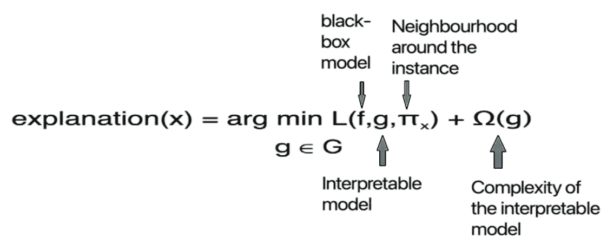
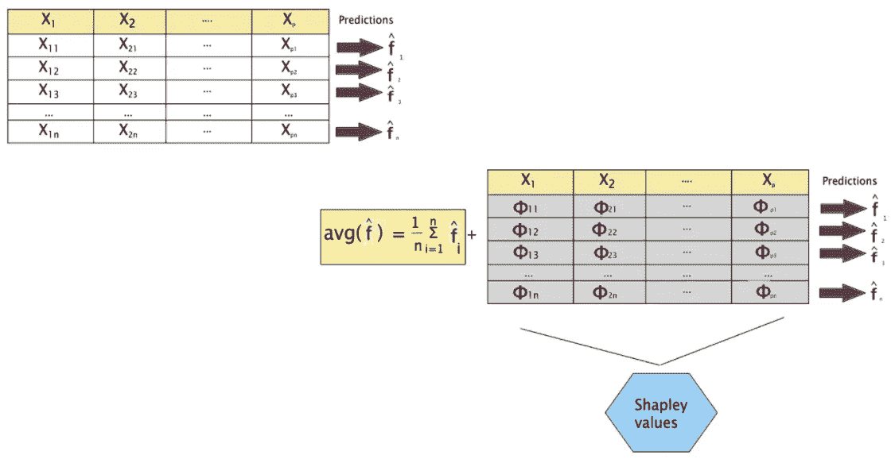

# 可解释的人工智能:黑盒机器学习领域的一个亮点

> 原文：<https://towardsdatascience.com/explainable-ai-an-illuminator-in-the-field-of-black-box-machine-learning-62d805d54a7a?source=collection_archive---------18----------------------->

## 不同的机器学习可解释性工具如何用于解释的概述

威廉·戴尼奥在 [Unsplash](https://unsplash.com/?utm_source=unsplash&utm_medium=referral&utm_content=creditCopyText) 上拍摄的照片

随着机器学习领域的发展，许多新的复杂机器学习模型被广泛应用于各个领域。特别是，随着深度学习的进步，数据正被用于做出一些关键决策。但有时，即使是人工智能专家也很难解释所谓的“黑箱模型”所做的某些预测。当涉及到医疗保健、自动驾驶汽车等高风险领域时，了解这些信息变得非常重要

1.  我们的模型学习是什么？
2.  模型的哪些部分负责做出某些预测？
3.  模型是否稳健？

不同的模型可解释性技术有助于回答这些问题。在本文中，我分享了一些常用的可解释性工具的概述。

*让我们让可解释性工具对所有人都是可解释的😀。*

在开始之前，最好先了解一些本文中会用到几次的术语。

作者图片

解释特定预测的最佳方式是，是否有任何可解释的机器学习技术可用于决策。可解释的 ML 技术的一些例子是:

一些可解释的 ML 技术的例子[ [来源](https://christophm.github.io/interpretable-ml-book/simple.html)

广义线性模型(GLM)家族的所有成员都非常容易解释。在本文中，我不会深入研究可解释的 ML 算法。要知道 GLM 是如何工作的，去看看我的另一篇[文章。](/what-is-so-general-about-generalized-linear-model-15dde9be2640)

</what-is-so-general-about-generalized-linear-model-15dde9be2640>  

**排列特征重要性:**

特征重要性为每个特征给出一个分数，它告诉我们这些特征中的哪些对我们的模型是重要的，这些特征中的哪些在驱动我们的模型预测中起着至关重要的作用。存在一些特定于模型的特征重要性度量，例如对于 GLMs，由特征的标准偏差缩放的参数系数作为特征重要性。类似地，对于基于树的模型，节点中分裂的杂质减少给出了特征重要性的度量。

但是置换特征重要性是模型不可知的特征重要性度量之一，其中我们通过置换其值来计算特征的重要性。

如果预测误差增加，则我们可以说该特定特征是重要的。

排列特征重要性示例[图片由作者提供]

特征重要性计算如下:

使用排列特征重要性的特征重要性[图片由作者提供]

如果 Fᵢⱼ的值大于 1，则可以认为某个要素是重要的。一个特性的值的排列可以用不同的方式完成，特别是 n！因此，置换特征重要性给出了作为输出的置信区间。

**部分相关图(PDP):**

部分相关图是一种全局方法，它考虑了所有数据实例，并给出了预测因子/特征和结果变量之间的全局关系。

PDP 计算一个/两个特征对结果的边际影响。它没有捕捉到特征之间的相互作用及其对预测结果的影响。

为了绘制 PDP，我们有两组功能:

*   我们要为其绘制 PDP 的功能
*   机器学习模型中使用的其他特征。

为数字特征绘制 PDP 的机制与为分类特征绘制 PDP 的机制略有不同。

为了绘制数字特征 X₁的 PDP，

1.  在原始数据上拟合机器学习模型 **f** 。
2.  为了获得特定数量的 PDP，比如说 X₁₁的特征 X₁，通过将所有数据实例的值改变为 X₁₁来创建人工数据。
3.  使用已经拟合的机器学习模型对每个数据实例进行预测。
4.  要素 X₁的特定 X₁₁量的 PDP 值将是步骤 3 中完成的所有预测的平均值。

特性特定值的 PDP 图片由作者提供]

5.遵循上述过程来覆盖 X₁的整个区间，并给出 X₁的 PDP 图。

类似地，为了绘制分类特征的 PDP，通过用任何一个可能的类别改变特征的值来创建人工数据，并且对该特征的所有类别继续该过程。数字和分类特征的 PDP 分别如下所示。

数字特性和分类特性的 PDP[[来源](https://christophm.github.io/interpretable-ml-book/pdp.html)

所以，我们已经学会了如何绘制 PDP。但是，通过观察这些图，我们能对特性的重要性说些什么呢？

主要的想法是，平板 PDP 告诉我们，功能并不那么重要。

*PDP 的变化越多，特性就越重要。*

对于数字特征，特征重要性的值通过以下公式计算，该公式基本上是该特征的 PDP 值的标准偏差。

数字特征的特征重要性[ [来源](https://christophm.github.io/interpretable-ml-book/pdp.html)

类似地，对于分类特征，重要性分数通过以下方式计算:

分类特征的特征重要性[ [来源](https://christophm.github.io/interpretable-ml-book/pdp.html)

**什么是代孕模型？**

代理模型是一种可解释的模型，其训练方式使得它能够以最大的解释近似底层黑盒模型的预测。它使用黑盒模型做出的预测作为输入，并尝试拟合一个可以近似黑盒模型的可解释模型(在上一节中讨论过)。

*   如果 R 值很高，我们可以说代理模型是底层黑盒模型的近似。我们可以通过以下方式计算 R 平方值:

代理模型的 r 平方值[图片由作者提供]

*   训练代理模型是一种模型不可知的方法，因为它不需要关于底层模型的任何信息，所需要的只是每个数据实例的特征值和底层模型的预测。
*   全局代理模型是整个黑盒模型的近似。
*   局部代理模型用于通过底层黑盒模型来近似特定实例的预测。

**LIME(本地可解释模型不可知解释):**

LIME 使用局部代理模型来对单个预测进行具体解释，而不是关注整个模型的解释。

LIME 的假设是，我们可以任意多次探索黑盒模型。此外，LIME 认为任何算法都是黑盒(即使我们将 LIME 应用于线性回归，它也会假设线性回归是黑盒)。

我们的目标是知道为什么黑箱模型做出了某种预测。

用于解释的感兴趣的数据点[图片由作者提供]

从上面的图片中，我们可以看到存在一个复杂的决策边界，这是两个类别的分类。但是，我们想知道为什么模型为突出显示的数据实例做出某个决定，哪些特性对做出这样的决定更负责。

为此，我们通过扰动来自原始数据集的样本并由黑盒对这些扰动样本进行预测来创建新数据集。

为 LIME 创建的新数据集[图片由作者提供]

创建的扰动样本根据它们与感兴趣的数据点的接近程度进行加权。

感兴趣的数据点附近的加权样本[图片由作者提供]

从上图中我们可以看到，靠近感兴趣实例的样本被赋予较高的权重(圆圈越大，权重越大)，而远离感兴趣点的样本被赋予较低的权重。

在这个新的数据集上训练本地代理模型。这个本地代理模型应该是上面列出的可解释模型家族中的任何模型。

对于数据实例(x)的解释，我们想要最小化损失 L，该损失 L 通过保持 g 的复杂度低(对于线性回归较少特征；对于决策树，树的深度更小)。这是 g 的复杂性和 f 的近似性之间的权衡。这种权衡被称为**保真度-可解释性权衡**。

石灰的优化功能[图片由作者提供]

其中 G 是可解释模型族。

在训练时，记住给予扰动样本的局部可解释模型权重。

*我们正在 x 的邻域中搜索复杂模型的最佳近似模型*

指数平滑核用于定义 x 的邻域:较小的核宽度意味着样本必须非常接近感兴趣的点才能影响局部拟合的模型。我不会说太多细节。更多细节你可以查看这本[书](https://christophm.github.io/interpretable-ml-book/)。

使用局部代理模型解释感兴趣的数据点[图片由作者提供]

从上面的图像中，你可以看到一个局部可解释的线性模型被拟合。一般这类线性模型本质上是稀疏的([套索回归](/ridge-and-lasso-regression-a-complete-guide-with-python-scikit-learn-e20e34bcbf0b)由 [Saptashwa Bhattacharyya](https://medium.com/u/9a3c3c477239?source=post_page-----62d805d54a7a--------------------------------) 精彩解释)。通过解释这个局部模型，我们可以对复杂模型对感兴趣点所做的预测做出某些解释。

我们已经了解石灰的工作原理，但这还不够。让我们看看如何解释一个 LIME 输出。

特定数据点的石灰输出[ [源](https://github.com/marcotcr/lime)

假设我们想要解释一个表格数据的特定数据实例的石灰输出，该表格数据有两个类别“可食用”和“有毒”。在这里，我们希望了解特定数据实例的不同特征的值如何影响预测。橙色高亮支持有毒，蓝色支持食用。局部拟合模型预测该数据实例有毒，概率得分为 1。上图中间部分给出的权重是局部拟合模型的参数。这里我们可以看到“气味=恶臭”这个值是增加被归类为有毒的机会的最重要的值，而“鳃大小=宽”是唯一减少被归类为有毒的机会的值。

要了解 LIME 如何处理图像和文本数据，请查看此[源](https://github.com/marcotcr/lime)。

**SHAP(沙普利附加解释):**

沙普利加法解释或 SHAP 是基于博弈论中沙普利值的概念。SHAP 背后的主要思想是知道每个单独的特征对做出某个预测有多大的贡献。这可能很难计算单个的贡献，因为在特征之间可能存在相互作用。

SHAP 是既可用于本地解释又可用于全球解释的度量之一。

*所以，我们理解为什么沙普利和为什么解释但为什么加法？？*

让我们看看。

Shapley 值使特定数据点的输出不同于基础模型的基线输出。假设φᵢⱼ是特征 j 的 iᵗʰ数据实例的沙普利值。这些值或正或负地使输出不同于基线输出。因为 Shapley 值对基线输出的影响的增加，所以它是“相加的”。

SHAP 解说[图片由作者提供]

现在让我们看看这些φᵢⱼ是如何计算的。

iᵗʰ数据实例的 jᵗʰ要素的沙普利值φᵢⱼ按以下方式计算

iᵗʰ数据实例的 jᵗʰ特征的沙普利值计算公式[图片由作者提供]

在哪里，

s 是特征的子集。

f 是底层黑盒模型。

f(SU{j})是具有感兴趣特征的子集 S 的黑盒模型的预测。

f(S)是没有感兴趣特征的子集 S 的黑盒模型的预测。

假设我们总共有 p 个特征。因此，每个 S 都是 p-1 个特征的子集。

例如，假设我们要计算φ₁₁，那么 s 就是绿色高亮显示的特征值的子集。在这里，我们的目标是了解特性的特定值是如何影响输出的。我们考虑不同的组合来捕捉特征之间的交互作用。

用于计算 Shapley 值的子集选择[图片由作者提供]

根据子集 s 中存在多少特征来给出加权项。其背后的直觉是，如果子集 s 中已经包括了许多特征，则对添加 jᵗʰ特征的贡献给予更大的加权。这表明即使已经包括了许多其他特征，jᵗʰ特征也会对预测产生强烈的改变。

现在让我们看看如何解释特定数据点的 SHAP 输出。

特定数据点的 SHAP 输出[ [来源](https://shap.readthedocs.io/en/latest/example_notebooks/overviews/An%20introduction%20to%20explainable%20AI%20with%20Shapley%20values.html)

对于这个特定的例子，底层黑盒模型的基线输出是 22.841，这个特定数据点的输出是 16.178。红色高亮显示的条表示有助于输出向基线输出移动的特征值，蓝色条表示有助于向相反方向移动的特征值。

要知道 SHAP 如何帮助解释全球，我们必须知道 SHAP 功能的重要性和 SHAP 依赖图。

**SHAP 特征重要性:**

jᵗʰ 特征的沙普利值按以下方式计算。

使用 Shapley 值计算全局特征重要性的公式[图片由作者提供]

特征重要性值越高，该特征越重要。

全球特征重要性图[ [来源](https://christophm.github.io/interpretable-ml-book/shap.html)

对于这个特殊的例子，使用激素避孕药的年数是最重要的特征，x 轴上的值代表这些特征对产出的平均影响的绝对量。

**SHAP 依赖情节:**

SHAP 依赖图可以被认为是 PDP 的替代方案。使用 SHAP 依赖图，我们还可以推断出特征之间的相互作用对模型预测的影响，这对于 PDP 是做不到的。它基本上是通过绘制 x 轴上的特征值和 y 轴上相应的 Shapley 值来创建的。

对于 jᵗʰ特征形状依赖图是通过绘图创建的

绘制 SHAP 依赖图的数据[图片由作者提供]

现在让我们来看看它的样子，以及如何解读它。

SHAP 依赖情节[ [来源](https://slundberg.github.io/shap/notebooks/plots/dependence_plot.html)

对于这个例子，当年龄在 20 到 40 岁之间时，这在模型预测中起着至关重要的作用，在此之后，年龄对模型输出的影响相当稳定。年龄与另一个特征----教育---- Num 的交互影响也可以从该图中得到解释，因为它显示了在接近 20 岁时，较少的教育比高等教育对产出的影响更大。

*注:*为了更好地理解这些方法并尽可能清晰地解释结果，本文中使用的图是从不同来源收集的。

**结论**

在本文讨论的所有可解释性工具中，SHAP 是最常用的，因为它的粒度以及它在本地和全局解释中的实现。虽然与其他技术相比，它需要一点额外的时间。因此，在使用任何可解释性工具之前，知道解释的目的是什么是非常重要的。

**如果你喜欢这篇文章请点击推荐。那太不可思议了。**

关注我在 [Medium](https://medium.com/@ayan.kundu09) 和 [LinkedIn](https://www.linkedin.com/in/ayan-kundu-a86293149/) 上的博客帖子和更新。

**参考文献**

1.  C.莫尔纳尔。*可解释的机器学习*。[https://christophm.github.io/interpretable-ml-book/](https://christophm.github.io/interpretable-ml-book/)
2.  https://shap.readthedocs.io/en/latest/index.html SHAP 文件
3.  米（meter 的缩写））t .里贝罗，s .辛格，c .盖斯特林。“我为什么要相信你？”解释任何分类器的预测。[https://arxiv.org/pdf/1602.04938v3.pdf](https://arxiv.org/pdf/1602.04938v3.pdf)

让我们把它包起来。非常感谢你的阅读和快乐学习。