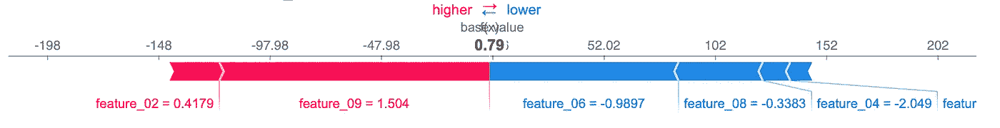
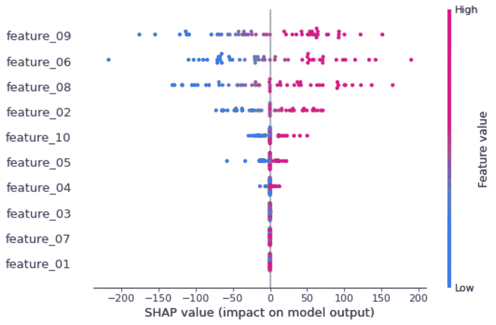

# 多输出回归的可解释人工智能

> 原文：<https://towardsdatascience.com/explainable-ai-for-multiple-regression-2df70cfc9995?source=collection_archive---------10----------------------->

## [模型可解释性](https://towardsdatascience.com/tagged/model-interpretability)

## 用 SHAP 透视多输出回归模型的“黑箱”。



多输出回归的 SHAP 值(图片由作者提供)

打开机器学习模型的“黑匣子”不仅对理解我们创建的模型至关重要，而且对向他人传达机器学习模型揭示的信息也至关重要。我见过几个项目失败，因为他们不能很好地向其他人解释，这就是为什么为了增加机器学习项目的成功实施，理解我们建立的模型是必要的。

最近我在做一个 ML 项目，需要多输出回归(预测不止一个输出/标签/目标),很难找到实现可解释性的可靠例子或资源。解决如何解释多输出回归模型的挑战需要大量的反复试验。最终，我能够分解我的多输出回归模型，并且我获得了一些值得分享的“经验教训”。

完整的代码可以在 GitHub 的[多输出回归模型的 SHAP 值](https://github.com/coryroyce/Explainable_AI/blob/main/Notebooks/SHAP_Values_for_Multi_Output_Regression_Models.ipynb)中找到，并且可以通过 Google Colab 在浏览器中运行。

# 设置和代码重点

## 创建数据

为多输出回归创建数据模型，以通过 [SHAP](https://github.com/slundberg/shap) 展示可解释性。

下面的代码创建了包含 1000 个样本和 10 个特征的数据，其中只有 7 个与我们试图预测的输出/标签有意义地关联。(稍后我们将看到 SHAP 价值观如何帮助我们看到信息丰富的特征。)最后，我们有 5 个输出/标签，使这成为一个多输出回归问题。

```
X, y = make_regression(n_samples=1000, n_features=10, n_informative=7, n_targets=5, random_state=0)
```

## 创建模型

为了创建多输出回归模型，我使用 Tensorflow/Keras 模型，因为它允许用户轻松地将输出/标签的数量设置为他们试图从数据中预测的标签数量。

```
model = Sequential()
model.add(Dense(32, input_dim=10, activation=’relu’))
model.add(Dense(5))
model.compile(loss=’mae’, optimizer=’adam’)
model.fit(X, y, verbose=0, epochs=100)
```

## 解释模型

导入 SHAP 并选择要生成解释的数据后，我们现在可以绘制各个输出/标签的解释。完整代码见[多输出型号的 SHAP 值](https://github.com/coryroyce/Explainable_AI/blob/main/Notebooks/SHAP_Values_for_Multiple_Regression_Models.ipynb)笔记本。

```
shap.force_plot(base_value = explainer.expected_value[current_label.value],shap_values = shap_value_single[current_label.value], features = X[list_of_labels].iloc[X_idx:X_idx+1,:])
```

下图显示了每个特征/输入如何影响整体预测。(红色为较高值，蓝色为较低值。)现在，我们从一个“黑箱”模型中获得了一个个体预测的详细解释。通过选择不同的标签，我们可以看到相同的输入特性是如何独立地影响每个输出/标签的(参见动态下拉列表的完整代码笔记本)。


多元回归的 SHAP 值(图片由作者提供)

与许多 ML 项目一样，很难判断我们使用的哪些输入/特征真正影响了预测，但我们可以再次使用 SHAP 和内置的汇总图来显示每个单独输出/标签的模型级汇总。



根据之前的数据设置，我们知道有 3 个特性对输出没有任何影响，我们现在可以很容易地看到，底部的 3 个特性(03、07 和 01)就是这些特性。

# 关键要点

## 1)单独考虑每个输出/标签

由于有更多的可用资源，通过尝试解释模型的单个输出/标签，将问题分解为更简单的问题。然后回到最初的问题(这个例子使用下拉菜单动态选择多个输出/标签中的任何一个来研究)。

## 2)创建一个学习教程

将教程创建为一个独立的[笔记本](https://github.com/coryroyce/Explainable_AI/blob/main/Notebooks/SHAP_Values_for_Multi_Output_Regression_Models.ipynb)，它可以在浏览器中运行并选择单独的输出/标签，这迫使我在一个超越复制和粘贴代码的层次上理解，以获得快速的解决方案。

如果你正试图打开多输出机器学习模型的黑匣子，我希望这展示了 SHAP 的价值，并帮助你解释你的模型。