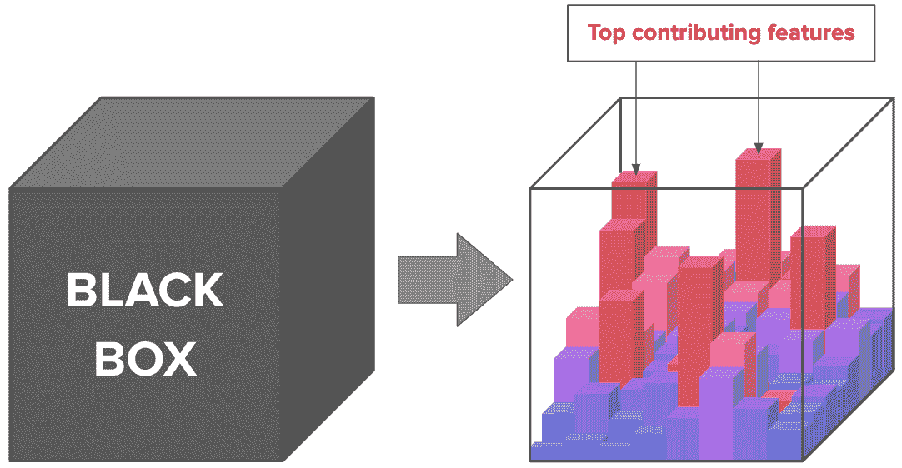

# 可解释的人工智能:第一部分——简介

> 原文：<https://towardsdatascience.com/explainable-ai-part-one-a-short-introduction-533640f1ae1?source=collection_archive---------44----------------------->

## [模型可解释性](https://towardsdatascience.com/tagged/model-interpretability)

## *作者:* [*海伦娜·弗利，机器学习研究员*](https://www.linkedin.com/in/helena-foley-3b23b3182/) *马克斯·凯尔森*

马库斯·斯皮斯克在 [Unsplash](https://unsplash.com/?utm_source=unsplash&utm_medium=referral&utm_content=creditCopyText) 上拍摄的照片

将机器学习(ML)实际应用于医疗数据的道路是漫长的，最终，终点可能就在眼前！它已经成功应用于染色肿瘤组织微阵列(TMA)样本(比契科夫等人，2018 年)、全切片图像(Ehteshami Bejnordi，2017 年)和皮肤癌图像(Haenssle 等人，2018 年)，在诊断准确性方面取得了巨大成功，有时甚至超过了临床专家！然而，在它能够真正在更广泛的医疗保健领域实施并有能力改变人们的生活之前，我们必须首先跨越我们的 Ts 并在其透明度上打点我们的 Is。这篇博客是两篇博客中的第一篇，它将向你简要介绍可解释人工智能的世界。

传统的模型，如线性回归，是直观的和高度可解释的。然而，由于数据的高维度，它们对基因组数据的效用是有限的(我们说的是每个样本都有几万甚至几十万个特征！).如果样本量足够大，更先进的模型，如卷积神经网络(CNN)可以产生更准确的结果(Akkus，2017)。然而，这些高级模型具有复杂的结构，具有多个隐藏层、非线性激活函数和反向传播规则，使得输入和输出之间的过程难以跟踪和解释。

作为科学家，我们不能盲目相信我们的模型，不管它们表现得多好。虽然我们知道我们向模型提供了什么信息，以及它输出了什么信息，但我们对所述模型的内部决策过程视而不见。这种盲目性导致了一个新名词，*黑盒*模型。这是一个非常令人担忧的原因，因为我们碰巧在一个数据集中找到的正确答案可能在其他地方的另一个数据集中并不正确。因此，除非我们看到模型使用什么信息来学习“正确”的答案，否则我们不会知道这些答案是否真正正确。这些模型倾向于选择阻力最小的路径，而这一路径往往是由不想要的人为因素驱动的，如批量效应，而不是真正的生物信号。虽然这在首次开发模型时可能没有明显的问题，但是一旦要求模型根据新信息进行预测，这可能导致错误的预测。在临床环境中，这可能非常危险。

这个问题的解决方案是撬开这个黑盒，看看模型认为哪些特征对其决策过程“重要”，这样我们就可以验证模型是否在做我们期望它做的事情，或者被告知我们未来的研究应该关注哪些特征(这些可能是重要的环境影响、生物过程或基因突变)。

显著性映射已经尝试了多种方法，包括:Shapley 采样(Strumbelj & Kononenko，2010)，树解释器(Saabas，2014)，相关性传播(Bach 等人，2015)，量化输入影响(达塔等人，2016)，LIME (Ribeiro 等人，2016)，以及 DeepLIFT (Shrikumar，2017)。这些方法中的每一种都提供了改进，但是保持结果的统计稳定性和通用性的能力，以及全球与局部水平的一致数值，仍然没有解决。

如前所述，简单的模型，如线性回归是透明的，完全可以解释，而深度模型充满了复杂的非线性函数。Ribeiro 及其同事(2016)表明，线性模型的局部近似可用于解释复杂的非线性模型。然而，这种局部近似缺乏与模型整体水平的稳定联系。深度模型(如神经网络)的内部过程可以被视为竞争信息的过程。在《N 人游戏的价值》(1953)中，Lloyd Shapley 概述了为了向参与游戏的所有玩家公平分配收益，我们需要三个公理:*可加性、一致性和虚拟玩家(T3)。通过将这种局部近似与 Shapley 理论相结合，Lundberg 和 Lee(2017；https://arxiv.org/abs/1705.07874[交付了一个*概念验证*设计，提供了从局部到全局限制所需的稳定性的数学保证。这项工作引入了 SHAP(SHapley Additive exPlanations)值，并提供了优于传统的、可解释的模型(如前面提到的线性回归)的显著优势(我们不会在这里深入讨论技术细节，因为这些在这里的](https://arxiv.org/abs/1705.07874)以及原作者的[博客](https://github.com/slundberg/shap)中有全面的介绍)。与之前的可解释模型相似，SHAP 值的正估计和负估计允许解释学习或预测给定类别的信心的增加或减少。然而，与传统模型不同，在传统模型中，显著性映射只能在整个群体中进行估计，SHAP 值还提供了所有特征和所有样本的粒度显著性估计(图 1)，从而允许更精确地理解内部学习过程。*

*图一。使用显著性映射将“黑盒”变成“白盒”的视觉表示*

在马克斯·凯尔森研究实验室，我们的使命是通过使用尖端的 ML 技术解决困难的挑战，如癌症，为科学做出积极的贡献。我们认识到 Lundberg 和 Lee (2017)的贡献有可能最终使先进的 ML 模型，如神经网络(NNs)，在临床设置中有用。例如，尽管在人类转录组上训练神经网络模型以准确预测癌症类型很容易实现，但知道哪些基因促成了这种分类是对临床医生和研究人员很重要的下一个方面，因为它可以为更好的治疗方法的开发提供信息。

这一系列博客文章旨在概述 SHAP 价值观的优势和局限性，以及它们在生物学和癌症方面的实际应用。请关注我们的[媒体](https://maxkelsen.medium.com/)或 [LinkedIn](https://www.linkedin.com/company/maxkelsen/) ，继续收看本系列的第二部分。

# **参考文献**

安多·萨巴斯。2014.解读随机森林。http://blog.datadive.net/interpreting-random-forests/.(2014)。访问时间:2017 年 6 月 15 日。

2019 年算法问责法案。可查阅 https://www . congress . gov/bill/116 th-congress/house-bill/2231/all-info(查阅时间:2020 年 2 月 8 日)。

Bach，S. *等人*关于通过逐层相关性传播对非线性分类器决策的逐像素解释。 *PLoS One* **10** ，1–46(2015)。

Bejnordi，B. E. *等*对深度学习算法检测乳腺癌女性淋巴结转移的诊断评估。美国医学会杂志。医学。协会 **318** ，2199–2210(2017)。

比契科夫，D. *等*基于深度学习的组织分析预测结直肠癌的结果。 *Sci。代表* **8** ，1–11(2018)。

通过定量输入影响的算法透明度。71–94 (2017).doi:10.1007/978–3–319–54024–5 _ 4

Haenssle，H. A. *等*人对机器:深度学习卷积神经网络用于皮肤镜黑色素瘤识别的诊断性能与 58 名皮肤科医生的比较。*安。肿瘤科。* **29** ，1836–1842(2018)。

解释模型预测的统一方法。神经 Inf。过程。系统。 2017 年 12 月，4766–4775(2017 年)。

"我为什么要相信你？"解释任何分类器的预测。继续进行。ACM SIGKDD Int。糖膏剂知道了。Discov。数据最小值。2016 年 8 月 13 日至 17 日，第 1135 至 1144 页。

Smilkov，d .，Thorat，n .，Kim，b .，Viégas，F. & Wattenberg，m.《smooth grad:通过添加噪声消除噪声》。(2017).

通过传播激活差异学习重要特征。*第 34 国际。糖膏剂马赫。学习。ICML 2017*74844–4866(2017)。

trumbelj，e .和 Kononenko，I .使用博弈论对个体分类的有效解释。 *J .马赫。学习。第 41 号决议第 11、1 至 18 段(2010 年)。*

深层网络的公理化归因。(2017).doi:10.1007/s 10144–009–0162–4