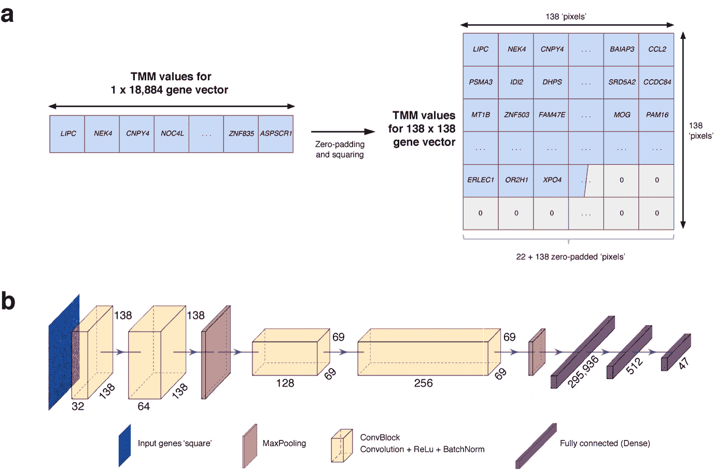
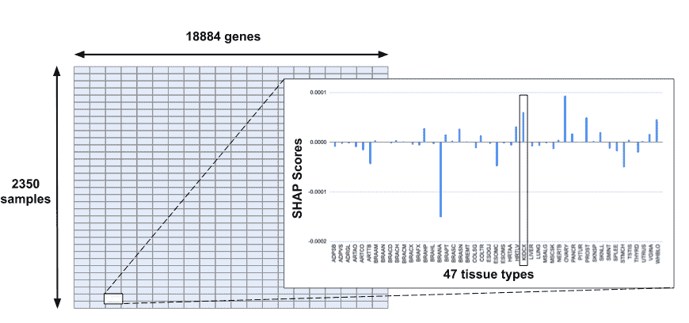
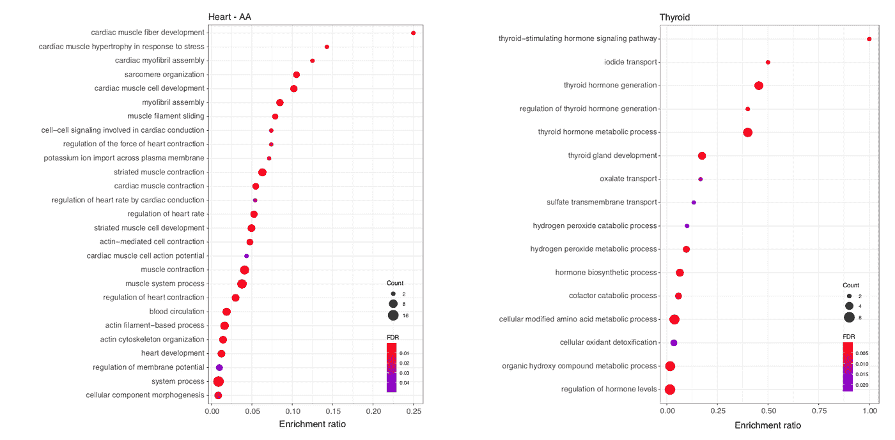
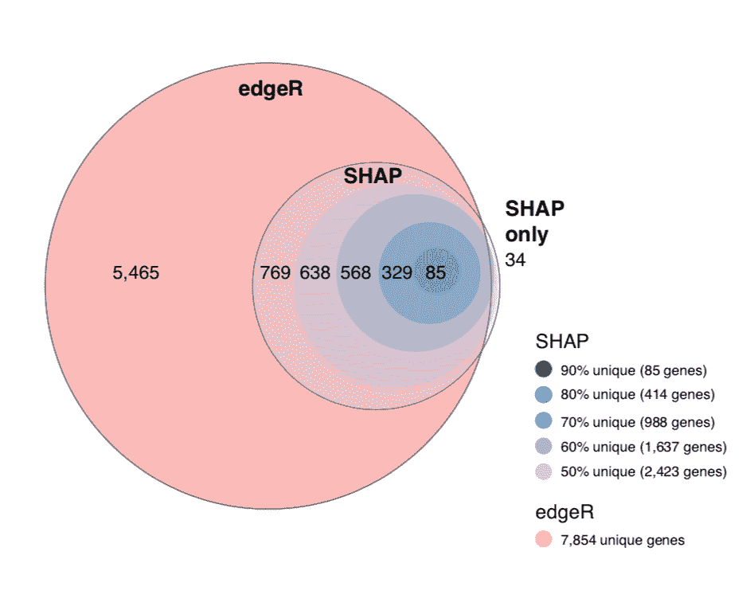
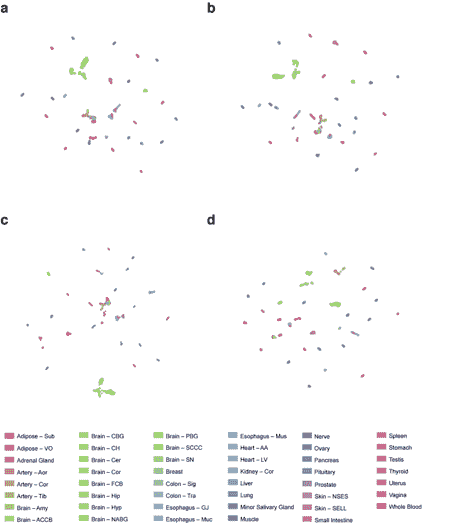
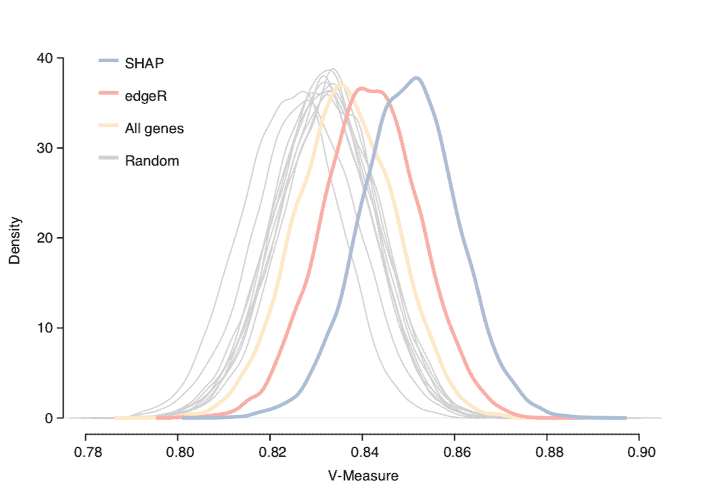

# 可解释的人工智能:第二部分——研究 SHAP 的统计稳定性

> 原文：<https://towardsdatascience.com/explainable-ai-part-two-investigating-shaps-statistical-stability-d3c0ee075354?source=collection_archive---------35----------------------->

## [模型可解释性](https://towardsdatascience.com/tagged/model-interpretability)

## ***作者:*** [***Helena Foley，机器学习研究员***](https://www.linkedin.com/in/helena-foley-3b23b3182/)***at Max Kelsen，根据*** [***SHAP 论文***](https://www.nature.com/articles/s41598-021-81773-9)***by***[*Melvyn Yap 博士，高级机器学习研究员*](https://www.linkedin.com/in/melvyn-yap/) *at Max Kelsen*

[rishi](https://unsplash.com/@beingabstrac?utm_source=unsplash&utm_medium=referral&utm_content=creditCopyText) 在 [Unsplash](https://unsplash.com/s/photos/machine-learning?utm_source=unsplash&utm_medium=referral&utm_content=creditCopyText) 上拍摄的照片

在我们的[之前的博客](/explainable-ai-part-one-a-short-introduction-533640f1ae1)中，我们介绍了 SHAP 值的概念(4)及其相对于其他显著性映射方法(如 LIME (5))的优势。我们还提出，将这种方法应用于遗传数据可以用于探索生物学，并使深度模型的临床效用成为可能。然而，考虑到前一篇博客以及(1，9)中提到的可靠性问题，我们在信任深度学习结果的解释之前谨慎行事是绝对重要的。安全导航的一种方法是通过所发现特征的已知生物学相关性，以及将结果与成熟可靠的传统生物信息学方法进行比较。

# 神经网络模型

首先，我们需要一个模型和一个目标假设。为此，我们训练了一个卷积神经网络(CNN 图 1)使用来自基因型-组织表达(GTEx)项目的 RNA-seq 数据预测组织类型。该 GTEx 数据集包括来自 16，651 个样本和 47 类(组织类型)的 18，884 个特征(基因)。

***图一。|我们卷积神经网络的架构。***

# 可解释模型

我们将 *GradientExplainer* SHAP 拟合到我们模型的 softmax 层，并计算了测试集的 SHAP 值(图 2)。这是使用 Lundberg 的 [SHAP GitHub 库](https://github.com/slundberg/shap)提供的库完成的。通过 SHAP 中值对基因进行排序，分别产生了每种组织类型的顶级基因。

我们选择这个可解释性模型是因为 *GradientExplainer* 利用了适合神经网络模型的统计方法。它也是用户友好的，适合在任何主要的 Python 深度学习框架上使用。Tensorflow、Keras 和 Pytorch，最重要的是，解决了前面提到的“健全性检查”出版物中提出的许多限制。 *GradientExplainer* 是将*综合梯度* (7)、 *SHAP* (3)和 *SmoothGrad* (7)合并成一个等式，该等式计算神经网络原始输入中每个特征的显著性得分。每个改进的细节在原始出版物中都有描述，但都很简短。

通过 CNN 模型的传播必须依赖于基于梯度的方法，因此为 CNN 开发的大多数显著性映射技术必须基于梯度。然而，由于普通激活函数(如 ReLU)的性质，这些方法的灵敏度大打折扣(因为一旦激活，梯度不会改变)，甚至经常遗漏非常显著的特征(1，9)。解决方案是一个简单的过程，即整合基线模型和输入之间路径上的所有梯度(等式 1)，并通过采用来自*无限博弈*定理的沙普利值(等式 2)将其与 *SHAP* 值相联系。通过采用 *SmoothGrad* 技术对灵敏度图进行了进一步改进，该技术将高斯噪声引入梯度和输入数据(7)。

**方程式 1。综合梯度(Sundararajan 等人，2017 年的等式 1)**

integrated gradsi(x)::=(Xi-Xi ')= 01F(x '+(x-x '))xid

**方程式 2。无穷小选手的奥曼-沙普利值**

(Sv)(ds)=01(v(tI+ds)-v(tI))dt

*其中 Sv 为 ds 无穷小播放器的 Shapley 值；t I 是包含所有玩家比例 t 的所有玩家集合 I 的完美样本，tI+ds 是 ds 加入 tI 后得到的联盟(来源于维基百科)*

# 特征选择

***图二。| SHAP 值矩阵及其内容的可视化表示。*** *背景代表一个具有 SHAP 值的全矩阵。前景插页显示该矩阵适用于所有 47 种可用的组织类型。*

SHAP 值的分布特性尚未得到数学证明，因此无法计算出 *p* 值。因此,“最重要”特性的选择仍然有些随意，可以通过几种方式来实现。例如，SHAP 可以用数字转换成排名，提供了一个非参数化的途径。然而，我们决定将截止点定义为组织排他性的函数，在 50%的顶级基因是组织排他性的情况下划线。这导致了我们的 2423 个 SHAP 鉴定的基因，此后被称为“SHAP 基因”。值得注意的是，在每种组织类型的前 1 个基因中(n=47)，我们发现其中 44 个是独特的。这表明，SHAP 确实正在确定与我们正在处理的问题相关的独特特征。

作为 SHAP 用于健全性检查的一个说明性例子，我们在撰写科学手稿的过程中发现，如果我们的模型是根据错误转换或非标准化的数据训练的，我们会观察到一些特征，如线粒体基因(线粒体是大多数真核细胞内的膜结合结构，被认为源于细菌，可以被视为化学能量发电站)显示为最显著的特征。然而，这种“显著性”并不是由组织分化的生物学相关性驱动的，而是一种技术人工制品的副产品。这是因为这些基因总是被表达，并且它们的原始表达值比“人类”基因的表达值大得多。因此，在原始尺度上，这些表达方式的任何变化都会被不公平地夸大。然而，在标准化尺度上，相对变化会变得小得多，从而降低各自的显著性。如果我们想象我们想要找到基因作为某些特定疾病的未来治疗靶点，这样的错误会导致灾难性的后果，无论是在经济上还是以牺牲患者的福祉为代价。

# 普遍性

几十年来，人工智能技术一直受到训练数据过度拟合的影响，这在医疗保健等关键领域可能非常危险。尽管训练/验证分裂加上技术，例如退出、批量标准化等。，可以使问题最小化，但普遍性问题仍然存在。这是因为用于训练/验证的样本来自单一来源，因此可能与另一个独立的收集来源有所不同。这可能是由于收集技术、使用的技术甚至人群中的流行病学差异等因素造成的。出于这个原因，没有什么能像独立的复制一样强有力地检验模型的通用性。因此，我们在完全独立于 GTEx 数据的样本外数据集中重新计算了 SHAP 值。独立的表达谱来源于人类蛋白质图谱(HPA)数据集(21 种组织类型)。当比较两组的结果时，我们发现来自 GTEx 和 HPA 样品的 SHAP 基因之间有很大的重叠。每个组织的这种重叠范围为我们重要基因的 20-60 %,这提供了强有力的证据，表明已识别的特征概括了我们的训练数据集，因此更有可能是组织分化的“真正”因果驱动因素。

# 生物学相关性

我们还使用 v11 序列研究了 SHAP 基因中每个组织的蛋白质相互作用的数量。我们的发现很有希望！与随机选择的 103 个基因相比，每种组织类型的 103 个 SHAP 基因的蛋白质之间的相互作用数量明显更高！

除此之外，我们还探索了这些基因列表中丰富的生物过程。我们发现这些基因中丰富的过程很大程度上反映了对那些组织应该是重要的过程。例如，心脏组织的富集过程包括心肌纤维，甲状腺的发育途径包括甲状腺激素生成(图 3)。

***图三。反应体途径分析。*** *这种丰富的通路为心脏——AA(心房附件)和甲状腺组织。*

# 与传统方法的比较

edgeR 是用于分析计数数据的差异表达以确定哪些基因显著区分感兴趣的表型(例如组织类型)的当前标准。我们使用这个软件包识别了 30，352 个差异表达的基因，然而，这些基因中的许多在组织中出现不止一次。为了将其与我们独特的 SHAP 基因进行比较，我们折叠了 edgeR 鉴定的基因，仅包括独特的基因，产生了 7854 个基因(称为“edgeR 基因”)。当我们将这些与我们的 SHAP 基因比较时，我们发现 98.6%的重叠(图 4)。

**图 4。基因集合的重叠。**

有趣的是，我们发现许多顶级 SHAP 基因在个体组织类型中没有通过 logFC edgeR 过滤器。请注意，edgeR 被设计为仅检测具有大效应大小的线性关联，这表明神经网络能够检测组织类型的更微妙的差异。这可能是因为 ML 模型能够同时分析多类数据(“同时看到”所有类)，而 edgeR 仅设计用于成对微分。

# 用 SHAP 分类

如果这些 SHAP 基因真的是与特定组织最相关的基因列表，那么我们会期望它们包含区分组织所需的所有信息。为了测试这一假设，我们使用一种叫做 UMAP 的降维工具来评估我们的重要特征产生的聚类质量，并比较各种控制特征集之间的结果。用于比较聚类质量的特征集包括所有基因、edgeR 基因、2423 个基因的随机子集和 SHAP 基因(图 5)。

***图 5。使用不同基因子集的保留 GTEx 样本的 UMAPs。a*** *所有基因(18884 个基因)* ***b*** *edgeR 基因(7854 个基因)* ***c*** *随机基因(2423 个基因；代表 UMAP 从 10 个单独的运行)，和****d****SHAP 基因(2423 个基因)。用颜色表示的组织类型(底部图例)。*

我们通过在 UMAP 投影上应用 k-means 聚类，然后计算 V-Measure 来评估这些聚类的质量，V-Measure 本质上不仅是对相同标签的样本分组的好坏的度量，也是对每个聚类的同质性的度量。

***图六。UMAP k-means 聚类分析的| V-测度。*** *使用 SHAP 基因进行 k-均值聚类(蓝色；2423 个基因)，10 组随机的 2423 个基因(灰色)，edgeR 基因(红色；7854 个基因)，以及所有基因(黄色；18884 个基因)。*

我们的结果表明，即使 SHAP 基因列表少于其他基因列表，它也能够为所有组织类型产生更高质量的聚类(图 6)。

总之，我们展示了*如何整合来自 SHAP 方法家族的*梯度，不仅通过与传统的生物信息学方法比较而言是可靠的，而且在应用于 RNAseq 数据时具有生物学信息和统计学效果。这项工作是一个巨大的进步，表明精心设计和安全实施的可解释模型有可能促进临床决策，并提供新的生物学见解。

欲了解更多信息，请阅读我们在《自然科学报告》网站上的[完整出版物](https://www.nature.com/articles/s41598-021-81773-9)。

# 参考

1.  Adebayo，j .，Gilmer，j .，Muelly，m .，Goodfellow，I.J .，Hardt，m .，和 Kim，B. (2018)。显著图的健全性检查。神经炎。

2.加尔格，M. (2009 年)。网络中心性的公理基础。SSRN 电子杂志。

3.刘易斯，f .，巴特勒，a .和吉尔伯特，L. (2010 年)。使用似然比检验的模型选择的统一方法。生态学与进化方法，2(2)，第 155-162 页。

4.解释模型预测的统一方法。神经 Inf。过程。系统。2017 年 12 月，4766–4775(2017 年)。

5."我为什么要相信你？"解释任何分类器的预测。 *Proc。ACM SIGKDD Int。糖膏剂知道了。Discov。数据最小值。*2016 年 8 月 13 日至 17 日，1135 日至 1144 日。

6.Shrikumar，a .，Greenside，p .和 Kundaje，A. (2019 年)。通过传播激活差异学习重要特征。[在线]arXiv.org。上市地点:【https://arxiv.org/abs/1704.02685【2019 年 9 月 4 日上市】。

7.Smilkov 博士、Thorat n、Kim b、VIégas f .和 Wattenberg m .(2019 年)。SmoothGrad:通过添加噪声来消除噪声。[在线]arXiv.org。可在:[https://arxiv.org/abs/1706.03825](https://arxiv.org/abs/1706.03825)【2019 年 9 月 4 日获取】。

8.深层网络的公理化归因。(2017).doi:10.1007/s 10144–009–0162–4

9.Tomsett，Harborne，d .，Chakraborty，s .，Gurram，p .，& Preece，A. (2020 年)。显著性度量的健全性检查。ArXiv，abs/1912.01451。

10.Wang，q .，Armenia，j .，Zhang，c .，Penson，a .，Reznik，e .，Zhang，l .，t .，Ochoa，a .，Gross，b .，Iacobuzio-Donahue，c .，Betel，d .，Taylor，b .，Gao，j .和 Schultz，N. (2018)。统一来自不同来源的癌症和正常 RNA 测序数据。科学数据，5(1)。

11.Way，g .和 Greene，C. (2017 年)。用变分自动编码器从癌症转录组中提取生物学相关的潜在空间。生物计算 2018。

12.Robinson，M. D .，McCarthy，D. J. & Smyth，G. K. edgeR:用于数字基因表达数据差异表达分析的生物导体包。生物信息学。26, 139–140 (2010).