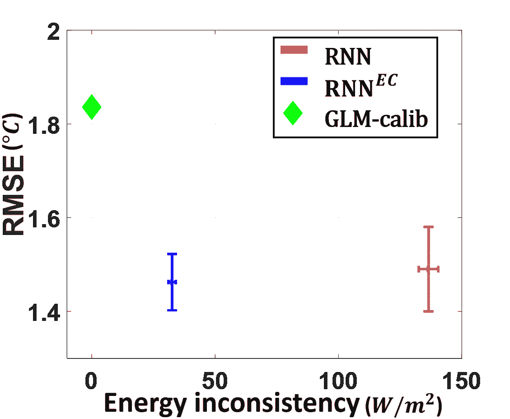

# 可解释的 AI:机器学习中的物理学？

> 原文：<https://towardsdatascience.com/explainable-ai-physics-in-machine-learning-d6374d2f4635?source=collection_archive---------24----------------------->

## 如何用物理原理约束你的 ML 模型将使你的系统更具概括性和可解释性

想象一下，给你一个任务，预测一个足球明星在下一场比赛中会进多少个球。一旦你得到了结果，你急忙向你的经理喊出答案:*减 3* 。在一瞬间，你意识到那个预言的不可思议和荒谬。

由 [Linus Mimietz](https://unsplash.com/@linusmimietz?utm_source=medium&utm_medium=referral) 在 [Unsplash](https://unsplash.com?utm_source=medium&utm_medium=referral) 上拍摄的照片

大多数 ML 模型主要从数据中学习。正如流行的说法:垃圾输入，垃圾输出——您输入的数据将被复制到您稍后想要检索的目标输出；如果您的输入数据集有偏差、不一致，甚至更糟、不准确，那么您就不能指望有好的预测。

但是，如果我们可以通过强加一些符合自然法则的物理公式来约束(或引导)这些 ML 模型，会怎么样呢？

# 数据驱动与理论驱动的建模

在试图描述现实世界中的现象时，我们需要建立能够精确复制这些事件的模型。一般来说，大多数建模方法可以分为两大类:数据驱动或理论驱动的解决方案。

**数据驱动**方法依赖于使用数据来理解周围的现象，但通常对潜在的理论解释理解有限。例如，你被告知要预测某个特定社区的房价。你有一个很好的工作假设，例如，受欢迎的服务设施的大小和距离将对房价有一定的影响。这肯定是有意义的，但是给定必要的输入，很少有第一原理物理理论可以决定性地提供最终结果。

**另一方面，理论驱动的**方法试图根据一阶原理构建模型(例如，作用于物体的力由质量及其产生的加速度来描述——F = ma)。模型是有确定性的，只要看数学公式就可以描述系统。

# 混合方法:物理学指导的机器学习

但是如果你能结合两者的优点呢？

> 如果你试图解释的现象有足够多的数据，并且可以用物理第一原理部分解释，那该怎么办？

最近的文献中广泛记载了混合方法的一些优点:

*   **实现一般化**尽管必须预测之前未见过的数据集，但您的模型能够始终表现良好，因为我们已经将“知识”嵌入其中。
*   **实现可解释性**因为物理公式是可预测的，你可以为一个“黑盒”ML 模型提供洞察力和一致性。

那么如何将物理学结合到我们的 ML 模型中呢？这一领域已经取得了一些进展，大部分集成可以分为三大类:

1.  **基于物理学的模型作为一个或多个基于 ML 的模块的替代品。**

在这个类别中，您包括了一个物理公式作为更大的基于 ML 的模型的一部分。例如，物理公式可以修改*输入*参数，操纵*中间*嵌入，或者甚至约束*输出*预测，如下图所示。

作为 ML 模型的子模块之一的物理模型

**2。惩罚物理不一致输出的基于物理的模型**

想象一下早先关于预测一个足球明星将要进多少个球的小例子。如果结果低于零(即物理上不太可能)，那么该模型可能会极大地惩罚这种预测。这是为了确保模型正确地“学习”与自然物理一致的解释(例如，温度不能低于 0 开尔文，速度不能超过光速，等等)。

物理一致损失函数

**3。ML 参数化物理模型**

有些问题，如预测气候变量(如降水等)的任务，计算量很大。大多数基于物理学的气候模型往往是全球范围的，具有非常低的空间分辨率(例如每单位像素 25 公里乘 25 公里的面积)。

想象一下，你必须预测下一次洪水何时会在你的地区发生？如果有足够数量的历史数据集，你可以使用纯数据驱动的方法。但是，你可能还想利用一个物理模型，将你的预测与地区/全球正在发生的事情联系起来(因为气候事件毫无疑问是相互关联的)。

一个解决方案是运行你的基于物理的模型，但是你使用 ML 参数化一些计算成本更高的变量(例如降雨量)。

让我们看看如何将这一概念转化为现实世界的案例研究。

# **应用:湖水温度**

在[1]中，作者试图通过结合物理原理和递归神经网络(RNN)来模拟湖水温度。然而，问题是训练数据的稀疏可用性，这可能导致任何数据驱动的 ML 模型表现不佳。

这就是物理学可以填补空白的地方。

**首先**，论文将一个物理模型集成到 RNN 中。如下图所示，该模型将能量守恒原理(净输入能量将使湖泊变暖，反之亦然)引入 RNN。

RNN 蕴含的节能原则

**第二**，这种能量守恒的物理现象被用来惩罚不遵循这一规律的预测。

物理一致损失函数

其中最终的损失函数是从典型的 RNN 模块的损失和能量守恒原理的损失相加得到的。

RNN 和混合 PGRNN 模型的误差分析

混合物理引导的 RNN (PGRNN)模型在性能上比裸 RNN 模型提高了近 20%。这显示了物理引导的 ML 模型如何通过服从真实的物理世界来改进基线。

# 离别的思绪

在未来，我相信如果我们继续将我们的领域知识编码到机器学习中，它会变得“更聪明”。你认为物理引导的 ML 模型还能在哪些领域发展？

***做订阅我的邮件简讯:***[*【https://tinyurl.com/2npw2fnz】*](https://tinyurl.com/2npw2fnz)****在这里我定期用通俗易懂的英语和漂亮的可视化总结 AI 研究论文。****

# ***参考文献***

*[1][https://arxiv.org/pdf/2001.11086](https://arxiv.org/pdf/2001.11086)*