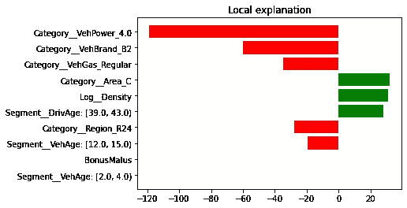
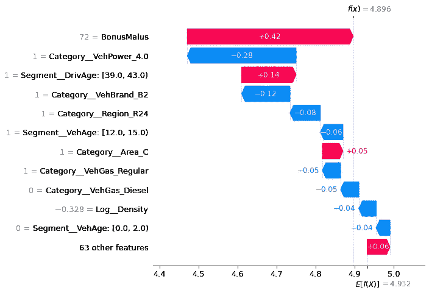
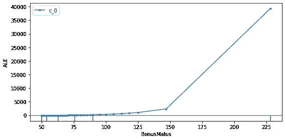
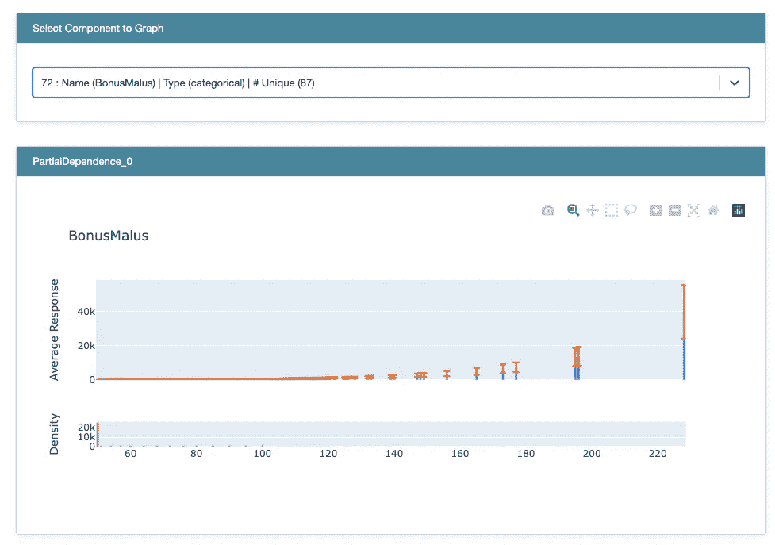
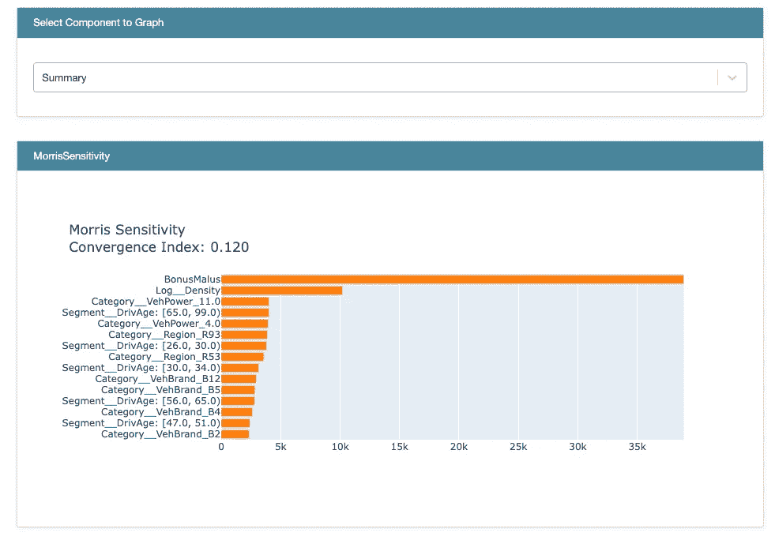

# 回归问题的可解释人工智能(XAI)

> 原文：<https://towardsdatascience.com/explainable-ai-regression-problem-practical-guide-f4d1994df692?source=collection_archive---------27----------------------->

## 许多 XAI 工具的实用指南


由[史蒂文·拉斯里](https://unsplash.com/@stevenlasry?utm_source=medium&utm_medium=referral)在 [Unsplash](https://unsplash.com?utm_source=medium&utm_medium=referral) 上拍摄的照片

# 机器学习可解释性是什么意思？

2016 年，里贝罗等人发表了他们迄今为止享有盛誉的论文:`*"Why should I trust you?": Explaining the Predictions of any Classifie*r`。著名的实验`*"Husky or Wolf"*`指出，尽管在设计一个精确的模型并对其进行适当训练方面付出了巨大的努力，但该模型仍然可以学习不可预测的相关性。例如，如果背景中有雪，模型学会预测照片中的狼。虽然这很有道理，但它并没有学会根据狼的特征来区分狼，而是从图像的背景来区分。

人工智能应用在当今世界蓬勃发展，所有决策权都交给了人工智能。考虑到这一巨大的数量以及需要通过的审查决定，弄清楚为什么做出某个决定变得至关重要。这让位于可解释的人工智能(XAI)。XAI 专注于(从视觉上)弄清楚什么样的特定特征以及在多大程度上影响了预测。这个领域正在开发许多工具和技术，这篇文章将在实践中看看它们。

这篇文章深入探讨了在机器学习工作流程中集成 XAI 工具。我的目标是给出代码示例，并展示一个模型的结果，这在其他文章或工具文档中并不常见。
这里涵盖的工具有:[石灰](https://github.com/marcotcr/lime)、 [SHAP](https://github.com/slundberg/shap) 、[谢顿不在场证明](https://github.com/SeldonIO/alibi)和 [InterpretML](https://interpret.ml/) 。

# 关于“黑盒与玻璃盒”的快速说明

虽然将它们相互对立是不正确的，但是它们是导致不同 ML 算法的两种不同类别的模型。玻璃盒算法类似于线性回归(或其他线性模型)、决策树、贝叶斯分类器，它们产生模型，可以根据模型的组成部分(分配给特征的权重或决策树中遵循的路径)相当容易地检查模型的预测。通过检查模型组件的组合，可以找到特定预测的解释。

黑盒模型通常与深度学习算法相关联。他们倾向于产生更准确的预测，但是牺牲了预测的清晰性和可追溯性。黑盒模型的常见例子是卷积神经网络(CNN)，广泛用于计算机视觉、图像中的对象检测和人脸识别领域。

这篇文章中描述的工具和技术是模型不可知的，也就是说，不管模型是玻璃盒模型还是黑盒模型，它们都能够为所做的预测提供清晰度。所有的工具都被设置来解释同一个玻璃盒子模型(即一个 TweedieRegression 模型)。
在另一篇文章中，我将重点介绍这些工具如何用于黑盒模型。

# 模型

本文中使用的模型是受 [scikit-learn](https://scikit-learn.org/stable/auto_examples/linear_model/plot_tweedie_regression_insurance_claims.html) 文档中的一个例子的启发，即`TweddieRegression`。这篇文章关注的是保险领域，特别是汽车保险的索赔金额。通常有多种方法来预测每单位风险(即给定保单的保险期限)的总索赔额。一种方法是在两个不同的模型中模拟索赔频率和遣散费(索赔金额),并计算总索赔金额作为它们的乘积。频率通常通过泊松分布建模，因为有许多保单记录的索赔总数为 0。并且严重性用伽马分布来建模，因为经验表明它具有这样的分布。

或者，当功率参数在 1 和 2 之间时，Tweedie 分布直接模拟总索赔额。网格搜索可以用来找到正确的参数，但在这篇文章中，1.9 被选为功率值。

我决定选择这种模式是因为:

*   这是我想玩的模型。
*   它确实简化了这篇文章的内容。
*   它很好地捕捉了数据。
*   这不是你在在线教程中看到的典型模型，它感觉更接近真实世界的生产场景。

下面是获取数据、执行特征工程以及最终训练模型的完整代码。

设计和训练模型

## 功能名称

应用`ColumnTransformer`后，特征名称不再容易阅读。`One Hot Encoding` (OHE)创造了一整套新功能。此外,`KBinsDiscretizer`为连续数据装入的每个区间创建一个新特征。对于当前数据点来说，要弄清楚什么是特性名称以及该特性的值是多少有点困难。在我的另一篇[文章](https://bbakiu.medium.com/extracting-feature-names-from-the-columntransformer-f1bed520aeba)中，我写了如何从`ColumnTransformer`中获取可读的特性名称。

# 讲解**人工智能** (XAI)工具

这篇文章集中在这四个 XAI 工具:石灰，SHAP，谢顿不在场证明，和解释。对于它们中的每一个，我将介绍如何将其与模型集成，以及如何针对给定的数据点`explain`某个预测。

## [LIME(局部可解释的模型不可知解释)](https://github.com/marcotcr/lime)

LIME 是一个模型不可知的工具，它可以对任何给定的监督学习模型给出解释。它提供的解释在被观察的数据点附近是局部可信的。它的简单性和直观性使它成为最流行的 XAI 工具之一。

下面的代码创建了一个`explainer`，并使用它来识别对给定数据点的预测有贡献的主要特征(在`X_test[42]`的情况下)。

石灰解释器

结果看起来像这样:

> `Intercept 211.86354640053418 // Lime model intercept
> Prediction_local [146.38162887] // LIME model prediction
> Right: 133.80831374760626 // value from glm_pure_premium.predict`

然而，这种文字表述不是很有描述性。为了可视化预测和对其影响最大的特性，我需要运行:`explain_data_point.as_pyplot_figure()`或`explain_data_point.as_list()`。结果直观地(或以文本形式)显示了给定数据点的某个特征值如何影响预测(积极或消极)。

```
explain_data_point.as_pyplot_figure()
```



给定数据点的局部解释的可视化

```
explain_data_point.as_list()
```

> `[('Category__VehPower_4.0', -118.60886335511677), ('Category__VehBrand_B2', -59.89935149820192), ('Category__VehGas_Regular', -34.65470430935958),
> ('Category__Area_C', 31.8465417201858),
> ('Log__Density', 30.911940033440064),
> ('Segment__DrivAge: [39.0, 43.0)', 28.24619186526209), ('Category__Region_R24', -27.9788217749691),
> ('Segment__VehAge: [12.0, 15.0)', -19.304050151977467),
> ('BonusMalus', 0.02413232592200181),
> ('Segment__VehAge: [2.0, 4.0)', 0.0)]`

## [SHAP ( **沙普利加法解说** )](https://github.com/slundberg/shap)

SHAP 使用博弈论中的沙普利值来解释模型和它们的预测。在 ML 意义上，游戏是预测，玩家是一个数据点的特征及其值。SHAP 解释了平均预测(通常来自**训练**数据)和给定数据点(或数据点集)的预测结果之间的差异。

SHAP 解说者

SHAP 库提供了不同的方式来可视化每个要素及其在数据点中的相应值如何影响预测。条形图、瀑布图或决策图都是预测如何实现的可视化工具。`E[f(X)]`是针对给定模型计算的期望值，基本上是来自训练数据集的所有目标值的平均值。对于给定的数据点，其维度会影响预期值(有些多一些，有些少一些),最终得到 `f(x)`值。

```
shap.plots.waterfall(shap_values[i], max_display=12)
```



按重要性排序的要素形状值条形图

期望值通常是`explainer.expected_value`，并且可以通过`explainer.shap_values(X_test[i])`检索给定数据点的所有 shapley 值的完整列表。

```
explainer.shap_values(X_test[i])
```

> `array([[-3.57367972e-02, 2.37260265e-05, -3.62400872e-03,
> 9.99498571e-03, 1.61319891e-02, -1.33205559e-02,
> -1.70261858e-03, -5.77566345e-02, 2.10600674e-02,
> -7.60667267e-04, 2.20831452e-02, 1.63428026e-02,
> 8.70301560e-03, 1.39718551e-01, -6.68123861e-03,
> -1.28186673e-02, -9.83389108e-03, 2.70578702e-02,
> -2.45288066e-02, 2.43979909e-02, -6.97570218e-04,
> 1.84981886e-04, 2.72899951e-02, 0.00000000e+00,
> -1.75415087e-04, -1.24097019e-01, 1.17185801e-02,
> -1.13515675e-02, -1.44770143e-02, 3.56013603e-03,
> -2.78724434e-01, 3.47278038e-02, -2.96024571e-02,
> 1.28822536e-02, -4.03941874e-03, 7.75558604e-04,
> 4.69723415e-03, -3.04630041e-03, -6.58506613e-04,
> 0.00000000e+00, 3.73403677e-04, 0.00000000e+00,
> -4.67284073e-02, -4.67924568e-02, -7.21878931e-03,
> -0.00000000e+00, -8.58881460e-06, -0.00000000e+00,
> -7.78920879e-02, 4.28093791e-03, 4.82906634e-04,
> -2.98388445e-03, 8.30043843e-03, 0.00000000e+00,
> -0.00000000e+00, 8.68300158e-03, -2.19710240e-02,
> 5.07694776e-03, -3.22590630e-04, -9.55616865e-05,
> 0.00000000e+00, -9.36496765e-05, -0.00000000e+00,
> 1.53178292e-03, -3.53638524e-02, 1.12146623e-04,
> -2.42871808e-02, 9.61732427e-03, 5.28887846e-02,
> 1.01917176e-02, -3.19149583e-03, 1.07590850e-03,
> 4.24827082e-01, -4.42527041e-02]])`

## [谢顿的不在场证明](https://docs.seldon.io/projects/alibi/en/stable/)

谢顿的不在场证明，类似于莱姆和 SHAP，能够为几乎任何 ML 模型提供解释。不过 GitHub 回购似乎并不是很活跃。从我的角度来看，我有一种感觉，它用一个更加一致和更加开发友好的 API 包装了 SHAP 工具和其他一些解释方法，这是由`scikit-learn`启发的。所以，我并没有在这上面投入太多的精力。尽管如此，以下是如何集成它以及如何可视化结果:

确定特征对模型影响的累积局部效应法



随着 BonusMalus 值的增加，该特征的累积局部效应也增加。

## [InterpretML](https://interpret.ml/)

InterpretML 是一个交互式工具，允许用户在探索阶段可视化多个仪表板并获得洞察力。此外，它还提供了以文本(字典)格式返回结果的`data`方法，这对于工程师来说非常方便。

InterpretML 是一个有趣的工具，因为它已经包括了黑盒解释器下的莱姆和 SHAP 解释器等等。它包括玻璃盒模型(线性模型、决策树)的解释器，在黑盒模型的类别中，它还包括部分依赖图(用于可视化目标和(一组)输入特征的依赖关系)，以及莫里斯敏感度分析(用于筛选哪些特征对未来分析足够重要)。

部分相关和莫里斯敏感性解释器



BonusMalus 的部分依赖解释器



莫里斯敏感度解释器

# MLOps .玩具

了解更多关于 ML/AI 中可解释工具的一个很好的资源，以及许多对你的 MLOps 之旅有帮助的很酷的工具是 [MLOps.toys](http://mlops.toys) 。它是由 Aproia 维护的，也是我写这篇文章的原始资料之一。

# 最后的想法

这篇文章中提到的工具主要面向数据科学家，帮助他们进行数据探索、模型设计或试图找出哪些功能是重要的，哪些是不相关的。它们使组织输出和可视化信息变得容易。

如果这些工具被用在生产环境中，在那里所有的预测/决策都会产生一个解释，它们需要对我来说更加开发友好。这意味着输出应该更多地以字典的形式出现，以便通过 JS 框架更容易地进行格式化、处理和可视化。
interpret ml 是个例外，它提供了用于在字典中生成仪表板的数据，而 Seldon Alibi 在提供一致的 API 方面做了很大的努力。

和任何事情一样，这些工具都不是灵丹妙药。他们不会保护模型免受偏见，他们只能指出这一点。通过足够的努力，误导性的解释可以被创造出来，这可以掩盖偏见。快速的谷歌搜索可以告诉你如何使用酸橙和 SHAP 达到对抗的目的，然而这篇文章的重点是让你更容易专注于正确的方向。

增加对这些工具和技术的信心的重要一点是一致性。根据我对莱姆和 SHAP 的评估，对于相同的模型和相同的数据点，他们对哪个特征(或给定数据点的特征值)在预测中具有最强的影响提供了不同的解释。但总的来说，他们的解释是有道理的，这很好。

终于可以通过 [LinkedIn](https://www.linkedin.com/in/bbakiu/) 和我联系了。