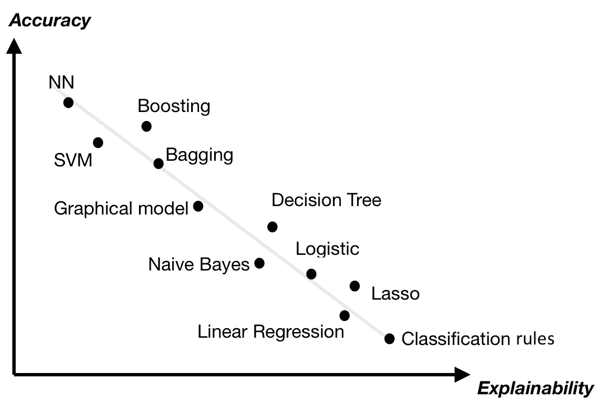
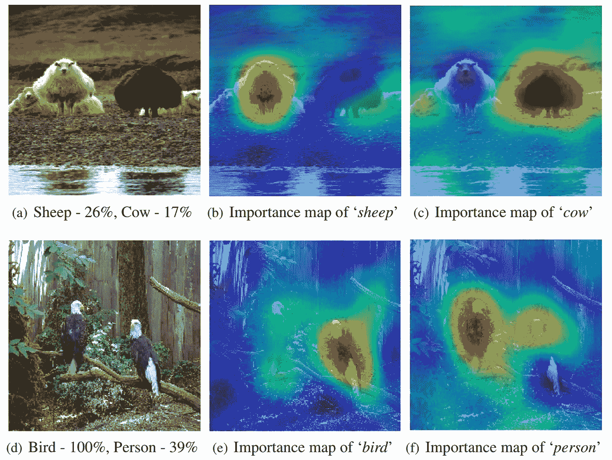
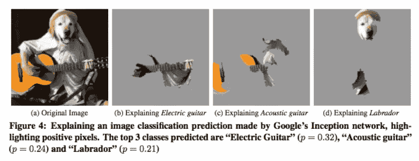

# 可解释的人工智能——打开“黑匣子”的钥匙

> 原文：<https://towardsdatascience.com/explainable-ai-the-key-to-open-black-boxes-4ad09e04d791?source=collection_archive---------18----------------------->

## 人工智能无处不在，需要可解释性

你可能已经注意到了，机器学习算法已经在我们的日常生活中无处不在。他们管理我们看到的内容，建议去办公室的理想路线，决定我们是否是公司职位的好候选人，等等。这种普遍性继续增长，因为它们很快将管理更广泛的基本活动，包括教育、工作、交通和医疗。

当然，这些算法是由人类构建和监督的(在大多数情况下)。但是目前使用的模型，本质上是深度神经网络，是如此复杂[1]，以至于它们的创造者几乎不可能理解它们的内部工作，从而产生了术语“黑盒”。正如我们将通过下面的例子看到的，能够解释他们的决定会带来多种好处。

**神经网络**:受人类大脑的启发，人工神经元最初接收一个值，并将其传输给下一层与之相连的神经元。因此，每个神经元都接收到一组值，这些值是根据每个神经连接的强度聚集起来的。然后，它应用非线性函数，并将获得的值传输到下一层；诸如此类。最终值对应于期望的预测，例如图像显示为狗的概率。

想象一下获得一笔银行贷款。你的申请文件可能会被机器学习模型研究，至少作为第一次筛选。后者使用你事先提供的数据(年龄、性别、工资、房租等。)以及外部数据(父母的职业，按时缴纳的账单等。)以决定是否同意向您提供这笔贷款，或者相反，是否应该拒绝。在这种情况下，**能够理解算法的决策**首先允许其创建者(例如数据科学家)**验证它是否正确工作，并在必要时调试****。事实上，在所有情况下，算法出于正确的原因做出正确的决定是至关重要的。特别是，确保没有**偏差**是至关重要的，因为算法可能会获得出色的结果，但使用虚假或歧视性的相关性。例如，如果在训练数据中，外国血统的人获得的贷款少于平均水平，则该算法可能已经学会降低如果该人是外国血统的人授予贷款的概率，这既不符合逻辑也不可取[2]。除了设计之外，理解模型的决策使得**促进其被企业接受**和使用成为可能；因为他们可以由此验证其行为是否符合公司的指导思想。最后，理解模型还允许**向客户**提供信息反馈，这具有真正的附加值。例如，候选人将被告知，如果有 5k /年的较高工资，并且在接下来的 6 个月里按时支付账单，贷款将被批准。**

> **我借此机会推荐凯茜·奥尼尔(Cathy O'Neil)的《数学毁灭武器》(Weapons of mathematics Destruction)一书，该书通过多种日常情况展示了人工智能如何加剧社会中的不平等并歧视某些人群。**

**一个可解释的人工智能的好处显然不止于这个特定的用例。无论我们是在看自动驾驶汽车还是人工智能辅助医生检测癌症，我们**都需要对这些模型**有完全的信心 **才能大规模分发它们，同时确保性能、安全、可靠和公平。只有可解释性允许这一点。****

> **简而言之，一个可解释的人工智能可以改善算法在某些情况下的行为，避免偏见和歧视，通过产生信心来增加公司内部的采用；向用户提供建设性的个性化反馈。**

**这一主题的重要性使得欧洲立法对其非常感兴趣。通过一般数据保护条例( **GDPR** )，欧盟通过排除某些关键算法决策在没有人类监督的情况下做出的可能性，使数据处理行为者承担责任——因此隐含地强加了可解释性。**

# **但是，什么是可解释性？**

> **从一开始，我们就在讨论机器学习模型的可解释性。但实际上，这个概念是什么意思呢？你如何让一个算法变得可解释？**

**首先你要知道机器学习模型有**两大类**:**

*   ****模型因其琐碎的内部工作而被认为是内在可解释的**——不需要额外的解释。例如，线性回归或决策树，对于它们，人类很容易理解模型的行为。不幸的是，对于许多应用程序来说，考虑到它们的简单性，它们的性能不够好，因此会一直没有被使用。**
*   **由神经网络领导的复杂模型通常更有效，但它们的预测很难解释。对于后者，我们应用所谓的**“事后可解释性** **方法”**，这发生在模型的训练和预测阶段之后，并描述其功能。这个概念和我们人类所做的非常相似。我们不是真正容易理解的个体，并且以一种复杂的方式运作。然而，我们能够在事后通过各种方式解释我们的决定。**

**正如你所想象的，我们对第二类特别感兴趣，因为它允许我们获得更好的结果，同时保持算法决策的一定透明度，从而限制了可解释性和性能之间著名的**权衡。****

****

**该图简要说明了可解释性和性能之间的权衡，由机器学习模型的选择产生。事后可解释方法使得用线性回归的可解释性获得神经网络(NN)的性能成为可能。来源:[3]**

> **事后方法可以是**全局**(针对所有实例的模型的一般功能)或**局部**(针对单个预测的模型功能)。它们适用于任何类型的自动学习算法(**模型不可知的**)或者特定于精确的架构(**模型特定的**)。**

**产生的解释可以采取各种形式，只要它忠实地描述了模型的功能，同时能被人类理解。其中，可能是[3]:**

*   **衡量模型中每个变量的重要性**
*   **数据点列表(最有影响力、最具代表性的…)**
*   **文本解释**
*   **视觉化**
*   **局部近似复杂模型的可解释模型**

# **一些事后解释方法**

**有各种各样的方法导致上述各种形式的解释。你会在下面找到 3 个例子，我希望它们能给你一个更精确的概念，解释方法是如何工作的。**

****显著图**是对模型内部参数使用数学运算的一系列方法，目的是解释神经网络的功能。仅举几个例子:*灵敏度分析、深度提升、Grad-CAM 或 GuidedBackpropagation* 。它们都反向传播神经网络中的梯度，以便估计每个输入变量对模型预测的影响。因此，解释是每个变量的重要性分数，或所谓的显著性图(见图片)。这些方法之间的差异体现在反向传播过程中的细微变化上。**

****

**来源:[https://bdtechtalks . com/rise-explable-ai-example-studential-map/](https://bdtechtalks.com/rise-explainable-ai-example-saliency-map/)**

****LIME**【4】围绕它希望解释的实例创建一个新的数据集。对于一个图像，它随机地去除几个超像素，并设计 N 个这样的新图像。然后，它在这组图像上建立一个可解释的模型(即线性回归或决策树)。该模型易于理解，并被用作对起始图像的预测的解释。换句话说，LIME 的目标是干扰已解释的实例，并使用简单的替代模型研究这些干扰对模型预测的影响。导致模型预测发生巨大变化的变量被认为是重要的。**

> **注意:对于线性回归，对应于每个超像素的系数表示其对于该图像分类的重要性。**

****

**来源:本地可解释的模型不可知的解释文件，里贝罗**

****SHAP** [5]建立在 Shapley 值[6]的基础上，Shapley 值源于博弈论，描述了如何在玩家之间“公平”地分配游戏的奖金，知道他们都合作了。例如，假设一个由 3 名玩家组成的团队在一次比赛中赢得了 100€，我们希望根据他们各自对项目的贡献在他们之间分配这一收益。事实上，在所有的团队工作中，经常有人比其他人投入更多，或者有独特的技能帮助团队达到另一个水平；所以谁的贡献更高。因此，当每个玩家加入任何可能的玩家联盟时，该方法计算每个玩家对所获得的支出的增加值。在这种特定情况下，我们计算(J1 和 J2 对 J1)，(JBOY3 乐队和 J2 对 JBOY3 乐队)，(J2 对无人)和(J1 和 JBOY3 乐队和 J2 对 J1 和 JBOY3 乐队)的增益。我们取一个加权平均值，找出 J2(玩家 2)对团队报告的总收益的“公平”贡献。**

**为了解释机器学习模型，我们通过考虑解释为游戏增益的预测来扩展 Shapley 值，其中每个变量都是该游戏的参与者。所以对于一个模型 f 对一个实例 X 的预测，记为 f(x)，一个变量 j 对一个变量联盟 S(变量子集)的边际贡献记为:*val(S U j)-val(S)= E[f(X)| X _ S = X _ S，X_j=x_j] - E[f(X)|X_s=x_s]* 。变量 j 的 Shapley 值的公式如下(已知有 F 个特征):**

****

**公平的概念由 4 个公理定义，Shapley 值是满足它们的唯一解。在实践中，上述总和是不可能计算的，我们求助于近似值，如 SHAP，它利用线性回归来估计每个变量的 Shapley 值，然后将它们作为解释。**

****

**SHAP 的输出说明示例。来源:[5]**

> **这些方法必须适应它们接收的数据的不同**形态**，即:文本、图像、表格或图形。**

# **提供良好的解释**

**既然我们已经看到了为什么可解释性是必要的，以及它由什么组成，剩下的就是让我们接近**如何评估这些方法，**以便提出一个模型的好的解释。**

**从理论角度来看，通常很难定义什么是好的解释。一些研究人员研究了这个问题，并定义了一个理想属性的列表。**

*   ****精度&保真度**:解释是相关的，并且完全符合“黑盒”模型的预测。**
*   ****稳健性**:实例特征或模型运行中的微小变化不会实质性地改变解释。**
*   ****确定性**:解释反映了机器学习模型的确定性。换句话说，解释表明了模型对于所解释的实例的预测的置信度。**
*   ****含义**:解释反映了每个变量的重要性。**
*   ****代表性**:解释涵盖了许多案例或实例，因此模型的功能更一般。**
*   **可理解性:这个解释很容易让人理解。该属性包括几个方面，下面将更详细地讨论。**

**的确；从人类理解的角度来看；一个好的解释往往是:**

*   **选择性:人们不期望解释涵盖一个事件的所有原因，而是希望给出两三个关键因素。
    *例如:“法国足球队在一场势均力敌的比赛后以 1 比 0 击败了德国队，因为他们在两个罚球区都更加冷静”。***
*   **对比:人们通常不会问为什么会做出预测，而是问为什么是这个预测而不是另一个预测。
    *举例:为什么贷款的是他，不是我？***
*   ****社交**:讲解是讲解者和接受者互动的一部分，所以必须适应受众。换句话说，面向数据科学家的解释必须不同于面向申请贷款的银行客户的解释。**

# **未来前景**

**尽管已经有一些可靠且易于使用的解释方法，这方面的研究仍在兴起。因此，在未来几年中，尤其是由于该领域的日益普及，可以预期会有许多改进。除其他事项外，最好更加坚持所提供的解释的性质，发展支持现有方法的先进理论，以及改进这些方法的评估过程，以保证它们在各种情况下的可靠性。最终目标是为任何受众提供可靠、可扩展且易于理解的解释。**

> **本文最初是为“**AI for Tomorrow”**而写，也可在[这里](https://medium.com/ai-for-tomorrow/lintelligence-artificielle-explicable-enjeu-majeur-pour-d%C3%A9mystifier-les-bo%C3%AEtes-noires-e0c2a7c8a036)获得(法语)。**

# **参考文献**

**[1] 3Blue1Brown —但是什么是神经网络呢？|第 1 章，深度学习—[https://www.youtube.com/watch?v=aircAruvnKk](https://www.youtube.com/watch?v=aircAruvnKk)**

**[2]凯茜·奥尼，《数学破坏的武器》。2016**

**[3]杜瓦尔，A. (2019)。可解释的人工智能(XAI)。 *MA4K9 学术报告，华威大学数学研究所*。**

**[4]里贝罗、马尔科·图利奥、辛格、萨梅尔和盖斯特林。我为什么要相信你？解释任何分类器的预测。2016 年在 KDD。**

**[5] Lundberg，s .，& Lee，S. I. (2017 年)。解释模型预测的统一方法。 *arXiv 预印本 arXiv:1705.07874* 。**

**[6] Shapley，Lloyd s.《N 人游戏的价值》.对博弈论的贡献 2 (28):第 307-317 页。1953.**

**[7]莫尔纳尔。可解释的机器学习。2018**

****

**照片由[阿诺·弗朗西斯卡](https://unsplash.com/@clark_fransa?utm_source=unsplash&utm_medium=referral&utm_content=creditCopyText)在 [Unsplash](https://unsplash.com/@clark_fransa?utm_source=unsplash&utm_medium=referral&utm_content=creditCopyText) 拍摄**