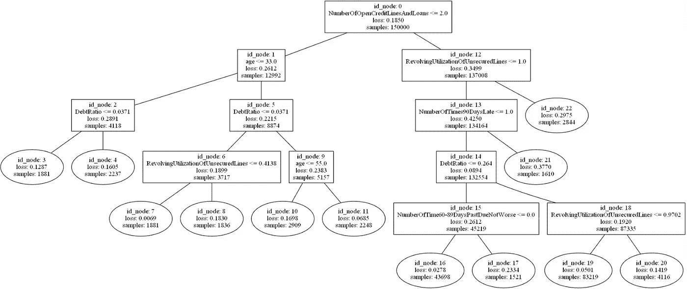
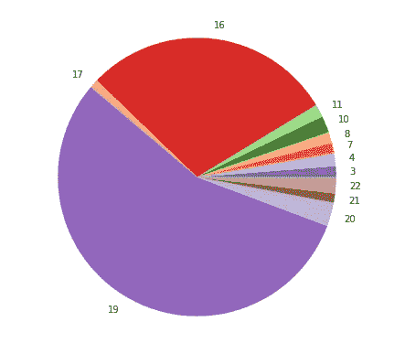
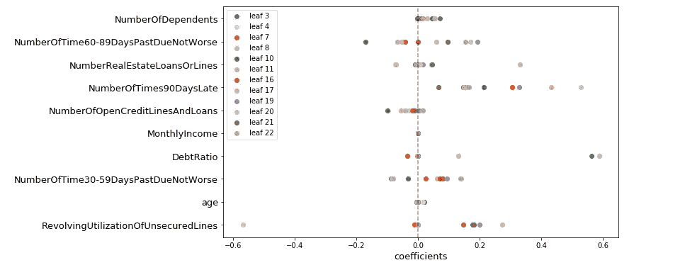
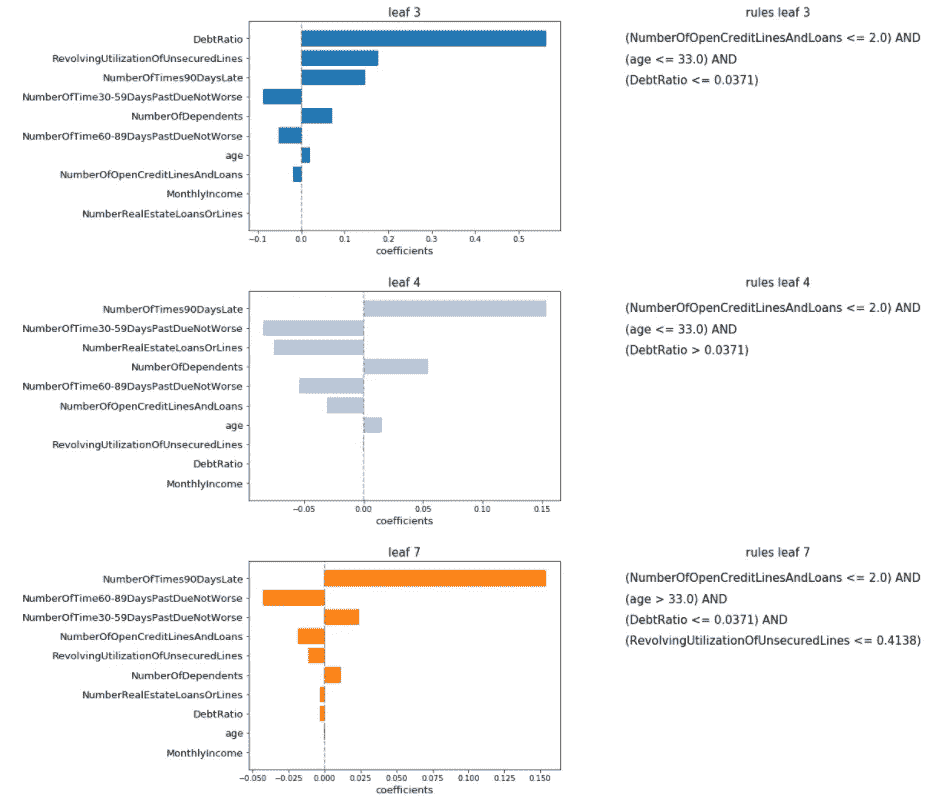
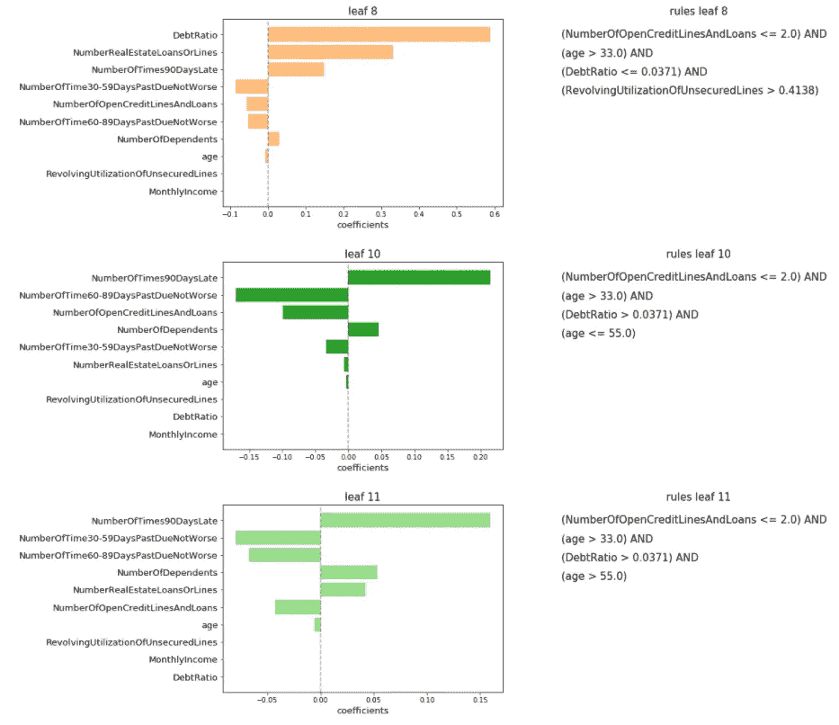
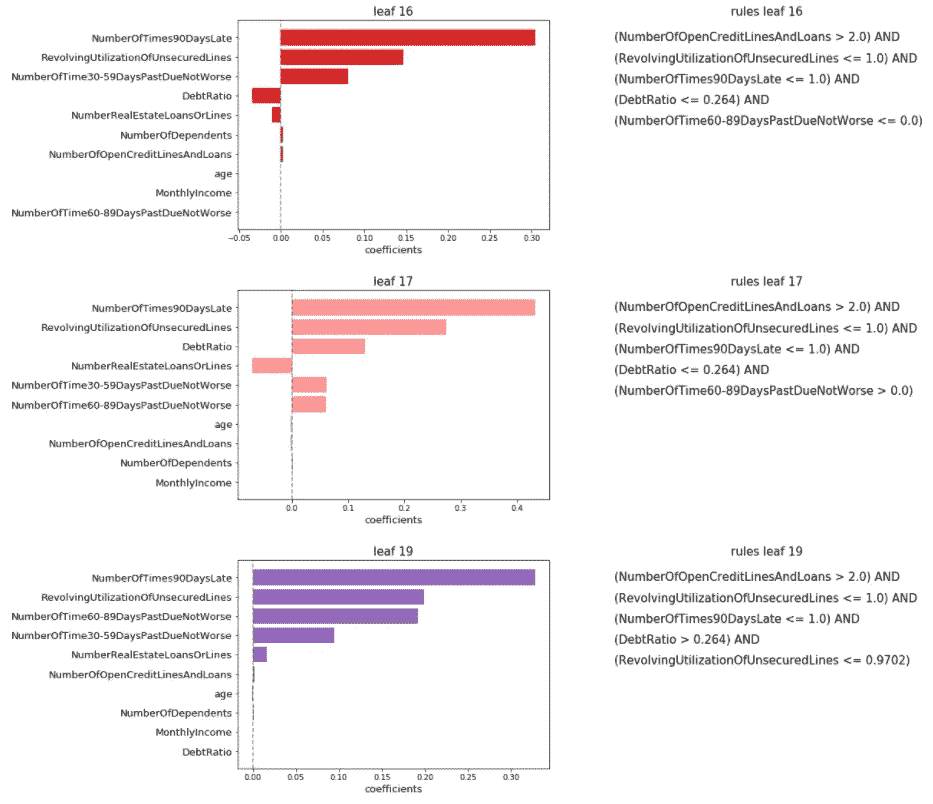
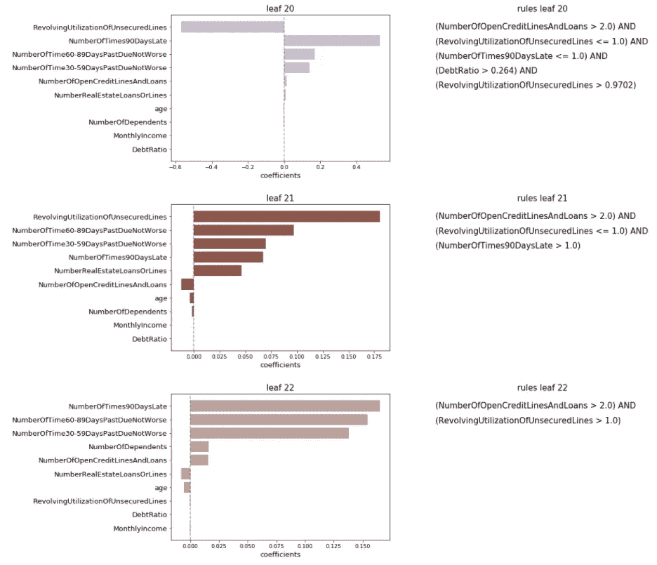

# 用线性树解释人工智能

> 原文：<https://towardsdatascience.com/explainable-ai-with-linear-trees-7e30a6f067d7?source=collection_archive---------25----------------------->

## [模型可解释性](https://towardsdatascience.com/tagged/model-interpretability)

## 提取符合线性模型的有意义的决策规则

[zbynk skr enn](https://unsplash.com/@skrcenyz?utm_source=medium&utm_medium=referral)在 [Unsplash](https://unsplash.com?utm_source=medium&utm_medium=referral) 上的照片

在人工智能领域，在开发机器学习管道时，**准确性**和**可解释性**之间的权衡是一个至关重要的方面。**准确性**是指模型预测的正确程度，而**可解释性**规定了人类理解结果的难易程度。两者之间的平衡关系到最终的业务需求。

当我们试图解释我们的 ML 管道的输出时，我们应该考虑一个重要的方面。**可解释性不一定导致可解释性。如果人们没有足够的知识来理解预测，从预测中提取洞察力的可能性可能是无用的。一些模型不可知的技术可能就是这种情况，这些技术可以附加在流程的最后一步，以提供可解释性的结果。尽管它们可能是非常强大的工具，但如果使用不当，它们对于非技术人员来说可能太多了。如果我们试图解释可解释性得分计算背后的启发性，就会遭到致命一击。**

最好的解决方案是保持简单。表现出最佳和最简单的解释洞察力的模型是线性或基于树的算法。它们也是最著名和最容易理解的两种算法。线性回归(分类上下文中的逻辑回归)提供了检查系数大小的可解释性结果。同样，我们可以从决策树中提取决策规则形式的学习历史。

在大多数情况下，简单是低预测能力的同义词。这是一个错误和草率的考虑。性能是相对的，取决于分析领域、数据质量和正确选择适当的验证策略。不变的是我们所掌握的工具的解释能力。因此，为了从最简单的方法中获得最佳效果，无论是在性能上还是在解释力上，我们试图将它们结合起来。

在这个背景下，我们引入了 [**线性树**](https://github.com/cerlymarco/linear-tree) : *一个 python 库来构建在叶子处具有线性模型的模型树。*该软件包以 sklearn 风格提供了简单的基本估计器，以包装`sklearn.linear_model`中可用的每个线性估计器，并构建一个最佳树结构。在训练过程中，最佳分裂被评估为在所接收的数据集上拟合线性模型。最终模型由基于树的结构组成，在叶子中具有线性模型。换句话说，多元线性回归是根据简单的决策规则对数据进行分区计算的。

在这篇文章中，我们利用 [**线性树**](https://github.com/cerlymarco/linear-tree) 的能力来提供有用的解释。我们通过执行一项预测任务使之成为可能。作为训练过程的结果，我们可以完全免费地检索一些非常简单和强大的可解释的结果。

# 数据

我们从 [Kaggle](https://www.kaggle.com/c/GiveMeSomeCredit/overview) 收集了一个金融数据集。有了这些数据，我们的目标是建立一个预测算法来量化某人在未来两年经历财务困境的概率。我们有不同的数值变量，可以用于我们的模型:

*   `RevolvingUtilizationOfUnsecuredLines`:信用卡和个人信用额度的总余额除以信用额度百分比之和；
*   `age`:借款人年龄，单位为年；
*   `NumberOfTime30-59DaysPastDueNotWorse`:借款人在过去 2 年中逾期 30-59 天的次数；
*   `DebtRatio`:每月债务偿还额除以每月总收入；
*   `MonthlyIncome`月收入；
*   `NumberOfOpenCreditLinesAndLoans`:未结贷款数量(分期付款，如车贷或按揭)和信用额度(如信用卡)；
*   `NumberOfTimes90DaysLate`:借款人逾期 90 天或以上的次数；
*   `NumberRealEstateLoansOrLines`:抵押和房地产贷款笔数；
*   `NumberOfTime60-89DaysPastDueNotWorse`:借款人在过去 2 年中逾期 60-89 天的次数；
*   `NumberOfDependents`:家庭中不包括自己的被赡养人数。

外生变量是可以自我解释的，并且非常适合我们实验的目的。

# 建模和解释

我们的范围是拟合一个线性树，以产生易于解释的结果。在这个模拟中，我们使用所有的数据进行训练。我们使用来自 [sklearn](https://scikit-learn.org/stable/modules/generated/sklearn.linear_model.RidgeClassifier.html#sklearn.linear_model.RidgeClassifier) 的`RidgeClassifier`作为线性估值器来构建我们的树形结构。不同的参数配置可能产生不同的树结构，从而导致不同的结果。选择和验证最好的一个是我们的责任。

从拟合线性树得到的树结构(图片由作者提供)

我们对树叶特别感兴趣。与经典决策树一样，每片叶子都是在每条探索路径中应用的修剪过程的结果。当不再有收益时，就通过将数据分割成更多分区来减少损失而言，增长过程会停止。我们以根据简单的决策规则划分成不同组/叶的训练数据的“聚类”版本结束。

将训练样本分发到树叶中(图片由作者提供)

每个叶片还包含一个拟合的线性模型。我们正在构建一个线性树，并且考虑来自左右子候选的训练损失的加权和来评估分裂。我们最终在每片叶子中有一个拟合的线性模型，该模型预测满足一组给定决策规则的所有样本。

从所有叶子的线性模型中提取的系数(图片由作者提供)

此时，我们可以检查结果。查询线性模型，我们提取系数，并查看树叶中每个变量的影响。这还不是全部。我们还可以获得在训练期间建立的决策规则集。它们有助于识别给定样本属于哪片叶子。**通过决策规则和系数的组合，我们对模型**遵循的决策路径有了一个完整的概述。

树叶 3、4、7 的系数(左边)和决策规则(右边)(图片由作者提供)

来自叶子 8、10、11 的系数(左边)和决策规则(右边)(图片由作者提供)

来自叶子 16、17、19 的系数(左边)和决策规则(右边)(图片由作者提供)

来自叶子 20、21、22 的系数(左边)和决策规则(右边)(图片由作者提供)

# 摘要

在这篇文章中，我们介绍了作为构建线性树工具的<https://github.com/cerlymarco/linear-tree>**线性树包。它们可以被认为是理解特征之间的关系并提供可解释结果的有价值的解决方案。线性树利用决策树和线性模型的组合来帮助我们更好地解释我们的预测。然而，像所有其他算法一样，它们需要适当的调整和数据理解，以实现所需的性能。**

**[**查看我的 GITHUB 回购**](https://github.com/cerlymarco/MEDIUM_NoteBook)**

**保持联系: [Linkedin](https://www.linkedin.com/in/marco-cerliani-b0bba714b/)**