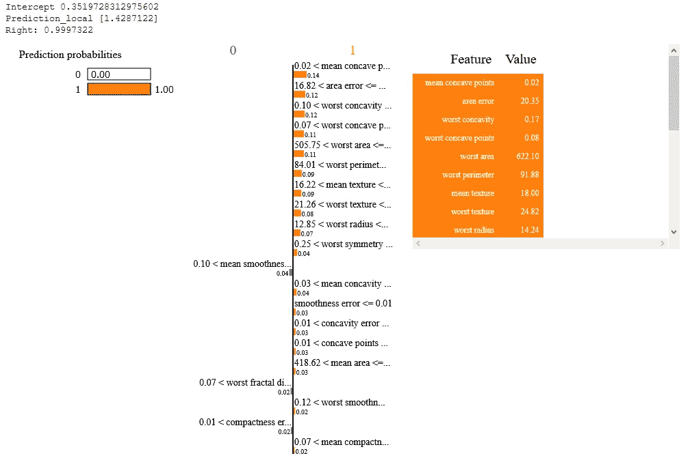
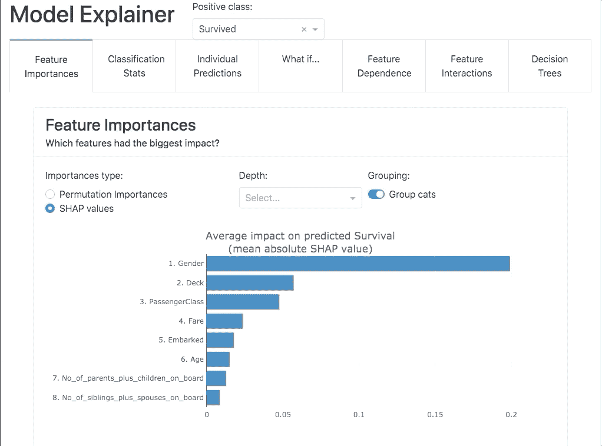

# 可解释的人工智能(XAI)——用 Python 写的 7 个包来解释你的模型的指南

> 原文：<https://towardsdatascience.com/explainable-ai-xai-a-guide-to-7-packages-in-python-to-explain-your-models-932967f0634b?source=collection_archive---------0----------------------->

## 介绍各种框架和 web 应用程序，解释和说明 Python 中的机器学习(ML)模型

凯文·Ku 在 [Unsplash](https://unsplash.com?utm_source=medium&utm_medium=referral) 上的照片

在过去的几年里，可解释的人工智能已经取得了重大进展。将这些黑盒模型转换成透明和可解释的算法的追求已经在学术界和商界获得了牵引力。许多文章、出版物和开源贡献现在使得解密这些复杂的模型变得容易，并把它们变成*白盒*，特别是对于商业用户、经理和领域专家。今天涉及生产 ML 模型的分析项目将这种可解释的人工智能作为交付的关键组件，以支持用户对可理解性和透明性的需求。

# 不久之前

在 [SHAP](https://github.com/slundberg/shap) 和[时间](https://github.com/marcotcr/lime)等方法流行起来之前，标准模型解释(在全球层面上)具有一定的可解释性，包括可变重要性(基于 ML 算法的不同方法)、[决策树](https://scikit-learn.org/stable/modules/tree.html)、[部分依赖图(PDP)、个体条件期望图(ICE)](https://scikit-learn.org/stable/modules/partial_dependence.html) 和经典回归系数等方法。在我们获得安慰和信任之前，人类需要了解事物是如何运作的。更高的模型复杂性导致更少的可解释性，这种经典的权衡现在已经得到控制。这些新的方法应用了诸如创建复制模型的方法，这些方法在局部范围内模拟原始模型的行为，并有助于解释某种预测是如何做出的。

# XAI 新时代

虽然近年来开发了许多包/方法，但本文旨在简要介绍 Python XAI 版中一些流行的包/框架，包括它们的基本特性和规范。下面还提供了代码片段示例和可视化效果，以提供输出的要点。请注意，这些包具有不同的依赖性，可能会在 Python 环境中产生冲突。建议设置不同的环境来运行这些代码，避免版本冲突。还要注意，我并不提倡这里的任何包，下面的一些评论是我基于使用和经验的个人意见。由于本文仅提供了一个介绍性的概述，因此每一节都提供了多个参考资料和文章链接，以供进一步阅读。

在这篇文章中，我们将使用[乳腺癌数据集](https://archive.ics.uci.edu/ml/datasets/Breast+Cancer+Wisconsin+%28Diagnostic%29)作为一个例子来描述来自各种包的一些输出。在该数据集中，从乳腺肿块细针抽吸(FNA)的数字化图像中计算特征。它们描述了图像中出现的细胞核的特征。任务是进行二元分类预测。

我们开始吧！

首先，让我们设置数据集。

图片来源:作者

让我们构建一个基本的 [Xgboost 模型](https://xgboost.readthedocs.io/en/latest/)，我们将在各个包中使用它。

现在我们开始分析来分解这个模型，并使它的运行变得透明。

# ***1。SHAP***

今天最流行的方法之一，SHAP (SHapley 附加解释)是一种基于博弈论的方法来解释任何 ML 模型的输出。它将最优信用分配与使用博弈论及其相关扩展的经典 Shapley 值的本地解释联系起来。

图片来源:SHAP Github 页面

SHAP 帮助你理解影响的大小(条形的长度)和方向(颜色)。

图片来源:SHAP Github

SHAP 是一个模型不可知的框架。关于方法论的更多细节可以在他们的第[页](https://shap.readthedocs.io/en/latest/index.html)和论文中找到，比如由[伦德伯格和李](https://papers.nips.cc/paper/2017/file/8a20a8621978632d76c43dfd28b67767-Paper.pdf)撰写的论文。Ula La Paris 的另一篇理解数学的好文章是一个面向例子的解释，可以在这里阅读。这个包现在很容易成为最受欢迎的选择之一，在过去几年中，它在模型可解释性的各个方面都有直观和引人入胜的可视化。下面给出了一些可视化效果，以及生成这些效果的代码。

图片来源:作者

对于数据科学家来说，这是一个很好的起点。围绕使用这些值来生成更吸引人的可视化和洞察力的创造性方面在于数据科学家。下面的文章就是一个例子。

<https://medium.com/swlh/push-the-limits-of-explainability-an-ultimate-guide-to-shap-library-a110af566a02>  

这个包充当了许多基于仪表板和应用程序的框架的基础，这些框架将在本文后面介绍。

# 2.石灰

Lime 是第一个在可解释性领域流行起来的技术之一。Lime 代表本地可解释的模型不可知解释。本[论文](https://arxiv.org/abs/1602.04938)涵盖了 Lime 背后的方法论。目前，Lime 有助于解释表格数据、图像和文本分类器的预测。

Lime 基本上试图通过创建局部代理模型来给出模型行为的局部线性近似，该局部代理模型被训练来局部模拟 ML 模型的预测。虽然全球重要性显示了对整个数据集的平均影响，但每个变量可能以不同方式影响局部观察。这个代理模型可以是从 GLMs 到决策树的任何东西，它试图理解局部重要性可能如何不同。Christoph Molnar 在 [interpretable-ml-book](https://christophm.github.io/interpretable-ml-book/lime.html) 中提到的一般框架是:

*   选择您感兴趣的实例，您希望了解其黑盒预测的解释
*   扰动数据集并获得这些新点的黑盒预测
*   根据新样本与感兴趣的实例的接近程度对其进行加权
*   在具有变化的数据集上训练加权的、可解释的模型
*   通过解释本地模型来解释预测

但是石灰有一定的局限性，应该谨慎使用(更多细节请参考本文[文章](/whats-wrong-with-lime-86b335f34612))。这篇[文章](/explaining-machine-learning-classifiers-with-lime-def5adaacfea)为想要深入研究石灰的人提供了有趣的实验和进一步的参考。

在我们的数据集上，我们解释观察 79。

图片来源:作者

# 3.沙帕什

交互性和引人入胜的视觉效果是传达数据故事、见解和模型结果的关键。将这些编译到笔记本或网络应用程序中代表了商业和数据科学家/分析师应该如何呈现 AI/ML 成果并与之交互的理想方式。[沙帕什](https://shapash.readthedocs.io/en/latest/)朝那个方向迈出了一步。这是一个由法国保险公司 MAIF 的数据科学家构建的 Python 库。这个软件包围绕 SHAP/莱姆可解释性编译了各种可视化，并发布了一个易于使用的交互式仪表板作为一个 web 应用程序。

它使用 Shap 或 Lime 后端来计算贡献。Shapash 依靠不同的必要步骤来构建一个 ML 模型，以使结果可以理解。

图片来源:shapash

它适用于回归、二元分类或多类问题，并与许多模型兼容: *Catboost* 、 *Xgboost* 、 *LightGBM* 、 *Sklearn Ensemble* 、*线性模型*和 *SVM* 。

图片来源:shapash

我们的数据集和相关代码的一些可视化分享如下。我们继续使用我们的 *Xgboost* 模型作为与这个包兼容的例子。

图片来源:作者

Shapash 最近还在软件包中添加了报告和文档功能，这将在本文[的](/shapash-1-3-2-announcing-new-features-for-more-auditable-ai-64a6db71c919)中详细介绍。这个包越来越受欢迎，被许多媒体文章和 YouTube 视频所覆盖。

# 4.解释器仪表板

由 Oege Dijk 构建的 ExplainerDashboard 是一个广泛的、引人入胜的交互式仪表板库，用于解释各种频谱和方法中的 ML 模型。与 Shapash 相比，这要详细得多，即不仅限于 SHAP 或石灰。

图片来源: [Explainerdashboard](https://explainerdashboard.readthedocs.io/en/latest/index.html)

这个仪表板涵盖了 ML 可解释性的各个方面，例如:

*   特征重要性
*   度量和评估
*   局部预测可解释性
*   如果分析呢
*   决策树
*   功能依赖关系
*   相互作用

作者撰写的一篇中型文章详细介绍了软件包和各种输出。

<https://medium.com/value-stream-design/making-ml-transparent-and-explainable-with-explainerdashboard-49953ae743dd>  

还有作者的 [PyData GLobal 2020 talk](https://www.youtube.com/watch?v=1nMlfrDvwc8) 。

虽然这个包有许多可视化和输出。这个仪表板可能会有各种各样的组件，但它是模块化的，允许在创建自己喜欢的仪表板版本时有很大的灵活性和定制性。还有内联解释器来查看单个组件。下面是一些例子，后面是代码。

图片来源:作者

您可以用下面的一行代码创建预构建的仪表板。您可以根据需要切换和打开/关闭各种选项卡。

关于这个包的更详细的指南可以在 Ravi 的这篇文章中找到。

<https://medium.com/analytics-vidhya/explainer-dashboard-build-interactive-dashboards-for-machine-learning-models-fda63e0eab9>  

# 5.Dalex

[DrWhy 的一部分。AI](https://github.com/ModelOriented/DrWhy/blob/master/README.md) ， [Dalex](https://github.com/ModelOriented/DALEX) 是一个流行的库，它提供了各种 ML 框架的包装器。然后可以研究这些包装器，并与一组本地和全局解释器进行比较。

这本[电子书](https://ema.drwhy.ai/)解释了 Dalex 的哲学和方法论细节。它涵盖了模型可解释性的各个方面，如下图所示。

图像来源于 [DALEX](https://github.com/ModelOriented/DALEX)

Python 和 R 版本的软件包涵盖了可变重要性、PDP 和 ALE 图、分解图和 SHAP 瀑布图。它还包含一个用 Python 包装的原生 SHAP 包。这个包可以和各种 ML 框架一起工作，比如`scikit-learn`、`keras`、`H2O`、`tidymodels`、`xgboost`、`mlr`或者`mlr3.`

图像来源[解释性模型分析](https://ema.drwhy.ai/)

电子书中介绍了故障和实时方法，在此[文章中进一步解释了](https://www.researchgate.net/publication/324246426_Explanations_of_Model_Predictions_with_live_and_breakDown_Packages)是此软件包的独特之处。这不同于通常的 SHAP 法和石灰法。这个包是为数不多的几个也有[公平](https://fairmlbook.org/)模块的包之一。笔记本示例可在[这里](https://dalex.drwhy.ai/python-dalex-fairness.html)找到。一些模块如[其他条件不变](https://ema.drwhy.ai/ceterisParibus.html)有一些吸引人的视觉效果，如下图所示。

图像来源[解释性模型分析](https://ema.drwhy.ai/)，泰坦尼克号数据集

在我们的数据集上使用这个包，我们用下面给出的代码片段生成了一些视觉效果。

图片来源:作者

所有的情节都是互动的，与 Plotly 有一个整洁的集成，可以很容易地保存。Dalex 也不会落在仪表板空间的后面。 [Arena](https://arena.drwhy.ai/docs/) 是 Dalex 的交互式拖拽仪表盘。视觉效果相当不错，界面也很整洁。下面是我们数据集中的一张快照，您可以从中一窥仪表盘。代码片段只有几行，如下所示。

图片来源:作者

# 6.可解释的增压机(EBM)

这是街区里新来的孩子。由 [Interpret ML](https://interpret.ml/) 创建，Interpret 是微软的一个开源包，它有一个“玻璃盒子”模型模块，可以解释。这并不意味着性能上的损失，因为 EBM 在一些[数据集](https://github.com/interpretml/interpret/)中表现出与其他增强方法相当的性能。

基于[加性模型](https://en.wikipedia.org/wiki/Additive_model#:~:text=In%20statistics%2C%20an%20additive%20model,class%20of%20nonparametric%20regression%20models.)的思想，这种方法改变了训练过程，从训练所有特征的决策树到一次一个特征的决策树。以小深度和增强方式为每个特征构建多个树。基于其所有树的求和，我们可以用输出变量来估计输入变量的函数( *f)* 。这里有一些作者[的好视频](https://youtu.be/MREiHgHgl0k)。论文也可以在[这里](https://arxiv.org/pdf/1909.09223.pdf)获取。每个特征对最终预测的贡献可以通过其 *f* 来理解。由于 EBM 是一个附加模型，每个特征以模块化的方式对预测做出贡献，这使得推理每个特征对预测的贡献变得容易。

代码架构非常简单。下面这张来自官方[论文](https://arxiv.org/pdf/1909.09223.pdf)的图片给了我们一瞥。

图片来源:由[解读 ML](https://arxiv.org/pdf/1909.09223.pdf)

除了玻璃盒模型，人们还可以使用通常的 SHAP，石灰，PDP 和包装的灵敏度组件。这个也兼容`scikit-learn`。这篇 Medium [文章](/interpretml-analysis-of-svm-and-xgboost-models-e68062f7299f)为 *SVM* 和 *Xgboost* 提供了一个很好的使用这个包的例子。这个包还允许您将各种交互式小部件编译成一个简洁的仪表板。在他们的 github [页面](https://github.com/interpretml/interpret/)中有很多例子。然而，我发现这个包仍然处于早期阶段，并且在一般的东西上是有限的，例如，模型度量等等。相对于其他软件包，可视化效果也没有那么吸引人。然而，这种方法有望获得相当的性能。

在我们的数据集上，下面给出了一些可视化和代码。

图片来源:作者

这些都可以打包到一个仪表板中。

图片来源:作者

# 7.ELI5

ELI5 是麻省理工学院的另一个可解释性包，支持 ML 框架和包，如 *Scikit-learn、Keras、Xgboost、*等。有了统一的 API，跨包和框架比较模型变得更加容易。还有许多其他组件，如[文本解释器](https://eli5.readthedocs.io/en/latest/tutorials/black-box-text-classifiers.html)，它使用 Lime 算法和[置换重要性](https://eli5.readthedocs.io/en/latest/blackbox/permutation_importance.html)。这个包巧妙地将解释分为两个部分:

1.  Global 是`[show_weights(](https://eli5.readthedocs.io/en/latest/autodocs/eli5.html#eli5.show_weights))`，您可以在其中提供所需的参数，以指定您希望看到的全局重要性类型(例如，“增益”、“重量”、“增益”、“覆盖”、“总增益”、“总覆盖”)
2.  `[eli5.show_prediction()](https://eli5.readthedocs.io/en/latest/autodocs/eli5.html#eli5.show_prediction)`给出了局部水平解释，解释了局部水平预测

其他函数如`[eli5.formatters](https://eli5.readthedocs.io/en/latest/autodocs/formatters.html#module-eli5.formatters)`可以用来获取 HTML、文本、JSON 或 PIL 图像等。解释的表示。

我在这个包里找不到引人入胜的视觉效果。跨各种 ML 包/框架的统一平台是它的主要亮点。下面给出了一些输出和代码片段。

图片来源:作者

# **8。这还不是全部！**

虽然这篇文章涵盖了使你的模型透明和可解释的最流行的选项，但还有其他可以进一步探索的包，如涵盖一些不同方法的 [Alibi](https://github.com/SeldonIO/alibi) ，如 [Anchors](https://docs.seldon.io/projects/alibi/en/latest/methods/Anchors.html) 。 [Skater](https://github.com/oracle/Skater) 是另一个软件包，它以一个酸橙叉开始，但后来作为一个独立的框架爆发。还有其他一些有趣的项目值得探索，比如 IBM 的 [EhticalML](https://github.com/EthicalML/xai) 、 [Aix360](https://pypi.org/project/aix360/) 、ML 的[多样性反事实解释(DiCE)](https://github.com/interpretml/DiCE) ，它来自于我们上面为 EBMs 介绍的 interpret ML。Ai 等。对于那里的 R 爱好者来说，在文章 [*可解释人工智能的 R 包景观*](http://xai-tools.drwhy.ai/) 中可以找到 XAI 上类似的精选包列表。

# 结论

这一研究领域和开源贡献正在快速发展，这与解释、调试和验证我们的模型决策是多么重要是一致的，特别是当实际的人工智能模型部署呈上升趋势时，以及这些算法在我们的日常生活中变得多么有影响力。上述软件包只是一个起点，可供数据科学家、工程师和分析师进一步利用和构建。这将提高对基于人工智能的解决方案的信任，从而加快其采用。

***参考文献:***

[1][https://towardsdatascience.com/tagged/xai](https://towardsdatascience.com/tagged/xai)

[2][https://towards data science . com/unbox-the-black-box-using-lime-5c 9756366 faf](/unboxing-the-black-box-using-lime-5c9756366faf)

[3][https://www . kdnugges . com/2021/04/shapash-machine-learning-models-understand . html](https://www.kdnuggets.com/2021/04/shapash-machine-learning-models-understandable.html)

[[4]https://medium . com/swlh/push-the-limits-of-explability-an-ultimate-guide-to-shap-library-a 110 af 566 a 02](https://medium.com/swlh/push-the-limits-of-explainability-an-ultimate-guide-to-shap-library-a110af566a02)

【https://pypi.org/project/explainerdashboard/ 

[6][https://medium . com/value-stream-design/making-ml-transparent-and-explain-with-explainer dashboard-49953 AE 743 DD](https://medium.com/value-stream-design/making-ml-transparent-and-explainable-with-explainerdashboard-49953ae743dd)

[7][https://medium . com/swlh/push-the-limits-of-explability-an-ultimate-guide-to-shap-library-a 110 af 566 a 02](https://medium.com/swlh/push-the-limits-of-explainability-an-ultimate-guide-to-shap-library-a110af566a02)

[https://dalex.drwhy.ai/python-dalex-xgboost.html](https://dalex.drwhy.ai/python-dalex-xgboost.html)

[9][https://uc-r.github.io/dalex](https://uc-r.github.io/dalex)

[10][https://towards data science . com/decrypting-your-machine-learning-model-using-lime-5 ADC 035109 b5](/decrypting-your-machine-learning-model-using-lime-5adc035109b5)

[11][https://towards data science . com/explaining-machine-learning-classifiers-with-lime-def 5 adaacfea](/explaining-machine-learning-classifiers-with-lime-def5adaacfea)

[12][https://towards data science . com/whats-错在哪里-lime-86b335f34612](/whats-wrong-with-lime-86b335f34612)

[13][https://towards data science . com/the-explaible-boosting-machine-f 24152509 ebb](/the-explainable-boosting-machine-f24152509ebb)

[14][https://towards data science . com/interpret ml-analysis-of-SVM-and-xgboost-models-e 68062 f 7299 f](/interpretml-analysis-of-svm-and-xgboost-models-e68062f7299f)

[15][https://www . analyticsvidhya . com/blog/2020/11/demystifying-model-interpretation-using-Eli 5/](https://www.analyticsvidhya.com/blog/2020/11/demystifying-model-interpretation-using-eli5/)

[16][https://Eli 5 . readthe docs . io/en/latest/overview . html #特性](https://eli5.readthedocs.io/en/latest/overview.html#features)

[17][https://medium . com/analytics-vid hya/why-should-I-trust-your-model-bdda 6 be 94 c6f](https://medium.com/analytics-vidhya/why-should-i-trust-your-model-bdda6be94c6f)

[18][https://towards data science . com/explaible-artificial-intelligence-part-3-hands-on-machine-learning-model-interpretation-E8 ebe 5 AFC 608](/explainable-artificial-intelligence-part-3-hands-on-machine-learning-model-interpretation-e8ebe5afc608)

[19]https://awesomeopensource.com/projects/xai?categoryPage=7

【http://xai-tools.drwhy.ai/ 20】

[21][https://medium . com/analytics-vid hya/explainer-dashboard-build-interactive-dashboards-for-machine-learning-models-FDA 63 E0 eab 9](https://medium.com/analytics-vidhya/explainer-dashboard-build-interactive-dashboards-for-machine-learning-models-fda63e0eab9)