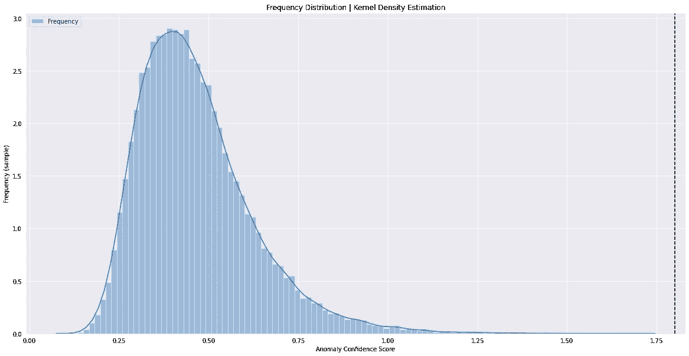
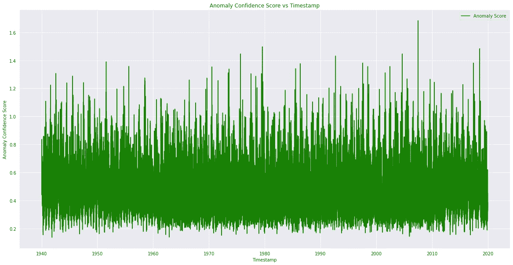
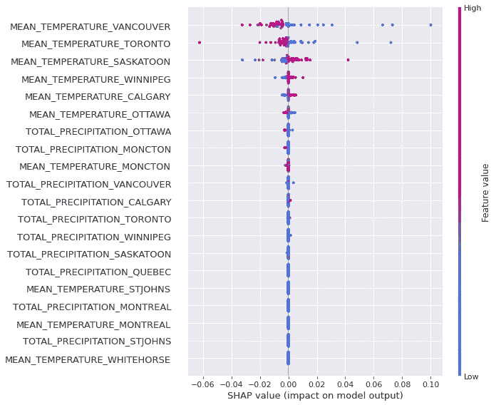

# 无监督深层异常探测器的可解释人工智能(XAI)设计

> 原文：<https://towardsdatascience.com/explainable-ai-xai-design-for-unsupervised-deep-anomaly-detector-6bd1275ed3fc?source=collection_archive---------9----------------------->

## 用于检测非分布样本和敌对攻击的可解释原型

无监督深度卷积神经网络的可解释原型&基于 lstm 自动编码器的高维异构/同构时间序列多传感器数据实时异常检测

你好，朋友们。在这篇博文中，我将带您了解包“ [msda](https://pypi.org/project/msda/) ”的新特性。更多细节可以在 GitHub 页面[这里](https://github.com/ajayarunachalam/msda)找到

MSDA 1 . 10 . 0 版有什么新功能？

MSDA 是一个用 Python 编写的开源`low-code`多传感器数据分析库，旨在减少时序多传感器数据分析&实验中从假设到洞察的周期时间。它使用户能够快速高效地执行端到端的概念验证实验。该模块通过捕捉变化和趋势来识别多维时间序列中的事件，以建立旨在识别相关特征的关系，这有助于从原始传感器信号中选择特征。此外，它还提供了一个无监督的深度卷积神经网络&来精确检测实时流数据中的异常。此外，还设计了一个基于 lstm 自动编码器的检测器，可在 GPU/CPU 上运行。最后，用博弈论的方法来解释所建立的异常检测器模型的输出。

该套餐包括:-

1.  时间序列分析。
2.  每个传感器列 wrt 时间的变化(增加、减少、相等)。
3.  每列值相对于其他列如何变化，以及每列相对于其他列的最大变化率。
4.  与趋势阵列建立关系，以确定最合适的传感器。
5.  用户可以选择窗口长度，然后检查每个传感器列的每个窗口的平均值和标准偏差。
6.  它为高于或低于阈值的每个传感器列值提供增长/衰减值的计数。
7.  特征工程 a)涉及各种汇总窗口值趋势的特征:平均值的变化和变化率，标准偏差。窗口偏差。b)变化率、增长率与标准偏差。偏差。c)随时间变化。d)随时间的变化率。e)增长或衰退。f)增长率或衰减率。g)高于或低于阈值的值的计数。
8.  ** **无监督深度时序异常检测器。** **
9.  ** **用博弈论的方法解释时序数据模型。** **

MSDA 是`simple`、`easy to use`和`low-code`。

# 谁应该使用 MSDA？

MSDA 是一个任何人都可以使用的开源库。在我们看来，MSDA 的理想目标受众是:

*   快速概念验证的研究人员。
*   希望提高工作效率的经验丰富的数据科学家。
*   偏好低代码解决方案的公民数据科学家。
*   数据科学的学生。
*   参与构建概念验证项目的数据科学专业人员和顾问。

# 异常重访

什么是异常现象，为什么会引起关注？通俗地说，“异常”或“异常值”是一个数据空间中的数据点，这些数据点是异常的，或脱离趋势的。异常检测侧重于识别数据中以某种方式偏离预期或典型的例子。现在，问题是，**“你如何定义某件事是不正常的或异常的？”**快速基本原理答案是样本空间中所有不跟随相邻点趋势的点。

对于任何业务领域，从大量数据中检测可疑模式都非常关键。比方说，在银行领域，欺诈性交易对银行构成了严重的威胁&损失/责任。在这篇博客中，我们将尝试学习如何在没有事先训练模型的情况下从数据中检测异常，因为你无法在数据上训练模型，而我们对此一无所知！这就是**无监督学习**的整个想法有所帮助的地方。我们将看到两种用于构建实时异常检测器的网络架构，即 a)深度 CNN b) LSTM 自动编码器

这些网络适合于检测大范围的异常，即时间序列数据中的点异常、上下文异常和不一致。由于这种方法是无人监督的，它不需要异常标签。我们使用未标记的数据来捕获和学习用于预测时间序列正常行为的数据分布。第一种架构的灵感来自 IEEE 论文 [DeepAnT](https://ieeexplore.ieee.org/document/8581424) ，它由两部分组成:**时间序列预测器**和**异常检测器**。时间序列预测器使用深度卷积神经网络(CNN)来预测定义的地平线上的下一个时间戳。该组件获取一个时间序列窗口(用作参考上下文),并尝试预测下一个时间戳。预测值随后被传递给异常检测器组件，该组件负责将相应的时间戳标记为**非异常**或**异常**。

第二种架构的灵感来自这篇自然论文[基于深度 LSTM 的多变量时间序列堆栈自动编码器](https://www.nature.com/articles/s41598-019-55320-6)

先简单了解一下什么是**自动编码器**神经网络。自动编码器架构用于以无监督的方式学习有效的数据表示。一个**自动编码器**有三个**组件**:压缩数据的编码(输入)部分，在该过程中学习数据集的表示(编码)，处理压缩数据(尺寸减小)的**组件**，以及从压缩数据中重构尽可能接近原始输入的学习表示同时最小化总损失函数的解码器(输出)部分。因此，简单地说，当数据被送入**自动编码器**时，它被编码，然后被压缩到更小的尺寸，并且更小的表示被解码回原始输入。接下来，让我们理解，为什么 LSTM 在这里是合适的？什么是 [LSTM](https://en.wikipedia.org/wiki/Long_short-term_memory) ？**长短期记忆** ( **LSTM** )是一种能够学习序列预测问题中顺序依赖关系的神经网络架构。LSTM 网络是一种[递归神经网络](https://en.wikipedia.org/wiki/Recurrent_neural_network) (RNN)。RNN 主要遭受消失梯度。渐变包含信息，随着时间的推移，如果渐变消失，那么重要的局部信息就会丢失。这就是 LSTM 的难处，因为它有助于记忆保存信息的细胞状态。其基本思想是，LSTM 网络内部有多个带有训练参数的“门”。其中一些门控制模块的“输出”，另一些门控制“遗忘”LSTM 网络非常适合基于时间序列数据进行分类、处理和预测，因为时间序列中的重要事件之间可能存在未知持续时间的滞后。

**LSTM 自动编码器**是使用编码器-解码器 **LSTM** 网络架构的用于序列数据的**自动编码器**的实现。

现在，我们已经了解了每个网络的基本概念，下面让我们来看看两个网络的设计，如下所示。DeepCNN 由两个卷积层组成。通常， [CNN](https://en.wikipedia.org/wiki/Convolutional_neural_network) 由一系列层组成，包括[卷积层](https://cs231n.github.io/convolutional-networks/#overview)、[汇聚层](https://cs231n.github.io/convolutional-networks/#overview)和[全连接层](https://cs231n.github.io/convolutional-networks/#overview)。每个卷积层通常有两个阶段。在第一阶段，该层执行称为卷积的数学运算，这导致线性激活。在第二阶段，非线性激活函数被应用于每个线性激活。像其他[神经网络](https://en.wikipedia.org/wiki/Artificial_neural_network)一样，CNN 也使用训练数据来调整其参数(权重和偏差)以执行学习任务。使用 [ADAM](https://arxiv.org/abs/1412.6980) 优化器优化网络参数。内核大小和过滤器数量可以根据数据集进一步调整，以获得更好的性能。此外，辍学率、学习率等。可以通过微调来验证网络的性能。使用的损失函数是 [MSELoss](https://pytorch.org/docs/stable/generated/torch.nn.MSELoss.html) (平方 L2 范数)，用于测量输入“x”和目标“y”中每个元素之间的均方误差。 **LSTMAENN** 由多个 [LSTM 层](https://pytorch.org/docs/stable/generated/torch.nn.LSTM.html)堆叠而成，具有 **input_size** —输入 x 中的期望特征数、 **hidden_size** —隐藏状态下的特征数 h、 **num_layers** —递归层数(默认为 1)等。更多详情请参考[此处](https://pytorch.org/docs/stable/generated/torch.nn.LSTM.html)。为了避免将数据中检测到的噪声解释为异常，我们可以调整额外的超参数，如“回看”(时间序列窗口大小)、隐藏层中的单位等。

# 无监督深层异常模型

*   ** [**深度卷积神经网络**](https://github.com/ajayarunachalam/msda/blob/main/msda/anamoly.py) **

```
DeepCNN(
  (conv1d_1_layer): Conv1d(10, 16, kernel_size=(3,), stride=(1,))
  (relu_1_layer): ReLU()
  (maxpooling_1_layer): MaxPool1d(kernel_size=2, stride=2, padding=0, dilation=1, ceil_mode=False)
  (conv1d_2_layer): Conv1d(16, 16, kernel_size=(3,), stride=(1,))
  (relu_2_layer): ReLU()
  (maxpooling_2_layer): MaxPool1d(kernel_size=2, stride=2, padding=0, dilation=1, ceil_mode=False)
  (flatten_layer): Flatten()
  (dense_1_layer): Linear(in_features=80, out_features=40, bias=True)
  (relu_3_layer): ReLU()
  (dropout_layer): Dropout(p=0.25, inplace=False)
  (dense_2_layer): Linear(in_features=40, out_features=26, bias=True)
)
```

*   ** [**LSTM 自动编码器**](https://github.com/ajayarunachalam/msda/blob/main/msda/anamoly.py) **

```
LSTMAENN(
  (lstm_1_layer): LSTM(26, 128)
  (dropout_1_layer): Dropout(p=0.2, inplace=False)
  (lstm_2_layer): LSTM(128, 64)
  (dropout_2_layer): Dropout(p=0.2, inplace=False)
  (lstm_3_layer): LSTM(64, 64)
  (dropout_3_layer): Dropout(p=0.2, inplace=False)
  (lstm_4_layer): LSTM(64, 128)
  (dropout_4_layer): Dropout(p=0.2, inplace=False)
  (linear_layer): Linear(in_features=128, out_features=26, bias=True)
)
```

现在，我们已经设计了网络架构。接下来，我们将通过下面给出的实际操作演示来完成进一步的步骤。

# **入门**

# 1)安装软件包

安装 msda 最简单的方法是使用 pip。

```
pip install msdaOR$ git clone https://github.com/ajayarunachalam/msda
$ cd msda
$ python setup.py install
```

# 笔记本

```
!pip install msda
```

# 2)导入时间序列数据

这里，我们将使用[和](https://www.kaggle.com/aturner374/eighty-years-of-canadian-climate-data)的气候数据。该数据集由几个[公共](https://climate.weather.gc.ca/)来源编译而成。该数据集由加拿大 13 个中心的每日气温和降雨量组成。降水不是雨就是雪(冬天可能会下雪)。1940 年，13 个中心中有 7 个有每日数据，但到了 1960 年，所有 13 个中心都有每日数据，偶尔会有缺失值。我们有大约 80 年的记录(数据的每日频率)，我们希望从这些气候数据中识别异常。如下图所示，该数据有 27 个特征，大约 30K 条记录。

```
df = pd.read_csv('Canadian_climate_history.csv')
df.shape
=============(29221, 27)
```

## 3)数据验证、预处理等。

我们首先检查缺失值，并估算这些缺失值。

预处理& ExploratoryDataAnalysis 类中的 **missing()** 和 **impute()** 函数可用于查找缺失值，并填充缺失信息。我们用平均值替换缺失值(因此，modes=1)。这些类中有几个实用函数，可用于分析数据集、手动过滤异常值等。此外，提供的其他选项包括日期时间转换、获取数据的描述性统计、正态分布测试等。更多细节请看这里

```
'''
Impute missing values with impute function (modes=0,1, 2, else use backfill)
0: impute with zero, 1: impute with mean, 2: impute with median, else impute with backfill method'''
ExploratoryDataAnalysis.impute(df=df, modes=1)
```

# 4)后处理数据以输入到异常检测器中

接下来，我们输入没有丢失值的数据，删除不需要的字段，断言时间戳字段，等等。在这里，用户可以输入要删除的列和它们的索引值，还可以用它们的索引值断言时间戳字段。这将返回两个数据帧，一个包含所有不带时间戳索引的数字字段，而另一个包含所有带时间戳索引的数字字段。我们需要使用一个带有时间戳的数据库作为后续步骤的数据索引。

```
Anamoly.read_data(data=df_no_na, column_index_to_drop=0, timestamp_column_index=0)
```

# 5) **用户输入时间窗口大小的数据处理**

时间窗口大小(回看大小)作为 Anamoly 类的函数 data_pre_processing 的输入给出。

```
X,Y,timesteps,X_data = Anamoly.data_pre_processing(df=anamoly_df, LOOKBACK_SIZE=10)
```

通过这个函数，我们还可以对范围`[0,1]`内的数据进行标准化，然后通过将“时间步长”作为另一个额外的维度来修改数据集。其思想是将二维数据集的维度从`[Batch Size, Features]`转换为三维数据集`[Batch Size, Lookback Size, Features].`，更多细节请查看[这里的](https://github.com/ajayarunachalam/msda/blob/main/msda/anamoly.py)。

# 6)选择定制用户选择输入配置来训练异常模型

使用 set_config()函数，用户可以从深层网络架构中进行选择，设置时间窗口大小，调整内核大小。可用的模型-深度卷积神经网络，LSTM 自动编码器，可以给出可能的值['deepcnn '，' lstmaenn']。我们选择时间序列窗口大小=10，对于卷积网络使用核大小 3。

```
MODEL_SELECTED, LOOKBACK_SIZE, KERNEL_SIZE = Anamoly.set_config(MODEL_SELECTED='deepcnn', LOOKBACK_SIZE=10, KERNEL_SIZE=3)
==================MODEL_SELECTED = deepcnn
LOOKBACK_SIZE = 10
KERNEL_SIZE = 3
```

# 7)训练所选择的异常检测器模型

根据可用性，可以使用 GPU/CPU 来训练模型。计算功能将使用 GPU(如果可用)，否则，它将使用 CPU 资源。 [google colab](https://colab.research.google.com/) 使用的 [NVIDIA TESLA K80](https://www.nvidia.com/en-gb/data-center/tesla-k80/) 是最受欢迎的 GPU，而 [NVIDIA TESLA V100](https://www.nvidia.com/en-gb/data-center/tesla-v100/) 是第一款张量核心 GPU。训练的次数可以自定义设置。正在使用的设备将在控制台上输出。

```
Anamoly.compute(X, Y, LOOKBACK_SIZE=10, num_of_numerical_features=26, MODEL_SELECTED=MODEL_SELECTED, KERNEL_SIZE=KERNEL_SIZE, epocs=30)
==================Training Loss: 0.2189370188678473 - Epoch: 1
Training Loss: 0.18122351250783636 - Epoch: 2
Training Loss: 0.09276176958476466 - Epoch: 3
Training Loss: 0.04396845106961693 - Epoch: 4
Training Loss: 0.03315385463795454 - Epoch: 5
Training Loss: 0.027696743746250377 - Epoch: 6
Training Loss: 0.024318942805264566 - Epoch: 7
Training Loss: 0.021794179179027335 - Epoch: 8
Training Loss: 0.019968783528812286 - Epoch: 9
Training Loss: 0.0185430530715746 - Epoch: 10
Training Loss: 0.01731374272046384 - Epoch: 11
Training Loss: 0.016200231966590112 - Epoch: 12
Training Loss: 0.015432962290901867 - Epoch: 13
Training Loss: 0.014561152689542462 - Epoch: 14
Training Loss: 0.013974714691690522 - Epoch: 15
Training Loss: 0.013378228182289321 - Epoch: 16
Training Loss: 0.012861106097943028 - Epoch: 17
Training Loss: 0.012339938251426095 - Epoch: 18
Training Loss: 0.011948177564954476 - Epoch: 19
Training Loss: 0.011574006228333366 - Epoch: 20
Training Loss: 0.011185694509874397 - Epoch: 21
Training Loss: 0.010946418002639517 - Epoch: 22
Training Loss: 0.010724217305010896 - Epoch: 23
Training Loss: 0.010427865211985524 - Epoch: 24
Training Loss: 0.010206768034701313 - Epoch: 25
Training Loss: 0.009942568653453904 - Epoch: 26
Training Loss: 0.009779498535478721 - Epoch: 27
Training Loss: 0.00969111187656911 - Epoch: 28
Training Loss: 0.009527427295318766 - Epoch: 29
Training Loss: 0.009236675929400544 - Epoch: 30
```

# 8)发现异常

一旦训练完成，下一步就是发现异常。现在，这将我们带回我们的基本问题，即，我们如何准确地估计&追踪什么是异常？。可以使用**异常得分、异常可能性、**和一些最近的度量，如 [**Mahalanobis 基于距离的置信度得分**](https://arxiv.org/abs/2003.00402) 等。 [Mahalanobis 置信度得分](https://arxiv.org/abs/1807.03888)假设预训练神经分类器的中间特征遵循类别条件高斯分布，其协方差与所有分布相关，新输入的置信度得分被定义为距最近类别条件分布的 [Mahalanobis 距离](https://en.wikipedia.org/wiki/Mahalanobis_distance)。异常分数是未被正确预测的活动列的分数。相反，异常可能性是给定异常分数代表真实异常的可能性。在任何数据集中，都会有一个自然的不确定性水平，它会在预测中产生一定数量的“正常”错误。异常可能性解释了这种自然水平的误差。因为，我们没有地面真实异常标签，所以在我们的情况下，我们不能使用这个指标。find_anamoly()用于通过生成假设和计算损失来检测异常，损失是数据集中给定的各个时间戳的异常置信度得分。

```
loss_df = Anamoly.find_anamoly(loss=loss, T=timesteps)
```

> 假设=模型(torch . from _ numpy(x . as type(NP . float 32))。到(设备))。分离()。cpu()。numpy()
> 
> loss = np.linalg.norm(假设-Y，轴=1)
> 
> return loss . shape(len(loss)，1)

# 9)绘制具有置信度得分的样本:DeepCNN 示例

接下来，我们需要可视化异常，为样本分配每个时间戳记录的异常置信度得分。plot_anamoly_results 函数可用于绘制每个时间戳记录相对于频率(bin)和置信度得分的异常得分。

```
Anamoly.plot_anamoly_results(loss_df=loss_df)
```



从上面的图表中，可以预先假定异常置信度得分大于等于 1.2 的时间戳/实例很可能是偏离预期或典型的示例，因此可以被视为潜在异常。

# 10)异常检测器预测的可解释结果— DeepCNN

最后，为所建立的时间序列预测器设计了[可解释人工智能](https://www.nature.com/articles/s42256-019-0048-x)的原型。在我们进行这一步之前，让我们了解什么是可解释的模型。

## 为什么《可解释的人工智能》( XAI)是当前的热门话题和需求？

数据无处不在，机器学习可以从中挖掘信息。如果机器学习模型生成的结果能够被人类容易地理解、解释和信任，那么表征学习将变得更有价值和非常重要。这就是[可解释人工智能](https://en.wikipedia.org/wiki/Explainable_artificial_intelligence)的用武之地，从而使事物不再是一个黑匣子。

explainable _ results()使用[博弈论方法](https://en.wikipedia.org/wiki/Game_theory)来解释模型的输出。为了在个体/样本水平上理解、解释和信任深度模型的结果，我们使用了[内核解释器](https://shap.readthedocs.io/en/latest/)。Shapley 值的一个基本属性是，它们总是对所有玩家都在场时的游戏结果和没有玩家在场时的游戏结果之间的差异求和。对于机器学习模型，这意味着所有输入特征的 SHAP 值将总是总和为基线(预期)模型输出与正在解释的预测的当前模型输出之间的差异。explainable _ results 函数接受要解释的特定行/实例/样本预测的输入值。它还需要输入要素的数量(X)和时间序列窗口大小差(Y)。我们可以得到单个实例级别的可解释结果，也可以得到批量数据的结果(比如前 200 行，后 50 个样本，等等。)

```
Anamoly.explainable_results(X=anamoly_data, Y=Y, specific_prediction_sample_to_explain=10,input_label_index_value=16, num_labels=26)
```



上图是第 10 个示例/样本/记录/实例的结果。可以看出，对相应的异常置信分数有显著贡献的特征是由于来自温哥华、多伦多、萨斯卡通、温尼伯、卡尔加里气象站的温度读数。

# 重要链接

*   示例无监督特征选择演示笔记本:[https://github . com/ajayarunachalam/msda/blob/main/Demo . ipynb](https://github.com/ajayarunachalam/msda/blob/main/demo.ipynb)
*   示例无监督异常检测器&可解释 AI 演示笔记本:[https://github . com/ajayarunachalam/msda/blob/main/Demo 1 _ v1 . ipynb](https://github.com/ajayarunachalam/msda/blob/main/demo1_v1.ipynb)

完整的代码可在[这里](https://github.com/ajayarunachalam/msda/tree/main/blog_example)获得。参考本[笔记本](https://github.com/ajayarunachalam/msda/blob/main/blog_example/Unsupervised-Deep-Anomaly-Detector-with-Interpretable-Results.ipynb)

# 接触

你可以在 ajay.arunachalam08@gmail.com 找到我

感谢阅读。一直，不断学习:)

# 参考

[](https://www.nature.com/articles/s41598-019-55320-6) [## 多元时间序列的深度 LSTM 堆叠自动编码器的无监督预训练…

### 目前，大多数真实世界的时间序列数据集是多元的，富含时间序列的动态信息

www.nature.com](https://www.nature.com/articles/s41598-019-55320-6) [](https://www.nature.com/articles/s42256-019-0138-9) [## 用可解释的人工智能对树木从局部解释到全局理解

### 基于树的机器学习模型广泛用于医疗保健、金融和公共服务等领域。的…

www.nature.com](https://www.nature.com/articles/s42256-019-0138-9) [](https://machinelearningmastery.com/lstm-autoencoders/) [## LSTM 自动编码器简介-机器学习掌握

### LSTM 自动编码器是一个使用编码器-解码器 LSTM 的序列数据自动编码器的实现

machinelearningmastery.com](https://machinelearningmastery.com/lstm-autoencoders/) [](https://ieeexplore.ieee.org/document/8581424) [## DeepAnT:一种用于时间序列中无监督异常检测的深度学习方法

### 传统的基于距离和密度的异常检测技术无法检测周期性和季节性…

ieeexplore.ieee.org](https://ieeexplore.ieee.org/document/8581424) [](https://en.wikipedia.org/wiki/Autoencoder) [## 自动编码器

### 自动编码器是一种人工神经网络，用于以无监督的方式学习有效的数据编码…

en.wikipedia.org](https://en.wikipedia.org/wiki/Autoencoder) [](https://en.wikipedia.org/wiki/Long_short-term_memory) [## 长短期记忆

### 长短期记忆(LSTM)是一种人工递归神经网络(RNN)结构，用于深度记忆领域

en.wikipedia.org](https://en.wikipedia.org/wiki/Long_short-term_memory) [](/illustrated-guide-to-lstms-and-gru-s-a-step-by-step-explanation-44e9eb85bf21) [## LSTM 和 GRU 的图解指南:一步一步的解释

### 嗨，欢迎来到长短期记忆(LSTM)和门控循环单位(GRU)的图解指南。我是迈克尔…

towardsdatascience.com](/illustrated-guide-to-lstms-and-gru-s-a-step-by-step-explanation-44e9eb85bf21)  [## 可解释的人工智能

### 可解释的人工智能(XAI)是指人工智能(AI)应用中的方法和技术

en.wikipedia.org](https://en.wikipedia.org/wiki/Explainable_artificial_intelligence) [](https://enterprisersproject.com/article/2019/5/what-explainable-ai) [## 什么是可解释的人工智能？

### 人工智能不需要为围绕它的神话和误解提供任何额外的燃料。考虑一下…

enterprisersproject.com](https://enterprisersproject.com/article/2019/5/what-explainable-ai) [](https://www.analyticsvidhya.com/blog/2017/12/fundamentals-of-deep-learning-introduction-to-lstm/) [## 深度学习精要:长短期记忆导论

### 引言序列预测问题由来已久。他们被认为是最难的…

www.analyticsvidhya.com](https://www.analyticsvidhya.com/blog/2017/12/fundamentals-of-deep-learning-introduction-to-lstm/)  [## 了解 LSTM 网络

### 2015 年 8 月 27 日发布人类不是每秒钟都从零开始思考。当你读这篇文章时，你…

colah.github.io](http://colah.github.io/posts/2015-08-Understanding-LSTMs/) [](https://machinelearningmastery.com/gentle-introduction-long-short-term-memory-networks-experts/) [## 专家对长短期记忆网络的温和介绍——机器学习掌握

### 长短期记忆(LSTM)网络是一种递归神经网络，能够学习顺序依赖关系

machinelearningmastery.com](https://machinelearningmastery.com/gentle-introduction-long-short-term-memory-networks-experts/) [](https://en.wikipedia.org/wiki/Recurrent_neural_network) [## 递归神经网络

### 递归神经网络(RNN)是一类人工神经网络，其中节点之间的连接形成一个循环

en.wikipedia.org](https://en.wikipedia.org/wiki/Recurrent_neural_network) [](https://en.wikipedia.org/wiki/Time_series) [## 时间序列

### 在数学中，时间序列是按时间顺序索引(或列出或绘制)的一系列数据点。最常见的是…

en.wikipedia.org](https://en.wikipedia.org/wiki/Time_series) [](https://www.analyticsvidhya.com/blog/2018/09/multivariate-time-series-guide-forecasting-modeling-python-codes/) [## 预测和建模的多元时间序列指南(带 Python 代码)

### 文章视频图书时间是决定一个企业兴衰的最关键因素。这就是为什么我们…

www.analyticsvidhya.com](https://www.analyticsvidhya.com/blog/2018/09/multivariate-time-series-guide-forecasting-modeling-python-codes/) 

[https://en.wikipedia.org/wiki/Convolutional_neural_network](https://en.wikipedia.org/wiki/Convolutional_neural_network)

 [## 随机梯度下降

### 随机梯度下降(通常缩写为 SGD)是一种优化目标函数的迭代方法

en.wikipedia.org](https://en.wikipedia.org/wiki/Stochastic_gradient_descent) [](https://en.wikipedia.org/wiki/Artificial_neural_network) [## 人工神经网络

### 人工神经网络，通常简称为神经网络，是计算系统模糊…

en.wikipedia.org](https://en.wikipedia.org/wiki/Artificial_neural_network)  [## Adam:一种随机优化方法

### 我们介绍了 Adam，一种基于随机目标函数的一阶梯度优化算法

arxiv.org](https://arxiv.org/abs/1412.6980) [](https://pytorch.org/) [## PyTorch

### 推动自然语言处理和多任务学习的发展。利用 PyTorch 的灵活性有效地研究新的…

pytorch.org](https://pytorch.org/) 

[https://machine learning mastery . com/stacked-long-short-term-memory-networks/](https://machinelearningmastery.com/stacked-long-short-term-memory-networks/)

[](https://en.wikipedia.org/wiki/Rectifier_%28neural_networks%29) [## 整流器(神经网络)

### 在人工神经网络的背景下，整流器是一个激活函数，定义为神经网络的正部分

en.wikipedia.org](https://en.wikipedia.org/wiki/Rectifier_%28neural_networks%29)  [## 基于长短期记忆的大词汇量语音递归神经网络结构

### 长短期记忆(LSTM)是一个递归神经网络(RNN)架构，已被设计为解决…

arxiv.org](https://arxiv.org/abs/1402.1128) [](https://climate.weather.gc.ca/) [## 历史气候数据

### 气候数据网站是一个关于过去天气、气候正常、历史雷达等信息的入口。

气候.天气. gc.ca](https://climate.weather.gc.ca/) [](https://www.kaggle.com/aturner374/eighty-years-of-canadian-climate-data) [## 加拿大气候资料 80 年

### 加拿大 13 个中心的每日温度和降水

www.kaggle.com](https://www.kaggle.com/aturner374/eighty-years-of-canadian-climate-data) [](https://en.wikipedia.org/wiki/Graphics_processing_unit) [## 图形处理单元

### 图形处理单元(GPU)是一种专门的电子电路，旨在快速操纵和改变内存…

en.wikipedia.org](https://en.wikipedia.org/wiki/Graphics_processing_unit) [](https://www.nvidia.com/en-gb/data-center/tesla-v100/) [## 英伟达特斯拉 V100 |英伟达

### NVIDIA Tesla V100 是世界上最先进的数据中心 GPU，旨在加速人工智能、高性能计算和图形。

www.nvidia.com](https://www.nvidia.com/en-gb/data-center/tesla-v100/) [](https://www.nvidia.com/en-gb/data-center/tesla-k80/) [## 特斯拉 K80

### NVIDIA Tesla K80 是世界上最快的 HPC 和机器学习加速器，旨在提供卓越的…

www.nvidia.com](https://www.nvidia.com/en-gb/data-center/tesla-k80/) 

【https://arxiv.org/abs/2003.00402 

 [## 一个简单的统一框架用于检测非分布样本和敌对攻击

### 检测从统计上或对抗上离训练分布足够远的测试样本是一种有效的方法

arxiv.org](https://arxiv.org/abs/1807.03888)  [## 马哈拉诺比斯距离

### Mahalanobis 距离是点 P 和分布 D 之间的距离的度量，由 P。

en.wikipedia.org](https://en.wikipedia.org/wiki/Mahalanobis_distance) [](https://www.nature.com/articles/s42256-019-0048-x) [## 停止解释高风险决策的黑盒机器学习模型，使用可解释的…

### 最近，人们对开发“可解释的人工智能”的方法越来越感兴趣，在这种情况下，创建模型是为了…

www.nature.com](https://www.nature.com/articles/s42256-019-0048-x) [](https://www.nature.com/articles/s42256-019-0138-9) [## 用可解释的人工智能对树木从局部解释到全局理解

### 基于树的机器学习模型广泛用于医疗保健、金融和公共服务等领域。的…

www.nature.com](https://www.nature.com/articles/s42256-019-0138-9) [](https://en.wikipedia.org/wiki/Game_theory) [## 博弈论

### 博弈论是对理性决策者之间战略互动的数学模型的研究。它有…

en.wikipedia.org](https://en.wikipedia.org/wiki/Game_theory) 

[https://www.nature.com/articles/s41551-018-0304-0](https://www.nature.com/articles/s41551-018-0304-0)

 [## 解释模型预测的统一方法

### 解释模型预测的统一方法神经信息处理系统进展 30 (NIPS…

proceedings.neurips.cc](https://proceedings.neurips.cc/paper/2017/hash/8a20a8621978632d76c43dfd28b67767-Abstract.html) [](https://shap.readthedocs.io/en/latest/) [## 欢迎来到 SHAP 文档- SHAP 最新文档

### SHAP 是一种博弈论的方法来解释任何机器学习模型的输出…

shap.readthedocs.io](https://shap.readthedocs.io/en/latest/) [](https://en.wikipedia.org/wiki/Shapley_value) [## 沙普利值

### 沙普利值是合作博弈论中的一个解概念。它是为了纪念劳埃德·沙普利而命名的，他…

en.wikipedia.org](https://en.wikipedia.org/wiki/Shapley_value)