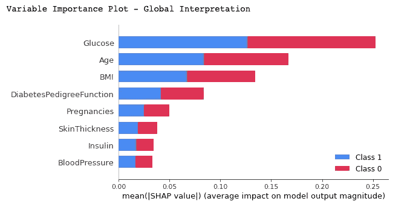
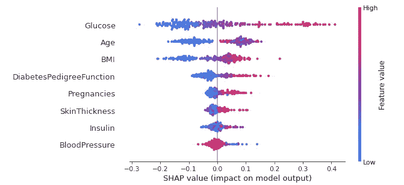
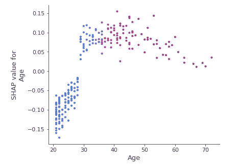
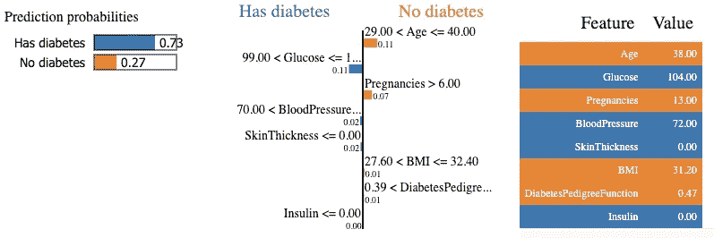

# 可解释的人工智能(XAI):莱姆和 SHAP，两个伟大的候选人来帮助你解释你的机器学习模型

> 原文：<https://towardsdatascience.com/explainable-ai-xai-lime-shap-two-great-candidates-to-help-you-explain-your-machine-learning-a95536a46c4e?source=collection_archive---------10----------------------->

## 如何使用两个代理工具来更好地理解模型的预测。

[医学家](https://unsplash.com/@medienstuermer)在 [Unsplash](https://unsplash.com/photos/aWf7mjwwJJo) 上拍摄的照片

# 介绍

作为数据科学家或机器学习实践者，将可解释层集成到您的机器学习模型中可以使它们值得信赖。它可以帮助决策者和其他利益相关者获得更多的可见性，并理解导致模型输出的决策的解释。

在本文中，我将带您了解两个代理模型，**莱姆**和 **SHAP** ，帮助您了解您的模型的决策过程。

# 模型结构

我们将使用来自 Kaggle 的[糖尿病数据集](https://www.kaggle.com/cjboat/diabetes2)。主要的焦点是可解释性，所以我们不会花太多时间去尝试花哨的模型。

# 模型可解释性

## ***SHAP***

它代表沙普利加法解释。该方法旨在通过计算每个特征对预测的贡献来解释实例/观察的预测。

SHAP 有许多模型解释的可视化工具，但是我们将讨论其中几个，每一个都有其特殊性。

1.  **带汇总图的变量重要性**

图 1:显示重要变量的汇总图

**观察:**以下是我们从之前的剧情中可以推断出来的:

*   它显示了重要特性的列表，从最重要到最不重要(从上到下)。
*   特征分析
*   所有的特征似乎对被诊断为糖尿病(标签=1)或未被诊断为糖尿病(标签= 0)的两个类别都有同等的贡献，因为颜色占据了矩形的 50%。
*   根据该模型，葡萄糖是最具有预测能力的一种。
*   年龄是第二个最有预测力的特征。
*   怀孕是最有预测力的第五个特征。

**2。特定标签上的汇总图**

图 2:标签= 1 上的深度摘要图

**观察:**对于分类问题，每个可能的标签都存在 SHAP 值。在我们的例子中，我们决定得到预测值 1(真)。以下是从图中可以推断出的主要特征:

*   对于****重要特性*** ，同样从变量重要性情节进行分析。*
*   *每个点代表单个数据实例的特征值。*
*   *颜色表明该特征是高值(红色)还是低值(蓝色)。*
*   *X 轴显示对预测输出的积极或消极贡献*

*当我们将这些分析应用于特征时，我们得到以下解释:*

*   ***对于葡萄糖:**我们看到大多数高值(红点)对预测输出有正贡献(在 X 轴上为正)。换句话说，如果单个数据实例的葡萄糖量很高，其具有阳性结果(被诊断为糖尿病)的可能性会大大增加，而低量(蓝点)会降低(负 X 轴值)被诊断为糖尿病的可能性。*
*   ***对于年龄**:对年龄进行同样的分析。年龄越高，数据实例(患者)最有可能被诊断为糖尿病。另一方面，当涉及到未成年时，该模型似乎很混乱，因为我们可以在垂直线(X 轴=0)的每一侧观察到几乎相同数量的数据点。由于年龄特征对于分析来说似乎是令人困惑的，我们可以使用 ***依赖关系*** ***情节*** 来获得更细粒度的信息。*

***3。依赖图***

**

*图 3:年龄特征的**依赖** **图***

***观察:**从依赖关系图中，我们可以清楚地看到，30 岁以下的患者被诊断为糖尿病的风险较低，而 30 岁以上的患者被诊断为糖尿病的风险较高。*

## *石灰*

*它代表局部可解释模型不可知解释。 ***局部*** 方面意味着它用于解释机器学习模型的个体预测。*

***设置讲解人***

*使用两个非常简单的步骤来构建解释器:(1)导入模块，(2)使用训练值、特征和目标来适应解释器。*

****第 5 行*** :我用最容易理解的方式创建了两个标签，而不是 1 和 0。*

***单实例解释***

*这里，对来自测试数据的单个实例进行解释*

**

*图 3:单个实例的时间解释能力*

***观察:t** 该模型以 73%的置信度预测该特定患者患有糖尿病，并且解释了该预测，因为葡萄糖水平高于 99，血压高于 70。在右边，我们可以观察到真实特征对患者的价值。*

# *文章结尾*

*恭喜你！你刚刚学会了如何用 SHAP 和莱姆来解释你的机器学习模型。现在，您可以构建可信的模型，帮助决策者和其他利益相关者获得更多的可见性，并理解导致模型输出的决策的解释。本文只介绍了这些工具的一小部分，您可以在下面的附加资源中进一步分析。*

*在 YouTube 上关注我，了解更多互动会话！*

# *额外资源*

*[欢迎来到 SHAP 文档](https://shap.readthedocs.io/en/latest/index.html)*

*[本地可解释的模型不可知解释(lime)](https://lime-ml.readthedocs.io/en/latest/)*

*再见🏃🏾*