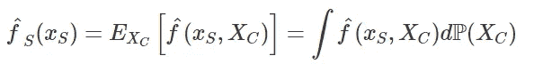
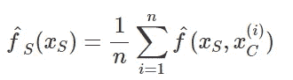
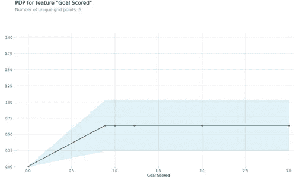
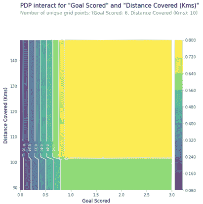

# 可解释的人工智能(XAI)方法第一部分——部分相关图

> 原文：<https://towardsdatascience.com/explainable-ai-xai-methods-part-1-partial-dependence-plot-pdp-349441901a3d?source=collection_archive---------4----------------------->

## 部分依赖情节的入门，它的优点和缺点，如何利用和解释它


来自[像素](https://www.pexels.com/ko-kr/photo/4050325/)的照片。归入“免版税”部分的照片。还贴着“免费使用”的标签。

# 可解释的机器学习(XAI)

可解释的机器学习(XAI)指的是努力确保人工智能程序在目的和工作方式上是透明的。[1]这是最近几年数据科学和人工智能领域最热门的关键词之一。这是可以理解的，因为许多 SOTA(最先进的)模型是黑盒，尽管它们具有顶级的预测能力和性能，但很难解释或说明。对于许多组织和公司来说，分类准确度提高几个百分点可能没有回答诸如“特征 A 如何影响结果？”这样的问题重要这就是为什么 XAI 一直受到更多的关注，因为它大大有助于决策和执行因果推理。

在接下来的一系列文章中，我将介绍目前在数据科学界广泛使用的各种 XAI 方法。我将介绍的第一种方法是部分相关图，简称 PDP。

# 部分相关图

部分依赖(PD)是一种*全局*和*模型不可知的* XAI 方法。全局方法对整个数据集给出了全面的解释，描述了特征在整个数据环境中对目标变量的影响。另一方面，局部方法描述了特征对观察水平的影响。模型不可知意味着该方法可以应用于任何算法或模型。

简而言之，PDP 显示了单个特征对黑盒模型预测值的边际效应或贡献[2]。对于更正式的定义，回归的部分相关函数可以定义为:



PDP 函数公式来自本书**可解释机器学习**第 8.1 章

上面的部分函数是通过计算训练数据的平均值来估计的，如下所示:



来自**可解释机器学习**第 8.1 章的 PDP 的部分函数估计公式

在上面的公式中，S 表示包含感兴趣的特征(即，我们想要了解对目标变量的影响的特征)的集合，C 表示包含不在集合 S 中的所有其他特征的集合

我们对分类变量有什么看法？这种情况更简单，因为我们只需要用分类变量中的每个类别替换所有数据实例，并对预测进行平均。例如，如果您有兴趣查看性别/性别的 PDP，那么您需要将性别/性别变量替换为“男性”类别，并对预测进行平均。计算“女性”类别的部分依赖性也是如此。

总的来说，PDP 很好，因为它以非常直接的方式显示了目标和特性之间的关系。例如，当应用于线性回归模型时，PDP 总是显示线性关系。[2]它还能够捕捉单调或更复杂的关系。

# 假设、限制和缺点

不幸的是，PDP 不是你在任何场合都可以挥舞的魔杖。它有一个重要的假设。所谓的**独立性假设**是 PD 图的最大问题。假设为其计算部分相关性的特征与其他特征不相关。

Christoph Molnar 的可解释机器学习书籍提到了这一假设

> “如果您计算的 PDP 的特征与其他特征不相关，则 PDP 完美地代表了该特征如何影响平均预测。在不相关的情况下，解释是清楚的:部分相关性图显示了当第 j 个特征改变时，数据集中的平均预测如何改变。

如果这个假设不成立，对情节的解释可能不太可靠。例如，为部分相关性图计算的平均值将包括非常不可能甚至不可能的数据点。[2]

这种方法还有三个额外的限制或问题。

首先，尽管可以计算，但两个以上特征的 PDP 很难绘制和解释。我个人认为，PDP 最多可以使用两个功能，超过这个数目我们就无法理解了。

第二，对于数据很少的区间内的值，PDP 可能不准确。因此，经常检查特征的分布是一种很好的做法，例如，通过直方图可视化它们。

第三，异质效应可能无法在图中捕捉到。[2]例如，如果某个特征根据不同的值区间与目标变量既有积极的关联又有消极的关联，那么这两种反作用力可能会相互抵消，误导用户总体边际效应为零。这会让用户误以为该特性对目标变量影响很小或没有影响。防止这种情况的一种方法是绘制个人条件期望(ICE)曲线(将在下一篇文章中讨论)和 PDP，以揭示异质效应。

# 履行

我们可以使用多个包和库来绘制 PDP。如果你用的是 R，pdp 有 **iml** 、 **pdp** 和 **DALEX** 等包。对于 Python 来说， **PDPBox** 包和 **sklearn.inspection** 模块中的**partialdependenciedisplay**函数是最好的。

让我们来看看 Kaggle 学习部分的[可解释的机器学习教程](https://www.kaggle.com/dansbecker/partial-plots)中的一个例子。[3]它使用了 PDPBox 软件包。

您首先阅读所有必要的库和包。

```
**import** numpy as np
**import** pandas as pd
**from** sklearn.model_selection **import** train_test_split
**from** sklearn.ensemble **import** RandomForestClassifier
**from** sklearn.tree **import** DecisionTreeClassifier
```

接下来，我们读入数据，将其分为训练和测试数据，并训练一个决策树分类器。

```
data = pd.read_csv('../input/fifa-2018-match-statistics/FIFA 2018 Statistics.csv')y = (data[‘Man of the Match’] == “Yes”) # Convert from string “Yes”/”No” to binaryfeature_names = [i for i in data.columns if data[i].dtype in [np.int64]]X = data[feature_names]train_X, val_X, train_y, val_y = train_test_split(X, y, random_state=1)tree_model = DecisionTreeClassifier(random_state=0, max_depth=5, min_samples_split=5).fit(train_X, train_y)
```

请记住，只有在模型被定型后，才能计算部分相关性。在上述决策树分类器被训练之后，我们读入我们的可视化库(matplotlib)以及用于绘制 PDP 的 pdpbox 包。

```
**from** matplotlib **import** pyplot as plt**from** pdpbox import pdp, get_dataset, info_plots# Create the data that we will plotpdp_goals = pdp.pdp_isolate(model=tree_model, dataset=val_X, model_features=feature_names, feature=’Goal Scored’)# plotpdp.pdp_plot(pdp_goals, ‘Goal Scored’)plt.show( )
```



XAI ka ggle 学习部分的 PDP 教程

来自 PDPBox 包的 PDP 图的好处是它还显示了置信区间(即上面图中的浅蓝色阴影)。

如果您想要绘制两个特性的 PDP，您可以使用 **pdp_interact** 和 **pdp_interact_plot** 功能。

```
# Similar to previous PDP plot except we use pdp_interact instead of pdp_isolate and pdp_interact_plot instead of pdp_isolate_plotfeatures_to_plot = [‘Goal Scored’, ‘Distance Covered (Kms)’]inter1 = pdp.pdp_interact(model=tree_model, dataset=val_X, model_features=feature_names, features=features_to_plot)pdp.pdp_interact_plot(pdp_interact_out=inter1, feature_names=features_to_plot, plot_type=’contour’)plt.show( )
```



2D PDP 从 XAI 教程在 Kaggle 的学习部分

如果有兴趣使用 Sklearn 中的另一个 Python 库(sklearn.inspection)，可以参考[文档](https://scikit-learn.org/stable/modules/partial_dependence.html)。[4]

感谢您阅读我的帖子！下一个 XAI 方法是冰曲线。

# ***参考文献***

[1] [可解释的人工智能(XAI)](https://www.techopedia.com/definition/33240/explainable-artificial-intelligence-xai) (2019)，Technopedia

[2] C .莫尔纳尔*、*、[可解释机器学习](https://christophm.github.io/interpretable-ml-book/pdp.html) (2020)

[3] D .贝克尔，[部分情节](https://www.kaggle.com/dansbecker/partial-plots)，卡格尔学

[4] [部分依赖](https://scikit-learn.org/stable/modules/partial_dependence.html)，Sklearn 文档