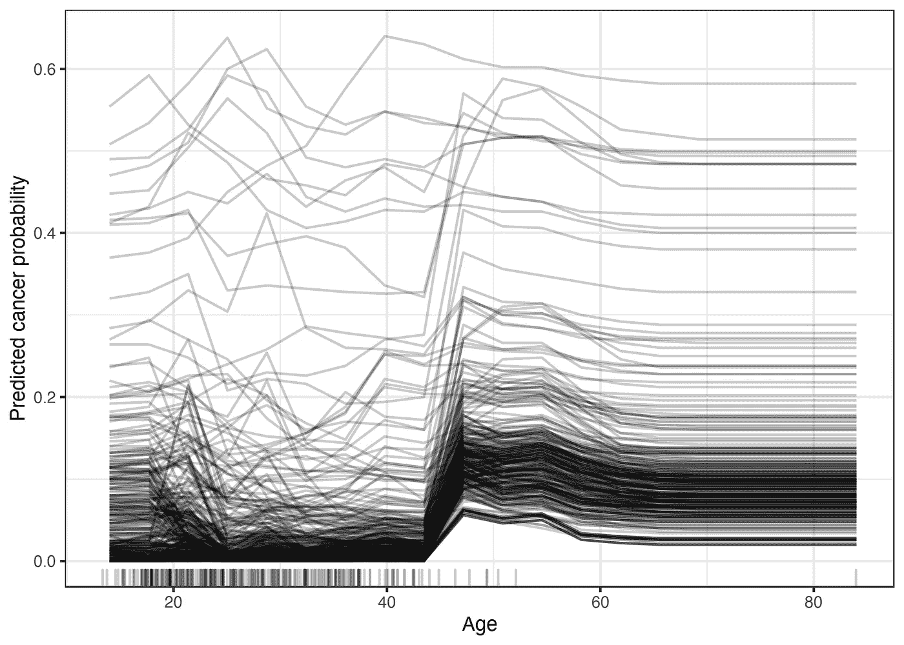
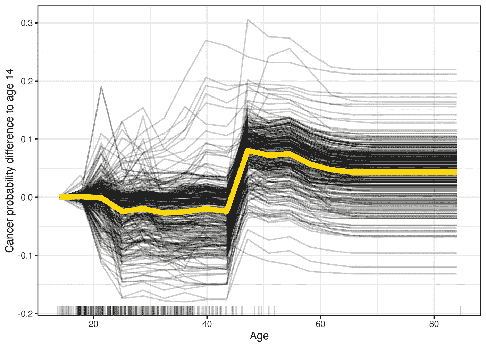

# 可解释的人工智能(XAI)方法第二部分——个体条件期望(ICE)曲线

> 原文：<https://towardsdatascience.com/explainable-ai-xai-methods-part-2-individual-conditional-expectation-ice-curves-8fe76919aab7?source=collection_archive---------18----------------------->

## 关于个人条件期望(ICE)曲线的教程，它的优点和缺点，它与 PDP 有何不同，以及如何使用和解释它


免费使用来自[像素](https://www.pexels.com/ko-kr/photo/5475760/)的照片。

# 回顾以前的帖子

可解释的机器学习(XAI)指的是努力确保人工智能程序在目的和工作方式上是透明的。[1]这是我打算写的 XAI 系列文章中的第二篇。

在我之前的[帖子](/explainable-ai-xai-methods-part-1-partial-dependence-plot-pdp-349441901a3d)中，我介绍了部分相关(PD)和部分相关图(PDP)的概念，这是一种使用 PD 值来显示特征对目标变量的边际平均影响的可视化方法。我建议在继续之前先看一下[的帖子](/explainable-ai-xai-methods-part-1-partial-dependence-plot-pdp-349441901a3d)！

在这篇文章中，我将讨论什么是个体条件期望(ICE)曲线，它的优点和缺点是什么，以及如何解释和使用它来提高模型的可解释性。

# 个体条件期望(ICE)曲线/图

在我之前的文章中，我解释过部分依赖(PD)是一种*全局*和*模型不可知的* XAI 方法。回顾并直接引用我之前的帖子:

> **全局**方法给出了对整个数据集的全面解释，描述了在整个数据环境中特征对目标变量的影响。**另一方面，局部**方法描述特征对观察水平的影响。**模型不可知**意味着该方法可以应用于任何算法或模型。[3]

ICE 还是一种模型不可知的方法，可以应用于任何模型。事实上，它与 PD 的概念基本相同，但不同之处在于它显示了每个实例的特征**的边际效应，而不是像部分相关图(PDP)那样计算整体数据环境中的平均效应。因此，它可以理解为单个数据实例的 PDP 的等价物。从视觉上看，ICE 图分别显示了每个实例的预测对某个特征的依赖关系，结果是每个实例一条线。[2]**

# **不同类型的冰地块**

> **居中的冰剧情**

在典型的冰图中，通常很难跨不同的冰线(针对不同的数据实例)进行比较，因为每个实例可能从不同的预测值开始。中心冰图，简称 c-ICE，是解决这个问题的冰图的变体。Christoph Molnar 的可解释机器学习 boo 建议将曲线固定在特征的低端是一个不错的选择。[2]



来自[可解释机器学习](https://christophm.github.io/interpretable-ml-book/ice.html)的典型 ICE 图示例，与下面的 c-ICE 图相当



来自[的 c-ICE 情节示例可解释机器学习](https://christophm.github.io/interpretable-ml-book/ice.html)

从可解释的机器学习书中的两个冰图示例(典型的冰图与 c-ICE 图)中可以看出，c-ICE 图在 14 岁时将各个冰线固定为 0。与第一个典型冰图相反，这使得用户更容易在不同的冰线上进行比较。我们可以看到，在 c-ICE 图中，对大多数女性的预测保持不变，直到 45 岁，与 14 岁相比，预测的概率增加。[2]

> **衍生冰剧情**

冰图的这个变体的名字使它不言自明。导数冰图，简称 d-ICE 图，是显示原始冰图的导数值的冰图。这有助于查看是否存在任何交互，因为对于所有数据实例，各自的导数应该是相同的。否则，这将意味着某种相互作用的存在。然而，Christoph Molnar 的可解释机器学习书籍认为，d-ICE 图需要很长时间来计算，因此相当不实用。[2]

# 优势

与 PDP 类似，ICE 曲线为用户提供了直观的见解。每条线代表单独的实例，因此允许我们观察特性的边际效应如何改变每个单独实例的特性的不同值。

ICE 图的另一个主要优势是，它使我们能够捕捉到 ***异构关系*** ，这在仅查看 PDP 时是不可能做到的。异质关系意味着一个特征对目标变量的影响具有不同的方向性，这取决于特征值的不同区间。

例如，如果我们正在建立一个预测贷款申请批准的模型，部分依赖图可能会告诉我们，年龄的边际平均效应对贷款申请批准是积极的(即，如果你越老，你的贷款申请越有可能被批准)。然而，冰图可能表明存在贷款申请批准概率低的个人，无论其年龄如何(即冰线是平的，斜率接近或等于 0)。从贷款机构的角度来看，这些个人可能是其他条件(即收入)不足以获得贷款批准的申请人。如本例所示，PDP 中的“平均”效应可能会掩盖更多因人而异的局部效应。

# 不足之处

记得我之前的[帖子](/explainable-ai-xai-methods-part-1-partial-dependence-plot-pdp-349441901a3d)中提到，PDP 的主要假设是感兴趣的**特性不应该与其他特性**相关联。否则，图中的一些值将没有意义或变得无效。冰原也有同样的问题。

冰情节的另一个问题是，如果太多的冰线在一张画布上，情节可能**难以消化。解决这个问题的方法是省略一些冰线，只画其中的一部分。你可以使用不同的标准或条件来决定保留哪些冰线，放弃哪些冰线。例如，在来自 H2O.ai 团队的本教程[笔记本](https://nbviewer.jupyter.org/github/jphall663/interpretable_machine_learning_with_python/blob/master/xgboost_pdp_ice.ipynb)中，它为特征值的每个十分位数绘制了冰线，以防止线的混乱。我强烈推荐查看那本[笔记本](https://nbviewer.jupyter.org/github/jphall663/interpretable_machine_learning_with_python/blob/master/xgboost_pdp_ice.ipynb)，因为它也指导你如何在不使用任何开源库的情况下从头实现 PDP 和 ICE 图。这将帮助你更好地掌握 PDP 和 ICE 情节背后的理论以及它们实际上是如何工作的！**

# 履行

我们可以使用多个包和库来绘制 ICE 图。如果你用的是 R，有包包括 **iml** 、 **ICEbox** 、 **pdp** 、 **condvis** 。对于 Python 来说， **sklearn.inspection** 模块中的**partialdependenciedisplay**函数、 **PyCEBox** 包和 **H2O** 包的 ice_plot 函数可用。

让我们来看看 Sklearn 文档中的一个例子。[4]

您首先阅读所有必要的库和包。

```
**import** numpy as np
**import** pandas as pd
**from** **sklearn.datasets** **import** make_hastie_10_2
**from** **sklearn.ensemble** **import** GradientBoostingClassifier
**from** **sklearn.inspection** **import** PartialDependenceDisplay
```

接下来，我们读入作为 Sklearn 数据集一部分的可用数据。

```
# Read in data as part of the Sklearn datasets offered
X, y = make_hastie_10_2(random_state=0) # set a seed with random_stateclf = GradientBoostingClassifier(n_estimators=100, learning_rate=1.0, max_depth=1, random_state=0).fit(X, y)features = [0, 1]PartialDependenceDisplay.from_estimator(clf, X, features, kind='**individual**')
```

与 PDP 类似，您只能在模型经过训练后绘制 ICE 曲线。

还有，注意*参数“种类”*。你会记得 **PartialDependenceDisplay** 模块是我们在我之前的[帖子](/explainable-ai-xai-methods-part-1-partial-dependence-plot-pdp-349441901a3d)中用来计算部分依赖(PD)的同一个模块。这里唯一的区别是我们在计算 PD 时没有指定的新参数“kind”。我们还可以将参数指定为等于“both ”,这将让我们同时在一个画布上绘制 PDP 和 ICE 曲线。这将是有意义的，因为我们可以同时观察边际平均效应和边际个体效应！

```
PartialDependenceDisplay.from_estimator(clf, X, features, kind='**both**')
```

其他一些可以用来在 Python 中绘制 ICE 曲线的包有 [PyCEBox](https://github.com/AustinRochford/PyCEbox/blob/master/notebooks/PyCEBox%20Tutorial.ipynb) 和著名的 AutoML 和大数据包 [H2O](https://h2o-release.s3.amazonaws.com/h2o/rel-zermelo/5/docs-website/h2o-docs/explain.html) (由 H2O.ai 团队制作)。[6, 7]

感谢您阅读我的帖子！下一个 XAI 方法是 ALE 图。敬请期待！

如果你感兴趣，请在各个页面上关注我！所有相关链接都汇集在这个[页面](http://junymusic.ctcin.bio/)！

# 参考

[1] [可解释的人工智能(XAI)](https://www.techopedia.com/definition/33240/explainable-artificial-intelligence-xai) (2019)，Technopedia

[2] C .莫尔纳尔*，*，[可解释机器学习](https://christophm.github.io/interpretable-ml-book/ice.html) (2020)

[3] S. Kim，[《可解释的人工智能(XAI)方法第一部分——部分相关图(PDP)](/explainable-ai-xai-methods-part-1-partial-dependence-plot-pdp-349441901a3d) (2021)，走向数据科学

[4] [部分依赖](https://scikit-learn.org/stable/modules/partial_dependence.html)，Sklearn 文档

[5] P. Hall，H2O.ai 团队，[可解释 _ 机器 _ 学习 _ 用 _ python>xgboost _ PDP _ ice . ipynb](https://nbviewer.org/github/jphall663/interpretable_machine_learning_with_python/blob/master/xgboost_pdp_ice.ipynb)，Jupyter 笔记本

[6] [PyCEBox 教程](https://github.com/AustinRochford/PyCEbox/blob/master/notebooks/PyCEBox%20Tutorial.ipynb)，PyCEBox

[7] [H2O 机器学习可解释性](https://docs.h2o.ai/h2o/latest-stable/h2o-docs/explain.html)，H2O.ai