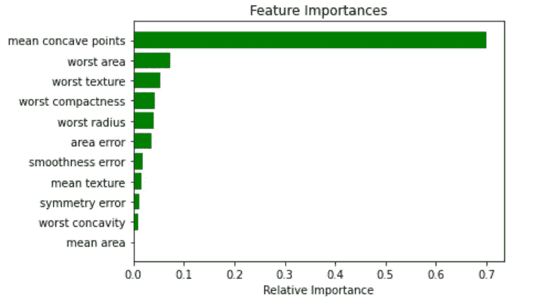
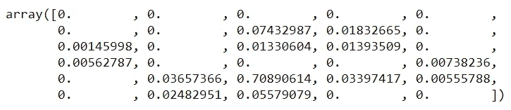
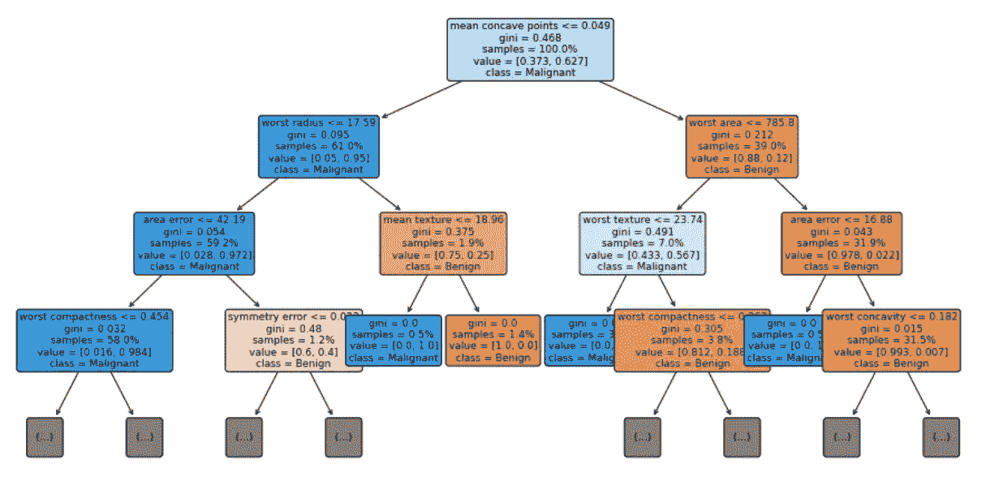
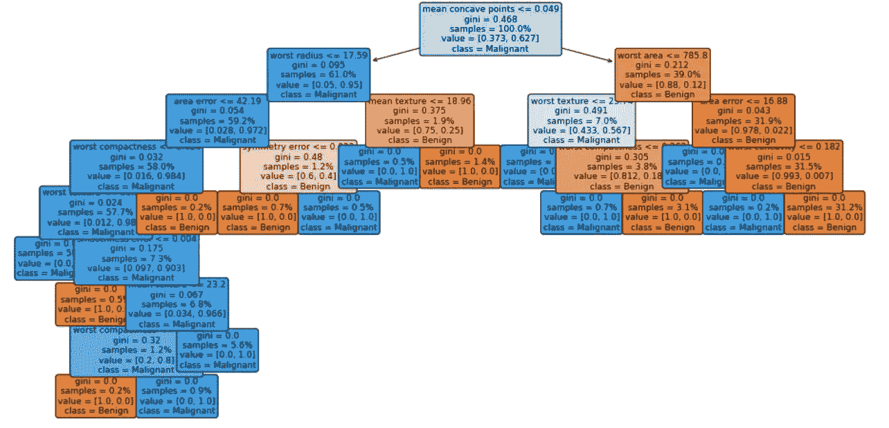
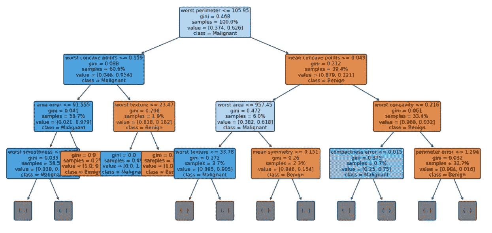

# 用决策树解释人工智能(XAI)

> 原文：<https://towardsdatascience.com/explainable-ai-xai-with-a-decision-tree-960d60b240bd?source=collection_archive---------18----------------------->

## 决策树可视化 XAI 分析实用指南


图片由 [Jplenio](https://pixabay.com/users/jplenio-7645255/) Sager 来自 [Pixabay](https://pixabay.com/?utm_source=link-attribution&amp;utm_medium=referral&amp;utm_campaign=image&amp;utm_content=2755908)

人工智能，学习模型随着时间的推移变得越来越复杂，很难直观地分析它们。人们经常听说机器学习模型是“黑匣子”，从某种意义上说，它们可以做出很好的预测，但我们无法理解这些预测背后的逻辑。这种说法是正确的，因为大多数数据科学家发现很难从模型中提取洞察力。然而，我们可以使用一些工具从复杂的机器学习模型中提取洞察力。

本指南是关于如何使用和解释 sklearn.tree.plot_tree 模型可解释性的实践指导。决策树本身是一种可解释的机器学习算法，广泛用于线性和非线性模型的特征重要性(在本文的全局解释部分中解释)。这是一个相对简单的模型，很容易通过可视化树来解释。

```
import numpy as np
from sklearn import tree
from sklearn.tree import DecisionTreeClassifier
import matplotlib.pylab as plt
from sklearn import datasets, ensemble, model_selection
from sklearn.ensemble import RandomForestClassifier
```

在这个例子中，我们将使用来自 sklearn 数据集的乳腺癌例子。这是一个简单的二元(恶性、良性)分类问题[【1】](https://scikit-learn.org/stable/datasets/toy_dataset.html#breast-cancer-dataset)。从乳腺肿块的细针抽吸(FNA)的数字化图像中计算特征。它们描述了图像中出现的细胞核的特征。

```
# import data and split
cancer = datasets.load_breast_cancer()
X_train, X_test, y_train, y_test = model_selection.train_test_split(cancer.data, cancer.target, random_state=0)
```

将数据集拆分为定型和测试数据集后，使用 tree。DecisionTreeClassifier()来构建分类模型。

```
# model and fit
cls_t = tree.DecisionTreeClassifier()
cls_t.fit(X_train, y_train);
```

现在，为了对模型有一个基本的印象，我推荐可视化特性的重要性。特征重要性被计算为通过到达该节点[【2】](/feature-selection-evaluation-for-automated-ai-e67f488098d8)的概率加权的节点杂质的减少。节点概率可以通过到达节点的样本数除以样本总数来计算。值越高，特性越重要。最重要的功能在树中的位置会更高。单个特征可以用于树的不同分支，那么特征重要性就是它在减少杂质方面的总贡献[【3】](/explaining-feature-importance-by-example-of-a-random-forest-d9166011959e)。

```
importances = cls_t.feature_importances_
indices = np.argsort(importances)
features = cancer.feature_names
plt.title('Feature Importances')
j = 11# top j importance
plt.barh(range(j), importances[indices][len(indices)-j:], color='g', align='center')
plt.yticks(range(j), [features[i] for i in indices[len(indices)-j:]])
plt.xlabel('Relative Importance')
plt.show()
```



作者图片

```
cls_t.feature_importances_
```

在这种情况下，只使用了前 13 个特性。其他功能未被使用。他们的重要性为零。



让我们设想决策树的前三层，max_depth=3。

```
# visualization
fig = plt.figure(figsize=(16, 8))
vis = tree.plot_tree(cls_t, feature_names = cancer.feature_names, class_names = ['Benign', 'Malignant'], max_depth=3, fontsize=9, proportion=True, filled=True, rounded=True)
```



作者使用 max_depth=3 图像的决策树可视化

## 关于这个模型，我们能了解到什么？

首先，我们可以看到每个决策层所使用的特性的名称和条件的拆分值。如果一个样本满足条件，那么它去左边的分支，否则，它去右边。

每个节点中的 samples 行显示了我们在当前节点中检查的样本数。如果 proportion=True，则样本行中的数字以总数据集的%为单位。

每个节点中的值线告诉我们该节点有多少样本属于每个类，当比例=假时，按顺序排列，当比例=真时，按比例排列。这就是为什么在每个节点中，value 中的数字加起来等于 value 中显示的数字(比例=假，比例=真)。



作者使用 max_depth=8 图像的决策树可视化

在类行中，我们可以看到节点的分类结果。

基尼系数是一个量化节点纯度的指标，类似于熵。大于零的基尼系数意味着包含在该节点内的样本属于不同的类别。在上图中，树叶的基尼系数为零，这意味着每片树叶中的样本属于一个类别。注意，当纯度高时，节点/叶具有较深的颜色。

## 决策树代理模型

解释“黑盒”模型的全局行为的一种流行方法是应用全局代理模型。全局代理模型是一种可解释的模型，它被训练成近似黑盒模型的预测。我们可以通过解释代理模型得出关于黑箱模型的结论。用更多的机器学习来解决机器学习的可解释性！[【4】](https://christophm.github.io/interpretable-ml-book/global.html)

训练代理模型是一种模型不可知的方法，因为它不需要关于黑盒模型内部工作的任何信息，只需要访问数据和预测函数。这个想法是，我们采取我们的“黑箱”模型，并使用它创建预测。然后，我们根据“黑盒”模型和原始特征产生的预测训练一个透明模型。请注意，我们需要跟踪代理模型在多大程度上接近“黑盒”模型，但这通常不容易确定。

随机森林分类器是一种常用的模型，它解决了决策树模型容易出现的过拟合问题。因此，在测试集上具有更好的准确性，但它是

```
clf = RandomForestClassifier(random_state=42, n_estimators=50, n_jobs=-1)
clf.fit(X_train, y_train);
```

使用您的模型(在本例中为 RandomForestClassifier)创建预测

```
predictions = clf.predict(X_train)
```

然后使用预测来使数据适合决策树分类器。

```
cls_t = tree.DecisionTreeClassifier()
cls_t.fit(X_train, predictions);
```

想象一下。

```
# visualization
fig = plt.figure(figsize=(16, 8))
vis = tree.plot_tree(cls_t, feature_names = cancer.feature_names, class_names = ['Benign', 'Malignant'], max_depth=3, fontsize=9, proportion=True, filled=True, rounded=True)
```



作者图片

就是这样！即使我们不容易理解森林中数百棵树的样子，我们也可以建立一个浅显的决策树来代替，并有希望了解森林是如何运作的。

最后，测量代理模型复制黑盒模型预测的能力。衡量代理复制黑盒模型的好坏的一种方法是 R 平方度量。

```
cls_t.score(X_train, predictions)
```

## **提示**

如果您正在使用 pycharm 创建模型，您可以使用 pickle 将其导出到 jupyter notebook。在出口方面:

```
import pickle
# dump information to that file
with open('model','wb') as outfile:
    pickle.dump(cls_t, outfile)
```

在进口方面:

```
import pickle
# load information from that file
with open('model','rb') as inputfile:
    modell = pickle.load(inputfile)
```

## 摘要

解释“黑盒”机器学习模型对于它们成功应用于许多现实世界问题非常重要。sklearn.tree.plot_tree 是一个可视化工具，可以帮助我们理解模型。或者换句话说，机器(模型)从特征中学到了什么？它符合我们的期望吗？我们能通过使用关于问题的领域知识添加更复杂的功能来帮助机器学习吗？使用决策树可视化可以帮助我们直观地评估模型的正确性，甚至可能改进它。本帖中的代码可以在[这里](https://github.com/Iditc/Posts-on-Medium/blob/main/Explainable%20AI/Explainable%20AI%20(XAI)%20with%20a%20Decision%20Tree.ipynb)找到。