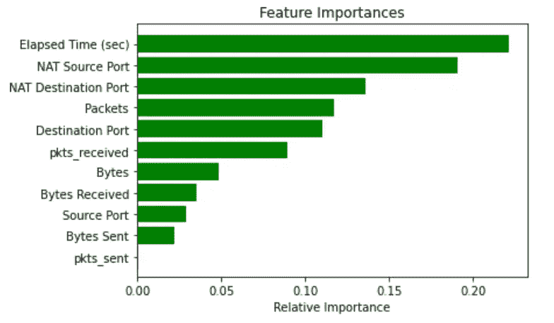
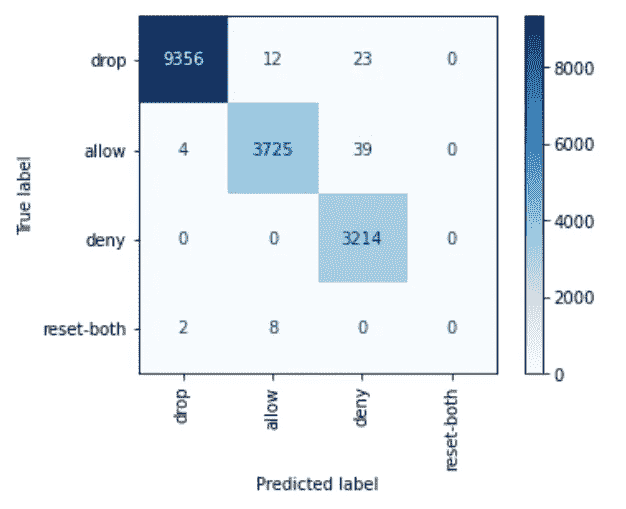
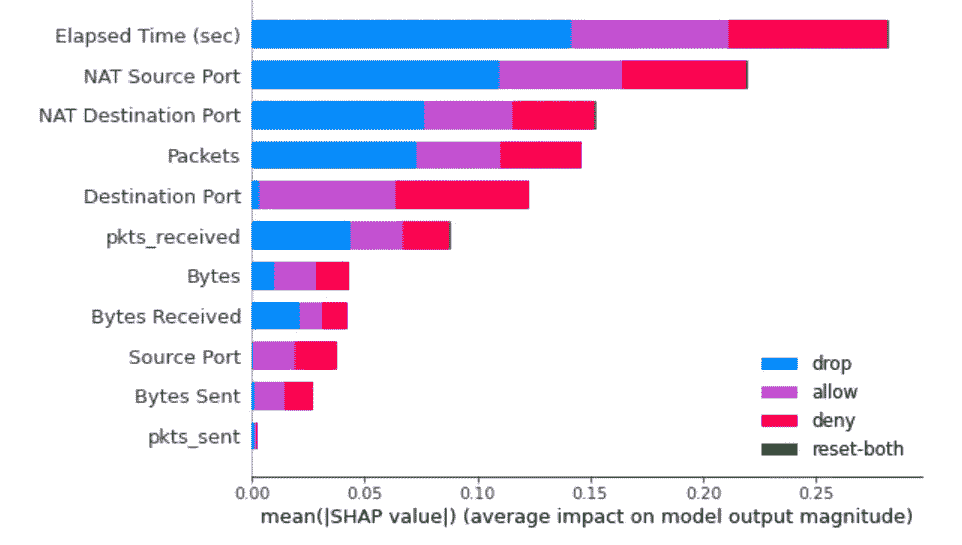
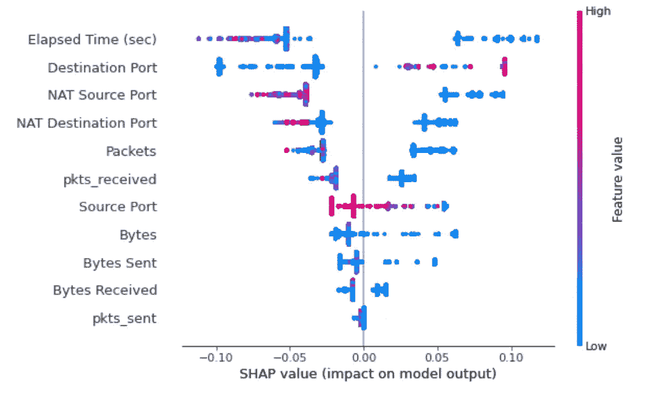
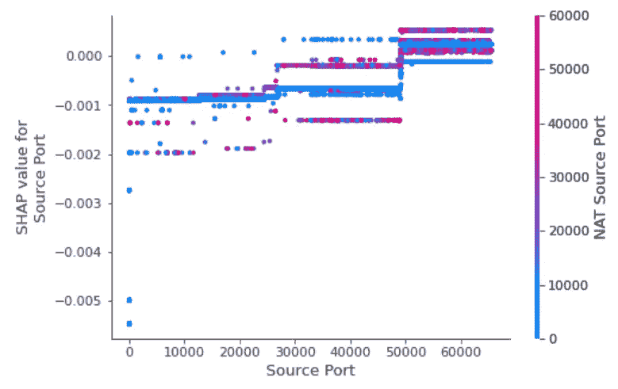
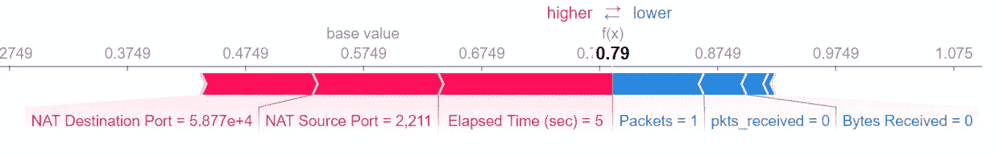
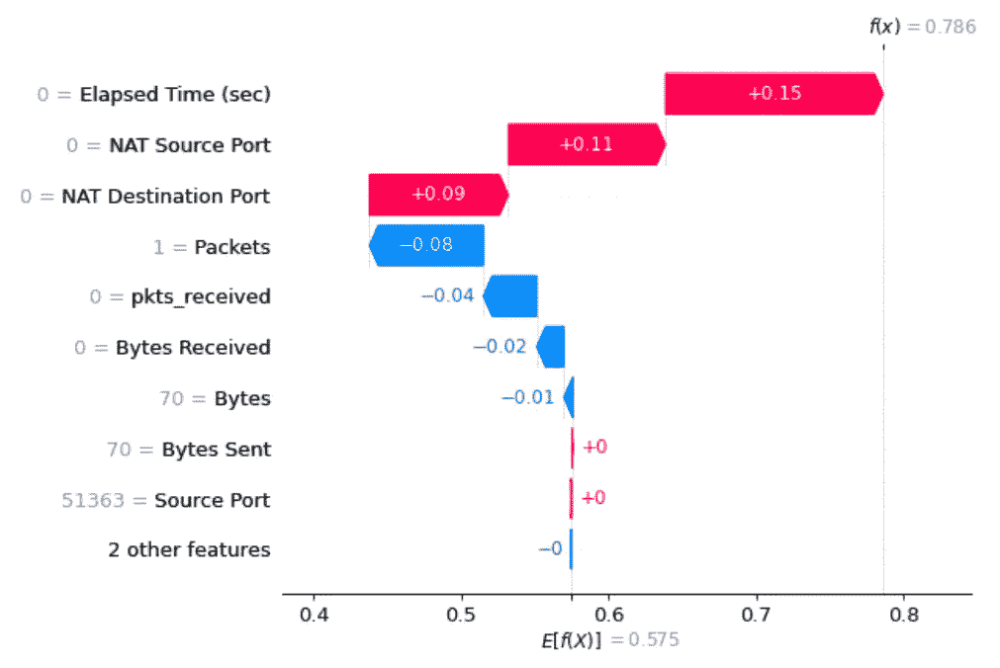

# 可解释的人工智能(XAI)与 SHAP-多类分类问题

> 原文：<https://towardsdatascience.com/explainable-ai-xai-with-shap-multi-class-classification-problem-64dd30f97cea?source=collection_archive---------3----------------------->

## 多类分类问题的 SHAP XAI 分析实用指南


图片由 [Pixabay](https://www.pexels.com/photo/abstract-art-circle-clockwork-414579/) Sager 来自 [Pixabay](https://pixabay.com/?utm_source=link-attribution&amp;utm_medium=referral&amp;utm_campaign=image&amp;utm_content=2755908)

模型可解释性成为机器学习管道的基本部分。将机器学习模型作为“黑盒”不再是一个选项。幸运的是，有一些分析工具，如 lime、ExplainerDashboard、Shapash、Dalex 等等，正在迅速发展，变得越来越流行。在之前的帖子中，我们解释了如何使用 [SHAP 解决回归问题](/explainable-ai-xai-with-shap-regression-problem-b2d63fdca670)。本指南提供了一个实际示例，说明如何使用和解释开源 python 包 SHAP 来进行多类分类问题中的 XAI 分析，并使用它来改进模型。

Lundberg 和 Lee (2016)的 SHAP(Shapley Additive explaints)是一种解释个体预测的方法，基于博弈理论上的最优 Shapley 值[【1】](https://christophm.github.io/interpretable-ml-book/shap.html#shap-feature-importance)。计算 Shapley 值以获得特征贡献在计算上是昂贵的。有两种方法可以近似 SHAP 值以提高计算效率:KernelSHAP、TreeSHAP(仅适用于基于树的模型)。

SHAP 提供基于 Shapley 值集合的全球和局部解释方法。在本指南中，我们将使用 Kaggle 数据集[【2】](https://www.kaggle.com/tunguz/internet-firewall-data-set)中的互联网防火墙数据集示例，展示多类分类问题的一些 SHAP 输出图。

```
# load the csv file as a data frame
df = pd.read_csv('log2.csv')
y = df.Action.copy()
X = df.drop('Action',axis=1)
```

像往常一样创建模型并进行拟合。

```
X_train, X_test, y_train, y_test = model_selection.train_test_split(X, y, random_state=0)cls = RandomForestClassifier(max_depth=2, random_state=0)
cls.fit(X_train, y_train)
```

现在，为了对模型有一个基本的印象，我推荐查看特性重要性和混淆矩阵。为了理解我们在特征重要性方面所处的位置，我使用了 scikit-learn 来计算每棵树内的杂质减少量[【3】](https://scikit-learn.org/stable/auto_examples/ensemble/plot_forest_importances.html)。

```
֫importances = cls.feature_importances_
indices = np.argsort(importances)
features = df.columns
plt.title('Feature Importances')
plt.barh(range(len(indices)), importances[indices], color='g', align='center')
plt.yticks(range(len(indices)), [features[i] for i in indices])
plt.xlabel('Relative Importance')
plt.show()
```



作者图片

稍后，我们可以将这些结果与通过 Shapley 值计算的特征重要性进行比较。

# 混淆矩阵

混淆矩阵是一种可视化模型性能的方法。更重要的是，我们可以很容易地看到模型失败的确切位置。

```
class_names = ['drop', 'allow', 'deny', 'reset-both']
disp = plot_confusion_matrix(cls, X_test, y_test, display_labels=class_names, cmap=plt.cm.Blues, xticks_rotation='vertical')
```



作者图片

模型无法从类 reset-both 中检测到任何实例。原因是一个不平衡的数据集，提供了很少数量的重置示例，这两个类都可以从中学习。

```
y.value_counts()
allow         37640
deny          14987
drop          12851
reset-both       54
Name: Action, dtype: int64
```

# SHAP 汇总图

模型输出的 SHAP 值解释了要素如何影响模型的输出。

```
# compute SHAP values
explainer = shap.TreeExplainer(cls)
shap_values = explainer.shap_values(X)
```

现在我们可以绘制相关的图来帮助我们分析模型。

```
shap.summary_plot(shap_values, X.values, plot_type="bar", class_names= class_names, feature_names = X.columns)
```

在此图中，叠加了要素对类的影响，以创建要素重要性图。因此，如果您创建要素是为了将某个特定的类与其他类区分开来，那么这就是您可以看到它的图。换句话说，多类分类的摘要图可以向您显示机器从特征中学习到了什么。

在下面的例子中，我们可以看到类 drop 很少使用 pkts_sent、Source Port 和 Bytes Sent 特性。我们还可以看到，类 allow 和 deny 同等地使用相同的特性。这就是它们之间的混淆程度相对较高的原因。为了更好地区分允许类和拒绝类，需要生成专门用于这些类的新功能。



还可以看到特定类的 summary_plot。

```
shap.summary_plot(shap_values[1], X.values, feature_names = X.columns)
```



作者图片

摘要图结合了特征重要性和特征效果。摘要图上的每个点都是一个特征和一个实例的 Shapley 值。y 轴上的位置由特征决定，x 轴上的位置由 Shapley 值决定。可以看到，最不重要的特性 pkts_sent 具有较低的 Shapley 值。颜色代表从低到高的特性值。重叠点在 y 轴方向上抖动，因此我们可以了解每个要素的 Shapley 值的分布情况。这些功能根据其重要性进行排序。

在汇总图中，我们看到了特性值和对预测的影响之间关系的初步迹象。但是为了看到这种关系的确切形式，我们必须看看 SHAP 依赖图。

# SHAP 依赖图

部分依赖图(短 PDP 或 PD 图)显示了一个或两个特征对机器学习模型的预测结果的边际效应(j . h . Friedman 2001[【3】](https://statweb.stanford.edu/~jhf/ftp/trebst.pdf))。部分相关性图可以显示目标和特征之间的关系是线性的、单调的还是更复杂的。

部分相关图是一种全局方法:该方法考虑所有实例，并给出一个关于特征与预测结果的全局关系的陈述。PDP 假设第一特征与第二特征不相关。如果违反了这一假设，为部分相关图计算的平均值将包括非常不可能甚至不可能的数据点。

依赖图是一种散点图，显示单个功能对模型所做预测的影响。在这个例子中，当每个住所的平均房间数高于 6 时，房产价值显著增加。

*   每个点都是数据集中的一个预测(行)。
*   x 轴是数据集中的实际值。
*   y 轴是该要素的 SHAP 值，表示知道该要素的值会在多大程度上改变该样本预测的模型输出。

该颜色对应于可能与我们正在绘制的特征有交互作用的第二个特征(默认情况下，该第二个特征被自动选择)。如果另一个特征和我们正在绘制的特征之间存在交互作用，它将显示为明显的垂直着色图案。

```
֫# If we pass a numpy array instead of a data frame then we
# need pass the feature names in separately
shap.dependence_plot(0, shap_values[0], X.values, feature_names=X.columns)
```



作者图片

在上面的示例中，我们可以看到功能(源端口和 NAT 源端口)之间交互的清晰垂直彩色图案。

# SHAP 力图

力图给了我们单一模型预测的可解释性。在该图中，我们可以看到特征如何影响特定观察的模型预测。用于错误分析或对特定案例的深入理解非常方便。

```
i=8
shap.force_plot(explainer.expected_value[0], shap_values[0][i], X.values[i], feature_names = X.columns)
```



从这个情节我们可以看出:

1.  模型预测 _proba 值:0.79
2.  基本值:这是在我们不知道当前实例的任何特性的情况下预测的值。基本值是模型输出在训练数据集上的平均值(代码中的 explainer.expected_value)。在本例中，基值= 0.5749
3.  绘图箭头上的数字是该实例的特征值。运行时间(秒)=5，数据包= 1
4.  红色表示将模型得分推高的要素，蓝色表示将得分推低的要素。
5.  箭头越大，要素对输出的影响越大。影响的减少或增加量可以在 x 轴上看到。
6.  5 秒的运行时间增加了该类的属性 allow。包 1，减少属性值。

# SHAP 瀑布图

瀑布图是单实例预测的另一个局部分析图。让我们以 8 号实例为例:

```
row = 8
shap.waterfall_plot(shap.Explanation(values=shap_values[0][row], 
                                              base_values=explainer.expected_value[0], data=X_test.iloc[row],  
                                         feature_names=X_test.columns.tolist()))
```



作者图片

1.  *f(x)* 为模型 predict_proba 值:0.79。
2.  *E[f(x)]是*基值= 0.5749。
3.  左侧是特征值，箭头表示特征对预测的贡献。
4.  每一行显示了每个特征的正(红色)或负(蓝色)贡献如何将值从背景数据集上的预期模型输出移动到本次预测的模型输出[【2】](https://shap.readthedocs.io/en/latest/example_notebooks/api_examples/plots/waterfall.html)。

# 摘要

SHAP 框架已被证明是机器学习模型解释领域的一个重要进步。SHAP 结合了几种现有的方法，创造了一种直观的，理论上合理的方法来解释任何模型的预测。SHAP 值量化了特征对预测[【6】](/introducing-shap-decision-plots-52ed3b4a1cba)的影响的大小和方向(正或负)。我相信 XAI 分析与 SHAP 和其他工具应该是机器学习管道的一个组成部分。本帖的代码可以在[这里](https://github.com/Iditc/Posts-on-Medium/blob/main/Explainable%20AI/Explainable%20AI%20(XAI)%20with%20SHAP_MultiClass%20Classification%20Problem.ipynb)找到。