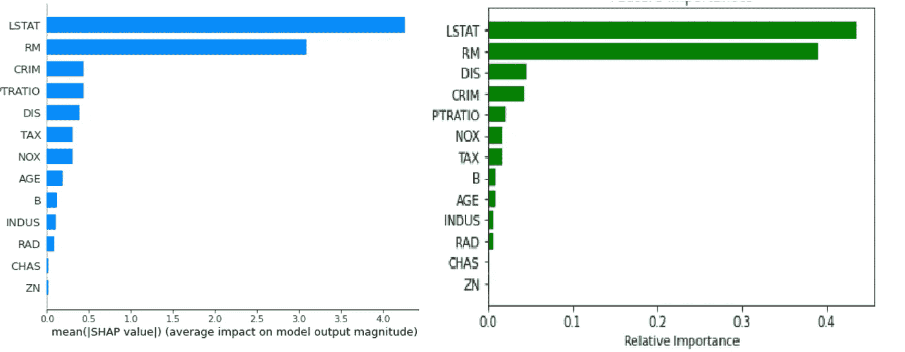
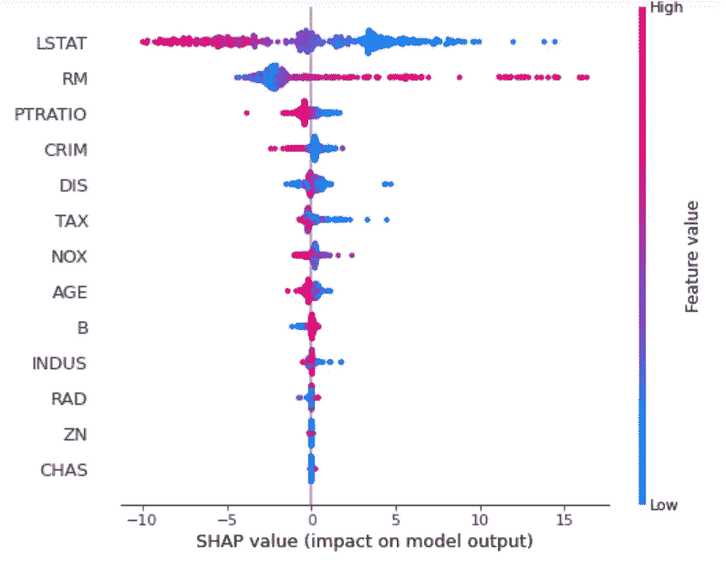
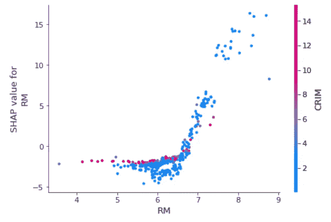
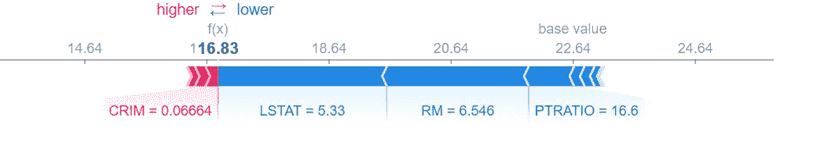
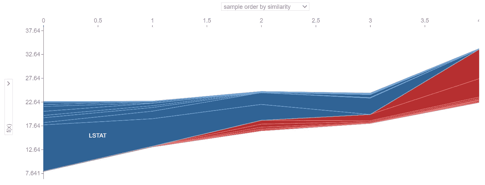
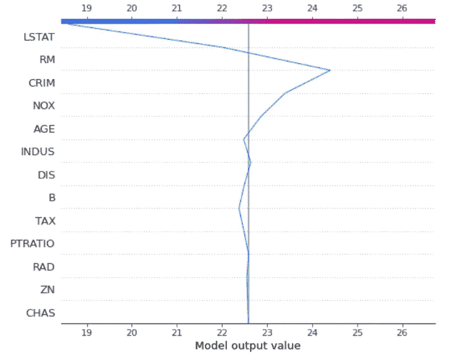
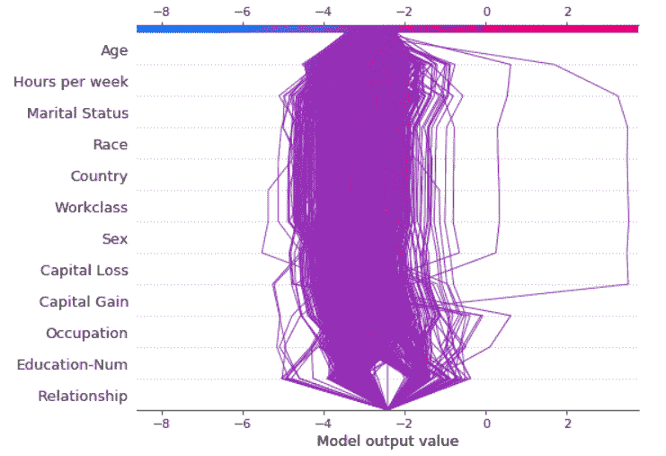

# 可解释人工智能(XAI)与 SHAP 回归问题

> 原文：<https://towardsdatascience.com/explainable-ai-xai-with-shap-regression-problem-b2d63fdca670?source=collection_archive---------3----------------------->

## 回归问题的 SHAP XAI 分析实用指南


图片由[创业股票照片](https://www.pexels.com/@startup-stock-photos) Sager 发自 [Pixabay](https://pixabay.com/?utm_source=link-attribution&amp;utm_medium=referral&amp;utm_campaign=image&amp;utm_content=2755908)

模型可解释性成为机器学习管道的基本部分。将机器学习模型作为“黑盒”不再是一个选项。幸运的是，有一些工具正在快速发展，变得越来越流行。本指南是 XAI 分析 SHAP 开源 Python 包回归问题的实用指南。

Lundberg 和 Lee ( [2016](https://dl.acm.org/doi/10.5555/3295222.3295230) )的 SHAP(Shapley Additive explaints)是一种解释个体预测的方法，基于博弈理论上的最优 Shapley 值。Shapley 值是合作博弈理论中广泛使用的一种方法，它具有令人满意的性质。数据实例的特征值充当联盟中的参与者。Shapley 值是一个特性值在所有可能的联合[ [1](https://christophm.github.io/interpretable-ml-book/shap.html#shap-feature-importance) ]中的平均边际贡献。

在本指南中，我们将使用来自 sklearn 数据集的波士顿房价数据集示例。是简单的回归问题[【2】](https://scikit-learn.org/stable/datasets/toy_dataset.html#boston-dataset)。

```
boston = datasets.load_boston()
X_train, X_test, y_train, y_test = model_selection.train_test_split(boston.data, boston.target, random_state=0)
```

将数据集拆分为定型和测试数据集后，创建模型并进行拟合。

```
regressor = ensemble.RandomForestRegressor()
regressor.fit(X_train, y_train);
```

## 计算 Shapley 值

使用 SHAP 软件包，计算非常简单明了。我们只需要模型(回归量)和数据集(X_train)。

```
# Create object that can calculate shap values
explainer = shap.TreeExplainer(regressor)
# Calculate Shap values
shap_values = explainer.shap_values(X_train)
```

计算完 SHAP 值后，我们可以绘制一些分析图，帮助我们理解这个模型。

# SHAP 特征重要性

作为第一步，我建议查看特性的重要性。这是对模型的基本理解。在下图中，您可以看到通过 SHAP 值计算的特征重要性(具有大绝对沙普利值的特征是重要的)和通过每棵树内杂质减少累积的平均值和标准偏差计算的特征重要性之间的比较(使用 scikit-learn[【3】](https://scikit-learn.org/stable/auto_examples/ensemble/plot_forest_importances.html))。正如你所看到的，它们看起来非常相似，但它们并不相同。

```
shap.summary_plot(shap_values, X_train, feature_names=features, plot_type="bar")
```



在左侧要素中，重要性由 SHAP 值计算得出。在右侧特征上，重要性通过使用 scikit-learn 模型来计算。作者图片

# SHAP 汇总图

摘要图结合了特征重要性和特征效果。摘要图上的每个点都是每个特性的一个实例的 Shapley 值。y 轴上的位置由特征决定，x 轴上的位置由每个实例的 Shapley 值决定。可以看到，LSTAT 是最重要的特征，具有较高的 Shapley 值范围。颜色代表从低到高的特性值。重叠点在 y 轴方向上抖动，因此我们可以了解每个要素的 Shapley 值的分布情况。这些功能根据其重要性进行排序。

```
shap.summary_plot(shap_values, X_train, feature_names=features)
```



作者图片

在汇总图中，我们看到了特性值和对预测的影响之间关系的初步迹象。但是为了看到这种关系的确切形式，我们必须看看 SHAP 依赖图。

# SHAP 依赖图

部分依赖图(PDP 或 PD 图)显示了一个或两个特征对机器学习模型的预测结果的边际影响(j . h . Friedman 2001[【4】](https://statweb.stanford.edu/~jhf/ftp/trebst.pdf))。部分相关性图可以显示目标和特征之间的关系是线性的、单调的还是更复杂的。部分相关图是一种全局方法:该方法考虑所有实例，并给出一个关于特征与预测结果的全局关系的陈述。PDP 假设第一特征与第二特征不相关。如果违反了这一假设，为部分相关图计算的平均值将包括非常不可能甚至不可能的数据点。

相关性图是一种散点图，显示单个功能对模型所做预测的影响。在这个例子中，当每个住所的平均房间数高于 6 时，房产价值显著增加。

*   每个点都是数据集中的一个预测(行)。
*   x 轴是数据集中的实际值。
*   y 轴是该要素的 SHAP 值，表示知道该要素值后该预测的模型输出会发生多大的变化。

该颜色对应于可能与我们正在绘制的特征有交互作用的第二个特征(默认情况下，该第二个特征被自动选择)。如果另一个特征和我们正在绘制的特征之间存在交互作用，它将显示为明显的垂直着色图案。

```
shap.dependence_plot(5, shap_values, X_train, feature_names=features)
```



作者图片

在上面的例子中，我们可以看到每个住宅的平均房间数高于 7.5，CRIM 总是很低。这些病例的 Shapley 值很高，大大提高了结果。这种洞察力是 RM、卷曲特征之间的依赖性相互作用的函数。

# SHAP 力图

这个图给了我们一个单一模型预测的解释能力。力图可用于误差分析，找到对具体实例预测的解释。

```
i = 18
shap.force_plot(explainer.expected_value, shap_values[i], X_test[i], feature_names = features)
```



作者图片

从这个情节我们可以看出:

1.  模型输出值:16.83
2.  基本值:这是在我们不知道当前实例的任何特性的情况下预测的值。基本值是模型输出在训练数据集上的平均值(代码中的 explainer.expected_value)。
3.  绘图箭头上的数字是该实例的特征值。CRIM，城镇人均犯罪率= 0.06664，RM，平均房间数= 6.546
4.  红色表示将模型得分推高的要素，蓝色表示将得分推低的要素。
5.  箭头越大，要素对输出的影响越大。影响的减少或增加量可以在 x 轴上看到。
6.  0.066 的卷曲增加属性值，6.546 的 RM 减少属性值。

如果我们想更全面地展示先前的预测，我们可以使用力图的变体。在这里，我们可以看到一组垂直(旋转 90°)并排放置的行的预测。在下图中，我们可以看到数据集中的前 5 行。

```
# visualize the first 5 predictions explanations with a dark red dark blue color map.
shap.force_plot(explainer.expected_value, shap_values[0:5,:], X_test[0:5,:], plot_cmap="DrDb", feature_names=features)
```



作者图片

# SHAP 决策图

决策图显示了与力图基本相同的信息。灰色垂直线是基值，红线表示每个特征是否将输出值移动到比平均预测值更高或更低的值。

这个图可以比前一个图更清晰和直观一点，尤其是当有许多特征要分析的时候。在力图中，当预测因子的数量很高时，信息可能看起来非常浓缩。

```
shap.decision_plot(explainer.expected_value[0], shap_values[0], feature_names = list(features))
```



作者图片

决策图的垂直直线标记了模型的基础值。这条彩色的线是预测。特征值打印在预测线旁边，以供参考。从图的底部开始，预测线显示了 SHAP 值如何从基础值累积到图顶部的模型最终得分。决策图是 SHAP 值的文字表示，使它们易于解释。

力图和决策图都有效地解释了前述模型的预测。主要影响的大小和方向很容易识别。



基于 SHAP 值的异常值检测。来源

将决策图堆叠在一起有助于根据 SHAP 值定位异常值。在上图中，您可以看到一个不同数据集的示例，使用 SHAP 决策图进行异常值检测。

# 摘要

SHAP 框架已被证明是机器学习模型解释领域的一个重要进步。SHAP 结合了几种现有的方法，创造了一种直观的，理论上合理的方法来解释任何模型的预测。SHAP 值量化了特征对预测[【6】](/introducing-shap-decision-plots-52ed3b4a1cba)的影响的大小和方向(正或负)。我相信 XAI 分析与 SHAP 和其他工具应该是机器学习管道的一个组成部分。更多关于 XAI 与 SHAP 的多类分类问题，请参见[链接](/explainable-ai-xai-with-shap-multi-class-classification-problem-64dd30f97cea)。本帖中的代码可以在[这里](https://github.com/Iditc/Posts-on-Medium/blob/main/Explainable%20AI/Explainable%20AI%20(XAI)%20with%20SHAP%20-%20regression%20problem.ipynb)找到。