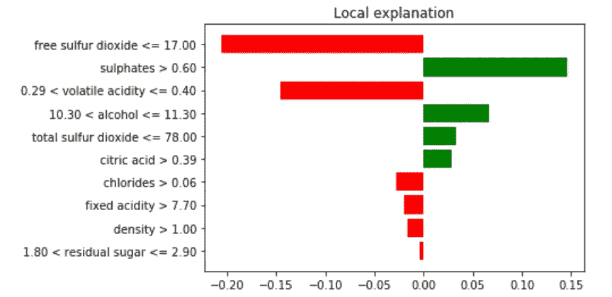

# 可解释的人工智能(XAI)。但是，为谁？

> 原文：<https://towardsdatascience.com/explainable-artificial-intelligence-xai-but-for-who-696aa1e65c67?source=collection_archive---------17----------------------->

## [模型可解释性](https://towardsdatascience.com/tagged/model-interpretability)


西班牙加的斯，作者卡洛斯·穆根

> *这篇博客是 ECMLPKDD 偏见研讨会上“*[](https://arxiv.org/abs/2107.08045)**对欧洲央行可解释人工智能的迫切需求”的科学披露(见下面的引文)**

*试图解释预测或建立可解释的机器学习模型是一个迅速发展的热门话题。当在医学、核能、恐怖主义、医疗保健或金融等许多领域的决策过程中应用机器学习时，一个人**不能**盲目相信预测，让算法“不受约束”，因为这可能会产生灾难性的后果。*

*模型的预测性能通过广泛的指标组合进行评估，如准确性、召回率、F1、AUC、RMSE、MAPE…但高预测性能可能不是唯一的要求。*

*在可解释的人工智能和可解释的人工智能领域有一个巨大的趋势，那就是建立对模型预测的信任。许多论文、博客和软件工具以非常明确的方式呈现了可解释性和可解释性，但是...*

> **对谁负责？对谁负责？**

*我想我们都同意这样一个事实:我们不需要对一个模型的行为做出相同类型的解释。与普通的数据科学家相比，人工智能专家如 Andrew NG、Geoffrey Hinton、Ian good fellow……不需要同样的解释来解释为什么一个模型要做什么以及为什么要做。此外，外行用户可能需要一个完全不同的解释，因为他们可能没有人工智能领域的知识(他们也可能不想)。*

> *所以，人工智能中的解释有不同的受众。*

*Andrew NG 和网飞推荐系统的一个随机选择的用户有不同的理解需求"*这部电视剧为什么被推荐？*“一个随机的用户可能会发现得到某部动作电影的建议就足够了，因为他们在过去两周的每晚都在看动作电影，但是然后 Andrew NG(用任何其他著名的人工智能人物替换名字)可能需要不同类型的解释。*

***机器学习的讲解是针对特定受众做的。**当前的 xAI 趋势似乎是为拥有良好机器学习知识的数据科学家建立解释… **但是 *xAI* 应该专注于向数据科学家或普通用户解释 AI 吗？***

*软件开发中的一个典型错误是，开发人员最终为自己开发软件，结果却是为他们的目标受众设计的很差。*

*可解释的人工智能可能会面临与糟糕的软件开发类似的命运。人工智能的解释可能是为数据科学家和机器学习研究人员自己开发的，而不是为日常用户开发的。*

## *使用案例:石灰*

*一种被证明有用的技术是使用局部代理模型。可能最著名的是局部可解释的模型不可知解释(LIME)。想法相当简单:目标是理解机器学习模型为什么做出个体预测；这叫个别解释。LIME 测试当你将数据的变化输入机器学习模型时，预测会发生什么[5]。*

*在下图中，我们可以看到著名的葡萄酒质量数据集的某个实例的局部近似值。无论原始模型是什么(模型不可知)，我们都可以做一个局部近似，看看哪些特性有贡献，贡献多少。*

**

*葡萄酒质量数据集实例的本地解释*

*有了这个局部近似，我们就有了一个线性模型，它只适用于这个数据实例。我们扰动了输入数据空间，定义了一个局部近似，并在那里拟合了一个模型。*

> *我们能向谁解释这个？*

*有人会说这种解释对他们来说很直观，因为它是作为一个线性模型估计器构建的，几乎没有什么特性。每个特征的贡献是线性的。有人甚至会说，这种解释对一个在这个领域有一点知识，但*没有 ML* 经验的人来说是有好处的。此外，这对于没有时间并且由于某种原因快速浏览相同解释样本的数据科学家来说也很有用，因此对于没有时间的*数据科学家来说*。*

*但是，我们到底在做什么呢？我们是在使用黑盒解释器来预测黑盒算法吗？只有一小部分数据科学家能够真正理解随机森林或梯度增强决策树的行为，但真正知道 LIME 在随机森林中具体做什么的数据科学家就更少了。石灰局部解释图中表示的是什么？这个解释有多稳定？它的可争议性呢？*

*尽管对可解释人工智能的兴趣正在快速增长，但一些问题仍然存在。我们在为谁构建解释？我们的目标是研究人员/数据科学家吗？还是我们针对的是普通观众？*

## *引用*

*这篇博客是 ECMLPKDD 关于偏见的研讨会上发表的论文[(链接)](https://arxiv.org/abs/2107.08045)的科学披露。请引用为:*

```
*@inproceedings{MouganDesi,
  author    = {Carlos Mougan Navarro and
               Georgios Kanellos and
               Thomas Gottron},
  title     = {Desiderata for Explainable {AI} in Statistical Production Systems
               of the European Central Bank},
  booktitle = {Machine Learning and Principles and Practice of Knowledge Discovery
               in Databases - International Workshops of {ECML} {PKDD} 2021, Virtual
               Event, September 13-17, 2021, Proceedings, Part {I}},
  series    = {Communications in Computer and Information Science},
  volume    = {1524},
  pages     = {575--590},
  publisher = {Springer},
  year      = {2021},
  url       = {https://doi.org/10.1007/978-3-030-93736-2\_42},
  doi       = {10.1007/978-3-030-93736-2\_42},
}*
```

## *参考文献和文献*

*[1-欧洲中央银行统计生产系统急需可解释的人工智能](https://arxiv.org/abs/2107.08045)*

*[2-5 月版:关于可解释 AI 的问题](/may-edition-questions-on-explainable-ai-6968e9ac1ccf)*

*[3-可解释的人工智能:当心管理精神病院的囚犯，或者:我如何学会停止担忧并热爱社会和行为科学](https://arxiv.org/abs/1712.00547)*

*[4-停止解释高风险决策的黑盒机器学习模型，转而使用可解释的模型](https://www.nature.com/articles/s42256-019-0048-x)*

*“我为什么要相信你？”:解释任何分类器的预测*

*[6-人工智能的解释:来自社会科学的见解](https://arxiv.org/abs/1706.07269)*

*[7-可解释的机器学习:使黑盒模型可解释的指南。](https://christophm.github.io/interpretable-ml-book/)*

## *感谢*

*非常感谢[劳拉州](https://www.linkedin.com/in/laura-state/)和[罩轩](https://www.linkedin.com/in/xuan-zhao-127bb8150/)的参与和讨论。*

*欧洲委员会，no bias-h 2020-MSCA-ITN-2019 项目编号 860630。*