# 可解释的深度神经网络

> 原文：<https://towardsdatascience.com/explainable-deep-neural-networks-2f40b89d4d6f?source=collection_archive---------2----------------------->

## 从隐藏层获得定性见解


图片由诺尔·奥托(Pexels)提供

> 自然是一个无限的球体，它的中心无处不在，它的圆周无处不在。
> 
> B.帕

F *还是有些年头，* ***黑盒机器学习*** *一直被批评在从数据中提取知识方面的局限性。深度神经网络(DNNs)是最著名的“黑盒”算法之一。深度神经网络(DNNs)是当今使用最广泛和最成功的图像分类和处理技术。但是当涉及到结构化数据(最常见的数据问题)时，关于它的优势仍然存在争议。近年来，人们一直在努力开发* ***可解释的机器学习*** *技术，目标是为算法提供更强有力的描述方法以及向用户提供附加信息，从而增强数据洞察力。在这项工作中，我们提出了一种新的方法，使深度神经网络在将编码数据转换为实际知识时更容易理解。在每个隐藏层表示中，将检查数据结构，以清楚地了解深度神经网络如何为分类目的转换数据。*

# 深度学习的困惑

深度学习数学分析领域(Berner，J. et al. 2021)正在尝试使用数学方法来理解神经网络的神秘内部工作方式。这项研究的关键目标之一是理解神经网络在处理数据时实际上做了什么。深度神经网络(DNNs)在每一层转换数据，创建新的表示作为输出。在分类问题中，DNNs 寻求将数据分成不同的类别，逐层改进这一过程，直到产生最终输出。根据流形假设(manifold hypothesis)，该假设提出自然数据在其嵌入空间中创建更低维的流形，该任务可以理解为在数据空间中分离更低维的流形(Fefferman C .，2016；奥拉赫 c .，2014)。

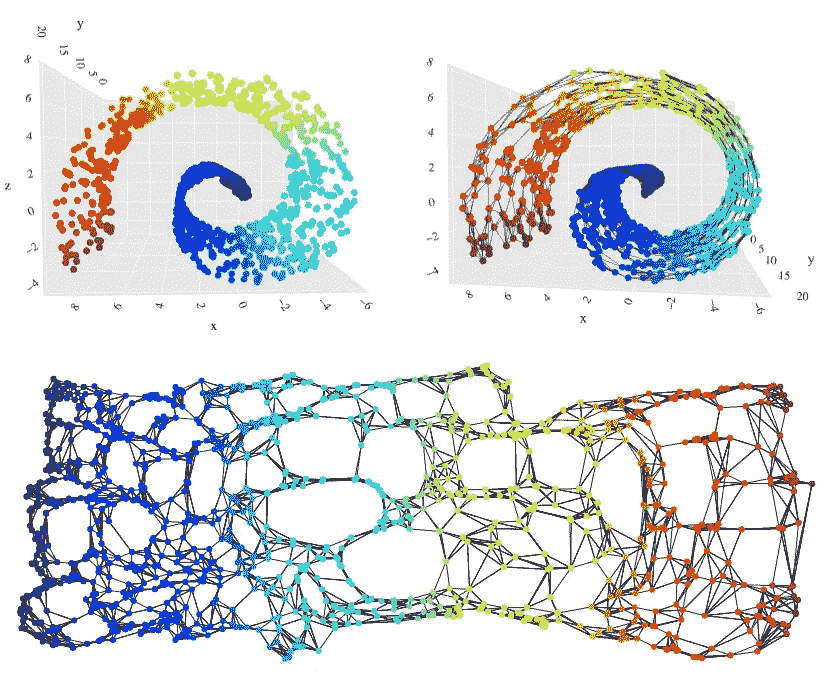

**图一**。从瑞士卷上随机生成的点，到使用 k-最近邻和 MDS 算法的低维嵌入。虽然初始数据分布是三维的，但最终的表示非常接近于一条连续的线(一维流形)。数据来自[https://chart-studio.plotly.com/~empet#/](https://chart-studio.plotly.com/~empet#/)。图片作者。

DNN 层由一个**实现函数**、*φ*(一个仿射变换)和一个组件式的**激活函数**、 *ρ* 链接。考虑图 2 所示的全连接前馈神经网络。网络架构可以通过定义层数 *N，L* ，神经元数量，激活函数来描述。网络参数是权重矩阵 W 和偏置向量 b。每一层的输出都是描述输入的新方式。这就是为什么它们被称为 r **表示**的原因，因为它们本质上是输入数据的抽象。对于每层，*φ(x，θ)= Wx+b* ，参数 *θ = (W，b)* 。权重矩阵是 *W* ，而偏置向量是 *b* 。

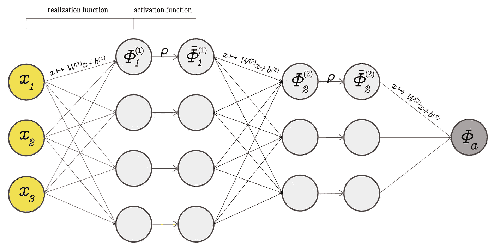

**图二**。具有架构的全连接前馈神经网络，a = ((3，4，3，1)， *ρ)。图片作者。*

激活函数在决定神经网络如何连接以及哪些信息从一层传递到下一层方面至关重要。最后，它控制信息交换，允许神经网络从数据中“学习”。他们学什么和为什么学仍然是一个困难的话题。一些研究人员甚至认为，DNN 可以从数据中学习一些特别的东西，而且这项研究是由几个层次共享的。因此，一个层学习了一些东西，然后将一个表示传递给下一个层，下一个层学习其他东西的说法是部分正确的。

# 数据拓扑

通过**降维**可视化高维数据表示是一种众所周知的用于检查深度学习模型的技术。在图 3 中，我们可以看到一个具有 a= ((33，500，250，50，1)， *ρ)架构的网络的层表示。*

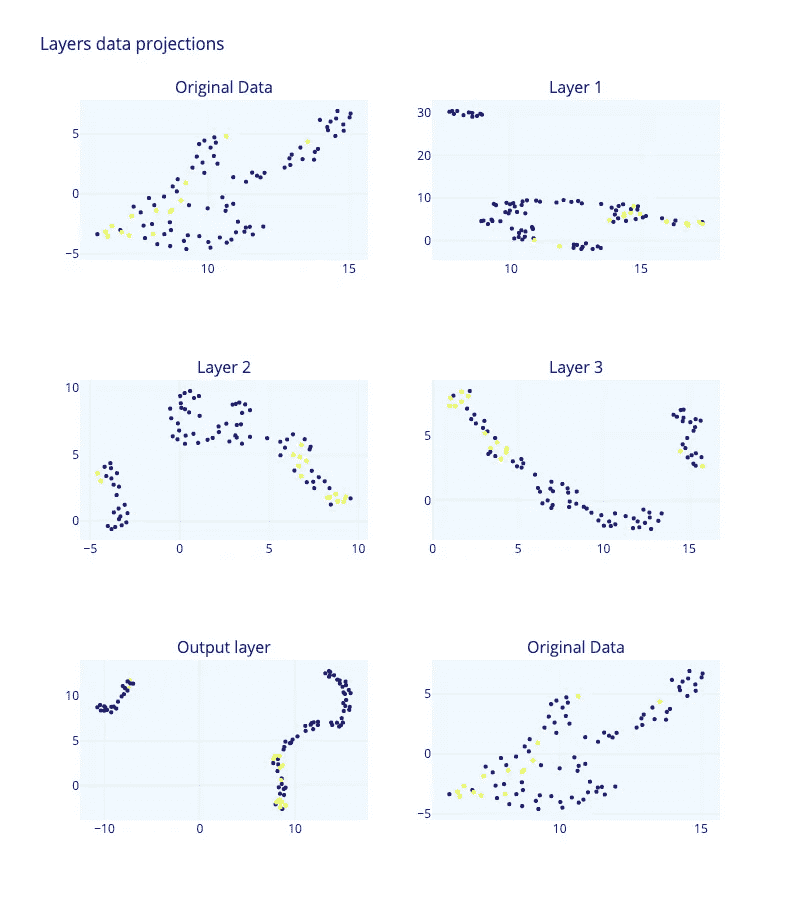

**图 3** 。使用 DNN 可视化二元分类问题中的高维表示。具有 33 列和 91 行的原始数据集。网络架构，a = ((33，500，250，50，1)， *ρ)。*用 UMAP 算法(均匀流形近似和投影)完成的表示的维数减少。不同的层试图在聚类中分离低维流形，以便将标签(黄色点)从其余数据点推开。深度网络的任务是尽可能地分离流形，以便隔离标签点。图片作者。

除了降维之外，还有其他可视化高维模型的技术。拓扑学分析空间中元素的连接信息，处理定性的几何信息。拓扑数据分析(TDA)使用范畴理论、代数拓扑和其他纯数学方法来实现对数据形式的实际调查[4]。高维数据集极大地限制了我们可视化它们的能力。这就是为什么 TDA 可以帮助我们提高可视化和分析信息的能力。最常观察到的数据拓扑包括连接的零部件、回路、空隙等。

在深度神经网络中分析高维数据表示时,**维数灾难**是一个主要挑战。在高维空间中，点非常分散，当 DNN 将数据从一个层传输到另一个具有不同维数的层时，点之间的欧氏距离以及点到子集的距离往往会增加。拓扑学是数学的一个分支，研究独立于所选坐标的几何对象的属性，这意味着即使对象被拉伸、弯曲或以其他方式变形，这些属性也不会改变。这使得拓扑对于分析深度神经网络表示特别有用，因为它允许分析数据的底层结构，而不受数据点的规模或方向的影响。

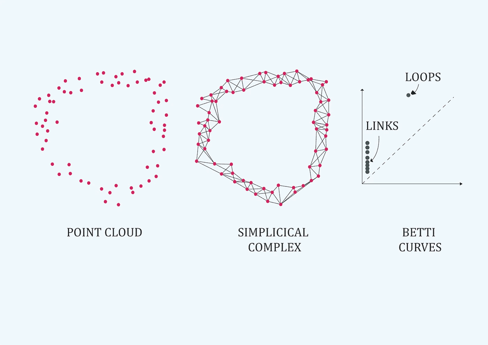

**图四**。定量拓扑数据分析。图片作者。

拓扑学避免了距离函数的量化值，而是用一个点到底层空间子集的**【无限接近】**的概念来代替它们【4】。

拓扑数据分析方法遵循一个基本程序:我们遇到一个**拓扑空间**(一个高维数据集的表示)，我们需要找到它的**基本组**(数据关系为链接、循环或空洞)。但是我们的数据集是一个陌生的空间，很难看到显式的循环和关系。然后，我们寻找另一个空间，它是与我们的[4]同伦等价的 T12，并且它的基本群更容易计算。由于两个空间都是同伦等价的，我们知道我们空间中的基本群与新空间中的基本群是同构的。这是一个无坐标的过程。一级连接信息与数据链路相关，二级连接信息与数据环路相关，三级连接信息与空隙相关(图 4 显示一级为绿色，二级为蓝色。

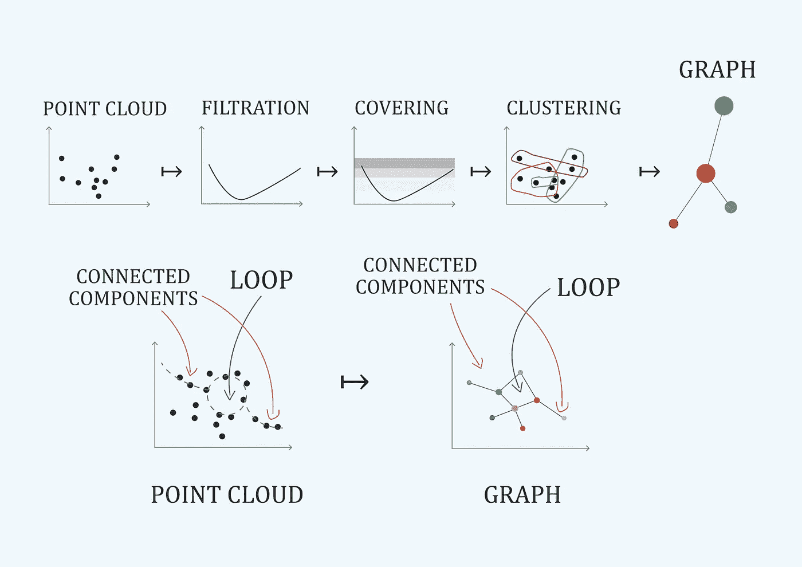

**图 5** 。定性拓扑数据分析。映射器算法。图片作者。

拓扑数据分析通过直接可视化为高维数据的定性理解提供了定量方法和工具(Carlsson G .，2009)。一个例子是**映射算法**(图 5)。定量数据分析将找到表示的基本组，定性数据分析将带来关于数据的其他定性见解。

**空间的拓扑特征**是它的**基本群**。在 TDA，这些签名是用来表征数据空间的定量元素。

为了直观地理解什么是数据拓扑，我们邀请您阅读这篇精彩的帖子:[即将到来的事物的数学形状](https://www.quantamagazine.org/the-mathematical-shape-of-big-science-data-20131004)来自 Tang Yau Hoong，发表在 Quanta 杂志上。

> 作为推论，我们可以说拓扑数据分析是关于寻找连接。

# 理解深网表示的拓扑:一个真实的例子

在这篇文章中，我们提出对深度神经网络(DNNs)的表示使用拓扑数据分析可以帮助我们更好地理解这些网络如何运行以及可以从每一层收集到什么信息。为了证明这一点，我们将使用印度政府提供的数据集作为药物发现黑客马拉松的一部分，该数据集也可以在 Kaggle 上获得。该数据集包括一系列已经过抗 Sars-CoV-2 有效性测试的药物，以及从 PubChem 库中获得的每个分子的其他化学细节。最终数据集包括 100 个测试分子，每个分子有 40 个特征，包括 pIC50 值，pic 50 值是半最大抑制浓度的负对数，用于衡量物质作为抑制剂的功效。这种分析的目的是根据这些分子对 Sars-CoV-2 的有效性开发一种分类方法。该数据集还包括 6 个盲分子，它们没有 pIC50 值，可用于预测任务。

我们使用 [Giotto-tda](https://giotto-ai.github.io/gtda-docs/0.4.0/library.html) 库来执行 tda 计算。库`gtda`是用 Python 编写的高性能拓扑机器学习工具箱。在我看来，使用`gtda`的真正优势在于它与`scikit-learn`的直接集成以及对表格数据、时间序列、图表或图片的支持。
这两种资产都使得构建机器学习管道变得简单。对于深度神经网络，我们使用 [Keras](https://keras.io/) 库。

## 深度神经网络架构

在我们的实验中，我们使用了具有架构的全连接神经网络， *a = ((33，500，250，50，1)，ρ)* 。这是一个具有三个隐藏层的基本图形。我们用 Keras functional API 建立了网络，以使不同的实验更具可重复性。功能 API 可以处理具有非线性拓扑的模型。

```
**# clean is the pandas data frame with the data, 
# and 'pIC50' is the label feature.**input_dim = len(clean.drop(columns='pIC50').columns) 
model = Sequential()**#The Dense function in Keras constructs a fully connected neural network layer, automatically initializing the weights as biases.****#First hidden layer**model.add(Dense(50, activation='relu',  
          kernel_initializer='random_normal',
          kernel_regularizer=regularizers.l2(0.05),    
                             input_dim=input_dim)
)**#Second hidden layer**model.add(Dense(40, activation='relu',  
          kernel_initializer='random_normal',
          kernel_regularizer=regularizers.l2(0.05) ))**#Third hidden layer**model.add(Dense(20, activation='relu',  
          kernel_initializer='random_normal',
          kernel_regularizer=regularizers.l2(0.05) ))**#Output layer** model.add(Dense(1, activation='sigmoid',  
          kernel_initializer='random_normal',
          kernel_regularizer=regularizers.l2(0.05) ))model.compile(optimizer='adam',   
             loss='binary_crossentropy',
             metrics=['accuracy'])
```

如前所述，激活函数在将数据从一层映射到另一层时至关重要。我们感兴趣的激活函数有两种:可逆的(具有连续逆的连续函数)和不可逆的。`tanh`、`sigmoid`或`softplus`是一级函数的例子，`ReLU`是不可逆函数的例子。激活函数可以是可逆的，但是神经网络作为一个整体，即使具有可逆的激活函数，通常也是不可逆的。

在这一点上，它是值得重述的。我们想在深层神经网络中研究表象的拓扑结构。因此，关键问题将是拓扑签名是否从一种表示保留到下一种表示。答案可以在范畴理论中找到:将一个范畴的对象(例如，德 DNN 表示)转换为另一个范畴的对象的构造是**函子**如果:

*   它可以扩展到态射上的映射
*   同时保留复合和同一性态射(Riehl E .，2017)。

这种结构定义了类别之间的态射，称为**函子**。此类函子或构造将类别之间的态射定义为类别 *C* 和 *D* 之间的 *F : C → D* 。因此，该任务仅限于确定从一层映射到另一层的数据是否是函子。函子描述了类别的等价性，因此一个类别中的对象可以被翻译成另一个类别中的对象并从另一个类别中重构。

为了检查 DNN 中的**功能**，首先，我们分析我们的 DNN 架构的准确性和损失(图 6)。

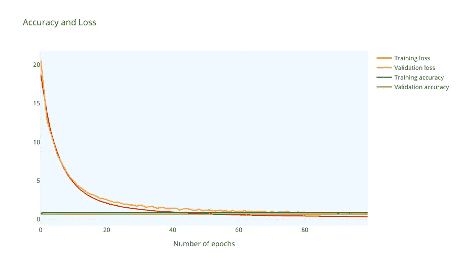

**图 6。**我们 DNN 建筑的准确性和损失。图片作者。

训练精度为 0.916，训练精度为 0.709。请记住，我们的数据集很小，因此准确性会受到影响。现在，我们计算每个表示的拓扑签名(也就是说，为每个图层表示找到基本组)。我们使用 Vietori-Rips 过滤[4]对`gtda`库进行了这项工作。结果如图 7 所示。

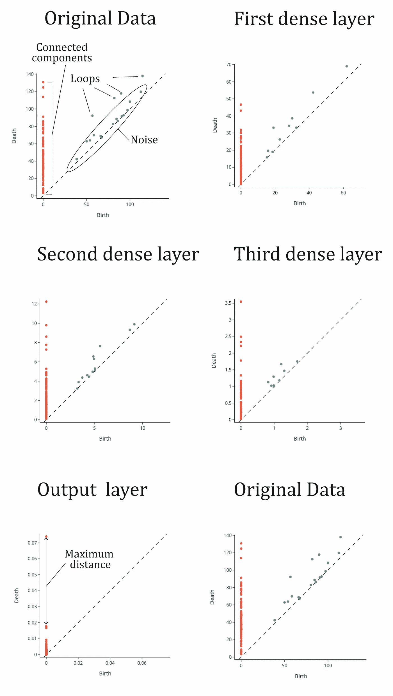

**图 7** 。图层表示的过滤。图片作者。

为了理解该图，我们可以考虑以下情况:橙色点表示拓扑空间中“靠近”在一起的数据点，而绿色点表示“环”或点簇。靠近对角线的绿点可能被认为是噪声或不完全形成的环。橙色点还指示集合的大小，并可用作表征空间的定量方法，称为拓扑签名。在图 7 中，我们可以看到从输入层到第三个隐藏层的拓扑签名被保留，有四个不同的环和几个连接点。垂直线上还有一个橘色的点，和其他的分开。在二元分类任务中，我们期望在代表两个类别的垂直线上看到两个不同的点簇，否则该集合可能是不可分类的。

这在输出图层中很明显，我们可以看到一个点明显远离其余的点，这意味着有两个类别，其中一个比另一个小得多(一个只有一个点，另一个有超过 10 个点)。然后，DNN 将这些相连的点分开，直到她得到一个清晰的分离，即两点之间的最大“距离”或最小“接近度”。它对数据集进行了二进制分类，因此拓扑签名似乎是相同的，但在输出函数中，我们要求 DNN 对此进行操作以进行分类。所以表示之间的转换是**函子**:复合和同一性态射被保留。

我们重复了这个实验，改变了几个超参数。最有趣的结论是，函子性似乎更依赖于网络宽度，而不是激活函数的可逆性。

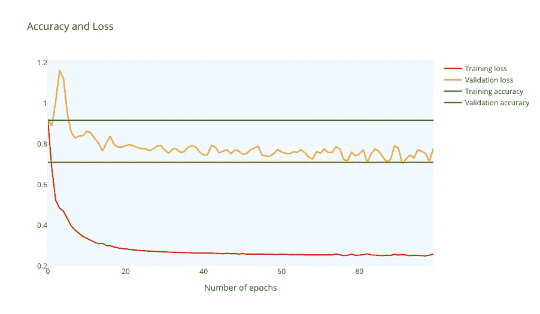

**图 8** 。精度和损耗同 *a = ((33，50，25，10，1)，ρ)*

我们实验了一个网络架构 *a = ((33，50，25，10，1)，ρ)。*精度和损耗与更广泛的架构非常相似(图 8)。然后，我们执行了相同的 Vietory-Rips 过滤(图 9)。我们看到拓扑签名与原始数据集大相径庭。在第一个隐藏层中，我们看到较少的循环在第二个隐藏层中完全消失(我们发现基本上是噪声)。从第二层开始，不映射拓扑签名。

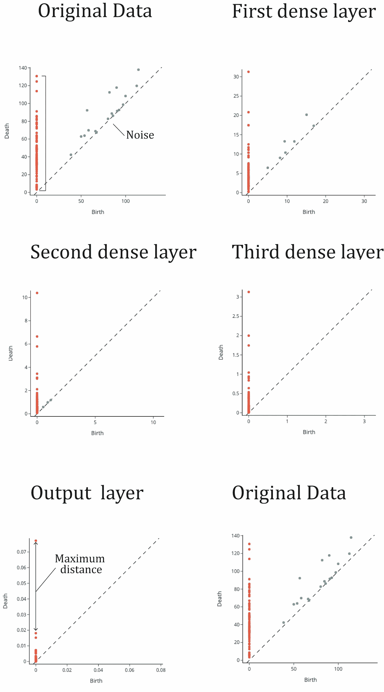

**图九**。层表示的 Vietory-Rips 过滤，a *= ((33，50，25，10，1)，ρ)* 。图片作者。

改写:神经网络即使在更宽的架构下也能够分离连接点，这似乎是违反直觉的，因为它表明 DNN 不需要考虑拓扑签名来进行准确的分离。然而，通过相对简单的操作来实现这一点是可能的。DNN 通过改变点之间的“接近度”来“操纵”数据的拓扑结构，这样就不会保留同态变换。

另一个话题是，在“学习”过程中，可能有必要考虑范畴的等价性。当我们考虑小数据集时，尽管我们获得了相对较高的准确性水平，但我们应该努力做得更好。拓扑数据分析为我们提供了在学习过程中双重测试网络性能的工具。

## 定性信息

我们已经看到了定量拓扑方法。但是拓扑学提供了非常有趣的定性理解工具。图 5 中介绍的 Mapper 算法是一种非常有趣的“可视化”算法，可以增强降维算法的性能。映射器算法可以自然地被视为一种聚类算法，它转换成具有有向边的图。在图 10 中，我们可以看到将 mapper 算法应用于具有架构 *a = ((33，500，250，50，1)，ρ) -* 宽层 *-的网络中的层表示的结果。*节点用“pIC50”值的标度来着色(我们的标签特性)。尽管我们已经进行了二元分类(0 表示负 pIC50 值，1 表示正 pIC50 值)，我们现在对回归的观点感兴趣，以获得啤酒的洞察力。我们用`gtda`库实现了 mapper 算法。制图者在选择超参数时的困难过滤、覆盖和聚类数据。

```
**""" 1\. Define filter function – can be any scikit-learn transformer. It is returning a selection of columns of the data """**filter_func = Eccentricity(metric= 'euclidean')**""" 2\. Define cover """**cover = CubicalCover(n_intervals=20, overlap_frac=0.5)**""" 3\. Choose clustering algorithm – default is DBSCAN """**clusterer = DBSCAN(eps=8,
                   min_samples=2,
                   metric='euclidean')**""" 4\. Initialise pipeline """**pipe_mapper = make_mapper_pipeline(filter_func=filter_func,
                                   cover=cover,
                                   clusterer=clusterer, 
                                   verbose=False,
                                   n_jobs=-1)**""" 5\. Plot mapper """**plotly_params = {"node_trace": {"marker_colorscale": "RdBu"}}fig = plot_static_mapper_graph(pipe_mapper,
                               X,
                               layout='fruchterman_reingold',
                               color_variable =clean['pIC50'],
                               node_scale = 20,   
                               plotly_params=plotly_params
)
fig.show(config={'scrollZoom': True})
```

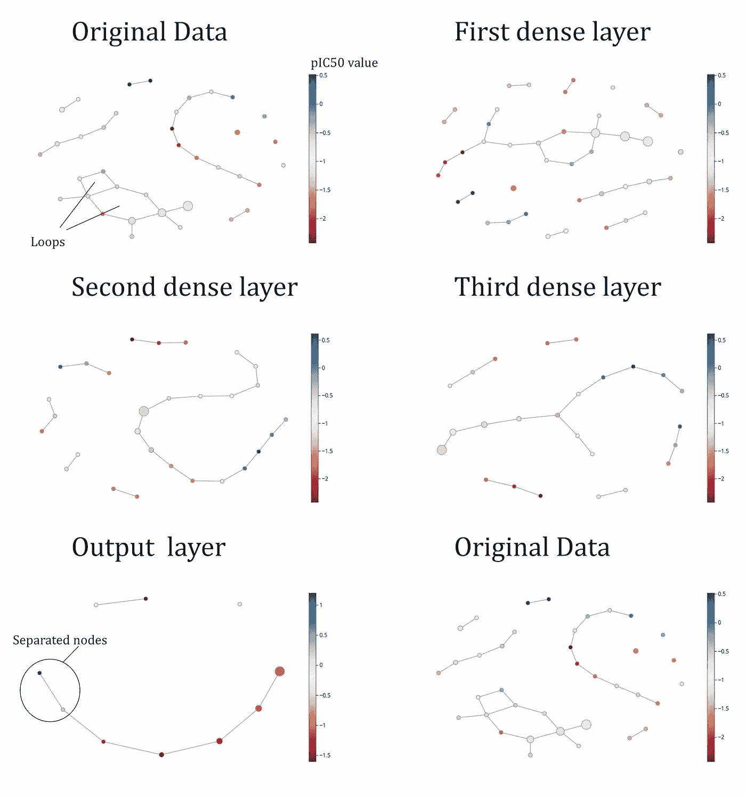

**图 10** 。一个 *= ((33，500，250，50，1)，ρ)* 的图层表示映射算法。图片作者。

我们在图 10 中看到了应用于输入、隐藏和输出层的映射器算法。输入层中的映射器显示了一些“循环”、几个不同长度的连通分量和一些非连通分量(孤立节点)。我们还可以在隐藏层 1 中看到循环，但在下面的层中看不到。在输入层，我们看到蓝点(pIC50 的正值)和红点(pIC50 的负值)完全混合在一起。有了这个图表，我们无法想象一个简单的方法来区分蓝点和红点。但输出层显示了深度神经网络是如何实现这种分离的:蓝色和红色的节点非常容易区分，因为蓝色位于连接组件的末端。我们可以很容易地切断联系，我们将有一个二元分类。我们可以看到，我们需要三个隐藏层来执行这种分离。如果我们看第三层，这种分离仍然是不可能的，所以另一个转换是必要的(输出层)。

> DNN 通过尝试连接尽可能多的数据点来解决分类问题。输出层通常包括一个主连接分支，以及一个隔离节点和一个双节点连接组件。与网络中的前几层相比，这一层中的点往往更具连通性。

mapper 算法的另一个有趣的特性是，您可以可视化每个节点，提取数据点，并直接从原始数据集转换见解(图 11)。我们看到 mapper 算法将节点转换为数据点，特别是与分子绘图相关的特征。最后但同样重要的是，我们可以将输入数据集中的每个特征以及隐藏层中的每个神经元的图形可视化。

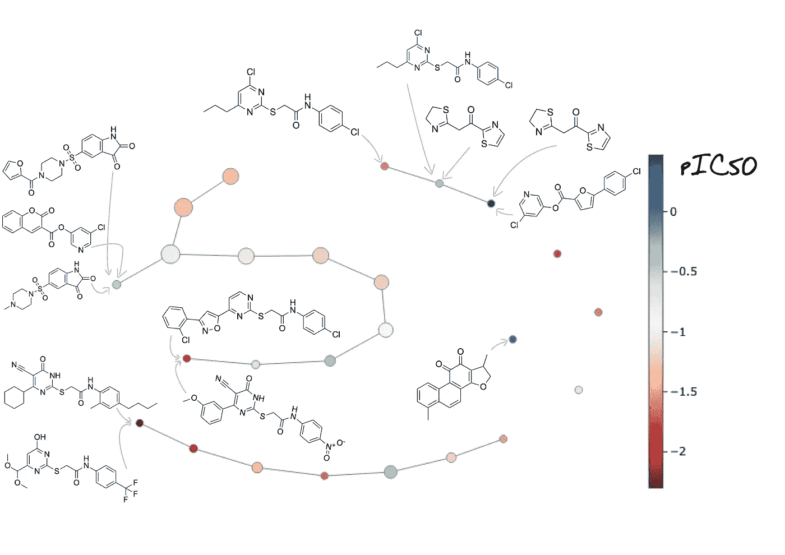

**图 11** 。Mapper 算法将节点转换为数据，在这种情况下转换为分子图。图片作者。

mapper 的这一功能非常有用，例如，可以监控每个分子在每个层的图形中的位置。

# 结论

在这项研究中，我们检查了使用神经网络进行图像分类和结构化数据分类。虽然已经有一些关于使用神经网络进行图像分类的研究，但是它们用于结构化数据分类的例子较少。我们已经展示了使用拓扑数据分析作为工具的潜力，以了解 dnn 在完成任务时使用的流程，并提高其性能。此外，我们发现，无论是否保留数据身份，DNNs 都可以达到类似的准确性水平，尽管这只是在小数据集上进行的测试。当从数据中学习时，使用保留拓扑签名作为评估 DNN 准确性的度量是值得探索的。

你可以在这里找到这篇文章[中使用的代码。](https://github.com/Javihaus/Explainable-Deep-Neural-Networks)

Berner，j .，Grohs，p .，Kutyniok，g .，& Petersen，P. (2021 年)。深度学习的现代数学。 *ArXiv，abs/2105.04026* 。

C.奥拉(2014)。神经网络、流形和拓扑。 [*陈少华博客*](https://colah.github.io/posts/2014-03-NN-Manifolds-Topology/) *。*

C.Fefferman、S. Mitter 和 H. Narayanan (2016 年)。检验多重假设。美国杂志。数学。社会主义者 29, 4, 983–1049.

G.卡尔松。(2009)拓扑和数据。*公牛。阿米尔。数学。社会主义者 46 , 255–308.*

E.瑞尔。(2017)语境中的范畴论。*信使多佛出版物*。