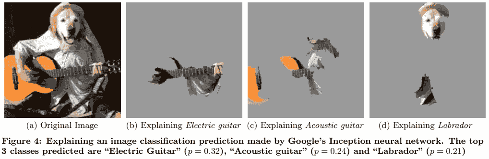
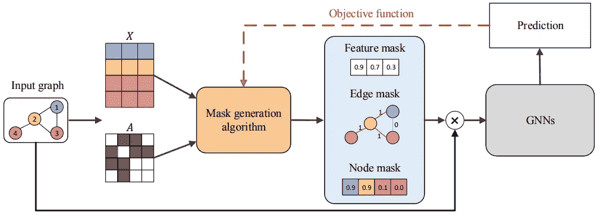
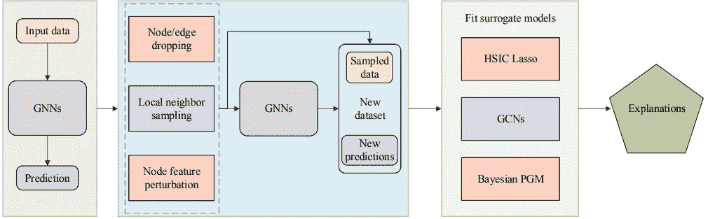
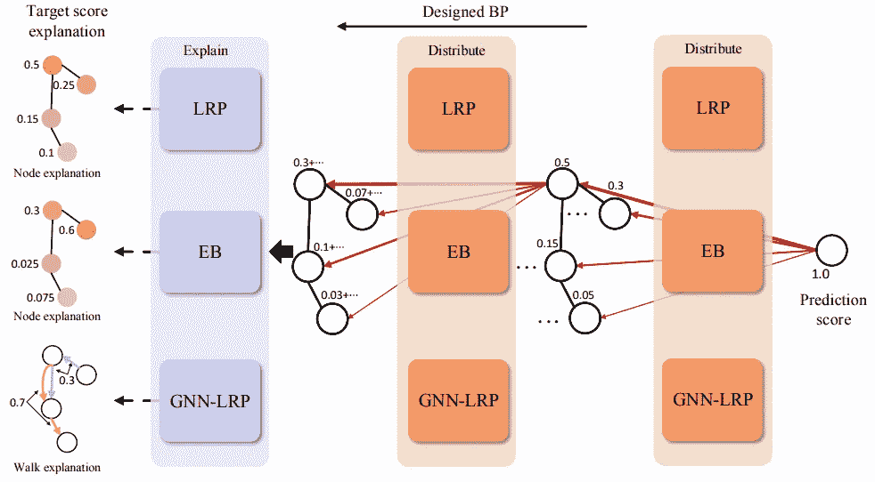

# 可解释图形神经网络

> 原文：<https://towardsdatascience.com/explainable-graph-neural-networks-cb009c2bc8ea?source=collection_archive---------15----------------------->

## 可解释人工智能的一个进步，以及为什么现有的解释方法很难适应 GNNs

# TL；速度三角形定位法(dead reckoning)

*   可解释性是深度学习中的一个大话题，因为它能够实现更可靠和可信的预测。
*   由于图形结构的不规则性，现有的解释方法不容易适用于图形神经网络。
*   快速窥视 5 组 GNN 解释方法。

# 可解释性增加了可靠性

最近，人工智能中的**可解释性**备受关注，其主要动机在于深度神经网络等**【黑箱】模型**产生的**更可靠、更可信的**预测。在[石灰论文](https://arxiv.org/abs/1602.04938)【2】中给出的一个很好的例子是，你会信任你的医生，因为他/她有能力根据你的症状解释诊断。类似地，如果预测可以以人类可解释的方式解释或证明，则深度模型生成的预测更可靠和可信。

## 相关职位

在过去的一个月里，TDS 上有几篇关于可解释人工智能的文章。他们中的一些人提供了动手的例子来帮助开始使用可解释的人工智能。如果你有兴趣学习更多关于可解释人工智能的知识，这里列出了几个帖子。

*   [如何使用形状来解释神经网络](/how-to-explain-neural-networks-using-shap-2e8a0d688730)【3】作者 [Gianluca Malato](https://medium.com/@gianlucamalato) 提供了一个使用形状来解释神经网络的示例，该神经网络被训练来预测给定 33 个特征的*糖尿病*的概率。然后将解释可视化，以了解每个特征如何影响预测的结果。
*   [可解释的人工智能(XAI)——由](/explainable-ai-xai-a-guide-to-7-packages-in-python-to-explain-your-models-932967f0634b) [Prateek Bhatnagar](https://prateek-bhatnagar89.medium.com/) 撰写的解释模型的 7 个 Python 包的指南 [4]提供了一个概述，并提供了几个解释深度模型的优秀工具包的实践示例，以帮助您入门。
*   [可解释的深度神经网络](/explainable-deep-neural-networks-2f40b89d4d6f)【5】作者 [Javier Marin](https://javier-marin.medium.com/) 提出了一种新的方法来可视化深度神经网络中的隐藏层，以使用拓扑数据分析来深入了解数据如何在整个网络中转换。

# 为什么很难用现有的方法来解释 GNN？

传统的解释方法在卷积神经网络(CNN)上工作得相当好。以下示例显示了输入图像(a)的三个最高预测类别标签的时间解释。我们可以清楚地看到导致相应预测的部分与类别标签相匹配。例如，吉他琴颈对预测“电吉他”(b)的贡献最大。

使用石灰法的示例说明[2]

然而，当涉及到图形神经网络(GNN)，事情变得有点棘手。与 CNN 运行的高度规则的网格相反，图形结构的不规则性带来了许多挑战。例如，我们可以很容易地解释 CNN 模型的上述解释，但对于一个图形来说，类似的节点级别的解释不容易可视化和解释。

在接下来的部分中，我们将回顾最近关于 GNNs 中可解释性的综述[1]中提出的每组方法的主要思想。

# 解释 GNN 的方法概述

**基于梯度/特征的方法:**使用*梯度或隐藏特征*作为输入重要性的近似值，通过反向传播解释预测。

**基于扰动的方法** : *相对于输入*的*扰动的输出变化*反映了该输入区域的重要性。或者换句话说，需要保留哪些节点/边/特征，以便最终预测不会与原始 GNN 模型偏离太多。

基于扰动的方法的一般管道[1]

**代理方法**:使用输入节点的*邻近区域*训练一个更易解释的代理模型。

代理方法的通用管道[1]

**分解方法**:将预测分解成若干项，每项作为对应输入特征的重要性分数。

分解方法的通用管道[1]

**生成方法**:根据待解释的 GNN 模型，学习生成达到最优预测得分的图形。

# 什么是好的 GNN 解释方法？

当谈到方法评估时，有许多事情需要考虑。[1]中的作者建议了几个度量标准来确保以下特性。

*   **保真度**:可解释的模型应该和被解释的原始 GNN 有一致的预测。
*   **稀疏度**:只有一小部分*节点/边/特征被用来解释。*
*   **稳定性**:输入的微小变化不应过多影响解释。
*   **准确性**:解释应该准确地恢复地面实况解释(这只对地面实况已知的合成数据集有效)

# 结论

可解释性是人工智能的一个关键部分，因为它能够实现可靠和可信的预测。然而，将现有的解释方法应用于 GNN 并非易事。我们已经快速浏览了现有 GNN 解释方法中的几个通用方法，以及定义一个好的 GNN 解释方法的一些期望的属性。

# 参考

[1]袁，于，桂，纪，[图神经网络的可解释性:一个分类综述](https://arxiv.org/abs/2012.15445)(2020)*arXiv*

[2] M. T. Ribeiro，S. Singh，C. Guestrin，“我为什么要相信你？”:解释任何分类器的预测(2016)， *ACM SIGKDD 知识发现和数据挖掘国际会议(KDD)*

[3] [如何用形状解释神经网络](/how-to-explain-neural-networks-using-shap-2e8a0d688730)

[4] [可解释的人工智能(XAI)——用 Python 写的 7 个包的指南来解释你的模型](/explainable-ai-xai-a-guide-to-7-packages-in-python-to-explain-your-models-932967f0634b)

【5】[可解释的深度神经网络](/explainable-deep-neural-networks-2f40b89d4d6f)