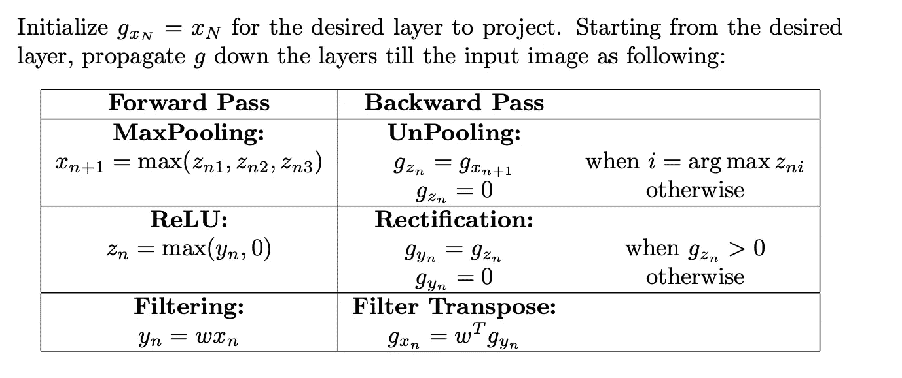
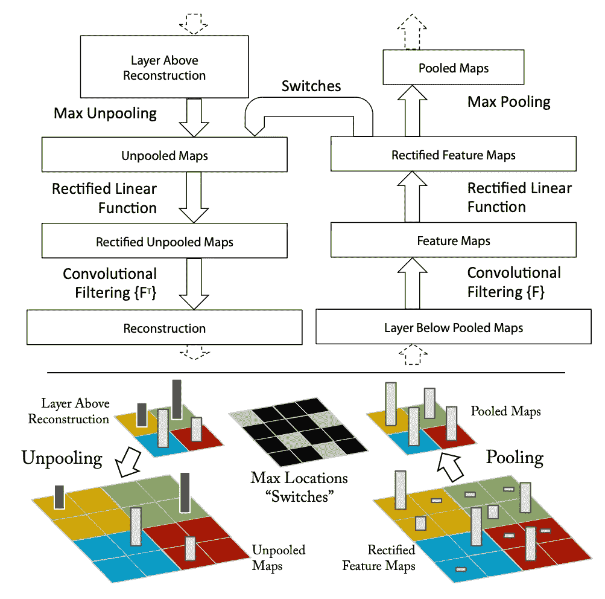
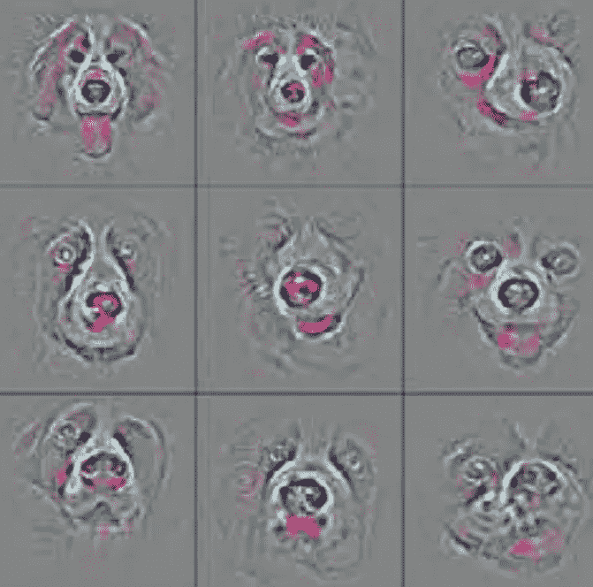
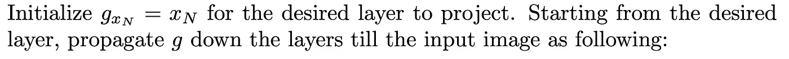
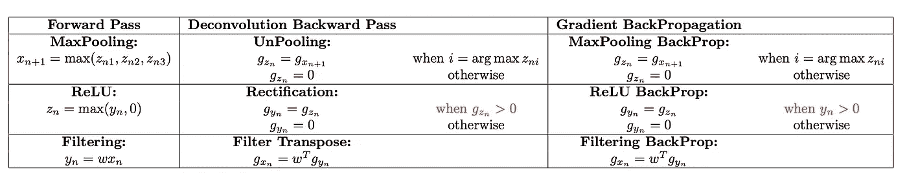
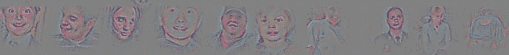
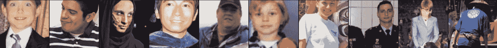
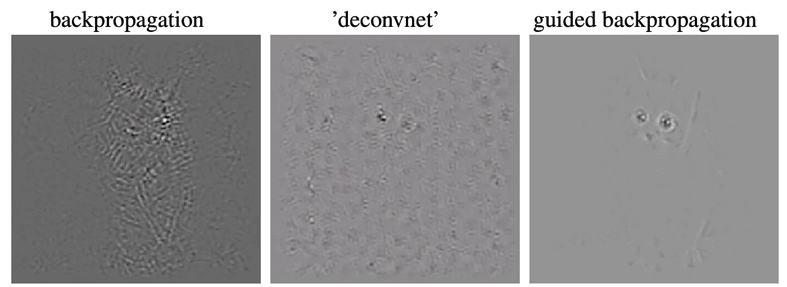

# 可解释的神经网络:最新进展，第 2 部分

> 原文：<https://towardsdatascience.com/explainable-neural-networks-recent-advancements-part-2-8cce67833ba?source=collection_archive---------19----------------------->

## 回顾十年(2010–2020)，四集系列

# 我们在哪里？

这个博客聚焦于神经网络可解释性的发展。我们将我们的演讲分为四个博客系列:

*   [第一部分](https://groshanlal.medium.com/recent-advancements-in-explainable-neural-networks-2cd06b5d2016)讲述了图像像素的**可视化梯度**对于解释 CNN 的 pre-softmax 类得分的有效性。
*   [第 2 部分](https://groshanlal.medium.com/explainable-neural-networks-recent-advancements-part-2-8cce67833ba)讲述了一些更先进的/改进的基于梯度的方法，如**去卷积**、**导向反向传播**来解释 CNN。
*   [第 3 部分](https://groshanlal.medium.com/explainable-neural-networks-recent-advancements-part-3-6a838d15f2fb)讲述了基于梯度的方法的一些缺点，并讨论了替代的公理化方法，如**逐层相关性传播**、**泰勒分解**、**深度提升。**
*   [第 4 部分](https://groshanlal.medium.com/explainable-neural-networks-recent-advancements-part-4-73cacc910fef)讲述了一些最近的发展，如**集成渐变**(上接第 3 部分)以及 CNN 架构中最近的创新，如**类激活地图**，开发这些地图是为了使特征地图更易理解。

# 基于梯度的方法

从第 1 部分继续，我们讨论为解释神经网络开发的更复杂的基于梯度的技术。

## 去卷积网络(2014 年)

解释 CNN 学习的特征图的最早努力之一可以追溯到马修·泽勒关于去卷积网络的工作。在他们关于“ [**可视化和理解卷积网络的工作中，(ECCV 2014)**](https://arxiv.org/abs/1311.2901) ”作者描述了一种将中间隐藏层的激活近似投射回输入层的方法。这种投影可以提供对隐藏层从输入图像中捕捉到的细节的洞察。通过投影连续的层(回到输入层)，作者表明 CNN 连续学习图像中更复杂的图案，如边缘、简单形状、更复杂的形状、纹理等。作者通过可视化著名的 AlexNet 的隐藏层来展示他们的结果，并根据他们的见解，也能够调整层以实现更好的性能！

下面简单介绍一下投影方法。从期望的层开始，激活信号通过层向下传递(类似于反向传播)，通过最大池层、ReLU、权重倍增:

**初始化**:从您想要向下投影的层开始，初始化与该层激活相同的重建信号。向下反向传播重构的信号。

*   **MaxPool** :当你遇到一个 MaxPooling 层时，从输入被汇集并在向前传递中被传递的地方寻找索引。在反向传递中，将重构的信号值传递给这些索引，将其他位置置零。
*   **ReLU:** 当遇到 ReLU 层时，只有当重构信号为正时才通过，否则归零。
*   **权值**:当 u 遇到 CNN 层或者任何权值相乘时，将权值的转置乘以重构的信号，并向下传递。

反卷积方程

有几点需要注意:

*   这种方法并不完全反转 CNN。它只投影有利于激活隐藏层的像素。
*   虽然它被称为去卷积，但这种方法实际上并没有去卷积 CNN。去卷积是一个误称，由于历史原因一直存在。它可以/可能更好地称为转置卷积。
*   反卷积中的大多数操作接近于梯度反向传播。我们将在接下来的章节中对此进行更多的讨论。

向前传球 Vs 向后传球，来源:[https://arxiv.org/pdf/1311.2901.pdf](https://arxiv.org/pdf/1311.2901.pdf)

从第 4 层投影到输入图像层的各种狗图像的去卷积，来源:[https://arxiv.org/pdf/1311.2901.pdf](https://arxiv.org/pdf/1311.2901.pdf)

## 引导反向传播(2015 年)

鉴于梯度可以用作理解神经网络决策的显著图，反卷积方法与梯度可视化有多大不同？在他们关于显著图的原始论文(来自上一节)中，作者提到了反卷积和梯度反向传播惊人的相似性。Jost Tobias Springenberg、Alexey Dosovitskiy、Thomas Brox、Martin Riedmiller 在他们的工作“ [**努力实现简单性:全卷积网络，(ICLR 2015)**](https://arxiv.org/abs/1412.6806) ”中进一步研究并提出了这一想法。值得一提的是，这篇论文对 CNN 架构进行了一项消融研究，并做出了除可解释性之外的许多其他重要贡献，这超出了本博客的范围。

当我们比较反卷积和梯度反向传播的方程时，我们注意到除了在 ReLU 阶段，所有的方程都是完全相同的。在去卷积中，(类似梯度的)重建信号只有在它为正时才被传递，即我们只传递有助于促进激活的信号。而在常规梯度传播中，只要 ReLU 在正向传递中向上传递输入，梯度就通过 ReLU 向下传递。这两者之间有细微的区别。

反卷积与梯度反向传播方程

作者将这两种冲突的方法结合成一种方法，称为**导向反向传播**。在这种方法中，作者建议使用梯度反向传播，除了在 ReLU 阶段。在 ReLU 阶段，只有当梯度为正时，我们才反向传播梯度。以下是方程式:

导向反向传播

导向反向传播仅在 ReLU 阶段不同于“香草”梯度反向传播。

以下是作者在 ImageNet 数据集上展示的一些结果。作者注意到，引导反向传播提供的可视化比“普通”梯度反向传播和反卷积更清晰。

样本图像的引导反投影结果，来源:【https://arxiv.org/pdf/1412.6806.pdf 

反投影 Vs 反投影 Vs 制导反投影，来源:【https://arxiv.org/pdf/1412.6806.pdf 

# 接下来是什么？

基于梯度的方法虽然容易理解，但有一些重要的缺点。我们将在下一部分讨论这些缺点。我们还讨论了一些公理化的方法来解决这些缺点，如**分层相关性传播**、**深度提升**等。我们将在下一部分讨论这些很酷的技术。

要阅读更多关于神经网络可解释性的激动人心的作品，你可以点击这里阅读下一部分: [**链接到第 3 部分**](https://groshanlal.medium.com/explainable-neural-networks-recent-advancements-part-3-6a838d15f2fb)