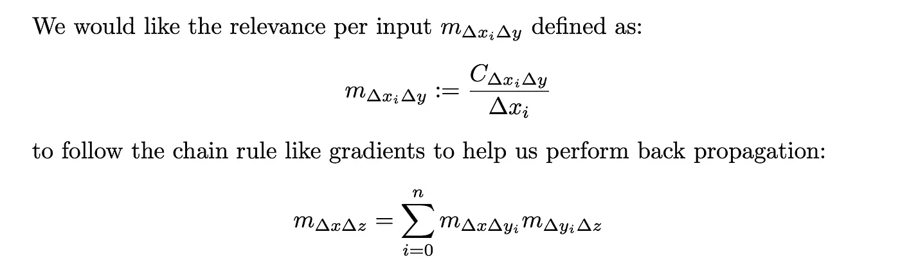

# 可解释的神经网络:最新进展，第 3 部分

> 原文：<https://towardsdatascience.com/explainable-neural-networks-recent-advancements-part-3-6a838d15f2fb?source=collection_archive---------14----------------------->

## 回顾十年(2010–2020)，四集系列

# 我们在哪里？

这个博客聚焦于神经网络可解释性的发展。我们将我们的演讲分为四个博客系列:

*   [第一部分](https://groshanlal.medium.com/recent-advancements-in-explainable-neural-networks-2cd06b5d2016)讲述了图像像素的**可视化梯度**对于解释 CNN 的 pre-softmax 类得分的有效性。
*   [第 2 部分](https://groshanlal.medium.com/explainable-neural-networks-recent-advancements-part-2-8cce67833ba)讲述了一些更先进的/改进的基于梯度的方法，如**去卷积**、**导向反向传播**来解释 CNN。
*   [第 3 部分](https://groshanlal.medium.com/explainable-neural-networks-recent-advancements-part-3-6a838d15f2fb)讲述了基于梯度的方法的一些缺点，并讨论了替代的公理化方法，如**逐层相关性传播**、**泰勒分解**、**深度提升。**
*   [第 4 部分](https://groshanlal.medium.com/explainable-neural-networks-recent-advancements-part-4-73cacc910fef)讲述了一些最近的发展，如**集成渐变**(上接第 3 部分)以及 CNN 架构中最近的创新，如**类激活地图**，开发这些地图是为了使特征地图更易理解。

# 公理方法

到目前为止，我们讨论了用于理解由神经网络做出的决策的基于梯度的方法。但是，这种方法有一个严重的缺点。由于像 ReLU 和 MaxPooling 这样的单元的存在，通常得分函数对于一些输入像素可以是局部“平坦的”,或者换句话说具有 0°梯度。基于梯度的方法通常对使 ReLU 或 MaxPool 饱和的像素贡献 0。这是反直觉的。为了解决这个问题，我们需要:

*   关于我们所指的可解释性或相关性的一些正式概念(超越普通梯度)。我们希望“相关性”遵循的属性是什么。希望相关性在线性层表现得像普通梯度一样，因为梯度擅长解释线性函数。
*   有哪些候选满足我们的“相关性”公理，这也很容易计算，理想情况下，我们希望在一次回传中计算它们。

## 泰勒分解和逐层相关性传播(2015)

Sebastian Bach、Alexander Binder、Grégoire Montavon、Frederick Klauschen、Klaus-Robert Müller 和 Wojciech Samek 首先探讨了公理相关性。他们在他们的工作“ [**中引入了逐层相关性传播的概念，通过逐层相关性传播对非线性分类器决策进行逐像素解释(PLOS 2015)**](https://journals.plos.org/plosone/article?id=10.1371/journal.pone.0130140#:~:text=Layer%2Dwise%20relevance%20propagation%20in,run%20on%20the%20computed%20features.) ”。

作者提出了关联性必须遵循的以下公理:

*   所有像素的相关性总和必须等于模型的类别分数。我们从现在开始称这个公理为“总关联守恒**”。这是一个流行的公理，其他作者也遵循。**

****

**总关联守恒，来源:[https://journals.plos.org/plosone/article?id = 10.1371/journal . pone . 0130140](https://journals.plos.org/plosone/article?id=10.1371/journal.pone.0130140)**

**作者提出了两种不同的方法来将总相关性分配给各个像素。**

****1。泰勒分解****

**在该方法中，作者建议选择参考图像 X₀，该参考图像将被解释为“**基线图像**”，相对于该基线图像来解释图像 x 的像素。希望该基线图像的类别分数尽可能小。**

**使用基线图像来比较输入图像以突出重要像素是许多公理相关性工作中反复出现的主题。基线图像的一些好例子是:**

*   **模糊输入图像:适用于彩色图像**
*   **空白(暗)图像:适用于灰度/黑白图像**

**给定基线图像 X₀，我们执行类得分函数的泰勒分解以获得各个像素的相关性。**

****

**泰勒分解，来源:[https://journals.plos.org/plosone/article?id = 10.1371/journal . pone . 0130140](https://journals.plos.org/plosone/article?id=10.1371/journal.pone.0130140)**

**神经网络的泰勒分解的扩展版本是由作者在他们的另一项工作中提出的，称为 [**深度泰勒分解**](https://arxiv.org/abs/1512.02479) 。深度泰勒分解形成了下面描述的逐层相关性传播的理论基础。**

****2。逐层相关性传播****

**泰勒分解是一种通用方法，适用于任何类得分函数。对于神经网络，我们可以设计一种更简单的方法，称为分层相关性传播。**

**对于神经网络，作者建议将相关性从输出层向下传递到起作用的神经元。**

*   **每当相关性从一个神经元向下传递到下一层中的起作用的神经元时，我们遵循起作用的神经元与从中传递相关性的神经元的总相关性守恒。因此，在 LRP，总的相关性保存在每一层。**

****

**分层相关性传播中的相关性守恒，来源:[https://journals.plos.org/plosone/article?id = 10.1371/journal . pone . 0130140](https://journals.plos.org/plosone/article?id=10.1371/journal.pone.0130140)**

*   **从上一层传入神经元的所有相关都被收集起来并相加，然后再向下传递。当我们从一层递归到下一层时，我们最终丰富了输入图像，给出了每个像素的相关性。**

****

**对神经元的输入相关性求和，来源:【https://journals.plos.org/plosone/article? id = 10.1371/journal . pone . 0130140**

**还有待于定义我们如何分配神经元与其贡献输入或输入神经元的相关性。这可以通过多种方案来实现。作者给出了这样一个简单的方案:**

****

**单个神经元的层相关性传播，来源:【https://journals.plos.org/plosone/article? id = 10.1371/journal . pone . 0130140**

**我们注意到，上述方案只是近似总相关性公理的守恒。为了精确地保持和，我们必须以某种方式将偏置项重新分配回输入/输入神经元。**

**以下是 LRP 在 ImageNet 数据集上的一些结果:**

****

**来源:[https://arxiv.org/pdf/1604.00825.pdf](https://arxiv.org/pdf/1604.00825.pdf)**

## **深度提升(2017 年)**

**继塞巴斯蒂安·巴赫等人关于 LRP/泰勒分解的工作之后，两代情·什里库马尔、佩顿·格林塞德、安舒尔·昆达杰在他们的工作 [**中提出了通过传播激活差异学习重要特征的深度提升方法(ICML 2017)**](https://arxiv.org/pdf/1704.02685.pdf) 。DeepLiFT(深度学习重要功能)使用参考图像和输入图像来解释输入像素(类似于 LRP)。虽然 LRP 遵循守恒定律，但没有明确的方法来分配像素间的净相关性。DeepLiFT 通过强制执行一个关于如何向下传播相关性的附加公理来解决这个问题。**

**DeepLiFT 遵循的两个公理是:**

****公理 1。总相关性守恒**:在每个神经元上，所有输入的相关性之和必须等于输入图像和基线图像的得分之差。这个公理和 LRP 的一样。**

****

**总关联守恒，来源:【https://arxiv.org/pdf/1704.02685.pdf **

****公理 2。反向传播/链式法则**:每个输入的相关性遵循类似梯度的链式法则。这足以帮助我们反向传播每个输入的类似梯度的相关性。这个公理使得 DeepLiFT 更接近“香草”梯度反向传播。**

****

**反向传播/链式法则，来源:[https://arxiv.org/pdf/1704.02685.pdf](https://arxiv.org/pdf/1704.02685.pdf)**

**作者证明了上述两个公理是一致的。**

**给定这些公理，DeepLiFT 有哪些好的候选解决方案？作者建议将相关性分为积极和消极两部分:**

****

**正面和负面贡献，资料来源:[https://arxiv.org/pdf/1704.02685.pdf](https://arxiv.org/pdf/1704.02685.pdf)**

**根据手头的函数，作者为 **C()** 和 **m()** 建议了以下候选解:**

*   ****线性规则**对于线性函数:这与对 m()使用渐变完全相同。LRP 也会这么做的。**

****

**线性法则，来源:[https://arxiv.org/pdf/1704.02685.pdf](https://arxiv.org/pdf/1704.02685.pdf)**

*   **像 ReLU，Sigmoid 这样的非线性函数的重新标度规则:这和 LRP 完全一样。**

****

**重新标度法则，来源:[https://arxiv.org/pdf/1704.02685.pdf](https://arxiv.org/pdf/1704.02685.pdf)**

**线性和重新标度规则非常接近 LRP。**

*   ****reveal cancel(Shapley)****规则**对于像 MaxPool 这样的非线性函数:对 MaxPool 使用重新调整规则(参考输入为 0)将最终把所有相关性贡献归于最大输入。其他输入的变化对输出没有影响。RevealCancel 法则修正了这个反直觉的结论，利用了 [**Shapley 值**](https://en.wikipedia.org/wiki/Shapley_value) 的思想。**

****

**沙普利法则，来源:[https://arxiv.org/pdf/1704.02685.pdf](https://arxiv.org/pdf/1704.02685.pdf)**

**Shapley 值已经在博弈论中用于计算输入变量的属性。最近一些关于可解释人工智能的作品(如 [**、SHAP**](https://arxiv.org/abs/1904.02868) )使用了从 Shapley Values 得到的灵感。**

**作者展示了在 MNIST 数据集上训练的 CNN 上使用 DeepLiFT 的结果。**

****

**深度提升 vs 梯度方法，来源:【https://arxiv.org/pdf/1704.02685.pdf **

# **接下来是什么？**

**继续研究相关性的公理方法，研究人员开发了一种完全基于梯度的方法，称为**集成梯度**，它满足许多理想的公理。最近，研究人员还探索修改 CNN 架构，使其更容易窥视。围绕这一点的一些新颖之处包括使用**全局平均池**和**类激活映射**。我们将在下一部分讨论这些很酷的技术。**

**要阅读更多关于神经网络可解释性的激动人心的作品，你可以点击这里阅读下一部分: [**链接到第 4 部分**](https://groshanlal.medium.com/explainable-neural-networks-recent-advancements-part-4-73cacc910fef)**