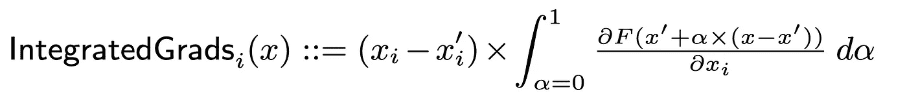
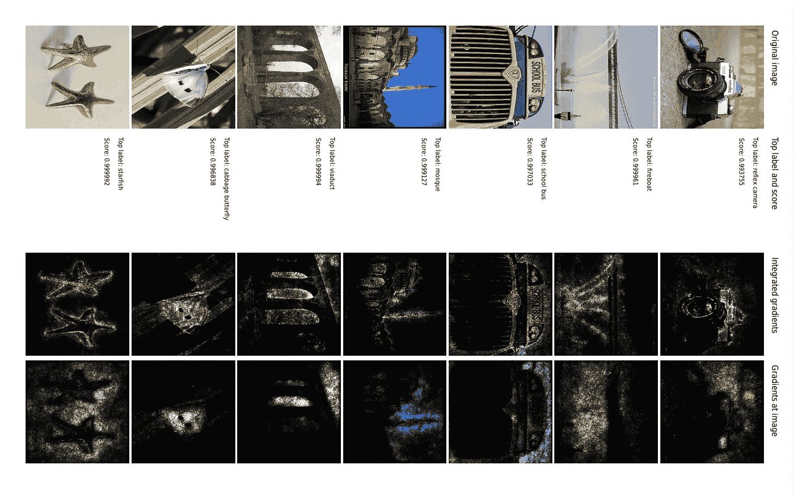
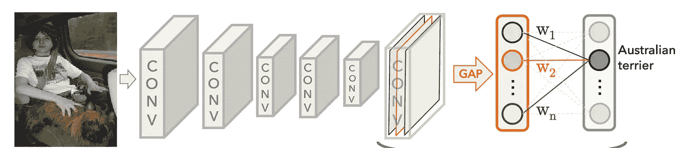
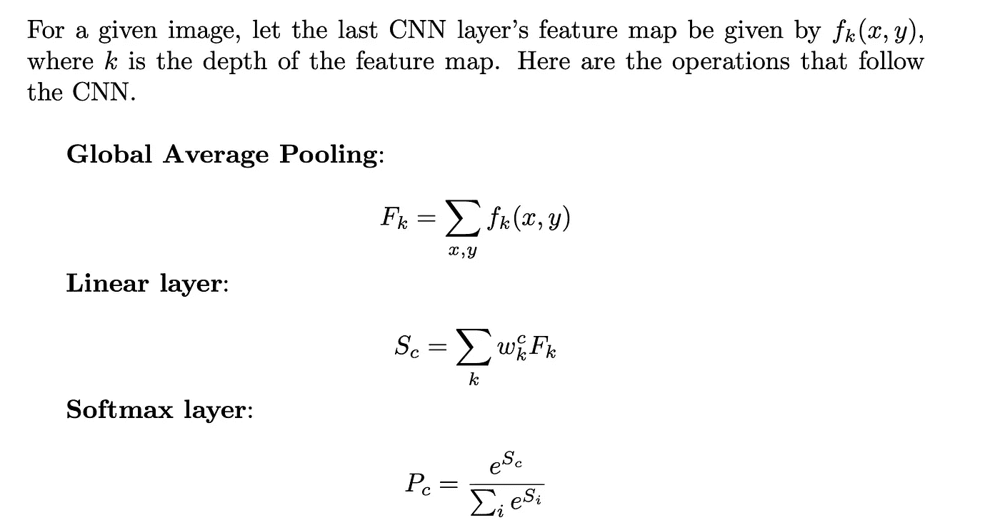
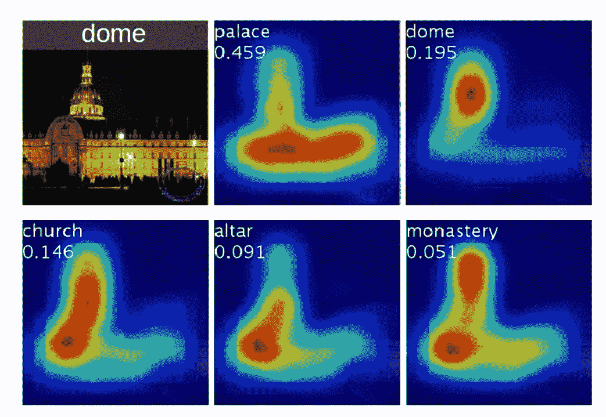
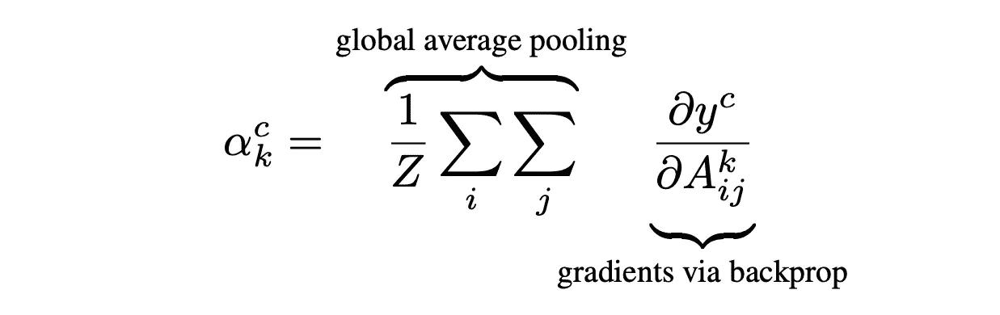
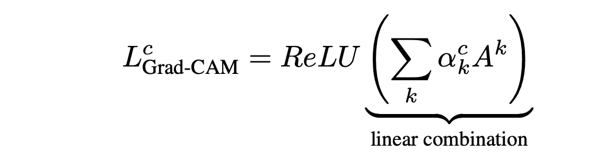
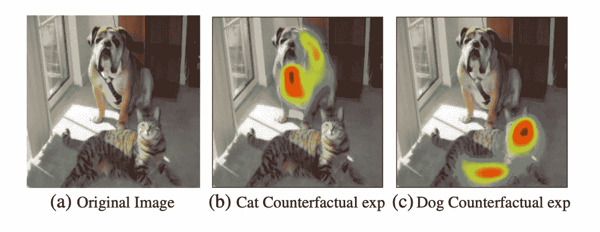
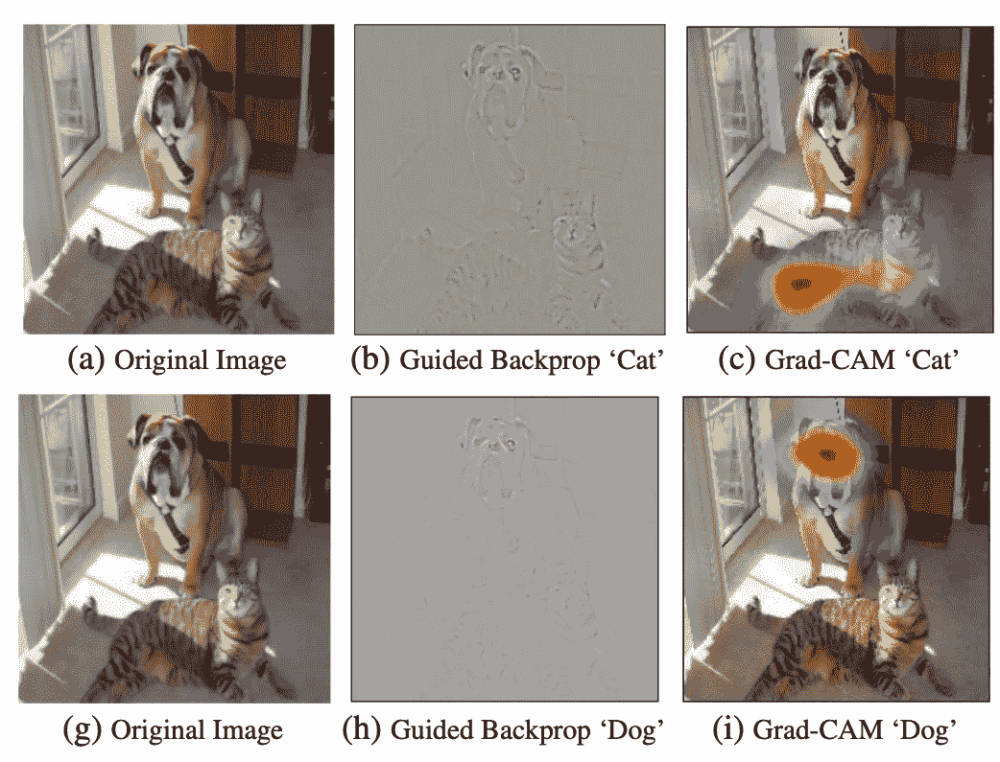

# 可解释的神经网络:最新进展，第 4 部分

> 原文：<https://towardsdatascience.com/explainable-neural-networks-recent-advancements-part-4-73cacc910fef?source=collection_archive---------15----------------------->

## 回顾十年(2010–2020)，四集系列

# 我们在哪里？

这个博客聚焦于神经网络可解释性的发展。我们将我们的演讲分为四个博客系列:

*   [第一部分](https://groshanlal.medium.com/recent-advancements-in-explainable-neural-networks-2cd06b5d2016)讲述了图像像素的**可视化梯度**对于解释 CNN 的 pre-softmax 类得分的有效性。
*   [第 2 部分](https://groshanlal.medium.com/explainable-neural-networks-recent-advancements-part-2-8cce67833ba)讲述了一些更先进的/改进的基于梯度的方法，如**去卷积**、**导向反向传播**来解释 CNN。
*   [第 3 部分](https://groshanlal.medium.com/explainable-neural-networks-recent-advancements-part-3-6a838d15f2fb)讲述了基于梯度的方法的一些缺点，并讨论了替代的公理化方法，如**逐层相关性传播**、**泰勒分解**、**深度提升。**
*   [第 4 部分](https://groshanlal.medium.com/explainable-neural-networks-recent-advancements-part-4-73cacc910fef)讲述了一些最近的发展，如**集成渐变**(上接第 3 部分)以及 CNN 架构中最近的创新，如**类激活地图**，开发这些地图是为了使特征地图更易理解。

# 公理方法

从上一节继续，我们将公理化方法和基于梯度的方法联系在一起。我们讨论一种基于梯度的方法，它遵循所有期望的公理。

## 集成渐变(2017)

在上一节中，我们看到了泰勒分解如何将像素值(和基线图像的像素)的梯度和差的乘积指定为单个像素的相关性。DeepLiFT 指定粗略梯度和输入图像与基线图像之间的像素值差的类似乘积。根据 RevealCancel 规则，我们可以观察到，单个像素的相关性是(粗略)梯度沿着δx 的正部分，后跟δx 的负部分的离散路径积分。这就引出了一个问题:

*   分数函数梯度上的路径积分对输入图像像素的特征属性有多有效。

Mukund Sundararajan、Ankur Taly 和 Qiqi Yan 在他们的工作“ [**深度网络的公理化归属(2017)**](https://arxiv.org/abs/1703.01365) ”中研究了这种使用集成梯度的思想。作者沿着他们希望所有特征归因方案都满足的两个理想的公理批判了当时流行的归因方案:

**公理 1。灵敏度**:每当输入和基线在一个特征上完全不同时，不同的特征应该被赋予非零的属性。

可以看出，由于总相关性的**守恒，LRP 和深度提升遵循灵敏度。但是基于梯度的方法不能保证灵敏度公理。发生这种情况是因为当分数函数相对于一些输入特征局部“平坦”时，在 ReLU 或 MaxPool 阶段饱和。通过饱和激活以适当的方式传递关联或归因是所有特征归因研究工作中反复出现的主题。**

**公理二。实现不变性**:当两个模型在功能上等价时，它们必须对输入特性有相同的属性

“普通的”梯度在数学上保证了实现的不变性。但是像 LRP 和深度提升这样对梯度的粗略近似可能会打破这个假设。作者展示了 LRP 和 DeepLiFT 违反实现不变性公理的例子。

作者建议使用综合梯度进行特征归属:

综合渐变，来源:[https://arxiv.org/pdf/1703.01365.pdf](https://arxiv.org/pdf/1703.01365.pdf)

作者进一步表明，上述定义遵循两个理想的假设:

*   **灵敏度:**根据微积分的基本定理，积分梯度归结为特征分数的差异，就像 LRP 和 DeepLiFT 一样。因此，他们就像 LRP 和 DeepLiFT 一样追随敏感性。
*   **实现不变性:**由于是完全按照梯度定义的，所以遵循实现不变性。

积分使用的默认路径是从基线到输入的特征的直线路径。对于上述公理，路径的选择并不重要。直线路径具有相对于基线和输入图像对称的附加属性。

以下是作者在 ImageNet 数据集上训练的 GoogleNet 模型上提供的一些结果:

综合渐变 Vs 渐变，来源:[https://arxiv.org/pdf/1703.01365.pdf](https://arxiv.org/pdf/1703.01365.pdf)

# 新颖的建筑

随着神经网络在图像识别和定位方面的更好性能的发展，人们也对修改网络架构以使其更具可解释性感兴趣。在前面的章节中，我们已经讨论了一些可视化细胞神经网络特征图的方法。但是除了特征地图之外，CNN 还有一堆完全连接的层(在最后一个 CNN 层的顶部)，这些层将过滤后的特征地图转换为 softmax 之前的分数，这不是很好解释。这一部分讲述了一些试图使 CNN 架构更具可解释性的作品。

## 类别激活图(2016)

由于完全连接的层不太容易解释，一些研究人员建议在(最后)CNN 层的每个特征图上用**全局平均池(GAP)** 替换完全连接的层，以在馈送到 softmax 之前将其减少为一维张量和其上的单个线性层。雷勃·周、阿迪蒂亚·科斯拉、阿加塔·拉普德里扎、奥德·奥利瓦、安东尼奥·托拉尔巴在他们的工作 [**中指出，这样的特征图(来自上一期 CNN)更具可解释性，学习深度特征用于鉴别性定位(CVPR 2016)**](https://arxiv.org/pdf/1512.04150.pdf) **。**

CNN 架构与全球平均池，来源:[https://arxiv.org/pdf/1512.04150.pdf](https://arxiv.org/pdf/1512.04150.pdf)

GAP 如何让 CNN 更具可解读性？我们能从这样的架构中得到什么样的解释？

作者注意到，间隙层将每个特征图减少为单个标量，并且其后的权重可以被解释为每个特征图与特定类别的相关性。为了说明这一点，作者将每个类别的**类别激活图(CAM)** 定义为对应于该类别的各个特征图的加权和。

班级激活图，来源:[https://arxiv.org/pdf/1512.04150.pdf](https://arxiv.org/pdf/1512.04150.pdf)

作者指出，尽管 CAMs 仅被训练用于图像识别，但它们在图像定位方面表现良好。这里是作者展示的单个图像的各种类的一些例子。

不同类别的 CAM 可视化，来源:[https://arxiv.org/pdf/1512.04150.pdf](https://arxiv.org/pdf/1512.04150.pdf)

## GradCAM 和制导 GradCAM (2019)

CAM 可视化的一个限制是，它只能应用于具有全局平均池(GAP)的架构。Ramprasaath Selvaraju、Michael Cogswell、Abhishek Das、Ramakrishna Vedantam、Devi Parikh、Dhruv Batra 将 CAM 方法扩展到其他架构，并在他们的工作“ [**Grad-CAM:通过基于梯度的定位从深度网络进行可视化解释(IJCV 2019、ICCV 2017)**](https://arxiv.org/pdf/1610.02391.pdf) 中提出了 GradCAM 的想法并指导了 GradCAM。

作者注意到，在基于间隙的 CNN 中，在反向传播期间，最后一个 CNN 层中的特征图中的所有像素从上面的层接收相同的梯度。围绕这一思想，作者提出，在一般的 CNN 中，由最后一层 CNN 中的特征图接收的平均梯度可以用作定义类激活图的相应权重。作者将这种基于**梯度的凸轮**或**梯度凸轮**简称为。

完全连接层的局部线性近似以提取凸轮权重，来源:https://arxiv.org/pdf/1610.02391.pdf

可视化产生的 GradCAM 图像(向上采样到输入图像大小)提供了热图，描述了图像的哪些部分强烈影响输出。

GradCAM 狗 Vs 猫可视化，来源:[https://arxiv.org/pdf/1610.02391.pdf](https://arxiv.org/pdf/1610.02391.pdf)

GradCAM 仅突出显示输入图像中负责特定类别激活的部分。对于更细粒度的细节，作者建议运行引导反向投影，并用 GradCAM 将结果信号逐元素相乘。作者称之为**制导 GradCAM** 。

制导 GradCAM，来源:[https://arxiv.org/pdf/1610.02391.pdf](https://arxiv.org/pdf/1610.02391.pdf)

作者展示了制导 GradCAM 的许多有趣的应用，包括可视化由神经网络执行的各种各样的任务，如图像识别、视觉问题回答、检测性别偏见、在人工智能系统中建立更好的人类信任等。

# 前方的路

这篇博客重点介绍了过去十年(2010 年至 2020 年)在图像识别/定位领域对神经网络所做决策进行可视化的一些卓越工作。虽然本讨论仅限于计算机视觉主题，但这里讨论的大多数方法已经成功应用于自然语言处理、基因组学等许多领域。可解释的神经网络仍在发展，每天都有新的研究出现，以更好地解释神经网络做出的决定。

在过去的十年里，人们对人工智能的透明度、公平性、隐私性和信任度等问题越来越感兴趣。在这个可解释人工智能的更一般的领域中有许多有趣的作品，如[**石灰**](https://arxiv.org/abs/1602.04938)[**SHAP**](https://arxiv.org/abs/1904.02868)等。一些研究人员一直对探索新的机器学习模型感兴趣，如 [**软决策树**](https://arxiv.org/abs/1711.09784) **，** [**神经支持的决策树**](https://arxiv.org/abs/2004.00221) ，这些模型可以隐式解释，并且足够强大，可以提取复杂的特征/表示。本博客中列出的大多数方法都不涉及重新训练网络，而只是窥视网络以提供可视化。最近一些名为 [**PatternNet**](https://arxiv.org/abs/1703.06339) 的工作挑战了这一假设，并探索了在生成解释方面更有效的神经网络架构。大量激动人心的工作正在进行中！

可解释人工智能的圣杯是当人工智能可以帮助人类从数据中做出新的发现，并指导我们的决策，而不仅仅是为我们提供“正确”的答案。