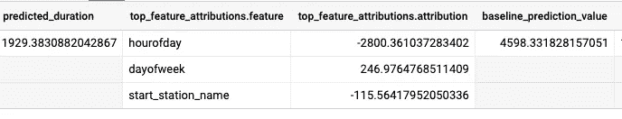

# 解释 BigQuery ML 模型

> 原文：<https://towardsdatascience.com/explaining-a-bigquery-ml-model-5cf8d9636ec9?source=collection_archive---------15----------------------->

## 如何获得和解释对预测的解释

BigQuery ML 是一种简单易用的方法，只使用 SQL 就可以在结构化数据上调用机器学习模型。虽然它只是从线性回归开始，但通过将 BigQuery ML 与 TensorFlow 和 Vertex AI 连接起来作为后端，已经添加了更复杂的模型，如深度神经网络和 AutoML 表。换句话说，虽然我们写 SQL，但是执行的是 TensorFlow。


图片由 [StartupStockPhotos](https://pixabay.com/users/startupstockphotos-690514/?utm_source=link-attribution&utm_medium=referral&utm_campaign=image&utm_content=849811) 来自 [Pixabay](https://pixabay.com/?utm_source=link-attribution&utm_medium=referral&utm_campaign=image&utm_content=849811)

BigQuery ML 正在从 Vertex AI 后端*获取更多功能。在早先的一篇[文章](https://medium.com/google-cloud/hyperparameter-tuning-directly-within-bigquery-ml-a0affb0991ae)中，我向你展示了超参数调谐。在这篇文章中，我将向你展示可解释性。

## 什么是可解释性？

可解释性是理解机器学习模型正在做什么的一种方式。有两种类型的解释。在局部可解释性中，我们问 ML 模型它是如何得出个体预测的结果的。为什么上面说这个租赁会持续 2000 秒？为什么会暗示这个交易是欺诈性的？

在全局可解释性中，我们询问特性的重要性。在预测租赁期限时，时间有多重要？交易金额对预测交易是否欺诈有多重要？

BigQuery ML 支持这两种类型的解释，但是根据我的经验，本地可解释性是最终用户想要的，所以我将重点讨论这一点。

## 回归模型

我将采用一个简单的模型来预测我在整本书中使用的自行车租赁期限(BigQuery:权威指南):

```
CREATE OR REPLACE MODEL ch09eu.bicycle_linear
TRANSFORM(
  * EXCEPT(start_date),
  CAST(EXTRACT(dayofweek from start_date) AS STRING)
         as dayofweek,
  CAST(EXTRACT(hour from start_date) AS STRING)
         as hourofday
)
OPTIONS(model_type='linear_reg', input_label_cols=['duration'])
AS
SELECT
  duration
  , start_station_name
  , start_date    
FROM 
  `bigquery-public-data`.london_bicycles.cycle_hire
```

**解释预测**

而不是打电话给 ML。预测，我们称之为 ML。EXPLAIN_PREDICT 在预测的同时获得解释:

```
SELECT * 
FROM **ML.EXPLAIN_PREDICT**(
    MODEL `ai-analytics-solutions.ch09eu.bicycle_linear`, 
    (
        SELECT 'Park Street, Bankside' AS start_station_name,
        CURRENT_TIMESTAMP() AS start_date
    )    
)
```

结果是:



预计持续时间为 1929 秒。

该模型以 4598 秒的基线预测值开始，这是整个训练数据集的平均预测值。从第二个输入(时间戳)开始，模型提取出了一天中的小时和一周中的天。

星期几是星期三，模型将基线值增加了 247 秒。换句话说，人们在周三租自行车的时间比平均时间稍长。

但是，我们看到的是凌晨 4 点。这将导致租赁期限大幅下调 2800 秒！

最后，Parkside 是一个租金通常较低的车站。因此，模型应用了另一个修正，这次是 116 秒。

4598 + 247–2800–116 = 1929

## 分类模型

作为我们的第二个示例，我们来看一个欺诈预测模型:

```
CREATE OR REPLACE MODEL advdata.ulb_fraud_detection 
TRANSFORM(
    * EXCEPT(Amount),
    SAFE.LOG(Amount) AS log_amount
)
OPTIONS(
    INPUT_LABEL_COLS=['class'],
    AUTO_CLASS_WEIGHTS = TRUE,
    DATA_SPLIT_METHOD='seq',
    DATA_SPLIT_COL='Time',
    MODEL_TYPE='logistic_reg'
) AS
SELECT 
 *
FROM `bigquery-public-data.ml_datasets.ulb_fraud_detection`
```

同样，我们使用 ML。解释 _ 预测:

```
SELECT * 
FROM ML.EXPLAIN_PREDICT(
    MODEL `ai-analytics-solutions.advdata.ulb_fraud_detection`, 
    (
        SELECT *
        FROM `bigquery-public-data.ml_datasets.ulb_fraud_detection`
        WHERE Amount BETWEEN 300 AND 305
        LIMIT 1
    )    
)
```

结果的欺诈预测类为 0(无欺诈)，概率为 0.946。这对应于-2.87 的 *logits* 值(概率是 logits 的 sigmoid)。

不幸的是，这个数据集没有告诉我们列是什么，但是基线是-2.70，表明数据值没有太多异常。

让我们尝试一个不同的预测，这次选择一个非常高价值的交易:

```
SELECT * 
FROM ML.EXPLAIN_PREDICT(
    MODEL `ai-analytics-solutions.advdata.ulb_fraud_detection`, 
    (
        SELECT *
        FROM `bigquery-public-data.ml_datasets.ulb_fraud_detection`
        **WHERE Amount > 10000**
        LIMIT 1
    )    
)
```

现在，该模型预测该交易很可能是欺诈性的。逻辑值是 12.665，而基线值是-2.7。这笔交易的概率大幅增加背后的关键因素是 V4(增加了 10.67)和 V14(减少了 4)。当然，如果我们知道 V4 和 V14 是……这将意味着更多，但公开发布的财务数据集没有这些信息。

如您所见，您可以使用实例解释来解释不同的输入是如何导致结果值发生变化的。这有助于建立模型正常工作的信心。

尽情享受吧！

**可解释性以最有效的方式为每个模型类型实现。在某些情况下，Vertex AI 被调用，而在其他情况下，它是在 BigQuery 内部完成的。但是这是一个实现细节——不管它是如何实现的，你都可以用同样的方式调用它。*