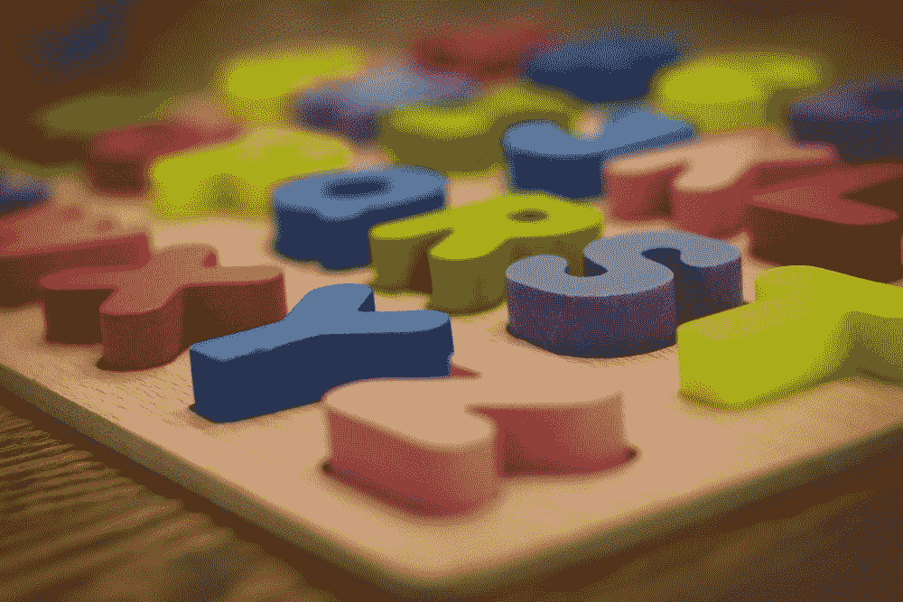

# 向外行人解释人工智能

> 原文：<https://towardsdatascience.com/explaining-ai-to-laymen-ccacd5185a77?source=collection_archive---------22----------------------->

## *在聚会上教授人工智能概念的技巧和例子*

图片来自 [Unsplash](https://unsplash.com/photos/JKMnm3CIncw) 上的 Yutacar

作为人工智能爱好者，当朋友或熟人问我们整天都在做什么时，我们会回答一个笼统的说法，如“我从事人工智能应用/研究/等。”由于人工智能如今已成为一个家喻户晓的术语，他们可能会跟进并询问更多细节，这使得环境有些糟糕。这让你处境艰难。显然，人工智能非常复杂，如果你在一个聚会或晚宴上，在短时间内恰当地解释它是很困难的。你想用*你的*知识给人们留下深刻印象，并进行顺畅的交谈，但是*他们的*知识匮乏可能是一个重大障碍。

在一个月又一个月的家庭朋友、老师和同学问我人工智能是如何工作的以及我作为一名人工智能开发者做了什么之后，我想出了一些好的策略和类比来向完全的外行人解释人工智能。这样，每当你和问你 AI 的人说话时，你就不会慌张，也不会让人觉得你不知道自己在做什么。

# 一般提示

***先处理任何误解。***

如果你在聚会上遇到的人对人工智能到底是什么知之甚少，第一步是澄清他们以前的任何错误想法。在我教年轻人或不涉足科技的人的经验中，他们通常认为人工智能系统是一个可以自行操作的机器人意识。如果这些误解没有被消除，当你试图传达人工智能的基础知识时，他们会把他们不正确的想法和你告诉他们的混淆起来。这可能会导致你说话时被打断，让你的思路被转移。最简单的开始方式是让他们“用一句话给我解释一下 AI。”我总是从这个问题开始，因为它让我对他们的知识和他们可能有的任何错误想法有了一个基线。在此基础上，您就有了接下来对话的路线图。

***还记得你是怎么学会 AI 的吗。***

解释人工智能的最好方式是用你最初被教导的方式来教导它。对我来说，我第一次接触 AI 和 ML 是由我爸爸介绍的，他描述了机器使用数据进行学习。如果你像我一样，在第一次学习时没有背景知识，使用你所学的策略会非常有效。我爸爸解释说，机器可以获得大量数据来学习，当你进行逻辑思考时，这很有意义。询问人工智能的人很可能能够理解逻辑解释，所以只要想想是谁教你的，并遵循那些相同的步骤。

***不要进入数学。***

既然你很聪明，你的朋友可能也很聪明，但这并不意味着你应该开始向他们描述反向传播和梯度下降。奇怪的是，我看到很多人直接进入了如何优化模型参数的描述，这似乎是一种过于复杂的方式来教授一个完全外行的人工智能。在聚会场合，你只有很短的时间来表达你的观点。你可能认为证明你懂高级数学会让你看起来很聪明，但事实上，人们会更看重沟通技巧。如果你能用简单的方式将一个复杂的话题传达给门外汉，他们会认为你比你给他们讲微积分要聪明得多。

***言简意赅，善于演讲。***

这是一个向任何人解释任何事情的通用提示。但是，在解释 AI 这样的高级领域时，这一点尤为重要。你展示自己作品的大部分经历都是在小组会议或讨论会上，在这些会议上，每个人都很好地理解了你所解释的内容。因此，你可能更习惯于使用聚会上你的朋友不会理解的行话和术语。混淆视听是最糟糕的情况——它让你看起来好像不知道自己在做什么。确保在向外行观众演示时，使用外行术语和普通语言。做一个自信的演讲者，让他们经常提问。记住你只有很短的时间，因为你是在一个聚会上，所以你必须快速工作。他们问的问题越多，他们自己就越能把想法整合在一起，这样你的工作就容易多了。

# 简单的类比

AI/机器学习的基本前提是，计算机使用数据来学习底层模式，并根据这些数据进行预测。对于没有计算机科学背景的人来说，这种说法有点复杂。所以，让我们使用人工智能建立的原理——人类学习。几乎任何人都应该能够理解人类是如何学习执行新任务的，就像你的朋友们自己试图学习新事物一样。

***数学考试***

让我们举一个大学和高中的例子——准备数学考试。这是我过去几个月的类比。

当我准备数学考试时，我总是做练习题。为了在数学考试中取得成功，我需要理解或预先了解我正在练习的概念，我们可以忽略这一部分。试图解释参数如何以预训练的直觉的某些方式初始化不是一个好的第一步。我的目标是尽可能多地答对数学问题，以便在考试中获得 A。

打个比方，学生将是 AI 系统，教科书问题将是训练数据，答案关键将是标签，实际考试是测试案例。这是解释的设置。你必须确保他们明白从**例子**中练习是一种很好的学习方式。

安妮·斯普拉特来自 [Unsplash](https://unsplash.com/photos/JexAuNCfefs) 的照片

现在我们可以解释人工智能的训练是什么样的。训练的第一步是把所有的练习题做一遍。接下来，你要给你的答案打分，看看你错了多少。当你知道你错了什么，你会重新做同样的问题。然后再给他们打分，看看你错在哪里，再重新做一遍。坚持做下去，直到你觉得准备好了。正如我们所看到的，每次重复这些问题就像是在为另一个时代进行训练。与答案匹配并确定你做错了什么就是计算损失并更新你的参数。

这个例子是有效的，因为大多数人都做过类似的准备考试的程序。使用相关的类比可以减少你解释自己的次数，因为不管是谁在听你说话，他都可以自己把事情联系起来。

一旦你解释了每一步，就用更专业的人工智能术语来解释。所以如果你刚刚解释完如何纠正你的答案，快速描述一下什么是损失函数。确保遵循一般提示，并在更高的层次上解释它们，例如，仅仅将损失计算称为“惩罚”就足以让某人明白你在说什么。

***儿童玩具***

另一个很好的例子是为初学走路的孩子设计的玩具形状解算器，比如 [this](https://www.google.com/url?sa=i&url=https%3A%2F%2Fwww.amazon.com%2FPlan-Toy-Shape-Sort-Out%2Fdp%2FB00000ITIV&psig=AOvVaw1IbA4TJ7YfL30sIBogH_Lv&ust=1622306342894000&source=images&cd=vfe&ved=0CA0QjhxqFwoTCJDiqZzo7PACFQAAAAAdAAAAABAK) 或者下图中的那个。使用这种玩具，幼儿的任务是将特定的形状插入与形状匹配的孔中。对于没有什么先验知识的孩子来说，这个任务几乎是不可能的。

图片来自 [Unsplash](https://unsplash.com/photos/5jtwRBB3CdI)

我们可以用这个例子来说明，AI 模型在学习的时候往往没有先验知识，这也是为什么要花这么多数据和时间来训练的原因。蹒跚学步的孩子必须预测积木将适合哪种形状，一旦尝试，他可以从父母那里得到反馈，或者只是知道它不适合。这是损失计算过程，因为每次幼儿看到形状是否适合各自的洞，它将增加知识并再次尝试。下一次，他们更有可能答对。这个启发式的过程就是 AI 系统的学习方式，在给外行人解释的时候，应该能很快理解。每个人都明白试错的过程，他们只是不知道启发式是什么意思。这个例子更适合快速聊天，因为你不能深入聊天。

***高级话题***

这些例子甚至可以扩展到更高级的 AI 概念，如半监督学习或自监督学习。如果你想解释半监督学习，谈谈数据收集是一个大问题，为了类比，解释你有一些没有答案的数学问题。直觉上，不管怎样，做没有答案的问题是一个好主意，但是为了从中学习，你必须从有答案的问题中利用你的知识。为了解释自我监督学习，使用学生以前在课堂上做的热身问题的想法。你会把问题拿出来，自己修改，创造一个不同的解决方案，然后解决问题。即使没有解决方案，这也会让你理解问题的基本结构。

然后，您可以转而谈论现实世界的数据收集和标注是如何具有挑战性的，这促使使用高级策略来最大限度地利用可用数据。对于教科书，请注意，有些教科书的问题有限，只有奇数问题有答案，但做偶数问题仍然是有帮助的，不管你是否知道自己是否答对了。正如你所知道的，有许多很好的类比可以非常有效地表现人工智能的基本概念。

# 最后的想法

作为人工智能开发人员，我们有一项更复杂的工作要向外行人解释。但幸运的是，解释它真的很容易，因为人工智能是建立在人类学习的基础上的。你可能有聪明的朋友，所以当有人提问时，描述人工智能如何工作应该是一种令人兴奋的体验，而不是尴尬的体验，并且注意到他们何时开始明白你在说什么是非常有益的。如果顺利的话，对话会非常有趣。通过在新的技术革命领域工作，确保你可以向想学习的人恰当地传达人工智能，不仅给他们留下深刻印象，而且让其他人对人工智能有正确的看法。