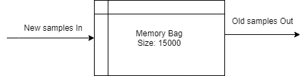

# 使用电影宗旨解释开放人工智能环境的双 Q 学习

> 原文：<https://towardsdatascience.com/explaining-double-q-learning-for-openai-environments-using-the-movie-tenet-816dc952f41c?source=collection_archive---------14----------------------->

## 带着钦佩而不是剧透。如果你没看过这部电影，这不是问题。看看基于 CNN 的双 DQNs 如何解决你的[***OpenAI******健身房***](https://gym.openai.com/) 问题！


红色在左边前进，蓝色在右边后退图片作者

## 请阅读:

这个帖子绝不是为了吸引点击的人。我向你保证，在实际的主题上不会有任何妥协，我们会在任何需要的时候使用电影的类比来增加阅读的乐趣。

> 不是一种感觉，而是一种波动。

# 没有剧透

作为一个粉丝，我理解我们中的一些人因为疫情还没有看这部电影，因此在这篇文章中，绝对不会有剧透。我们只讨论一些让电影惊艳的概念，而不是电影，你不需要看电影***来阅读这篇文章。***

**Tl；博士:【https://github.com/perseus784/Vehicle_Overtake_Double_DQN】<https://github.com/perseus784/Vehicle_Overtake_Double_DQN>**

*   *与解释机器学习所有概念的帖子不同，在这里，我们专注于项目的学习。每个元素如何影响我们的项目，以及如何设计这些将是主要的焦点。*
*   *这一点很重要，因为你可以通过原始论文以及互联网上不同帖子的其他精彩文章更好地了解概念和理解，但如果你打算自己实施一个，这种方法将有助于你了解实际障碍。*

# *这个计划*

*   *基础知识(只是为了让它不碍事)*
*   *要求、环境和系统配置*
*   *深度强化学习*
*   *模型架构*
*   *钳形运动*
*   *该算法*
*   *后代*
*   *外卖食品*
*   *结果*
*   *原则*

# *基础*

> ***强化学习** (RL)是机器学习**的一个领域**关注的是智能代理应该如何在环境中采取行动，以最大化累积回报的概念。*

## *为什么？*

*在人工智能的其他方法中，我们的模型有一个特定的目标来学习并相应地调整参数。但是在这里，我们让模型选择它想学的东西，只是基于它从做一个特定的动作中得到的回报。*

*这很重要，因为我们人类不会为每项任务单独训练。我们只考虑回报，用解决任务的技能武装自己。我认为 RL 是迈向更通用的人工智能的第一步，而不是一个任务定制的人工智能。如果你想学习一个新的环境/任务，只要改变你得到的奖励。模特也应该学习你的新环境。*

## *怎么会？*

*我们可以使用 RL 来训练一个代理来完成任何任务。这与我们人类的工作方式非常相似。*

> *做点工作，吃点糖果。*
> 
> *做更多的工作，得到更多的糖果。*
> 
> *做不好/无效的工作得不到糖果。*

*够简单吧？在这里阅读更多信息:[https://medium.com/@ipaar3/saturnmind-94586f0d0158](https://medium.com/@ipaar3/saturnmind-94586f0d0158)*

*它像一个婴儿。把婴儿放在任何地方，它都会根据每一次行动所获得的回报来适应所处的环境。*

## *这有用吗/我应该继续吗？*

*这篇文章的目标读者是想学习深度强化学习的人，这是一种基于深度学习的强化学习方法。如果你对 Deep RL 的任何方面感兴趣，如何创建一个可以自己学习玩游戏或处理任务的代理，你可以继续这篇文章。*

*希望获得一些关于深度 Q 学习、双 Q 学习及其实际实现的好见解的人是这篇帖子的目标受众。*

*也就是说，在互联网上学习一个新概念没有错，我会尽可能让你参与进来。*

# *要求、环境和系统配置*

*   *Python 3.7*
*   *张量流 2.3.0*
*   *OpenCV 的 Numpy*
*   *你的开放式健身环境。*

*我们的目标是帮助用户汽车在道路环境中自动超越机器人汽车。我们在深度强化学习的帮助下训练用户汽车，奖励功能将在用户汽车每次减速时，每次撞上机器人汽车时以及如果它前面有任何机器人汽车时惩罚用户汽车。由于我们使用来自环境的原始像素作为我们的状态空间，我们可以容易地改变环境和奖励函数以适应新的问题。*

*   *这里使用的 OpenAI-Gym 环境是一个[高速公路环境](https://github.com/eleurent/highway-env)，它为我们的 RL 实验提供了一个干净的管道。如果你还没有注意到，由于在实现基于 RL 的环境中可能有很多版本和变化，OpenAI 将这个过程标准化了。*
*   *所以，任何你用 OpenAI 得到的环境，比如环境，将会有相同的获得奖励，变量和游戏统计的格式。对于我们的任务，我们将从[到这里](https://github.com/eleurent/highway-env)获取公路环境，如下所示。*

**

*作者拍摄的公路环境图片*

## *主角:*

*在这个环境中，我们要训练我们的智能体(*主角*)通过直接摄取一个图像，输出一个动作，来学习超车我们环境中的车辆。但这并不意味着相同的管道对任何其他情况都没有用。正如我前面提到的，同样的代码可以应用于一个非常不同的问题，因为我们遵循的是 [***体育馆格式***](https://gym.openai.com/) 。*

*请查看动物园的例子，通过修改几行代码就可以构建出什么。下面的格式对于所有的环境都是一样的，环境可以通过修改第 3 行的代码来替换。*

```
***import** gym
**import** highway_envenv = gym.make("highway-v0")
observation = env.reset()
done =Falsewhilenot **done:**
  env.render()
  action = agent(observation) *# your agent* 
  observation, reward, done, info = env.step(action)
  if done:
    observation = env.reset()
env.close()*
```

***系统配置:**由于网络架构将涉及到几个 CNN，因此最好有一台配有像样的 GPU、超过 4GB 虚拟 RAM 和 4GB 系统 RAM 的机器。*

*代号:[*https://github.com/perseus784/Vehicle_Overtake_Double_DQN*](https://github.com/perseus784/Vehicle_Overtake_Double_DQN/blob/main/run.py)*

# *深度强化学习*

*简单来说，深度强化学习只是强化学习，但我们将使用神经网络来学习我们环境的策略，而不是 Q 表。*

## *为什么？*

*   *我们都知道神经网络在学习模式方面很有效。为了投入使用，我们用神经网络代替了 RL 算法的 Q 表。*
*   *这样做的好处是多方面的。首先，我们不需要为环境中的每个状态记忆单独的策略。这意味着，我们现在可以在更大的环境中进行 RL，而没有内存限制。为大型环境的每个状态制定一个策略将导致 Q 表的规模呈指数级增长。*
*   *其次，我们现在可以学习更复杂的政策，这些政策需要时间上的理解。旧的 RL 不能考虑环境以前的状态，而现在，dqn 可以学习采取一系列步骤，并在此基础上进行推广。*
*   *最后，我们可以有不同类型的网络输入，如图像、图像序列甚至数字序列。这可以是 CNN 和 rnn 的输入，它们分别在理解这些数据类型方面非常强大。*

# *模型架构*

*该项目的最令人兴奋的部分是为给定的问题选择正确的神经网络。虽然我们可以使用一个普通的神经网络来学习状态并给出政策，但最好是建立一个更擅长处理和处理图像的 CNN。做出这个决定是为了让我们可以使用相同的网络来解决没有定义状态的问题，并给出我们看到的原始输入，从而节省一些数据工程工作。*

*最初，我用一个像模型一样的 MobileNet V2，但后来测试时意识到它对我没有帮助，最好建立我们自己的网络来学习任务。*

**

*作者的建筑形象模型*

*   *拍摄四幅连续的环境图像并作为输入。这包括我们的特工在环境中移动。*
*   *我们的网络具有如上图所示的架构，层块基本上由多个卷积层和一个 MaxPool 层组成。*

**

*作者图片*

*   *在架构中引入 Dropout 是为了避免学习更多的 about 图像，让网络学习我们的任务。这样，我们迫使网络了解任务和策略。*
*   *该网络从 200×100×4 尺寸(4 个堆叠灰度帧对应 4 个尺寸)到 9x3x512 特征地图。下图显示了使用的卷积块数、每个卷积块数的功能图以及池层。*
*   *然后，这些特征地图被展平并馈入两个密集层，每个层有 512 个隐藏单元。*
*   *这种架构有助于网络学习代理的复杂目标。[我们的网络](https://github.com/perseus784/Vehicle_Overtake_Double_DQN/blob/main/deepnetwork.py)包含大约 9M 个参数。*

*代号:【https://github.com/perseus784/Vehicle_Overtake_Double_DQN】*

# **钳形运动**

**到目前为止，我们已经看到了一个简单的神经网络如何取代 q 表方法，但经过实验，这种方法有很多问题，可以通过使用两个不同的网络来克服，这两个网络同时运行，使我们的代理更好。**

> **钳形运动或双重包围是一种战术，在这种战术中，部队同时攻击敌人阵型的两侧。**

## **怎么了?**

**深度 Q 学习在理论上很有意义，对吗？但是当尝试实现时，一旦复杂性增加一点，它的表现就不太好了。**

****

**图片来自【arxiv 的双 DQN 纸**

**上面的等式是通过取可用策略的最大值来计算州的新策略的贝尔曼等式。然而，这是因为它采用下一个状态的最大 Q 值的估计，并执行动作，如上面的等式所示。在网络学习期间进行的这种高估会引入最大化偏差。**

*   **简而言之，网络倾向于高估每个状态的具有较高值(最大值)的策略，这可能导致策略收敛波动，使得收敛非常慢。**
*   **这是有意义的，因为我们同时在评估新策略和更新它。这肯定会导致训练过程的中断。**
*   **更简单地说，我们不想同时学习和玩这个游戏(但它是理想的)。实际上更好的做法是玩游戏，从你的错误中学习，提高水平，犯新的错误并从中学习。**
*   **所以，这里我们不是单一的网络，我们要引入另一个网络。估计器中的一个将集中于最大化策略的 Q 值，另一个用于更新该值。**

## **红蓝队:**

****

**作者图片**

**在电影《特尼特》中，他们做了一种叫做 ***太阳穴钳形运动*** 穿越时间来获取关于环境的知识，同时进行攻击。也就是说，一个小组将专注于收集事件发生时的环境知识，而另一个小组将利用这些知识攻击敌人。**

****

**作者的双 Q 学习图像**

*   **同样，我们将有两个网络在运行。一个将是我们的训练网络(*红队*)，它用从游戏中获得的数据训练我们的代理，另一个将是预测网络(*蓝队*)，它播放环境并为训练网络收集新的经验以保存在*存储器*中。**
*   **我们可以看到，随着时间的推移，代理获得的奖励会越来越高，因此这种操作会继续下去。您还可以看到使用我们的两个网络计算保单的最新数学公式。**

****

**arxiv 双 DQN 论文[双 Q 学习图像的修正贝尔曼方程](https://arxiv.org/pdf/1509.06461.pdf)**

*   **[这](https://arxiv.org/pdf/1509.06461.pdf)是他们介绍这项技术的原始论文，它是深度 RL 世界的主要助推器之一。我认为现在双 Q 学习这个名字以后用起来很好。**

# **该算法**

**我们已经准备好了主角和环境，可以开始训练了。由于这是一个在线培训程序，数据是实时收集、处理和反馈的。**

## **工作流程:**

****

**作者提供的培训管道图像**

*   **你可以在图片中看到我们训练程序的伪代码。我们将在下一节讨论ε和内存变量。**
*   **一旦环境启动，我们的预测网络将预测给定状态的行动，并保存从采取行动中获得的奖励。**
*   **这被重复几次，以收集更多的数据保存在存储器中，并避免过于频繁的训练。**
*   **每四次迭代，训练网络将对存储器中收集的数据进行训练。一旦网络被训练，该过程继续获得更多的数据。**

```
**memory = [ [current_state, action, next_state, reward, done], ...]**
```

*   *****上面显示的存储器*** 数据结构存储当前状态、代理采取的行动、采取行动后到达的下一个状态、采取该行动获得的奖励以及情节是否结束。**
*   **对于每 10 集，我们用本地保存的目录中训练好的模型更新我们预测的网络。我认为这是一个拉平的过程。**

****

**作者的培训流程图**

*   **左图显示了我们的培训流程。训练网络基本上是在本地训练和存储模型。另一方面，每 10 集的预测网络通过加载本地存储的模型来更新自身。**
*   **这种拉平过程使得训练和收敛非常顺利，并且从直观的角度来看，随着时间的推移，代理学会犯比愚蠢的错误更好的错误。**

## **培训:**

**培训持续数小时，最好使用 Tensorboard 记录所有日志，以便实时跟踪和可视化。我们在这里跟踪的两个主要指标是亏损和平均阶段性回报图。**

****损失:****

*   **损失图将显示网络在每个时期后学习得更好，因为它显示网络总体上做出更好的决策。**

****

**作者的损失图**

*   **我们在该系统中优化的损失是分别通过训练网络和预测网络的预测和地面真实值之间的均方误差。**
*   **请看一下[这段](https://github.com/perseus784/Vehicle_Overtake_Double_DQN/blob/main/deepnetwork.py#L77)代码，看看我们是如何分别从训练网络和预测网络得到预测和地面实况的。**

```
**loss = tf.keras.losses.mean_squared_error(ground_truth, prediction)**
```

*   **我们使用新的贝尔曼方程，我们必须找到预测的政策 Q 值和正确的政策之间的损失。**
*   **在我们将学习率降低到最小值后，来自训练网络的损失图更加平滑，并且我们还使用 Tensorboard 平滑了损失值。这个我们简单讨论一下。**

****平均情景奖励:****

*   **奖励图将显示随着纪元的增加，奖励也将增加，因为随着网络学习更多，它将执行给予它最大奖励的动作。**

****

**作者的奖励图**

*   **在他们开发双 DQN 技术的原始论文中，作者运行了 2.5 亿个时代的环境，与我们相比，我们只运行了 3K 时代的训练。**
*   **完美的政策不会因此而实现，但关键是要学习过程，而不是实现理想的结果。**
*   **特别是，在我们的实验中，我们给了更大的权重，让汽车保持在道路的右侧，以获得更好的回报。作为一个副作用，汽车在道路左侧行驶时会引发更多的事故。这有助于我们理解为强化学习任务设计奖励机制的复杂性。**
*   **一般来说，随着时间的推移获得越来越多的奖励是了解我们的代理正在学习我们打算学习的任务的一个好方法，甚至从视觉上来说，随着情节的增加，代理表现得很好，犯的错误也越来越少。**
*   **精确度指标并不能很好地衡量我们的网络在强化学习中的表现。因为可能是 Q 值死记硬背而不是学习任务的结果。**

**代号:[T3【https://github.com/perseus784/Vehicle_Overtake_Double_DQN】T5](https://github.com/perseus784/Vehicle_Overtake_Double_DQN/blob/main/deepnetwork.py#L125)**

# **后代**

**老实说，这是这篇文章最重要的部分。我认为这些实验和决定更重要，因为这些是你在试图建立一个类似的项目时将面临的障碍或障碍。**

> **后代——一个人的后代。**

**在我们构建管道时，添加/调整系统的一些关键元素以获得最大收益是非常重要的。这是通过创建多个版本的网络，并试验不同的超参数，甚至一些增加我们训练价值的机制来实现的。最后，选择合适的。**

> **你看…特尼特不是在过去创立的，它将在未来创立。**

## **体验回放**

*   **当代理学习和遍历情节时，它会忘记以前学习过的经验。因此，当我们训练时，递归地提醒网络它学到了什么是很重要的。**
*   **做到这一点的方法是使用体验重放机制。这种机制有助于网络在训练时通过随机选择来记住它的经历。**

****

**按作者划分的内存使用图像**

*   **该程序基本上存储了一个数据结构，其中包含当前观察结果、采取的行动、下一个状态、对该行动的奖励以及该集是否结束。**
*   **另外，我们不想存储整个历史，所以我们有一个 15000 个这样的数据结构的缓冲存储器。**
*   **缓冲存储器基本上是一个固定大小为 15000 的队列，当它积累更多时，就会弹出旧的存储器。网络使用该内存池来选择其批次并在其上进行训练。**
*   **假设我们的代理玩这个游戏，它学习通过一个特定的障碍。然后，当它继续前进到下一个障碍时，我们不希望它忘记从上一节中学到的东西。因此，该机制有助于深度 Q 网络根据经验进行训练，并在每个训练期间刷新其学习。**

## **探索与开发**

*   **当代理从第一次训练开始就过度适应它在一种情况下的经验，并且不探索获得更多奖励的新选项*(注意:不要将这与神经网络过度适应混淆)。***
*   **也就是说，如果代理发现了一些次优路径或处理这种情况的方法，因为它没有任何负面影响，所以它会选择这个值。**
*   **这最终导致代理人满足于次优的解决方案，而报酬从未达到理想状态。**

****

**作者的勘探与开发图表**

*   **为了克服这个陷入刚性状态的问题，我们可以使用一个叫做ε的值。**
*   **Epsilon 是一个情节衰减变量，从 1 开始衰减到 0，直到总情节的一半在该会话上运行。**
*   **对于环境的每个渲染，我们的代理决定随机探索动作空间或者从预测的网络动作中选择一个。这可以通过如下代码实现:**

```
**if np.random.random() > epsilon:
     action = np.argmax(get_prediction(state)) **#Exploitation**
else:
     action = np.random.randint(0, no_of_actions) **#Exploration****
```

*   **ε值在代理的探索或开发模式之间决定，并且它随着时间而减小。这是在培训的前半部分完成的，也就是说，在我们的案例中，我们在 3000 集的 1500 集内将ε值从 1 降低到 0.1，如上图所示。**

## **超参数调谐**

*   **通常的神经网络训练涉及大量的超参数调整，但由于深度学习社区的人们多年来对他们的发现所做的努力，这些年来变得更加精简和容易。**
*   **但是对于深度 RL，尤其是ε、学习速率和批量调整，该过程变得更加复杂。这是非常复杂的，因为每件事都很重要，即使这些参数的微小变化也会随着时间的推移造成巨大的差异。**
*   ****但是对我们有用的是在训练的前半段慢慢降低ε。****
*   *****学习率*** ，另一方面，我们使用默认的 TensorFlow Adam 学习率，但它在训练期间给我们带来了更大的损失波动，因此我们的训练网络使用了降低的 1e-4 学习率。这有助于减少波动损失。**
*   *****批量*** 为最终培训的 32 个。最初，我们使用较高的批量大小，如 256，512，但这些并没有显示出改进，而且偶尔会导致内存耗尽错误。**
*   *****训练频率*** 也是这其中的一个主要因素。训练频率基本上是目标网络在一个时间间隔内应该被训练的次数。代理在环境中每走四步，我们就训练一次网络。这为网络提供了足够的训练间隔以及收集新数据。**
*   *****拉平*** 是我们多长时间更新一次网上或预测网络来传递经验。这是每 10 集做一次，以便随着时间的推移网络预测变得更好，并且不会太多地更新在线网络而导致预测太不稳定。**

**代号:[*https://github.com/perseus784/Vehicle_Overtake_Double_DQN*](https://github.com/perseus784/Vehicle_Overtake_Double_DQN/blob/main/deepnetwork.py)**

# **外卖食品**

*   **先选择你想解决的问题，再选择解决方案。有一个解决方案，或者在这种情况下，一个特定的人工智能技术，并试图使它适合你的解决空间，只是糟糕的工程。**
*   **[OpenAI gym](https://gym.openai.com/) 是我们基于 RL 的实验的惊人资源。一旦了解了格式，我们就可以用同样的方式处理所有的环境。**
*   **要知道，无论我们的假设听起来多么正确，它都会出错。比如，我认为通过使用 MobileNet v2 作为特征提取器，我们永远不会出错，但它对我不起作用。**
*   **我还尝试了一个想法，比如结合我们 CNN 中的一些盗梦空间模块，以获得更好的效果，这些模块来自我之前的项目 [***。这个想法在那个项目中发挥了惊人的作用，但在这个项目中却没有任何改进。***](https://github.com/perseus784/Vehicle_Collision_Prediction_Using_CNN-LSTMs)**
*   **在处理一个神经网络架构的时候，从小的开始，随着你的进展增加复杂性，而不是从一个巨大的模型开始，在那里我们将不能识别出哪里出错了。**
*   **设计奖励函数是 RL 最重要的方面。因为这将决定我们的代理必须学习的任务。例如，在我们的例子中，我们对停留在最喜欢的车道上的代理人给予了奖励，但这引起了不希望的效果，如在其他车道上制造更多的碰撞，因为代理人总是试图停留在最右边的车道上。**
*   **总是考虑我们设计的奖励功能的分支，这些分支大部分隐藏在明显的地方，但是直观上有意义。**
*   **我们可以制作一个复杂的奖励函数来覆盖所有的边缘情况，并运行它一百万次迭代，最终会使它变得完美。但重点是创建一个通用的方法，你可以只输入原始图像(而不是每个任务需要设计的状态)和训练代理的奖励。**

****

**来自[way mo 网站](https://sites.google.com/view/waymo-learn-to-drive/)的鸟瞰图**

*   ****不是噱头。这个项目不仅仅是展示 RL 的力量。许多自动驾驶研究使用这种俯视方法来学习车辆代理的控制机制。****
*   **这包括 Waymo、特斯拉、优步等。该图显示了用于培训 SDCs 控制代理的输入内容，这有助于导航和巡航控制。**
*   **在今天，人工智能领域的教师比学生多。我只是作为一个学习者而不是一个大师来提出这一点。**

# **结果**

**请查看下面的每张图片，了解我们的代理如何通过训练超越该领域的其他代理。[这里的](https://youtu.be/sH00TWLwBoA)是一分多钟的连续录像。你可以看到它在左侧比右侧犯更多的错误，因为在我们的奖励函数中最喜欢的车道偏向。**

************************

**由作者训练的代理演示图像**

# **原则**

**我今天的学习，明天属于你。使用它，不要重复发明轮子。**

> **宗旨:被一个团体或运动坚持的原则。**

****

**红色在左边前进，蓝色在右边后退图片作者**

**总的来说，该项目为我们提供了关于深度 RL 的原始像素输入、网络架构选择、超参数调整、奖励函数设计、体验回放、探索与开发机制以及双重深度 Q 学习的良好知识。有了这个，我们可以进一步将这个项目扩展到更先进的技术，如 A2C 或 DDPG 的连续空间学习。**

**这里看一下代码<https://github.com/perseus784/Vehicle_Overtake_Double_DQN>**。****

**完整演示:**

**[https://youtu.be/sH00TWLwBoA](https://youtu.be/sH00TWLwBoA)**

**其他职位:**

**[https://medium.com/@ipaar3](https://medium.com/@ipaar3)**

> **！eraC ekaT**