# 解释我如何在以数据为中心的新竞争中名列前茅

> 原文：<https://towardsdatascience.com/explaining-how-i-reached-the-top-ranks-of-the-new-data-centric-competition-888fc8e86547?source=collection_archive---------8----------------------->

## [实践教程](https://towardsdatascience.com/tagged/hands-on-tutorials)

## 继吴君如本人代言(！)关于我的上一篇文章，很自然地分享了所有的技巧(带代码！)关于我如何应对 DeepLearning.ai 的新挑战。

*10 月 21 日编辑:我以优秀奖的身份被选为 8 名获奖者之一(见下文)。*

[万用眼](https://unsplash.com/@universaleye?utm_source=medium&utm_medium=referral)在 [Unsplash](https://unsplash.com?utm_source=medium&utm_medium=referral) 上拍照

# 比赛解释…又来了！

如果你还不熟悉 DeepLearning.ai 几周前推出的以数据为中心的新挑战，你可以看看我几周前写的描述这一挑战的文章。

不确定这是否值得？只是听从吴恩达的建议😉：

截图自 Andrew NG 对我上一篇文章的背书—2021 年 8 月
[https://www . LinkedIn . com/feed/update/urn:李:活动:6830591493435224064/](https://www.linkedin.com/feed/update/urn:li:activity:6830591493435224064/)

<https://medium.com/geekculture/a-deep-dive-into-andrew-ng-data-centric-competition-eb2bc0886005>  

如果你赶时间，**长话短说**:比赛的目标是产生尽可能好的一组图片来训练预定义的模型(ResNet50)识别罗马数字。该竞赛提供了一个大约。3000 张图片，包括嘈杂和贴错标签的数字，如下图所示:

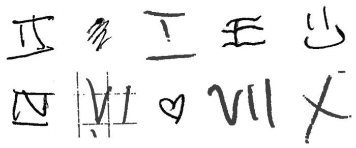

从训练数据集中提取-由作者在 DeepLearning.ai 的授权下编译

# 让游戏开始吧！

我将介绍不同的步骤，以平稳的方式达到良好的性能，但这显然是我为了找到最佳组合而进行的多次测试和试验的结果！

如果您想进一步探索我的解决方案，我还在 GitHub 上创建了一个专门的资源库(本文末尾有链接)。

## 1.图片评论

第一项任务可能是要求最高的:查看每张照片，检查一些标准。以下是我用过的一些:

*   这看起来像罗马数字吗？(如果没有，我们就应该去掉！)
*   **图片标注正确吗？**(例如。“II”在“III”文件夹中，反之亦然)
*   **什么是数质？**(评分从 1:好到 4:差)
*   **背景质量如何？**(等级同上)
*   **什么是字体风格？**(“Arial”或“Roman”)
*   **数字的确切格式是什么？**(“viii”或“VIII”)
*   我们能应用对称吗？(水平或垂直对称通常适用于“I、II、III 或 X”数字，但不适用于“I”、“II”或“VII”)

以下是我评估的三个例子(以表格形式存储):

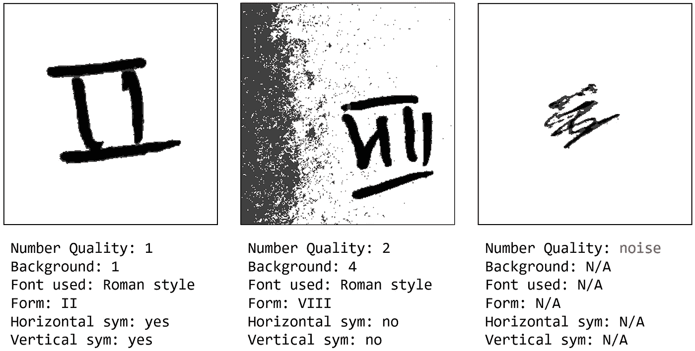

图片分类示例—按作者分类的图片

在查看 3000 张照片时(这花了我大约 2 到 3 个小时😅)，我有时会有“似曾相识”的感觉，我开始怀疑数据集中是否隐藏了一些重复项？这并不奇怪，所以我也必须考虑到这一点。

照片由[约尔根·哈兰](https://unsplash.com/@jhaland?utm_source=medium&utm_medium=referral)在 [Unsplash](https://unsplash.com?utm_source=medium&utm_medium=referral) 上拍摄

我还设计了一个简单的函数来自动检查文件夹的内容，以评估我将执行的不同操作的结果。像我后来在笔记本中使用的所有其他函数一样，我将它存储在一个专用的“dcc_functions.py”中(可以在 GitHub 存储库中找到)。

以下是初始数据集的输出:

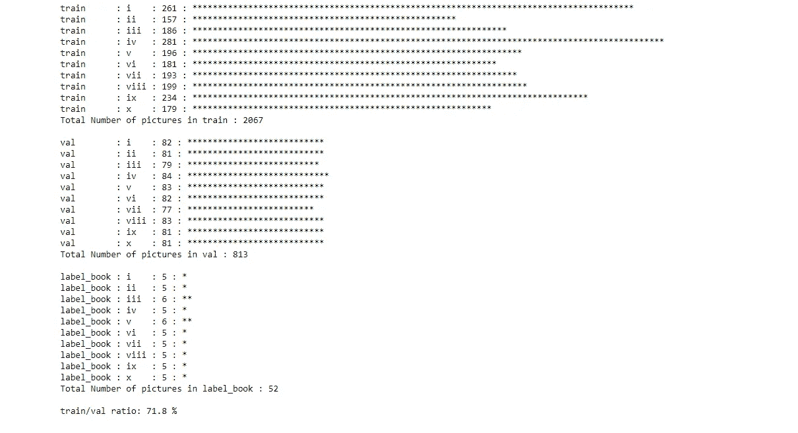

**folders_sumary** 由 **Pierre-Louis Bescond** 输出

## 2.数据集清理

**2.1 噪声消除**

我首先删除所有我认为纯粹是噪音或者至少是噪音太大而无法正确训练模型的图片。这显然是个人的选择，每个参与者可能都有不同的选择。我确定大约。要删除的 260 张图片(相应的列表存储在 GitHub repo 上的 Excel 文件中)。

**2.2 去重**

如前所述，我感觉有些照片完全一样，但手动识别它们是不可能的。我知道有一些技术可以解决这个问题:

*   将大小相同的文件配对 …但是会出现很多误报
*   **配对大小相同的文件&配置**(如两个“II”或“viii”)
*   **按文件统计配对文件**(使用，例如。， [PIL 的 ImageStat](https://pillow.readthedocs.io/en/stable/reference/ImageStat.html)
*   **利用结构相似度指标对文件进行配对**(此处[有说明](/how-pictures-structural-similarity-can-boost-your-computer-vision-projects-3dbb721a0fa))
*   **根据文件的“哈希”号将文件配对**

由于这不是一个“生死攸关”的问题，我决定使用第二种解决方案，这种方案既简单又容易实现。剧本([此处](https://github.com/pierrelouisbescond/data-centric-challenge-public/blob/main/dcc_find_duplicates.ipynb))确定了大约 200 对双胞胎照片，其中 53 张实际上是真正的复制品(下面是一些例子):

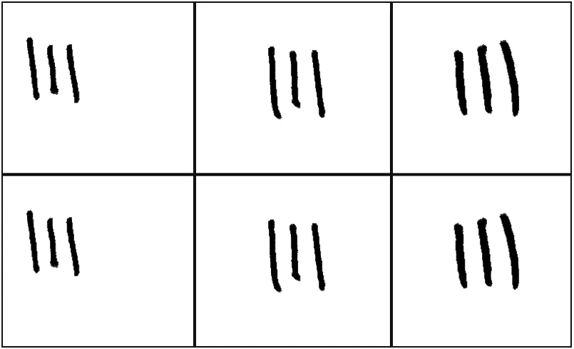

由**DCC _ find _ duplicates . ipynb**通过 **Pierre-Louis Bescond** 识别的双胞胎对的例子

**2.3 移动右侧文件夹中的一些图片**

没必要在这上面花太多时间:当一张照片被贴错标签时，我只是把它移回到它所属的文件夹。

**2.4 前卫还是不前卫？**

在我们继续之前，我想分享一个有趣的发现:我看了两次照片:一次是在我参加比赛的时候，另一次是在我对照片有了更好的想法的时候。

当我第一次查看原始图片时，我已经排除了许多看起来太模糊而无法训练模型的“边缘案例”。

但比赛开始几周后，我开始习惯这些尖锐的案例，并以不同的方式考虑它们，比如:“嗯，包括这个案例可能是好的，以教导模型这个案例可能会发生。”我最后添加了大约。80 张图片到数据集。

与直觉相反的是，这一新选择的性能正在下降，包括更尖锐的图片。怎么会这样

参与者之一 [Mohamed Mohey](https://medium.com/u/6a49733f05dd?source=post_page-----888fc8e86547--------------------------------) 在专门的对话主题中强调，32x32 变换(在训练前应用于数据集)有时会完全改变图片的本质，如下例所示:

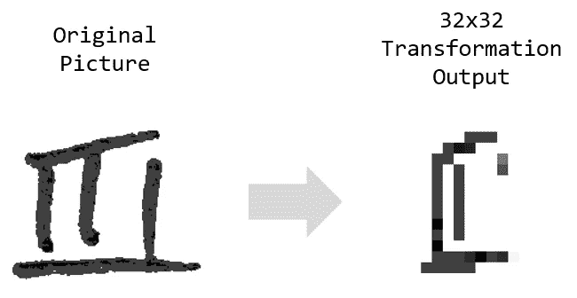

32x32 转换前后的相同图片-图片由作者提供-归功于 [Mohamed Mohey](https://medium.com/u/6a49733f05dd?source=post_page-----888fc8e86547--------------------------------)

我们可以观察到，由于这种 32x32 的转换，一个明显的“III”正在变成一个似是而非的“II”，解释了为什么一些尖锐的案例不一定会给模型带来有价值的信息。

在 32x32 的转换后再看一遍照片可能是件好事，但我没有！

**2.5 使用“标签簿”图片训练模型**

DeepLearning.ai 的组织者提供了一组 52 张图片，这些图片不在“train”或“validation”文件夹中，以评估我们的模型在 ResNet50 训练结束时的表现。

这是一个很好的方式来了解模型在最终和隐藏数据集上将如何表现，但由于排行榜上显示的分数，我也“猜测”到**对隐藏数据集的最终评估包括 2420 张图片** ( [请参见这里的相应笔记本](https://github.com/pierrelouisbescond/data-centric-challenge-public/blob/main/dcc_final_dataset_estimate.ipynb))。所以 52 张图片无论如何都不是很有代表性！

所以我干脆把这些图片放在了我的训练文件夹里！越开心，越有趣😁

**2.6 评估增强技术的影响**

正如你可能知道的，在由图片组成的数据集上使用增强技术来帮助深度学习模型识别允许正确推断类别的特征是非常常见的。

我决定考虑其中的几个:

*   **水平和垂直对称**
*   **顺时针和逆时针旋转(10°和 20°)**
*   **水平和垂直平移**
*   **裁剪图片中的白色区域**
*   **添加合成“盐和胡椒”噪声**
*   **将一些图片的噪声转移到另一些图片上**

**2.7 实现海关功能**

第一个功能非常简单，很容易用 PIL、OpenCV，甚至像 ImgAug 这样的“打包解决方案”来实现。我认为分享一些关于我设计的自定义函数的技巧会更有趣😀

***2.7.1 平方裁剪功能***

裁剪操作是一个有趣的操作！由于图片最终将被转换为 32x32 的图片，放大数字所在的区域可能会更好。

但是，如果数字不是“平方”形状，则在转换为 32x32 时，结果可能会失真(如下所示)。我重新设计了该函数，以便裁剪后的输出将始终为方形，并避免这种失真效果:

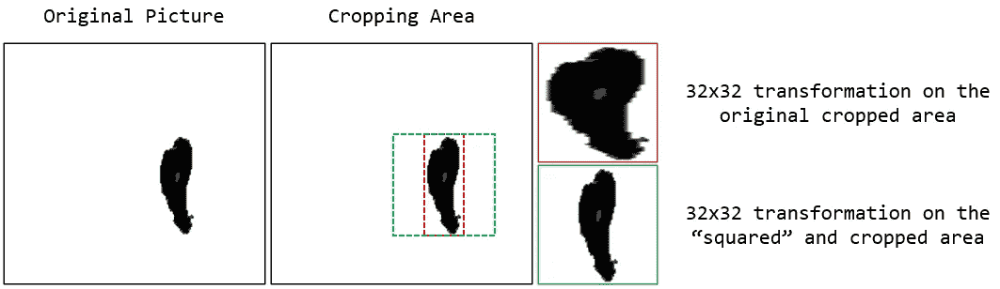

原始和裁剪的可能输出—作者提供的图像

***2.7.2【盐和胡椒】功能***

由于最终评估数据集上的背景可能不总是纯白的，我试图通过添加合成背景来增加图片。

我使用了“salt & pepper”函数，它基本上是将“0”和“1”随机添加到描述图片的 NumPy 数组中:

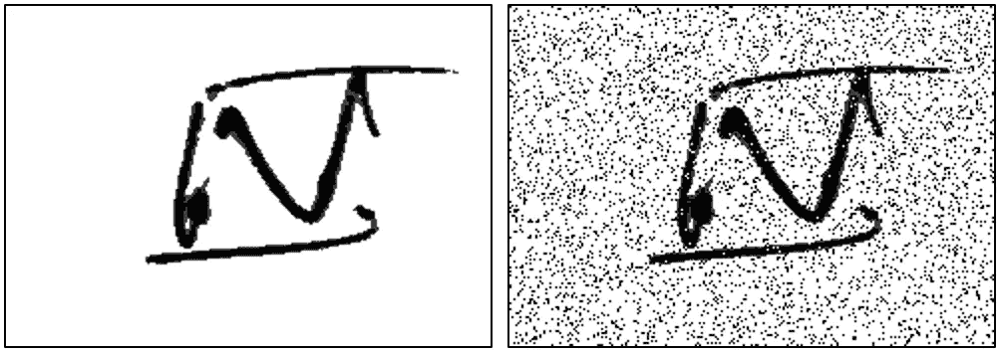

原创和“经验丰富”的图片——作者提供的图片

***2.7.3 背景噪声传递函数***

我对“盐和胡椒”函数的结果不太满意，因为噪声总是均匀的，所以我想了另一种方法给图片添加噪声。

我回收了一些我原本认为不可读的图片，让它们成为一些“嘈杂的背景”的基础。还有一些“背景很重”的图片，我去掉了编号(如下所示)以获得更多的样本。

它为我提供了一个“嘈杂背景库”，里面有 10 张图片，我在应用水平或垂直对称后随机添加到一些图片中:

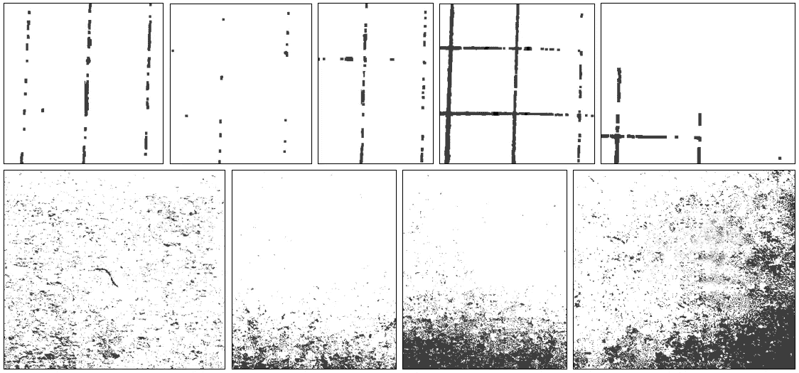

嘈杂的背景银行-作者图片

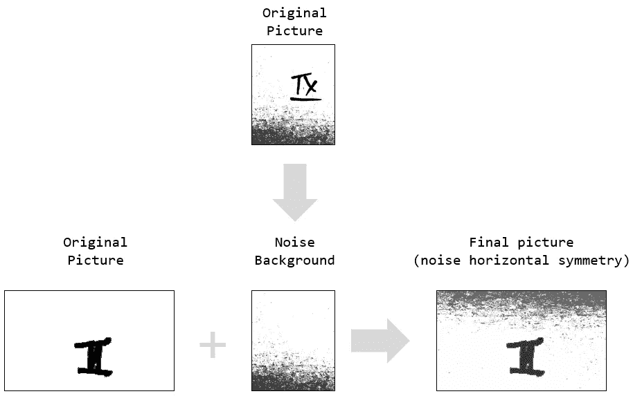

背景噪声转移示例—作者提供的图片

**2.8 选择最佳增量**

由于允许的图片数量不能超过 10.000 个元素，我必须知道哪些转换提供了最高的效果。

我决定通过比较基线(没有转换的干净数据集)和每种增强技术的单独性能来对它们进行基准测试(总结如下):

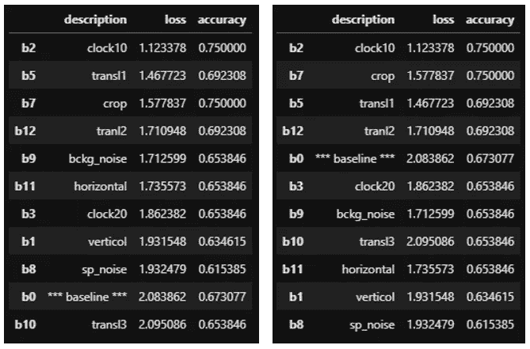

增强的影响，基于损失或准确性-图片由作者提供

我们可以观察到旋转、平移和裁剪带来了比其他方式更大的影响，所以我决定把重点放在这些方面。

# **和“瞧”！**

由于该过程是随机的(以 50%的概率和一些随机参数应用变换)，脚本的每次迭代将产生图片的唯一组合。

我的许多测试产生了大约 84%的性能，而最高的竞争对手达到了 86%(基线为 64%)。我猜是光荣的😅

将有一些额外的调整要考虑(如创建我自己的图片，并将其添加到数据集，但我选择只依赖于提供的初始图片)。其他人可能也尝试过！

# 竞争对手表现的全球概览

可能还值得一提的是，我分析了竞争对手在挑战的前几周(直到 2008 年 6 月)的表现，我们可以看到大多数参与者很快达到了可接受的表现，很快就达到了 75%及以上:

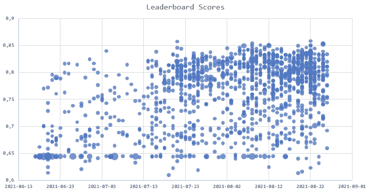

参赛作品的性能分析—作者提供的图片

# 最后的话

如前所述，**在对数据进行适当的审查/清理，并在不到 30 秒的时间内执行一个脚本之后，您可以轻松地胜过最先进的模型在有噪声的数据下所能产生的结果！**

我真的很喜欢参加这个挑战，根据我的说法，**比“GPU 能力”更需要“新鲜的想法”**，我真的很期待下一次挑战！

我们与其他参赛者和 Lynn(来自 DeepLearning.ai)进行了**许多有趣而丰富的互动**，分享我们对这场“同类第一”竞赛的看法。许多参与者更希望分享他们的观点和发现，而不是在排行榜上名列前茅。

我也知道生成“平均和嘈杂的数据”有多困难…所以祝贺组织者提供了这么好的材料来研究！

当然，我希望你喜欢 DeepLearning.ai 关于以数据为中心的挑战的第二部分！

# 等级

我的解决方案被 Andrew 和他的团队从 2000 多份提交的作品中选中，并获得了荣誉奖(共有 8 名获奖者/团队):

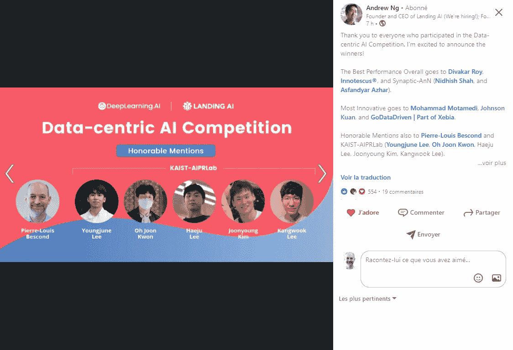

[源链接 dIn](https://www.linkedin.com/posts/andrewyng_thank-you-to-everyone-who-participated-in-activity-6851239083843444736-zuKc)

正如我所承诺的，这里是 GitHub 知识库的链接，欢迎在评论中分享你的经验和/或发现:

<https://github.com/pierrelouisbescond/data-centric-challenge-public>  <https://pl-bescond.medium.com/pierre-louis-besconds-articles-on-medium-f6632a6895ad> 