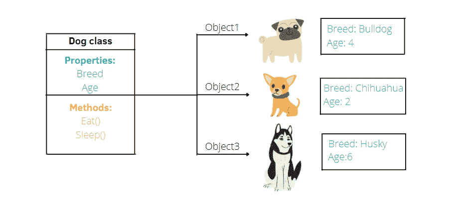
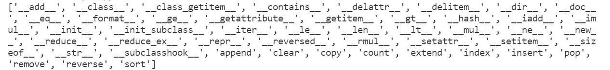

# 用简单的方式解释 Python 类

> 原文：<https://towardsdatascience.com/explaining-python-classes-in-a-simple-way-e3742827c8b5?source=collection_archive---------4----------------------->

## 使用示例理解类的基础



作者插图

当我第一次学习 Python 类时，我发现它真的很复杂，我不明白为什么需要知道它们。在一堂大学课上，教授开始直接解释构建类的语法，而没有解释做这个特定主题的真正意义，并使用非常无聊的例子，使我迷失了方向。

在这篇文章中，我想用不同的方式解释 Python 类。我将开始解释为什么需要知道这些类，并展示一些已经构建好的类的例子。一旦明确了外部环境，下一步就是使用一些例子和插图一步步地展示如何定义类。

目录:

1.  **课程介绍**
2.  **创建一个类**
3.  **构造函数方法**
4.  **神奇的方法**
5.  **实例方法**

# 1.课程简介

当你开始学习 Python 的时候，你肯定遇到过这样一句话:

> Python 是一种面向对象的编程语言

意思是用 Python 编程导致处处被对象包围。在瞬间

我们给一个变量赋值，我们就创建了一个对象。这个**对象**属于一个已经预先构建好的特定**类**，比如数字、字符串、列表、字典等等。根据类的不同，对象会有不同的**属性**和**方法**

让我们来看一些对象和类的经典例子:

```
a = 28
print(type(a))
#<class 'int'>
```

我们定义了一个对象 a，它属于 Integer 类。

```
l = [1,2,3]
print(type(l))
#<class 'list'>
```

这一次，新对象属于 List 类。从对象中，我们可以调用已经在 Python 中预先构建的方法。要查看对象中允许的所有方法，我们使用 dir 函数:

```
dir(l)
```



从输出中，我们可以注意到该类可以提供三种类型的方法:

*   **初始化器方法** `__init__`，这样调用是因为它是初始化对象属性的方法。此外，一旦创建了对象，就会自动调用它。
*   **神奇的方法**是两边有双下划线的特殊方法。例如，`__add__`和`__mul__`分别用于对同一类的对象求和、相乘，而`__repr__`则以字符串的形式返回对象的表示。
*   **实例方法**是属于被创建对象的方法。例如，`l.append(4)`在列表末尾添加一个元素。

# 2.创建一个类

现在，我们将创建一个空类，并在教程中逐步添加部分代码。

```
class Dog:
   pass
```

我们创建了一个名为 Dog 的类，其中`pass`用来表示没有定义任何东西。

```
jack = Dog()
print(type(jack))
#<class '__main__.Dog'>
```

一旦我们定义了 Dog 类，我们就可以创建类的**对象，它被分配给变量 jack。它是使用类似于我们调用函数的符号构建的:`Dog()`。**

该对象也可以被称为**实例**。如果你发现“实例”或“对象”这两个词写在某个地方，不要感到困惑，它们总是指同一个东西。

像以前一样，我们检查对象的类型。输出清楚地指出该对象属于 Dog 类。

# 3.初始化器方法

除了前面显示的代码，初始化器方法`__init__`用于初始化 Dog 类的属性。

```
class Dog:
  **def __init__(self,name,breed,age)**:
    self.**Name** = name
    self.**Breed** = breed
    self.**Age** = age
    print("Name: {}, Breed: {}, Age: {}".format(self.Name,
                                             self.Breed,self.Age))
```

我们可以观察到该方法有不同的参数:

*   `self` 是用作第一个参数的标准符号，指的是稍后将创建的对象。访问属于该类的属性也很有用。
*   `name`、`breed`和`age`是剩余的自变量。每个参数用于存储对象的特定属性值。
*   `Name`、`Breed`和`Age`是定义的属性。**注意这些属性通常不大写**。在本文中，它们是大写的，以突出属性和它们相应的值之间的区别。

```
jack = Dog('Jack','Husky',5)
#Name: Jack, Breed: Husky, Age: 5
print(jack)
#<__main__.Dog object at 0x000002551DCEFFD0>
print(jack.Age)
#5
```

我们再次创建了对象，但是我们也指定了对应于属性的值。如果您尝试运行代码，您将自动获得灰色窗口第二行中显示的文本行。这是检查所定义的类是否运行良好的好方法。

还值得注意的是，初始化器方法是在创建对象后自动调用的。这一方面可以通过打印属性“Age”的值来演示。您可以对其余的属性执行相同的操作。

# 4.神奇的方法

也有可能以更复杂的方式打印相同的信息。为此，我们使用神奇的方法`__repr__`:

```
class Dog:
    def __init__(self,name,breed,age):
        self.Name = name
        self.Breed = breed
        self.Age = age
    **def __repr__(self):**
        return "Name: {}, Breed: {}, Age: {}".format(self.Name,
                                           self.Breed,self.Age)
```

方法`__repr__`采用一个唯一的参数`self`，它可以从这个参数访问对象的属性。

```
jack = Dog('Jack','Husky',5)
print(jack)
#Name: Jack, Breed: Husky, Age: 5
```

如果我们显示创建的新实例，我们可以查看属性及其各自的值。

# 5.实例方法


睡觉还是醒着？保罗·特里内肯斯在 [Unsplash](https://unsplash.com/photos/rXrGRrThBl4) 上的照片。卡尔·安德森在 [Unsplash](https://unsplash.com/photos/jKDFcXwk5Cw) 上拍摄的照片。

实例方法是属于类的方法。作为神奇的方法，它们接受一个输入参数`self`来访问类的属性。让我们看一个例子:

```
class Dog:
    def __init__(self,name,breed,age,**tired**):
        self.Name = name
        self.Breed = breed
        self.Age = age
        self.**Tired** = tired
    def __repr__(self):
        return "Name: {}, Breed: {}, Age: {}".format(self.Name,
                                           self.Breed,self.Age) 
    **def Sleep(self):**
        if self.Tired==True:
            return 'I will sleep'
        else:
            return "I don't want to sleep"
```

在初始化器方法中，我们添加了一个新的参数`tired`，并因此添加了一个新的属性`Tired`。之后，我们定义了一个叫做 Sleep 的新方法:如果属性的值等于 True，狗就要睡觉，否则，它就不睡觉。

```
jack = Dog('Jack','Husky',5,tired=False)
print(jack.Sleep())
#I don't want to sleep
```

狗不累，所以不睡觉。

# 最终想法:

在这篇文章中，我提供了 Python 类的快速总结。我希望你发现这有助于巩固你的课程基础。我没有解释其他类型的方法，静态方法和类方法，因为我想把重点放在最常见的方法上。而且，另一个有趣的话题是[类继承](/master-class-inheritance-in-python-c46bfda63374?sk=7baf37f4749abddf04a61f5787efa50b)，我写的另一篇帖子里有涉及。感谢阅读。祝您愉快！

你喜欢我的文章吗？ [*成为会员*](https://eugenia-anello.medium.com/membership) *每天无限获取数据科学新帖！这是一种间接的支持我的方式，不会给你带来任何额外的费用。如果您已经是会员，* [*订阅*](https://eugenia-anello.medium.com/subscribe) *每当我发布新的数据科学和 python 指南时，您都可以收到电子邮件！*