# 解释 sci kit-与 SHAP 一起学习模型

> 原文：<https://towardsdatascience.com/explaining-scikit-learn-models-with-shap-61daff21b12a?source=collection_archive---------2----------------------->


照片[由 Marek Piwn](https://unsplash.com/@marekpiwnicki?utm_source=medium&utm_medium=referral) icki [在 Unsp](https://unsplash.com?utm_source=medium&utm_medium=referral) lash 上拍摄

## 数据科学基础

## 走向可解释的人工智能

*可解释的人工智能(XAI)* 通过使机器学习模型更加透明，帮助建立对它们的信任和信心。 [XAI 是一套工具和框架，可用于理解和解释机器学习模型如何做出决策。一个有用的 XAI 工具是 Python 中的 SHAP 库。此工具允许我们量化特征对单个预测以及整体预测的贡献。该库还带有美观易用的可视化功能。在这篇文章中，我们将学习 SHAP 库的基础知识，以理解来自 *Scikit-learn* 中内置的回归和分类模型的预测。](https://cloud.google.com/blog/products/ai-machine-learning/why-you-need-to-explain-machine-learning-models)


由[汉堡龙虾工作室](https://unsplash.com/@lobostudiohamburg?utm_source=medium&utm_medium=referral)在 [Unsplash](https://unsplash.com?utm_source=medium&utm_medium=referral) 拍摄

# 1.夏普价值观✨

> 形状值帮助我们量化*特征对预测的贡献*。Shap 值越接近零表示该要素对预测的贡献越小，而 shap 值远离零表示该要素的贡献越大。

让我们来学习如何为回归问题提取要素的 shap 值。我们将从加载库和样本数据开始，然后构建一个快速模型来预测糖尿病进展:

```
import numpy as np
np.set_printoptions(formatter={'float':lambda x:"{:.4f}".format(x)})
import pandas as pd
pd.options.display.float_format = "{:.3f}".formatimport seaborn as sns
import matplotlib.pyplot as plt
sns.set(style='darkgrid', context='talk', palette='rainbow')from sklearn.datasets import load_diabetes
from sklearn.model_selection import train_test_split
from sklearn.ensemble import (RandomForestRegressor, 
                              RandomForestClassifier)import shap # v0.39.0
shap.initjs()# Import sample data
diabetes = load_diabetes(as_frame=True)
X = diabetes['data'].iloc[:, :4] # Select first 4 columns
y = diabetes['target']# Partition data
X_train, X_test, y_train, y_test = train_test_split(X, y, 
                                                    test_size=0.2, 
                                                    random_state=1)
print(f"Training features shape: {X_train.shape}")
print(f"Training target shape: {y_train.shape}\n")
print(f"Test features shape: {X_test.shape}")
print(f"Test target shape: {y_test.shape}")
display(X_train.head())# Train a simple model
model = RandomForestRegressor(random_state=42)
model.fit(X_train, y_train)
```

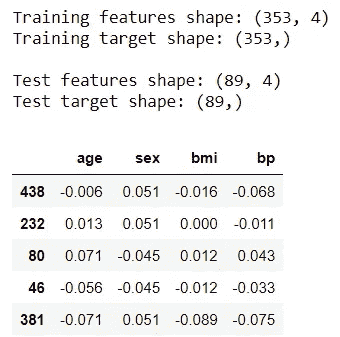

获取 shap 值的一个常见方法是使用[解释器](https://shap.readthedocs.io/en/latest/generated/shap.Explainer.html)对象。让我们创建一个`Explainer`对象，并为测试数据提取`shap_test`:

```
explainer = shap.Explainer(model)
shap_test = explainer(X_test)
print(f"Shap values length: {len(shap_test)}\n")
print(f"Sample shap value:\n{shap_test[0]}")
```

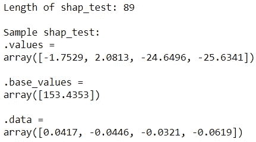

`shap_test`的长度是 89，因为它包含了每个测试实例的记录。从第一个测试记录中，我们可以看到有三个属性:
◼ `shap_test[0].base_values`:目标的基值
◼ `shap_test[0].data`:每个特性的值
◼ `shap_test[0].values`:每个特性的形状值

让我们了解一下这些属性中的每一个向我们展示了什么。

## 📍1.1 基础值

*基值(* `shap_test.base_values` *)* ，也称为*期望值(* `explainer.expected_value`)，是训练数据*中的*平均目标值*。*我们可以用下面的代码来检查这一点:

```
print(f"Expected value: {explainer.expected_value[0]:.1f}")
print(f"Average target value (training data): {y_train.mean():.1f}")
print(f"Base value: {np.unique(shap_test.base_values)[0]:.1f}")
```

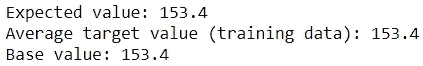

因此，我们将互换使用词语*期望值*和*基础值*。

## 📦 1.2.数据

接下来，`shap_test.data`包含与`X_test`相同的值:

```
(shap_test.data == X_test).describe()
```

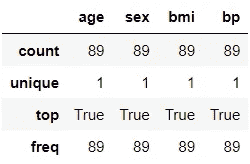

让我们把它转换成数据帧来看看:

```
pd.DataFrame(shap_test.data, columns=shap_test.feature_names, 
             index=X_test.index)
```

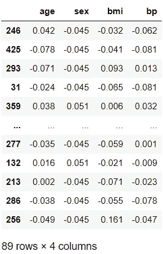

这只是我们传递给它的数据集的副本。

## ✨ 1.3.价值观念

来自`shap_test`的最重要的属性是`values`属性。这是因为我们可以从中访问 shap 值。让我们将 shap 值转换成数据帧，以便于操作:

```
shap_df = pd.DataFrame(shap_test.values, 
                       columns=shap_test.feature_names, 
                       index=X_test.index)
shap_df
```

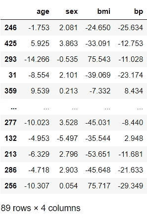

我们可以看到每个记录的 shap 值。如果我们把这些 shap 值加到期望值上，我们将得到预测:

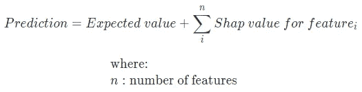

我们来看看是不是这样:

```
np.isclose(model.predict(X_test), 
           explainer.expected_value[0] + shap_df.sum(axis=1))
```

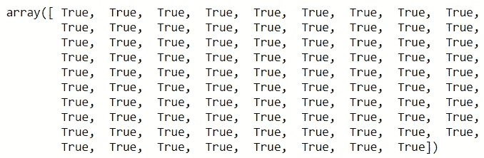

厉害！这里我们用`np.isclose()`忽略[浮点不准确](https://stackoverflow.com/questions/2100490/floating-point-inaccuracy-examples)。现在，我们有了 shap 值，我们可以像这样进行自定义可视化，以了解特性贡献:

```
columns = shap_df.apply(np.abs).mean()\
                 .sort_values(ascending=False).indexfig, ax = plt.subplots(1, 2, figsize=(11,4))
sns.barplot(data=shap_df[columns].apply(np.abs), orient='h', 
            ax=ax[0])
ax[0].set_title("Mean absolute shap value")
sns.boxplot(data=shap_df[columns], orient='h', ax=ax[1])
ax[1].set_title("Distribution of shap values");
```

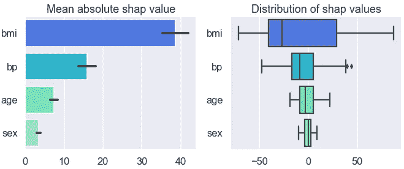

左侧子图显示了每个特征的平均绝对形状值，而右侧子图显示了形状值按特征的分布。从这些图表中可以看出,`bmi`在使用的 4 个特性中贡献最大。

# 2.形状内置图📊

虽然我们可以使用 shap 值构建我们自己的可视化，但是`shap` 包带有内置的奇特的可视化。在这一节，我们将熟悉这些观想中的一些精选。我们将会看到两种主要的情节🌳**全局:**显示特征总体贡献的图形。这种图显示了一个特征对整个数据的总体贡献。
🍀**局部:**显示特定实例中特征贡献的图。这有助于我们深入了解单个预测。

## 🌳 2.1.全局|条形图

对于前面显示的左侧子图，有一个等效的内置函数，只需几次击键:

```
shap.plots.bar(shap_test)
```

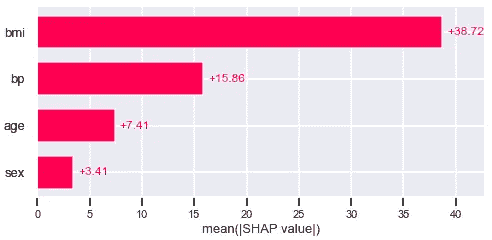

这个简单但有用的图显示了特性贡献的强度。该图基于特征的平均绝对形状值:`shap_df.apply(np.abs).mean()`。要素从上到下排列，具有最高平均绝对形状值的要素显示在顶部。

## 🌳 2.2.全局|汇总图

另一个有用的情节是摘要情节:

```
shap.summary_plot(shap_test)
```

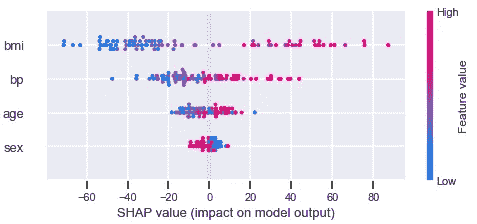

这里有一个替代语法:`shap.plots.beeswarm(shap_test)`用于这个具体的情节。与之前一样，要素按其平均绝对形状值排序。与之前的条形图相比，此图表更加复杂，包含更多信息。下面是解释该图的指南:
◼️ **图的横轴**显示了特征的 shap 值分布。每个点代表数据集中的一条记录。例如，我们可以看到对于`bmi`，点非常分散，在 0 附近几乎没有任何点，而对于`age`，点更靠近 0 聚集。
◼️ **点的颜色**显示特征值。这个额外的维度允许我们看到 shap 值如何随着特征值的改变而改变。换句话说，我们可以看到关系的方向。例如，我们可以看到，当`bmi`为高时，shap 值往往较高(由粉红色圆点表示)，当`bmi`为低时，shap 值往往较低(由蓝色圆点表示)。还有一些紫色的点分散在光谱中。

如果我们发现默认颜色图不直观或不合适，我们可以将其更改为我们首选的 [matplotlib 颜色图](https://matplotlib.org/stable/tutorials/colors/colormaps.html)，如下所示:

```
shap.summary_plot(shap_test, cmap=plt.get_cmap("winter_r"))
```

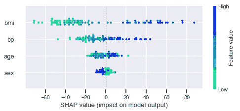

此外，我们还可以使用不同的绘图类型。这里有一个例子:

```
shap.summary_plot(shap_test, plot_type='violin')
```

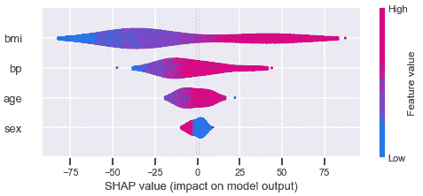

## 🌳 2.3.全球|热图

热图是可视化 shap 值的另一种方式。我们看到的是彩色编码的单个值，而不是将形状值聚合成一个平均值。特征标绘在 y 轴上，记录标绘在 x 轴上:

```
shap.plots.heatmap(shap_test)
```

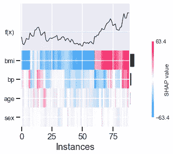

该热图由顶部每个记录的预测值(即`f(x)`)的线图补充。

我们可以使用`cmap`参数将颜色图更改为我们想要的颜色图:

```
shap.plots.heatmap(shap_test, cmap=plt.get_cmap("winter_r"))
```

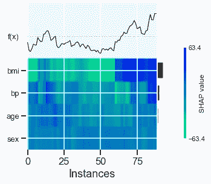

## 🌳 2.4.全局|力图

这个交互图让我们可以看到由记录构成的 shap 值:

```
shap.force_plot(explainer.expected_value, shap_test.values, 
                X_test)
```

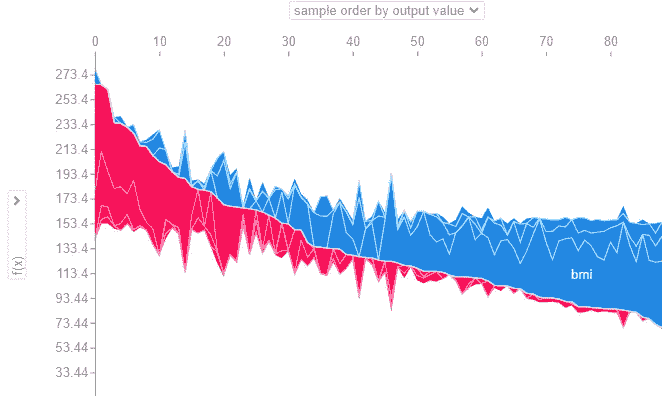

就像热图一样，x 轴显示每条记录。正的形状值显示为红色，负的形状值显示为蓝色。例如，由于第一条记录的红色成分比蓝色成分多，因此这条记录的预测值将高于预期值。

交互性允许我们改变两个轴。例如，y 轴显示预测，`f(x)`，x 轴按上面快照中的输出(预测)值排序。

## 🍀 2.5.局部|条形图

现在，我们将通过图表来理解个别情况下的预测。让我们从柱状图开始:

```
shap.plots.bar(shap_test[0])
```

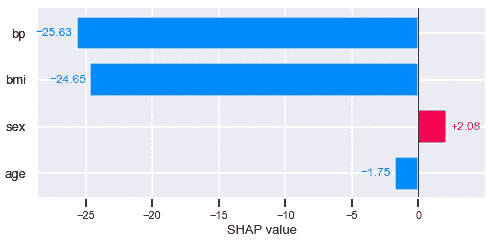

语法与*第 2.1 节中的完全相同。Global | Bar plot'* 除了这次我们对单个记录的数据进行切片。

## 🍀 2.6.局部|瀑布图

这是条形图的另一种替代形式:

```
class WaterfallData():
    def __init__ (self, shap_test, index):
        self.values = shap_test[index].values
        self.base_values = shap_test[index].base_values[0]
        self.data = shap_test[index].data
        self.feature_names = shap_test.feature_namesshap.plots.waterfall(WaterfallData(shap_test, 0))
```


瀑布图是信息密集的，有四位信息:
◼️在 y 轴上，我们看到记录的实际特征值。如果您不确定我的意思，请将`X_test.head(1)`与 y 轴上的值进行比较。
◼️在图表的右下角，我们看到`E[f(X)]`，预期值。
◼️在左上角，我们看到`f(x)`，预测值。
◼️ ️Just 像前面的柱状图一样，横条代表颜色编码的特征贡献。从底部的期望值开始，我们可以看到每个贡献是如何上下移动预测值以最终达到预测值的。

## 🍀 2.7.局部|力图

最后一个要熟悉的图是单个记录的力图。如果我们将该图旋转 90 度并绘制多个记录，我们将看到全局力图。

```
shap.plots.force(shap_test[0])
```

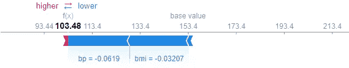

我们既可以看到基础值:153.4，也可以看到预测值:103.48。我们还可以看到特性贡献的分解。

# 3.调整分类🌓

到目前为止，我们已经关注了一个回归示例。在这一节中，我们将学习一种方法来调整我们所学的内容以适应二元分类。让我们导入 titanic 数据的子集并训练一个简单的模型:

```
# Import sample data
df =  sns.load_dataset('titanic')
df['is_male'] = df['sex'].map({'male': 1, 'female': 0}) # Encode
# Keep numerical complete columns
df = df.select_dtypes('number').dropna() 
X = df.drop(columns=['survived'])
y = df['survived']# Partition data
X_train, X_test, y_train, y_test = train_test_split(X, y, 
                                                    test_size=0.2, 
                                                    random_state=1)print(f"Training features shape: {X_train.shape}")
print(f"Training target shape: {y_train.shape}\n")
print(f"Test features shape: {X_test.shape}")
print(f"Test target shape: {y_test.shape}")
display(X_train.head())# Train a simple model
model = RandomForestClassifier(random_state=42)
model.fit(X_train, y_train)
```

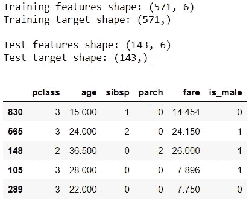

## ✨ 3.1.形状值

我们将创建一个解释器对象，并像前面一样提取 shap 值:

```
explainer = shap.Explainer(model)
shap_test = explainer(X_test)
print(f"Length of shap_test: {len(shap_test)}\n")
print(f"Sample shap_test:\n{shap_test[0]}")
```


就像回归`shap_test.data`将包含与`X_test`相同数量的记录。但是，从这个示例记录中，我们可以看到`values` 和`base_values`的尺寸不同。

我们先来看看基值。基值现在告诉我们每个类的概率。我们将关注积极类(即`y==1`，生存):

```
print(f"Expected value: {explainer.expected_value[1]:.2f}")
print(f"Average target value (training data): {y_train.mean():.2f}")
print(f"Base value: {np.unique(shap_test.base_values)[0]:.2f}")
```

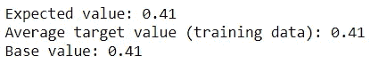

现在，让我们看看 shap 值。还为这两个类提供了 Shap 值。你也会注意到它们是彼此的反面。我们可以这样提取正类的 shap 值:

```
shap_df = pd.DataFrame(shap_test.values[:,:,1], 
                       columns=shap_test.feature_names, 
                       index=X_test.index)
shap_df
```

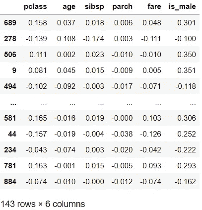

让我们仔细检查一下将 shap 值的总和加到预期概率上是否会得到预测概率:

```
np.isclose(model.predict_proba(X_test)[:,1], 
           explainer.expected_value[1] + shap_df.sum(axis=1))
```

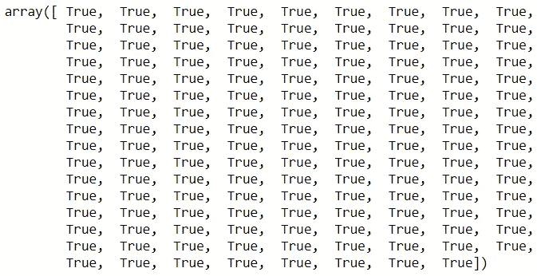

太棒了，现在你知道如何得到概率单位的 shap 值了。

## 📊 3.2.形状内置图

是时候调整我们之前看到的情节了。为了避免重复，我将展示一个全局图的示例和一个局部图的示例，因为其他图可以使用相同的逻辑来复制。

**全局|条形图:**让我们检查特征对预测正类的总体贡献:

```
shap.plots.bar(shap_test[:,:,1])
```

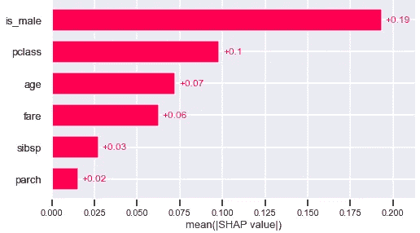

**局部|瀑布图:**我们来看看第一个测试记录的瀑布图:

```
shap.plots.waterfall(shap_test[:,:,1][0])
```

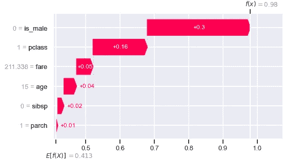

从这个图中，我们可以看到每个特征是如何对属于正类的预测概率做出贡献的:对于这个记录是 0.98。

## 📍 3.3.使用案例

在我们结束之前，让我们看一个示例用例。我们将为幸存者找到最不正确的例子，并试图理解为什么模型做出不正确的预测:

```
test = pd.concat([X_test, y_test], axis=1)
test['probability'] = model.predict_proba(X_test)[:,1]
test['order'] = np.arange(len(test))
test.query('survived==1').nsmallest(5, 'probability')
```

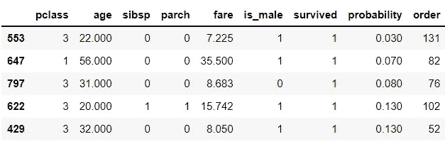

第一次记录的存活概率是 0.03。让我们看看特性是如何促成这一预测的:

```
ind1 = test.query('survived==1')\
           .nsmallest(1, 'probability')['order'].values[0]
shap.plots.waterfall(shap_test[:,:,1][ind1])
```

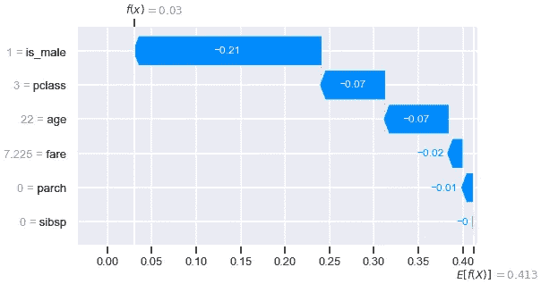

年轻的三等舱男性乘客……我们可以看到，性别、乘客级别和年龄已经大大降低了预测。让我们在训练数据中找到类似的例子:

```
pd.concat([X_train, y_train], 
          axis=1)[(X_train['is_male']==1) & 
                  (X_train['pclass']==3) & 
                  (X_train['age']==22) & 
                  (X_train['fare'].between(7,8))]
```

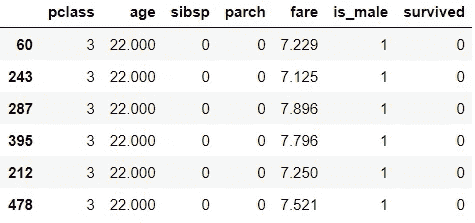

所有类似的训练例子其实都没有存活下来。这就说得通了。这是一个小用例，说明 shap 如何有助于解释为什么模型会得出不正确的预测。


[云](https://unsplash.com/@albedo?utm_source=medium&utm_medium=referral)在 [Unsplash](https://unsplash.com?utm_source=medium&utm_medium=referral) 上拍照

希望您喜欢学习如何使用 SHAP 库来理解 Scikit-learn 中内置的回归和分类模型。因为 SHAP 是模型不可知的，所以你也可以把它用于其他模型。我希望你能很快使用这个可解释的人工智能工具来理解为什么模型会做出预测，以便改进模型并更好地向他人解释它。

*您想访问更多这样的内容吗？媒体会员可以无限制地访问媒体上的任何文章。如果你使用* [*我的推荐链接*](https://zluvsand.medium.com/membership) ，*成为会员，你的一部分会费会直接去支持我。*

感谢您阅读这篇文章。如果你感兴趣，这里有我其他一些帖子的链接:
◼️️ [K 近邻解释](/k-nearest-neighbours-explained-52c910c035c5)
◼️️ [逻辑回归解释](/logistic-regression-explained-7695f15d1b8b)
◼️️ [比较随机森林和梯度推进](/comparing-random-forest-and-gradient-boosting-d7236b429c15)
◼️️ [决策树是如何构建的？](/how-are-decision-trees-built-a8e5af57ce8?source=your_stories_page-------------------------------------)
◼️️ [管道、ColumnTransformer 和 FeatureUnion 说明](/pipeline-columntransformer-and-featureunion-explained-f5491f815f?source=your_stories_page-------------------------------------)
◼️️ [FeatureUnion、ColumnTransformer &管道用于预处理文本数据](/featureunion-columntransformer-pipeline-for-preprocessing-text-data-9dcb233dbcb6)

再见🏃 💨