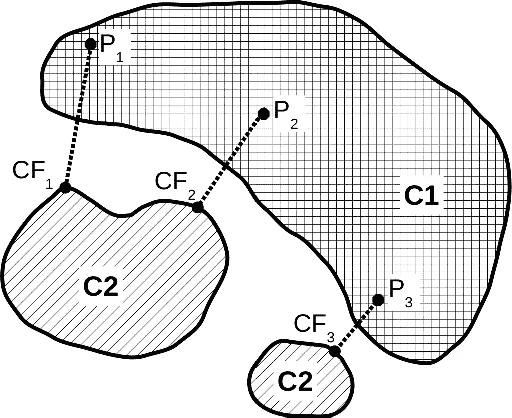
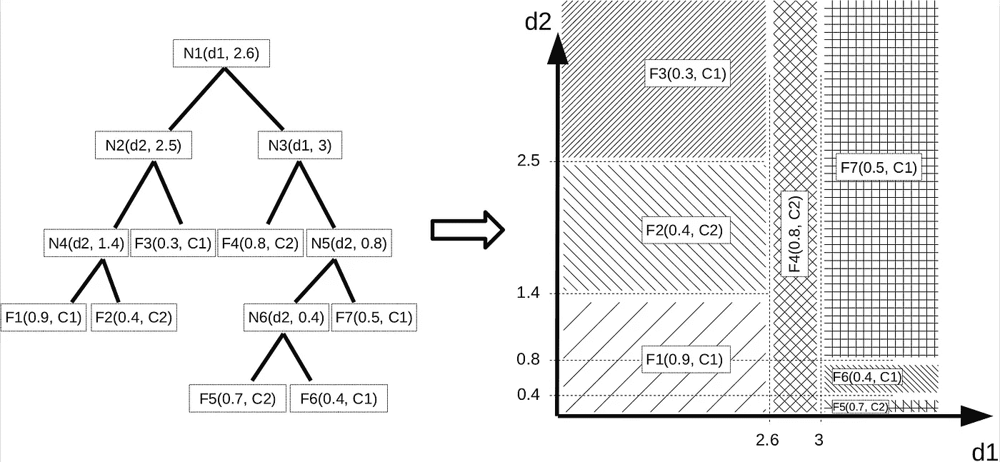
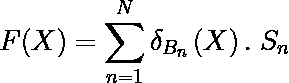
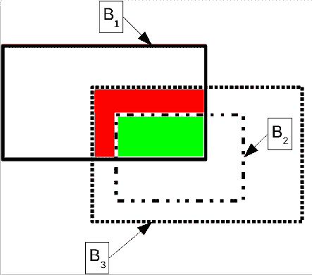
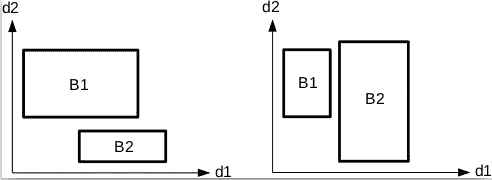
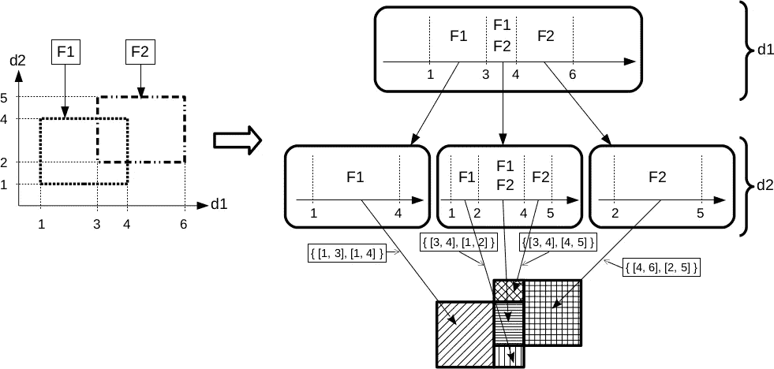
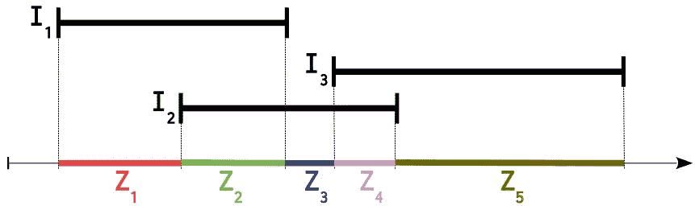
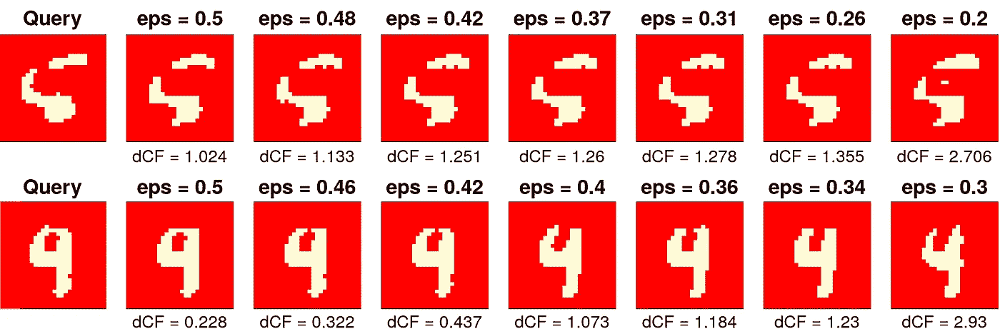

# 用反事实的例子解释 XGBoost 模型的决策

> 原文：<https://towardsdatascience.com/explaining-the-decisions-of-xgboost-models-using-counterfactual-examples-fd9c57c83062?source=collection_archive---------24----------------------->

## 模型可解释性——故障检测、识别和诊断

反事实推理是可解释性的一般范式。它是关于确定我们需要对输入数据应用什么样的最小变化，以便通过分类模型将它分类到另一个类中。

典型的应用场景是故障检测和诊断。让我们想象一下，我们可以使用传感器精确地监控生产过程，这些传感器遍布整个生产链(通常在每个工作站)。利用这些数据，我们可以在制造过程的每个阶段跟踪产品。因此，可以记录与最终出现故障的产品相关联的数据，用于进一步分析，以试图追溯故障是从哪里引入的。特别是，我们有兴趣找到引入故障的工作站，并且如果可能的话，有兴趣诊断那里可能出现了什么问题(如果数据允许的话)。在这一点上，您可能已经猜到，主要目标是避免长时间停止生产链，同时试图发现哪里出了问题。拥有一个能够在眨眼之间提供这种答案的人工智能可能会证明非常有用，最重要的是，对商业有好处，这是一个足够好的借口，可以解决你在阅读本文其余部分时遇到的所有理论困难。


如果你不希望这种事发生在你身上，请进一步阅读:)。你不必再品尝生产线上生产的所有饼干，以确保它们符合祖母的标准。你将有一个预测它的模型，每次饼干不符合标准时，你将能够准确地说出生产线的哪个地方出了问题，以及为什么，甚至有什么最小的行动来使事情恢复正常。以及 100%人工智能驱动的解决方案。[图片由作者提供]

好消息是我们能够设计非常有效的故障检测模型(FDM)。后者能够实时分析来自不同性质(数值、分类……)的大量数据，并在生产的不同步骤进行测量，以预测给定的制造元件是否有缺陷。不太好的消息是，解释这种模型提供故障诊断的决定要困难得多。通常使用的 FDM 通常是非常复杂的黑盒模型，并且除了透明之外什么都不是。

在这篇文章中，我们展示了一类称为树集合模型的模型，属于流行的高性能模型，如 **XGBoost** ，LightGBM，random forests …，我们可以使用一种称为“反事实解释”的方法来解释这类模型的决定。为了简单起见，我们在此仅考虑将数据分为两类的二元分类模型:正常/故障。

对于被模型分类为故障的给定查询点，我们计算称为**反事实示例**的虚拟点(以下称为 **CF 示例**)。后者是输入空间中欧几里得距离最近的点，被模型分类为正态。这个点是虚拟的，因为它不一定存在于训练集中。大多数情况下不会，我们是基于 FDM 模型参数建立的。CF 示例背后的几何直觉如下图所示。



两类分类器的决策区域。模型预测类别 1 的区域标记为“C1”，模型预测类别 2 的区域标记为“C2”。点 P#i 的最接近的反事实示例由 CF#i 表示。它是最接近 P#i 的点，被模型分类为类别 2。在上图中，我们将所有点 P#i 放在类 1 中，所以我们在类 2 中寻找它们各自的反事实例子。[图片由作者提供]

对于一个错误的数据，我们可以使用其相关联的 CF 示例来说明需要在最小程度上改变什么，以便它返回到正常类。你看到它在几英里外，这是我们用来执行故障诊断。这种方法非常有效，因为它可以发现细微的变化，从而区分错误数据和正常数据。这些变化可以是多变量的，也就是说，与正常状态相比，几个输入特征可能已经发生了变化。(CF vs 特性重要性？)最重要的是，我们有与物理设备(工作站)和制造过程相关的输入特性。因此，如果故障输入数据与 CF 示例的比较指出，为了恢复正常，我需要将站 25 中的温度降低 0.1°C，并将站 31 中的压力增加 0.05 巴，我可以迅速在我的生产链上安排这种干预，以避免新的故障发生和浪费更多的时间/材料。这也是反事实解释特别有趣的地方，**它们给你一个精确的想法，告诉你应该采取什么样的最小行动来纠正问题**。好吧，我希望我说服了你，手头有一个与你的错误数据相关的 CF 示例是快速解决你的问题的关键，并且，潜在地，是一笔巨大的金钱节省(认为一切都是关于金钱和时间节省的陈词滥调……)。

在这一部分中，我们展开了一个有效的算法方法来计算在树集成模型的情况下与错误数据相关的最近的 CF 例子。我会尽量保持整体的直观性，但有时我不得不挖掘数学。敏感的读者可以跳过这些部分，这并不妨碍对整体的理解，而且你仍然可以把它留到以后，当你解决了生产链上的问题，有了足够的自由支配时间的时候。

首先，我们需要输入树集合模型的特殊性。CF 示例是基于模型的特殊性(即模型参数)计算的，因此理解它们如何工作似乎是相当重要的一步。

让我们从决策树开始，它是这种模型的基础组件。更准确地说是二叉决策树:在这种树的每个节点中，我们通过将输入特性的值与单个阈值进行比较来分析它。如果特征值高于阈值，我们转到右边的分支，否则，我们转到左边的分支。我们重复这个逻辑，直到我们在与分数(对一个类的投票)相关联的树的叶子中结束。现在让我们从几何学角度来分析这意味着什么。我试着在下图中表现出来。如果你认为这个数字没用，我会在另一个帖子里把它作为数字艺术回收，但是请相信我把我所有的才华都放在里面了。



输入特征空间中的决策区域对应于决策树的叶子。这些区域是盒子/多维间隔，在某些边上可能是开放的。输入空间是二维的。在节点 **Ni** 中，我们指示输入数据的哪个维度 **dj** 被分析，以及与其比较的阈值 **ci** 。节点 **Ni** 因此与对 **(dj，ci)** 相关联。可以检查到，即使在树根和树叶之间的路径上对一个特征测试了两次以上，只有两次测试对于表征与树叶相关联的判定区域是有效的，其他测试是多余的。无论输入维度的数量是多少，该属性都有效。 **N1** 和 **F1** 之间的路径包含一个对特征 **d2** 进行冗余测试的例子:在节点 **N2** 中，我们测试“**D2**2.5”，在节点 **N4** 中，我们测试“**D2**1.4”，相当于只测试“**D2**1.4”。[图片由作者提供]

从几何学上讲，决策树的叶子似乎是多维的盒子(在某些面上可以是开放的)。为了在数学上更加正确，我们会说叶子是多维区间。那么，树的组合怎么样？你自己可能很容易得出结论，它只不过是多维区间/盒子的集合，以及它们相关的类投票/分数。要预测一个输入元素，我们只需要搞清楚它属于哪些盒子(盒子之间可能会有交集)，把关联的分数加起来就可以了。在数学上，如果我们将一个树集成模型 ***F*** 表示为一对( ***B*** ，***S*** )其中*是一组盒子/叶子和 ***S*** 的关联分数的集合，那么与 ***F*** 关联的预测函数就是这样简单:*

**

*树集合模型预测函数。n 是模型的叶子数。Bn 表示第 n 片叶子，Sn 表示与该叶子相关联的分数。Sn 是 K 维向量，其中 K 是与分类问题相关联的类的数量。它通常是一个稀疏向量，只为单个类投票(即只有一个非空系数)。为了知道与输入点 X 相关联的模型的决策，我们计算“arg max(F(X))”。如果 X 属于叶 Bn，则δBn(X)=1，否则δBn(X)=0。[图片由作者提供]*

*您可能认为像 XGBoost 这样的模型可能会产生更复杂的决策函数，但事实上不是这样……对于二进制分类，它会产生一个分数(在 0 到 1 之间),一旦与阈值(默认为 0.5)进行比较，就会告诉您数据属于哪个类别。我将发表另一篇文章，介绍如何将这篇文章中描述的可解释性方法应用于多类分类和回归的树集合模型，因此，请遵循我的渠道(为了你好，这没有任何商业成分，科学是我唯一的燃料)。*

*在这一点上，我们将尝试基于模型的决策区域的几何分解来确定我们的 CF 示例。这就是事情变得棘手的地方，因为我们不能直接使用我上面提到的分解。下面的例子应该足以让你相信我们做不到，这个世界比它看起来更糟糕。*

**

*几个叶子/盒子的交叉使得出现新的区域，其分数是通过将交叉形成这些区域的各个盒子的分数相加来确定的。例如，绿色区域的分数通过计算 S1 + S2 + S3 来确定，红色区域的分数通过计算 S1+S3 来确定。[图片由作者提供]*

*在上图中，三个方框 B1、B2 和 B3 的交叉点出现了两个新的决策区域(以红色和绿色突出显示)。我们无法确定这些区域属于哪一类，除非我们将相交形成这些区域的盒子的分数相加。你猜怎么着？这就是我们的工作。我们对原始分解进行“超级分解”,确定所有相交区域以及其他区域。出于算法的原因，我们计算一个“超级分解”,它也是盒子的集合。所以，它看起来会像这样:*

**

*相互交叉的三个盒子的初始集合的超级分解。超级分解也采用盒子集合的形式。后者不一定是能找到的最简单的盒状分解(就盒数而言)。[图片由作者提供]*

*这个问题的所有困难是设计一种算法方法来计算一个盒状的超分解，它避开了问题的潜在组合。实际上，以强力方式表述，该问题相当于确定，对于任何一组“k”个盒子，这些“k”个盒子是否形成最大相交区域，即它们的相交区域是否不为空，以及在“k”个盒子之外是否没有其它盒子被认为与该区域相交。这个问题是组合性的，即使对于中等数量的盒子也是不容易解决的。我们提出了一种逐维构建相交盒的算法。我们使用边垂直于坐标轴的盒子的一个便利的特性:如果两个盒子没有根据一个特定的维度相交，它们根本没有相交。下图说明了这个想法。*

**

*如果两个盒子没有根据一个特定的维度相交，则它们根本没有相交。在左图中，两个框根据尺寸 d1 相交，但不根据尺寸 d2 相交。在右图中，两个框根据尺寸 d2 相交，但不根据尺寸 d1 相交。[图片由作者提供]*

*这个属性产生了一个树状的层次结构。每个级别对应于输入空间的一个维度。在每个节点中，我们根据对应于树状结构的当前级别的维度来计算存储在该节点中的盒子的最大交集。如果两个框没有根据该维度相交，则它们将不再一起出现在树的下一层的相同节点中，因为根据上述属性，它们没有机会一起形成相交区域。*

*将我作为数字艺术创作者的惊人天赋付诸行动，我在下面尝试以图形方式“运行”该算法，已经达到了文字所能提供的极限，并且不想用一个核心的算法证明来窒息你。该算法主要是关于前面提到的树状结构的构造。该结构在其叶子中包含由树集合模型的叶子形成的交叉区域的盒状超分解。*

**

*由盒分解算法构建的树状探索结构。我们在此考虑二维特征空间中具有两片叶子(F1，F2)的模型。该算法逐维进行。第一级对应于维度 d1，并且对应于根据维度 d1 分解成模型叶的最大相交区间。在这一级之后，我们以三个独立的叶子子集结束，我们对其应用相同的 1D 分解过程，但是，这一次，根据维度 d2。阴影区域表示由算法产生的结果最大交集框。[图片由作者提供]*

*在树状结构的每个节点中，我们总是解决相同的交集问题:给定一列盒子和与该节点相关联的输入空间的维度，我们寻找该维度中盒子的最大交集，即我们解决前面提到的组合问题，但是是在一个维度中。因此，我们不再处理盒子，而是处理 1D 区间，它是盒子在所考虑的维度中的投影。幸运的是，在 1D，问题不再是组合的，甚至在考虑区间的数量上变成线性的。这个想法是将所有的区间放在一个 1D 轴上，如下图所示。*

**

*从 1D 区间的集合中寻找 1D 最大交集的区域(区间)。如果一个区域对应于 **k** 个区间的交集的区域，则称该区域为最大交集，其中 **k** 是在该区域中相交的区间的最大数量。为了计算这些区域，我们将所有区间放置在 1D 轴上，并且每当区间开始或结束时，我们创建一个新的最大相交区域。在上面的例子中，从区间{I1，I2，I3}的集合中，我们提取了五个最大相交区域 Z1，Z2，Z3，Z4 和 Z5。[图片由作者提供]*

*然后，我们注意到，除了终止最后一个最大交集区域的最后一个区间结束之外，每次区间开始或结束时，都会开始一个新的最大交集 1D 区域(这是一个 1D 区间)。因此，如果我们考虑 N 个区间的初始集合，我们将最多有 2 个。N-1 个最大相交区域。从算法上来说，我们必须对所有区间的开始和结束进行排序，这相当于排序 2。n 分。实际上，在超分解算法中，通过在每个维度上分别预分类构成树集成模型的盒子，并且通过观察使用屏蔽操作从有序集合中提取子集产生有序子集，可以跳过该操作。因此，我们可以考虑节点中盒子的子集，而不必根据与节点相关联的维度再次对它们进行排序。因此，与问题的初始复杂性相比，我们最终在树状结构的每个节点中进行的处理惊人地便宜。*

*在这一点上，你可能已经预料到超级分解算法可能会产生如此多的决策区域，以至于它甚至不适合你的计算机内存。这就是残酷的现实。因此，我们现在将寻找优化，仍然允许找到确切的 CF 示例，但限制实际建立的区域的数量。主要思想是，我们不需要构建模型的整个决策区域，只需要围绕查询点构建一些东西，这样就可以从其他类中找到一个例子。因此，我们想要限制精确 CF 示例所在的搜索区域的大小。作为第一次尝试，我们可以使用训练数据来这样做:给定一个查询点，我们在训练集中寻找被模型分类为正常的最接近的数据(注意，我说的是“分类的”，而不是“标记的”)。这为搜索区域的大小提供了第一个相当可靠的上限。使用这个，我们将只建立位于这个上限内的搜索区域。这很方便，因为用于建立决策区域的算法是逐维进行的。因此，如果对于给定的维度，部分构建的决策区域已经比上限更远，我们可以停止在搜索树的相应节点中的探索。这种方法的通用名是“分支-绑定”，在需要沿着树状结构的分支进行探索的所有场景中特别有用(这显然是我们的情况)。*

*我希望你还在跟随我进行这一危险的分支定界的探索。还有许多其他实用的优化方法，其中最有效的是以深度优先的方式探索搜索结构。这很快为我们提供了一个比单独使用训练集计算的上界更好的上界。在实践中，我们使用多线程并行维护多个深度优先探索，以保持其有效性。每当我们发现一个比最后一个紧的上界更紧的上界时，我们就更新最紧的上界的值，并将新的上界传递给所有线程以供立即使用。这最终导致搜索树的快速修剪，并允许在眨眼之间彻底探索模型的决策区域(有时更多，取决于你眨眼的速度)。*

*最后一点，维度在某些时候对你有利(能够写这个很少见，所以我几乎可以称这个时刻为历史性的，如果我不打字，你会看到我的笔迹颤抖)。简单地说，添加的维度越多，部分构建的框到查询点的距离超过上限的几率就越高。这个简单的效果会使您通过搜索树创建的区域数量保持稳定，甚至有时会在达到一定数量的维度后(略微)减少。好吧，让我们不要对此过于狂热，最好添加好的优化，祈祷快速的结果。*

*所以，现在我展开了资金原则，让我们把我们的手放在代码中。出于我极大的善意，也为了你美丽的眼睛，我用一段很好的 C++程序编写了上面所有的优化(甚至更多),我用 R 封装了它(也许在不久的将来，我还会写一个 python 包装器，这样它就可以和你喜欢的高级编程语言一起使用了)。我将在另一篇博文中向您展示如何做好简单的 Rcpp 包装，以至于您可能会考虑放弃 python。*

*R 包可以在我的 [github](https://github.com/PierreBlanchart/CMBDTC) 上找到。它需要“ [Boost](https://www.boost.org/) 和“[TBB](https://software.intel.com/content/www/us/en/develop/tools/oneapi/components/onetbb.html)”c++库。您必须检查这些库的路径是否在位于。/src "文件夹，或者它们可以在标准系统路径中找到。要将软件包安装到 INSTALL_PATH 文件夹中，请从终端使用以下命令(仅限 linux 用户):*

```
*cd PACKAGE_SOURCE_FOLDER
R CMD INSTALL -l /INSTALL_PATH ./ --preclean*
```

*一旦你(成功地)安装了 R 包，让我们从用例开始。我选择保持相对简短的描述，以避免 github 的可怕冗余。如果您感兴趣，请注意代码仍在开发中，等待外部贡献者将它制作成一个大尺寸树集合模型的 CF 可解释性的伟大包，有一天它可能会在 XGBoost 的代码中占有一席之地(是的，作者是一个梦想家……)。*

*作为第一个例子，让我们考虑一个用于消费信贷批准/拒绝的数据集。与我在博客文章开头宣传的工业故障检测场景完全不同，但是 CF 可解释性方法可以扩展到任何分类场景，包括正常类(信用批准)和“异常”类(信用拒绝)。此外，小数据集很好地展示了一些东西，学术界已经使用它们几十年了(这是一个可靠的论点吗？).该数据集允许学习 20 个输入特征之间的映射，例如正在进行的信贷数量、收入、年龄、信贷目的…以及授予或不授予信贷的决定。*

*我省略了 XGBoost 模型的所有特性格式和训练细节，您可以很容易地从演示脚本中对它们进行逆向工程。让我们直接跳到 CF 示例计算。我们首先需要选择测试数据中与信用拒绝相对应的一点。我们检查它是否被归类并标记为“信用拒绝”。为了保证以后，我们简单地看看地面真相。就两类准确率而言，经过训练的模型确实不会高于 75%，因此会有许多误报(意味着被归类为“信用拒绝”的点，而这在现实中是不存在的)。给定一个我们称之为“查询点”的选定点，我们计算其相关的最近 CF 示例。下面，我解释用于确定 CF 示例的函数中每个参数的含义。我觉得有必要在这里做，因为它在代码中缺乏解释。*

*负责计算 CF 示例的主方法的签名。*

*下表显示了三个人的一些结果。每次提到查询点(客户端状态)，以及关联的 CF 例子(推荐+限制推荐)。当查询点和 CF 示例之间没有变化时，该单元格留空。对于每个人，我们计算两个 CF 示例。第一个(行“建议”)对应于“完全行动能力”情景，即个人可以控制/改变与自己有关的所有特征。第二种情况对应于“部分可行动性”情景，即个人只能控制/改变少数变量。例如，认为个人无法控制自己的年龄是更现实的，尽管对再生乳液的研究已经取得了很大进展。*

**

*对于三个不同的个人，我们诊断了银行拒绝他们所要求的信贷的决定，并且我们展示了 CF 方法所提供的建议，即他们需要改变一个最小值以使信贷被授予他们。对于每个个体，我们发出两个建议:第一个认为个体有控制/改变所有特征的可能性(“建议”线)。第二种认为个人只能控制有限数量的特征(“限制推荐”线)，这通常更现实(例如，个人不能对自己的年龄或婚姻状况做出任何改变)。无论如何，我真诚地希望这将帮助你获得 100 美元的信贷，你需要购买布加迪赛车你的梦想。[图片由作者提供]*

*第二个用例涉及 MNIST 数据集的误分类数字。我们从十个类别中提取两个类别，它们本质上是不明确的(例如 1 和 7，或者 5 和 6)。然后，我们训练一个两类分类 XGBoost 模型，该模型学习区分这两个类。作为查询点，我们选择属于一个类的一个点，该点被模型误分类到另一个类中。我们还确保输入的数字在视觉上是模糊的(意味着人眼不能真正判断它属于哪个类别)。这最后一点特别重要，因为我们的目标不是检测分类模型的潜在弱点，而是检测输入数据中异常值的存在。因此，我们需要能够认为输入数据在某些方面是错误的，并且分类器只是做它的工作。只有在这些假设下，我们才能在误分类和错误数据之间画出一条平行线，并像对待错误数据一样对误分类的例子应用我们的 CF 方法。*

*在这个用例中，我们引入了另一个方面:合理性的概念。为了使 CF 示例更可信(即，视觉上更有说服力)，我们可以在与模型对 CF 示例的预测相对应的决策得分上添加约束。通过迫使模型以更大的置信度预测正确的类，我们获得看起来越来越接近正确的类的元素的 CF 示例(“正确的类”，我是指与基本事实中的查询点相关联的类)。强制似然性以失真为代价，这意味着较高的似然性导致 CF 示例在欧几里德距离方面离查询点更远。下图说明了这个想法。*

**

*考虑两个二进制分类问题(5 对 6 和 4 对 9)。第一行:一个“5”失误的例子——被模型归类为“6”。初始查询图像显示在左侧。我们使判定阈值在 0.5 和 0.2 之间变化。获得被模型更有把握地分类到正确类别的 CF 示例是以引入到初始查询数据的失真为代价的，即，判决阈值“eps”越低，到初始查询“dCF”的距离越高。从视觉上看，我们看到 CF 方法提供了对初始查询数据的合理更改，使其看起来更像“5”。第二行:一个“4”失误的例子——被模型归类为“9”。[图片由作者提供]*

*也可以实施其他似真性标准:例如，我们可以检查找到的 CF 例子位于包含来自训练数据集的至少一个元素的最大交集区域中。这将避免挑选出在现实生活中不现实/不可及的非分布 CF 示例。*

*最后一点，在我让你吃你的没有缺陷的晶片之前，并不强制考虑一个查询点和它对应的 CF 例子之间的欧几里德距离。也可以考虑其他距离，而不需要改变分解算法，只要这些距离可以被公式化为坐标相加，即被计算为:“ **d** (X，Y) = **g** ( ∑ **di** (X[i]，Y[i])”，其中“ **di** ”是应用于第 I 个坐标的特定运算，“ **g** ”是递增的单调函数。比如: **di** (X[i]，Y[i]) = (Y[i]- X[i])对于平方的欧氏距离。*

*好吧，这篇很长的博客文章要记住什么(抱歉，我可能在第一次尝试与世界交流时过于啰嗦)。首先，树集成模型允许精确 CF 示例的计算，同时是用于故障检测的更好的模型(尤其是梯度增强树)。第二，除了定位故障/异常之外，CF 示例给出了纠正故障/异常的最小行动的精确概念。此外，这里提供的 CF 方法具有产生稀疏解释的巨大优势，即，在数量减少的输入特征上建议改变，这使得解释对于人类用户来说更容易理解。*

*如果你对这个话题感兴趣，并且想知道更多关于这个方法的可能性，你可以在这里阅读全文，我恰好是这篇文章的作者(但这纯粹是随机巧合)。如果你想在你的应用程序中使用这个包，请引用:[一个精确的基于反事实例子的树集合模型可解释性方法](https://arxiv.org/abs/2105.14820)*

*在下一篇文章中，我将向您展示 CF 解释对回归问题的扩展，并教您(如果您允许的话)如何部署 CF 推理以实现利润最大化，或者至少，如何仅仅通过改变厨房地毯的颜色就使您的房屋销售价格攀升 10 000 美元。好吧，我说得太多了(或者说还不够)，但是如果这第一篇帖子成功了，我会把完整的配方交付给你:)。*