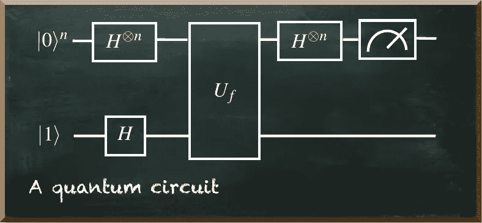
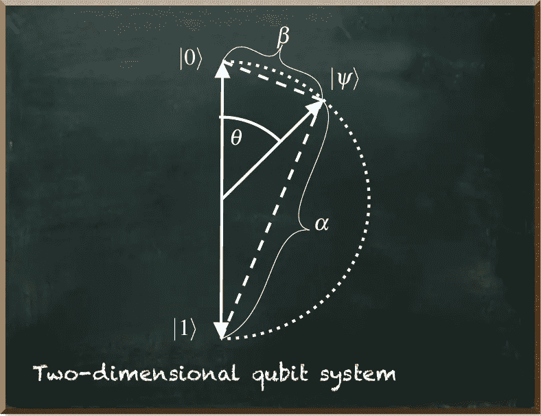
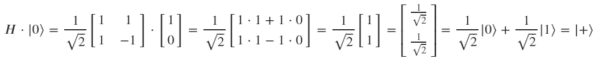
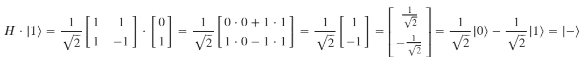

# 为非数学家解释量子电路的数学

> 原文：<https://towardsdatascience.com/explaining-the-math-of-a-quantum-circuit-for-the-non-mathematician-79abf345c508?source=collection_archive---------17----------------------->

## 你是否因为所有的数学知识而难以理解量子电路？

量子机器学习要不要入门？看看 [**动手量子机器学习用 Python**](https://www.pyqml.com/page?ref=medium_circuitmath&dest=/) **。**

在以前的帖子中，我声称[你不需要成为数学家](/you-dont-need-to-be-a-mathematician-to-master-quantum-computing-161026af8878)或物理学家[才能理解量子计算。](/you-dont-need-to-be-a-physicist-to-understand-quantum-machine-learning-e0c91db4dfc3)

然而，如果你既不是数学家也不是物理学家，学习量子算法有时会很难。它具有挑战性，因为它广泛使用符号。符号的问题在于，你不能轻易地谷歌它们。例如，考虑下面的电路。

作者图片

它代表了一种你在学习量子算法时会经常遇到的结构。但是如果你不知道这些术语的意思，你怎么知道呢？

以|0⟩和|1⟩为例。只是为了好玩:谷歌一下。

𝐻⊗𝑛怎么样？你知道如何在谷歌中输入这个词吗？(即使是中等文本编辑器也不支持正确书写此术语。)我的意思是，如果你得到的只是一张图片，那么从图片上复制文字都不容易。

如果你不是数学家，这些符号和象形文字一样好。

作者图片

当然，你不需要成为天才才能理解量子电路。只要你比克里特斯聪明一点，你就会没事的。

作者图片

那么，让我们来解释一下量子电路。量子计算不是偶然用数学符号来描述的。量子电路是一种数学构造。这是一个等式。而且，毫无疑问，数学是一种简洁而精确的语言。有了数学，你可以非常简洁地描述算法。

不幸的是，对我们大多数人来说，数学充其量是第二语言。

让我们从最左边开始。在那里，我们找到了电路的输入。|0⟩和|1⟩表示量子位元最初的状态。当我们在|0⟩态测量一个量子位时，它是 0。当我们在|1⟩态测量一个量子比特时，它是 1。这类似于传统的钻头。

***那么，我们为什么不直接写 0 和 1 呢？为什么我们要把它们放在这么奇怪的框架里？***

原因是一个量子位不仅仅是 0 或 1。它是 0 和 1 的线性组合，除非你测量它。一旦你测量它，它立刻变成 0 或 1。我们用向量来描述这种线性关系。所以|0⟩和|1⟩表示两个向量。它们是我们在量子计算中使用的标准基向量，用狄拉克符号书写。向量是有长度和方向的几何对象。狄拉克符号(也称为 bra-ket)在量子力学领域很流行。但这并不新奇。

我们可以简单地说

我不得不承认。这两个方程只是将向量从一种符号转换成另一种符号。所以，它仍然使用数学和符号。但这是大多数人在高中学习的符号。如果你对向量一点都不熟悉，我给你谷歌了足够多的关键词。

但是在你去 Google now 之前，我们为什么不图形化地看一下这两个向量呢？

作者图片

向量中的每个数字代表一个维度。所以，我们的向量是二维的。

在此表示中，两个维度都位于垂直轴上，但方向相反。因此，系统的顶部和底部分别对应于标准基矢量|0⟩和|1⟩。

在图中，有另一个称为“psi”的向量——|𝜓⟩.

|𝜓⟩代表任意量子位状态。我们上面提到过，一个量子位是 0 和 1 的线性关系。因此，

𝛼和𝛽是该矢量到标准基矢量|0⟩和|1⟩.的距离如果我们将它们平方，我们得到测量量子位为 0 (=𝛼)或为 1 (=𝛽)的概率。

举个例子，如果我们说𝛼=1 和𝛽=0，那么|𝜓⟩=1⋅|0⟩+0⋅|1⟩=|0⟩.对于𝛼=1 来说，测量量子位为 0 的概率是 1 =1=100%。

仅仅说我们测量一个量子位为 0，另一个量子位为 1，这就需要很多数学，不是吗？

但是，我们还没有完成初始化。你可能已经注意到在|0⟩^𝑛.旁边有一个小小的上标𝑛通常，这表示一个指数。这里，它说我们在|0⟩态没有一个量子比特，但是在这个态有𝑛量子比特。我们也可以把它写成|00⋯0⟩和𝑛0。

**所以，我们的电路包含了 *n 个*量子位，它们被初始化为一个我们测量为 0 的状态，还有一个量子位被测量为 1。**

在量子位的初始化旁边，我们看到了术语𝐻⊗𝑛和𝐻.先说后者。在量子计算中，大写字母通常代表矩阵。矩阵𝐻代表哈达玛矩阵，其定义为

重要的是要知道，如果你用一个向量乘一个矩阵会发生什么(假设矩阵的列数等于向量的行数)。然后，结果是另一个向量。

例如，如果我们将哈达玛矩阵乘以状态向量|0⟩或|1⟩，那么我们得到另一个向量。

和

两个矢量的𝛼和𝛽值相等，如果你平方它们。唯一的区别是𝐻乘以|1⟩.时𝛽的符号通常，标志也是这种状态的简称。

在量子计算中，|+⟩是

|−⟩是

当你计算这些值的平方来分别计算量子位的概率为 0 或 1 时，你会得到 1/2。

因此，𝐻矩阵有效地转换了量子位的状态。我们不再确定地测量量子位为 0 或 1。但是当我们测量的时候，可能是 0，也可能是 1——各有 50%的概率。

也许，你已经开始怀疑𝐻⊗𝑛的意思了。|0⟩^𝑛代表|0⟩.的𝑛量子位如果我们把这些量子位看作一个单一的向量，那么这个向量就不仅仅只有二维，而是 2⋅𝑛维。每个量子位有两个维度。

只有当一个矩阵和一个向量有相同的维数时，我们才能把它们相乘。这就是𝐻⊗𝑛所关心的。

让我们看看𝐻⊗2=𝐻⊗𝐻.这种两个矩阵相乘的方式叫做张量积。我们可以把它写成

它创造了一个更大的矩阵。更重要的是，它是递归工作的。

我饶你在这里扩展𝐻⊗2。总的来说，是的

这个公式被称为克罗内克积。这是数学上的说法:

**对每个** 𝑛 **量子位应用相同的变换矩阵(这里是** 𝐻 **)。**

电路的下一个术语叫做𝑈𝑓.它代表一个酉矩阵。酉矩阵是它自己的共轭转置矩阵。这听起来很复杂。但简单来说，矩阵翻转了对角线。自身是共轭转置的矩阵具有有趣的特征。例如，当你把这样一个矩阵本身相乘时，结果就是单位矩阵。𝑈是一个矩阵，𝑈†是它的共轭转置。然后，𝑈†𝑈=𝑈𝑈†=𝐼.

我们知道矩阵可以改变量子位的状态。但是，单位矩阵不会改变它。所以，我们可以说𝐼|𝜓⟩=|𝜓⟩.

所以，当你把你的量子位状态乘以同一个幺正态两次，它会再次得到原来的量子位状态。或者，换句话说，转换会自行恢复。

酉矩阵的另一个重要特征是它保留了测量概率。这是当前电路中的重要一点。

记住，所有的量子位在进入𝑈𝑓变换之前都处于 0 和 1 概率相等的状态。所以，如果一个酉矩阵不改变概率，它们仍然是相等的。

如果这个矩阵不会改变概率，我们为什么还要应用它呢？

答案就在|+⟩和|−⟩之间。如上所述，两种状态下的量子位具有相同的测量概率。

但是我们已经知道的哈达玛门有一个有趣的效应。它不仅把一个量子位从|0⟩变成了|+⟩，从|1⟩变成了|−⟩，还把|+⟩变回了|0⟩，把|−⟩变回了|1⟩.它会恢复原状。

这就是最终的𝐻⊗𝑛所做的。关键是𝑈𝑓是我们要解决的某个问题的占位符。

它只是将一些量子位从|+⟩翻转到|−⟩.它翻转了问题解中必须为 1 的那些。而且，它没有触及|+⟩那些需要在解决方案中为 0 的部分。

# 结论

在这篇文章中，我们揭示了量子电路背后的数学原理。我们学习了量子电路的数学以及它的含义。

原来小小的数学符号里有很多含义。如果你都知道，数学是精确描述电路的简洁方法。但是如果这些你都不知道，单单数学作为解释是不够的。它没有强调重要的事情，也没有提供你可以用来做自己研究的线索(比如关键词)。

手边的电路代表了著名量子算法的结构，例如 Deutsch-Jozsa 算法和 Bernstein-Vazirani 算法。

两种算法的区别在于𝑈𝑓.的实现

𝑈𝑓矩阵将这些量子位从|+⟩翻转到|−⟩，我们想测量为 1。并且这些形成了算法旨在解决的问题的解决方案。

在这篇[帖子](/an-illustrative-case-of-quantum-advantage-6dd1a0168a73)中，你可以了解更多关于用友和 Deutsch-Jozsa 算法的细节。

你对量子计算了解得越多，你对数学的理解也就越多。但是你也会看到量子计算不全是数学。然后，你会奇怪为什么没人费心用非数学的方式解释事情。

数学应该是解释的补充。这样，读者就更容易理解这些公式。如果她在看到一个公式时已经理解了这个概念，那么所有这些符号更有可能是有意义的。

量子机器学习要不要入门？看看 [**动手量子机器学习用 Python**](https://www.pyqml.com/page?ref=medium_circuitmath&dest=/) **。**

免费获取前三章[这里](https://www.pyqml.com/page?ref=medium_circuitmath&dest=/)。