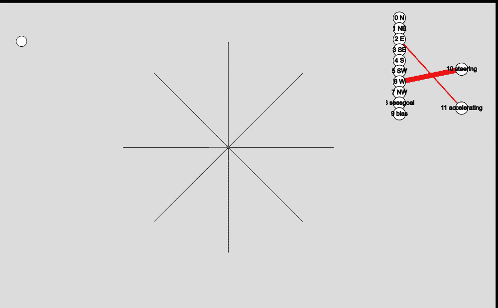
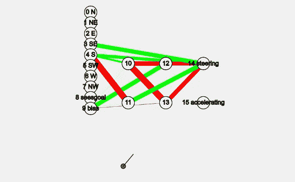
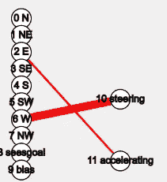
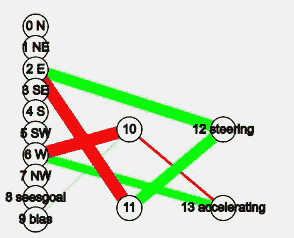
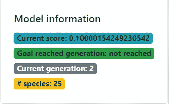

# 自我学习、进化的神经网络的解释

> 原文：<https://towardsdatascience.com/explanation-of-a-self-learning-evolving-neural-network-7f6b71df6241?source=collection_archive---------16----------------------->

## 观察并理解算法是如何学习、变异和进化的

就像在塞伦盖蒂草原上，我们的算法是适者生存(图片由[陈虎](https://unsplash.com/@huchenme)在 [unsplash](https://unsplash.com/photos/60XLoOgwkfA) 上提供)

在这篇文章中，我们将通过一个自我学习，基于进化的遗传算法的应用来增强它自己的拓扑结构。迷茫？我可以想象；这是一些大词。不过，请继续关注我，我保证在本文的结尾，您会看到这个算法的美妙之处。

为了尽可能清楚地理解神经进化算法，我编写了一个名为 Dots 的[小游戏，它将展示算法的工作方式。我试图用外行的术语描述发生的事情，而不是专注于编程或数学。目标是让你了解神经网络的一般工作原理，并看到它们的可能性和应用。](https://mike-huls.github.io/neat_dots/#)

我们正在使用的算法被 Ken Stanley 称为 NEAT(扩充拓扑的神经进化)。读完这篇文章后，你会对它的工作原理和好处有一个大致的了解。我们将通过以下步骤来实现这一点:

1.  游戏的描述和目标
2.  圆点；输入和输出
3.  演变的点
4.  将所有这些放在一起—快速总结
5.  其他应用

# 1.设置和游戏目标

前往[**mike-huls.github.io/neat_dots**](http://mike-huls.github.io/neat_dots)并按下右上角的绿色大播放按钮。

1.显示单个点的游戏概述(出于说明目的画出的传感器)

你首先会看到的是右下角的一堆圆圈，然后它们就像喝醉的飞机驾驶员一样向前移动。这些圆圈被称为点，它们产生了数百个。在游戏开始的时候，几百个小点产生并开始移动。如果他们撞上了黑色的边界，他们就死了。边缘的黑边是一个障碍。如果一个点碰到其中的一个，它就死了。您可以点击“添加障碍”按钮来绘制新的障碍。

一旦所有的点都死了，或者过了一段时间后，一个全新的新一代的点就会诞生。每个点的目标是达到左上角的目标。游戏的目标是进化这些点，使它们以最快、最优化的方式达到目标。让我们来看看这是如何工作的！

# 2.介绍我们的选手

玩几次这个游戏，尝试一些不同的障碍，看看这些点是如何反应的。现在是时候更好地了解他们了。首先我们将分析点本身；它如何解释环境，它能做什么，它如何决定这样做？

介绍我们的点(和一个漂亮的大脑；稍后将详细介绍)

## 行动、传感器和决策

圆点可以以两种方式移动:它们可以加速、减速和左右转向。dots 的目标是加速和转向，以达到目标；左上角的白色圆圈。

但是一个圆点如何决定何时加速或转向呢？这完全取决于点的周围环境。每个有 9 个传感器；它可以朝 8 个方向看(由图 1 中的线条表示)。此外，它可以检测是否看到目标。偏置传感器总是设置为 1；以防所有其他节点“关闭”。

所有传感器的值都在 0 和 1 之间。越靠近障碍物，该值越大，为 1。如果没有检测到障碍物，传感器为 0。seesGoal 传感器的工作方式略有不同；不是 0 就是 1。

动作的值介于-1 和 1 之间。负值将减速或转向左侧，正值将加速或转向右侧。

## 连接这些点；创造一个大脑

我们的目标是让 dot 作用于它的传感器；它为了生存和触及目标而解读它的环境。圆点必须知道，如果它在那里探测到一个障碍物，它不应该转向左边。每个点都有一个大脑，使得一个点完全有可能做到这一点。把大脑想象成传感器连接到行动的方式。这也被称为神经网络的拓扑结构(还记得这篇论文的名字吗？).您将在第一列中看到传感器节点，在第二列中看到操作节点。

2.一个点的大脑

在游戏的右上角，你可以看到最成功的圆点的大脑。你可以在图 2 中看到一个特写。由于游戏刚刚开始，这个大脑相当简单，但它可以复杂得多:

3.更复杂的大脑

dot 不仅创建了更多的连接，还创建了一些额外的节点。这样它可以一次解释多个传感器。例如，它可以检测传感器 1 和 2 中的障碍物，然后将该观察结果与传感器 0 中的障碍物相结合，并让该结果影响转向。

创建额外的节点和边是非常特殊的；在大多数神经算法中，你必须事先定义你的拓扑(大脑)。它假设您知道需要连接哪些节点。NEAT 的美妙之处在于它从最简单的拓扑开始；只有输入(传感器)和输出(动作)，然后建立自己的拓扑结构。这保证了一个最小的网络结构，通常真的很酷。稍后我们将讨论算法如何演化拓扑。

在图 2 中，我们看到传感器 6 通过一条红色粗线连接到方向盘。红色表示连接是负的。厚度表示连接的**重量**高；传感器 6 对转向有很大的负面影响。换句话说:当这个点探测到它左边的东西时，它会转向左边，直接撞上障碍物。这有点傻，但没关系，我们的小点还在学习。

# 3.演变的点

我们使用的神经网络的美妙之处在于，我们没有预先定义任何东西。这个点并没有被设定远离墙壁，它甚至一点也不知道墙壁是如此致命。然而，这个点被编程为*学习*。在这一节中，我们将深入探讨 dot 是如何学习的，它是如何分享其知识的，以及这些知识是如何传递给下一代的。一般顺序如下:

*   计算点适合度
*   形成物种
*   交叉
*   使突变

我们正在进化我们的点(图片由[尤金·日夫奇克](https://unsplash.com/@eugenezhyvchik)在 [Unsplash](https://unsplash.com/photos/xJY-7gtC38o) 上拍摄)

## 适者生存

当一个点产生时，它的传感器和动作之间没有多少联系。将创建一个随机连接，并赋予一个随机权重，由其厚度表示。在上面的图像中，这个点会自己撞到墙上。交通部不知道这对他来说是否是个好决定；它不知道自己是否在做正确的事情。为了学习，必须有某种对他有益的衡量标准。这就是健身的用武之地。

你可能认识达尔文的这个术语。健康反映了你对周围环境的适应程度。把它想象成一只狗，如果它做了好事，它会得到一份奖励；我们在强化“好”的行为。在游戏中，我们可以在*模型信息*部分看到最佳表现点的适合度。

点模型信息

我们在代码中定义一个点什么时候做得好。在这个特殊的例子中，我将适应性定义如下:

*   如果 dot 还没有看到目标，它需要进入探索模式:健身是 0 开始，并增加它覆盖的距离。
*   如果这个点已经看到了目标，这意味着这个点已经到达了它可以到达的位置。首先，dot 会因此获得奖金；那么它的适应度就由它死于目标的距离来定义；越短越好
*   如果小点达到了目标，它将再次获得奖励。健康的定义是达到目标所需的最短步数；确保我们尽快到达那里。

太好了！当一个点表现良好时，我们已经进行了编码。有了这些信息，我们就可以执行这个算法中最重要的部分:物种形成。

## 物种形成

现在我们有了比较点的方法，我们可以揭示为什么我们同时产生数百个点:它们将进行实验，分享知识和进化。它是这样工作的:在每个点完成它的工作后；四处狂奔，随意撞墙，是时候看看谁最厉害了。首先我们要根据他们的大脑来比较所有的点。非常相似的点将被归为一个物种。

你可以在游戏中识别物种；有时你会清楚地看到一组点在做着与其他点完全不同的事情。也许他们走向北的路线，而另一组绕过障碍物向南走。这是因为他们的大脑明显不同。

我们将根据每个物种的适合度排列它们内部的点，然后杀死每个物种的下半部分。这听起来可能有点残酷，但你是完全正确的。但是就像在自然界一样；只有适者生存。还要注意的是，圆点只需要在它们的物种内部竞争；这是为了保护创新。新发展的 dots 可能在开始时表现不佳，需要几代人才能真正发挥作用。如果它们在发挥出真正的潜力之前就灭绝了，那就太可悲了。

最后，是时候消灭过时的物种了。我们可以通过检查物种中表现最好的点的适合度分数来检测这一点。如果几代人都没有改进，它就变得陈旧了，是时候淘汰了。

我们正在观看快进中的进化(图片由[库勒](https://www.pexels.com/@couleur-1208853)在[像素](https://www.pexels.com/photo/photo-of-yellow-and-blue-macaw-with-one-wing-open-perched-on-a-wooden-stick-2317904/)上拍摄)

## 交叉

在最后几段中，我们已经删除了许多坏点。让我们用我们最好的点来繁殖后代，把那些聪明的头脑传递下去。在每个物种中，随机选择成对的亲本。具有较高适合度分数的点具有较高的变化以被选择。每一对将结合他们最好的特点创造一个孩子。他们后代的大脑将是他们父母大脑的结合体。在这一步之后，我们的人口将与这一代人开始时一样多。

## 使突变

新一代开始前的最后一步是突变。为了保持创新，大脑中的每个点都会随机变异。这意味着每个点要么得到一个新的节点，要么得到一个新的连接。

这一步在所有的点上引入了一些随机性。在某些情况下，这将是有益的，其他点将遭受他们的新大脑。谢天谢地，多亏了物种形成，这个点将有一些时间来“调整”它的大脑。

## 再做一次

我们的新一代已经准备好迎接下一轮挑战。所有的点将再次产生，希望导航与多一点成功，并最终达到目标或死亡。然后他们的适应度被再次计算，所有的点都被特化、剔除、繁殖和变异，我们为下一个周期做好了准备。每一代都会比上一代好一点，最终目标会实现。

# 4.把所有的放在一起

我认为 NEAT 非常特别，因为它要求你事先定义很少的东西。在许多统计技术中，有许多要求。在许多遗传算法中，我们需要预先定义我们的拓扑结构(点脑)。NEAT 从一个最小的拓扑开始，只是连接输入和输出，然后慢慢增加复杂性以尽可能保持简单。此外，它通过使用物种来保护创新；圆点只需要在它们的物种内部竞争。此外，它培育出表现最好的点，结合了父母双方的最佳特征。

与其他统计技术相比，NEAT 的缺点是它生成的模型非常复杂。当我们使用线性回归时，我们可以提取一个简单的公式，一个整洁的大脑可能会非常复杂，很难用一个简单的公式来把握。当我们可以使用线性回归来确定变量之间是否存在线性关系时，这种关系可能很难看出。

# 5.其他应用

在点的情况下，我们将点传感器连接到它可以执行的一些动作。这在现实世界中没有太大的价值，但谢天谢地，NEAT 并不局限于通过障碍迷宫导航笨拙的圆圈。在这一节中，我们将研究一个假设的例子，如何在现实世界中应用 NEAT。

经纪人机器人将决定你的房价(图片由[亚历山大·奈特](https://www.pexels.com/@agk42)在 [Unsplash](https://www.pexels.com/photo/high-angle-photo-of-robot-2599244/) 上提供)

## 决定房价

您有一个包含房屋特征和销售价格的数据集。我们将应用 NEAT 来创建一个大脑，它可以根据特征最准确地确定销售价格。

一个点有 9 个传感器:8 个方向的视线和是否能看到目标。例如，我们的房价大脑将拥有*房屋表面*、*土地表面*、*卧室数量*、*建筑年份*、*拥有车道*和*停车位数量*。例如，我们必须在 0 到 1 之间调整所有这些值，其中 0 是最小建筑年份，1 是最大建筑年份。我们的输出将是房价。房价也会是 0 到 1 之间的数字；在我们的训练数据中，它映射在最低和最高房价之间。

就像我们产生了几百个点一样，现在我们将产生几百个“宅脑”,并从我们的训练集中给他们所有人一些数据记录。数据流经大脑计算房价。我们将把这个与实际房价进行比较。区别在于适合度；越小越好。然后，简洁的算法再次发挥作用。大脑被评分、分类、筛选、特化、繁殖和变异，之后我们会再次向它们输入数据。

大脑会改变它们的拓扑结构并调整它们的权重。经过多次迭代后，我们可以将表现最好的大脑输入一些新数据，以便预测房价。

# 结论

当我第一次读这篇整洁的论文时，我爱上了这个算法，因为它非常像自然。我们谈论的是物种、适应度、基因组、杂交、父母和后代。对我来说，我们能够对这种自然行为进行编程是非常令人着迷的。我真的很喜欢这个算法的灵活性，优雅和效率。

我希望这篇文章是对这个伟大算法的介绍，并且足够清晰地向您展示它的美妙之处。如果你有建议/澄清，请评论，以便我可以改进这篇文章。同时，查看我的其他关于各种编程相关主题的文章。编码快乐！

—迈克

页（page 的缩写）学生:比如我正在做的事情？[跟我来](https://github.com/mike-huls)！