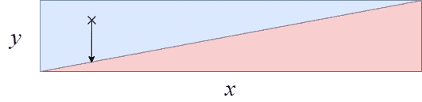
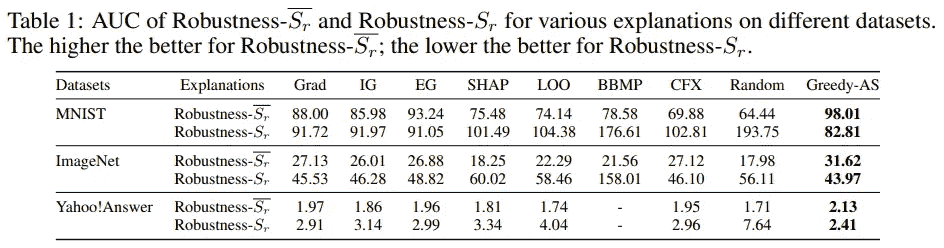

# 通过稳健性分析说明和特性的重要性

> 原文：<https://towardsdatascience.com/explanations-and-features-importance-through-robustness-analysis-396a7907777?source=collection_archive---------15----------------------->

## 一种更精确、更可靠的方式来解释你的预测

本文基于 Hsieh 等人在 ICLR 2021 上发表的[评估和通过稳健性分析](https://arxiv.org/abs/2006.00442)进行解释的方法。

# 一组重要的特性意味着什么？

目前有许多不同的算法来为神经网络分类器预测提供解释。我们希望这些算法能够区分重要特征和不重要特征。如果小扰动可以改变预测，则一组特征是重要的，而如果需要大扰动来改变预测，则一组特征是不重要的。

例如，考虑一个极其简单的分类问题，它有两个预测类(下面是红色和蓝色)和两个特征( *x* 和 *y* ):

特性 *y* 更重要，因为一个小的扰动就能轻易改变等级:

虽然 *x* 不那么重要，因为需要更大的扰动来改变类别:

在 MNIST 数据集上，人们可以看到重要的要素是那些可以通过添加或删除数字线来更容易地更改预测的要素。

[来源](https://arxiv.org/abs/2006.00442)

对于给定的分类器 *f* ，输入 *x* 和特征集 *S* ，我们定义了“鲁棒性-S”(表示为 *g(f，x，S))* ，其量化了对 *S* 上 *x* 的最小扰动δ(*δ*在 *S* 外等于零)，该扰动改变了预测:

[来源](https://arxiv.org/abs/2006.00442)

如果我们把 *S_r* 表示为重要特征的集合，把 *\not{S_r}* 表示为它的补集，那么必然是这样的:g(f，x，S_r) 小而 *g(f，x，\not{S_r})* 大。[评估和通过鲁棒性分析进行解释的方法](https://arxiv.org/abs/2006.00442)的作者设计了一种算法“Greedy-AS ”,可以为 S_r 找到一个很好的候选。他们的实现可在 [Github](https://github.com/ChengYuHsieh/explanation_robustness) 上获得。我们首先显示结果(下一节),然后更详细地介绍算法。

# 结果

对于给特征赋予重要性值的任何算法 *f* 以及对于任何数量的特征 *k* ，可以计算由 *f* 标识的前 *k* 特征定义的 *S* 的 *g* 函数。通过改变 *k* ，可以为 *f* 计算 *g* 函数的 AUC(下表中称为鲁棒性)。

这样，人们可以通过算法的鲁棒性来比较不同的算法:

[来源](https://arxiv.org/abs/2006.00442)

可以看出，Greedy-AS 能够比当前的 SOTA 算法更精确地识别特征，如 IG(集成梯度)或 EG(预期梯度)，这两种算法都在 Captum(py torch 的可解释库)中实现。

让我们想象一下所提供的不同解释(点击放大):

[来源](https://arxiv.org/abs/2006.00442)

[来源](https://arxiv.org/abs/2006.00442)

# 贪婪算法

为了计算 *S_r* ，第一个简单的方法是以贪婪的方式来做:从空集 *S=∅* 开始，然后迭代地选择最大化 *g(f，x，s*∩*{ I })的最佳特征 *i* ，当你选择 k 个特征时*停止。

然而，这种方法不能很好地处理功能的交互，因为功能的子集在同时添加时可能是重要的，而在逐个添加时可能是不重要的。为了处理这个问题，我们最大化期望 g(f，x，S∩*{ I }*∪R*)*其中 *R* 是期望所基于的一组随机特征。如果 *i* 与其他特征相关，当 *R* 包含时 *g* 的值将会很大，因此期望值会更大。

这篇中型文章旨在快速简单地介绍这种算法。请随意阅读[评估和通过鲁棒性分析](https://arxiv.org/abs/2006.00442)进行解释的方法，以获得更多详细信息。