# 非线性核函数的显式特征映射

> 原文：<https://towardsdatascience.com/explicit-feature-maps-for-non-linear-kernel-functions-171a9043da38?source=collection_archive---------16----------------------->

## [思想和理论](https://towardsdatascience.com/tagged/thoughts-and-theory)

> 这一切都是为了找到合适的空间

在高层次上，许多机器学习算法可以被认为由以下步骤组成。

1.  给我们一个输入数据集，其中的例子由 n 维特征向量描述。在有监督的问题中，我们也有一个目标标签。
2.  使用一些函数将特征向量映射到新的 *m* 维空间。(通常情况下， *m* 大于 *n* 。)

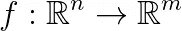

3.在新的特征空间中训练基本的机器学习模型。

比如你可以在上面的框架里想到很多深度学习的模型。通过将原始输入传递给创建新要素制图表达的多个图层来转换原始输入。然后你在新的特征空间里训练一个基本的机器学习模型。用于回归任务的多层感知器可以被视为应用于由隐藏层生成的特征的线性回归模型。类似地，通过添加 sigmoid 作为输出层的激活函数，我们在新的特征空间中训练逻辑回归分类器。

事实上，神经网络的巨大成功可以归因于这样一个事实，即映射函数是复杂的和可学习的，因此能够表示问题特定的模式。

但是在许多其他情况下，我们使用一个固定函数将原始数据特征映射到一个新域。一个标准的例子是通过考虑现有特征对的乘积来创建新特征。看看下面的例子。通过简单地将两个维度的乘积相加作为第三维度，我们获得了一个线性可分的数据集。

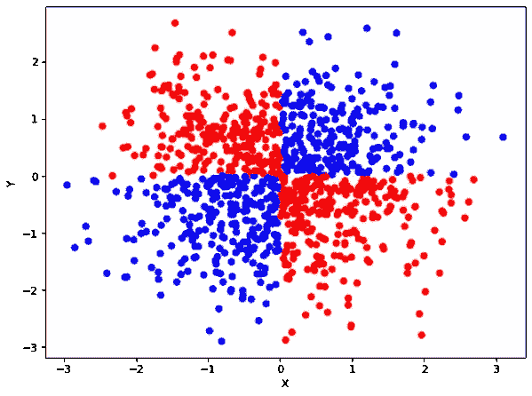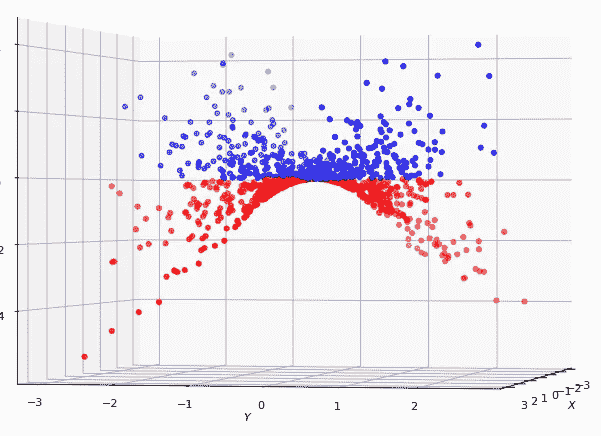

左边的数据集不是线性可分的。通过添加 x*y 作为第三个特征，数据明显地变成线性可分的。

# 核函数和支持向量机

在高层次上，核函数测量由数字向量表示的对象之间的相似性。核函数是支持向量机的基础，其目标是学习对象之间的分离超平面。核函数应该满足一定的数学要求，这些要求经过一定的简化，可以表述如下。

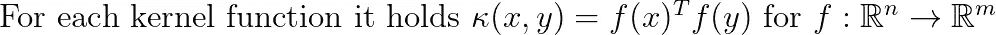

上面说了我们必须能够把两个向量之间的核函数改写成一个新的(高维)空间中向量之间的内积。

让我们考虑几个例子，使上面的正式定义更清楚:

*   **线性内核**。这里 *m = n* 和 *f* 是身份映射。

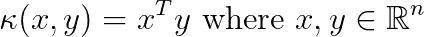

线性核的一个变体是余弦核，其中向量被归一化为具有单位范数。

*   **多项式内核**。

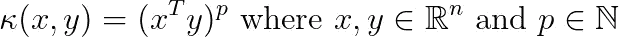

注意，对于 p=2，我们可以将向量 x 重写为一个 n 维向量。例如，设 *x = (x1，x2，x3)* 和 *y=(y1，y2，y3)* 为两个三维向量，p=2。那么对于 2 次多项式核，它成立

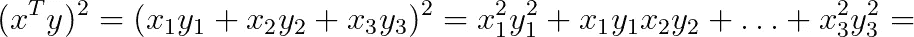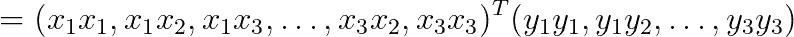

即，对于显式特征图，我们有一个 9 维向量。

更一般地，多项式核的显式特征映射是 n^p-dimensional.

*   **RBF 内核**。径向基函数用于定义 RBF 核:

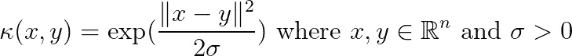

指数函数的使用使得显式特征图的维度是无限的。

## 内核技巧

评估显式特征映射的明显问题是大多数内核的映射的高维度。这导致了臭名昭著的内核技巧的发现。我们让读者参考[这个关于内核技巧的精彩解释](/the-kernel-trick-c98cdbcaeb3f)，但是在高层次上，它实现了以下内容。通过重写我们想要优化的目标函数，我们可以在高维空间中学习一个*隐式定义的*分离超平面，而不需要生成高维向量。分离超平面由一组向量定义，即所谓的支持向量，而不是由精确的坐标定义。当我们需要决定一个点 *x* 位于超平面的哪一侧时，我们针对所有支持向量*y*来评估核函数 *k(x，y)* 这要高效得多。考虑 100 维输入向量和次数 p=4 的多项式核。显式计算要素制图表达需要我们使用 10⁸矢量，即 1 亿个条目。但是用支持向量评估乘积需要两个 100 维向量的内积，然后将结果提升到 4 次方。

为了更好地了解我们可以实现的计算节省，假设我们已经检测到超平面由 1，000 个支持向量隐式定义。评估所有支持向量的核将需要总共少于 1，000*100*4 次乘法(最后一项 4 来自评估内积幂的乘法次数)。这是使用评估单个示例所需乘法次数的 0.004 分之一。显式特征映射。

## 大数据改变了这一局面

然而，在大数据时代，支持向量机并不是真正可扩展的。首先，为了计算一组支持向量，我们需要计算由输入实例的所有对 *(x，y)* 的核值 *k(x，y)* 组成的 Gram 矩阵。因此，对于我们训练数据集中的 *t* 个例子，我们需要一个具有 *t* 个条目的矩阵。即使我们决定通过仅保留最大的条目来存储 Gram 矩阵的稀疏化版本，对于大规模数据集，简单地计算所有对的核函数也是不可行的。

另一个问题是，对于大规模复杂数据集，支持向量的数量随着数据集大小线性增长[1]。因此，即使我们有能力训练一个 SVM 模型，预测时间也会非常慢，因为对于单个预测，我们需要多次评估核函数。

## 明确但简洁

支持向量机的上述限制已经促使研究人员考虑获得显式特征图的紧凑表示的问题。这意味着原始的 *n* 维向量 *x，y* 被新的 *m* 维向量 *f(x)，f(y)* 替换，对于相当大的 *m* ，使得

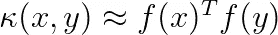

这里的 *m* 是用户定义的参数。m 越大，近似值越好。因此， *m* 是准确性和可伸缩性之间的权衡。

请随意跳过下面对构建显式特征图的底层机制的描述。这对理解接下来的部分并不重要。

## 它是如何工作的？

接下来，我们考虑为两种最广泛使用的核函数(RBF 核函数和多项式核函数)构建显式特征映射的两种方法，并直观地说明它们是如何工作的:

[**RBF 采样器**](https://scikit-learn.org/stable/modules/generated/sklearn.kernel_approximation.RBFSampler.html#sklearn.kernel_approximation.RBFSampler) **。**

使用概率论中的一些高级数学概念，我们可以获得内核的以下表示

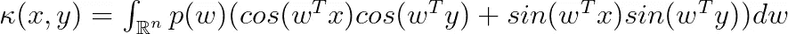

其中 *p(w)* 是一个概率分布[2]。

上面的公式允许我们设计一个采样程序，根据 *p(w)对向量 *w* 进行采样。*注意括号里的表达式可以写成两个坐标的内积。大量的样本将产生一个近似的显式特征图。对于向量的集合，我们使用相同的随机种子对近似显式特征图中每个坐标的值 *w* 进行采样。以这种方式，我们保证样本是协调的，并且彼此相似的向量，即具有小的欧几里德距离的向量，很可能在各自的坐标中以相似的样本结束。

[**多项式计数草图**](https://scikit-learn.org/stable/modules/generated/sklearn.kernel_approximation.PolynomialCountSketch.html) **。**

多项式 CountSketch 或 TensorSketch [3]建立在 CountSketch 算法的基础上，用于检测大规模数据流中的重要内容。我们将直观地解释这种方法是如何工作的。想象一下，给我们一个向量 *x* 构造 n 维显式特征图，称之为 *z* 。然后，每个索引 *i* 由散列函数随机放置在一个 *m* 桶中，用 *B* 表示，并用零初始化。此外，值 *z[i]* 以相等的概率乘以随机选择的-1 或 1。准确地说，我们将一个存储桶更新为

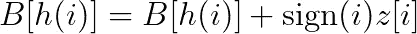

假设某些 *z[i]* 值比其余值大得多，即所谓的重量级人物。让*z【j】*这样的重量级人物。包含它的桶， *B[h(j)]* 还包含其他条目 *z[k]* 。桶中的内容是

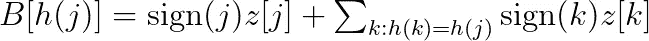

然而，符号是随机的，如果求和包含许多小项，它们很可能会相互抵消。

现在假设我们有两个向量的显式特征图 z 和 w，使得 *z[j]* 和 *w[j]* 都很大。(最终，这就是我们在内核中寻找的东西，检测在两个输入向量中都有意义的特征子集。)我们将 *z[j]*w[j]* 的乘法替换为

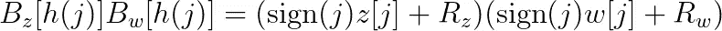

其中 R *z* 和 R *w* 是散列到同一桶的其他条目的上述总和。因为*z【j】*和*w【j】*前面的符号相同，R *z* 和 R *w* 较小，所以我们得到了*z【I】* z【j】*的一个很好的近似。

上面假设我们可以直接访问显式特征图中的条目 *z[i]* 。在[3]中，作者设计了一种有效的算法，该算法可以通过避免生成显式特征图来执行上述操作。它在输入向量的长度上几乎以线性时间运行。

## 如何使用显式特征地图

好消息是，显式特征地图已经在 scikit-learn 中[实现](https://scikit-learn.org/stable/modules/kernel_approximation.html)，并且易于使用。(以下示例的代码可在 https://github.com/konstantinkutzkov/explicit_feature_maps 的[找到)](https://github.com/konstantinkutzkov/explicit_feature_maps)

首先，导入必要的包:

```
from sklearn import svm, datasets
from sklearn.kernel_approximation import RBFSampler
from sklearn.kernel_approximation import PolynomialCountSketch
```

然后，我们可以简单地将原始向量转换为新的特征表示。

```
poly_cs = PolynomialCountSketch(
               degree=3, 
               gamma=1.0, 
               random_state=1, 
               n_components=1000
            )X_train, y_train, X_test, y_test = 
    get_train_test_split(X, y, train_index)
X_train_poly, X_test_poly = 
    poly_cs.fit_transform(X_train), poly_ts.fit_transform(X_test)
```

最后，使用线性 SVM 训练模型:

```
model_cs = 
svm.LinearSVC(C=1.0, max_iter=10000).fit(X_train_poly, y_train)
```

我们在由 64 维向量描述的手写数字组成的[数字数据集](https://scikit-learn.org/stable/modules/generated/sklearn.datasets.load_digits.html)上训练上述模型。因此，3 次多项式核的显式特征映射将导致维数为 262，144 的向量。相反，我们使用只有 1000 个条目的特征地图，少了 260 倍，并获得了基本相同的结果。以下结果是 10 次交叉验证的平均值:

```
Linear SVM: 0.985
RBF SVM: 0.817
Polynomial SVM: 0.998
Explicit RBF: 0.818
Explicit Polynomial: 0.997
```

在上面的例子中，RBF SVM 和多项式 SVM 由使用核技巧的对偶 SVM 模型训练。多项式核优于其他方法，而 RBF 核似乎不适合这个问题。

## 实用提示

*   如果要将相同的映射应用到不同的集合，无论是为了模型部署还是结果的可再现性，都要确保使用相同的随机种子。
*   缩放要素。如果特征没有被缩放，那么在多项式计数草图中，特征图将偏向最重的条目(参见关于该方法如何工作的讨论)。
*   考虑到显式映射的近似的较小维度用作正则化参数。

## 应用程序

明显的应用是使用显式特征映射来训练线性支持向量机。但是，假设他们不知道手头的问题，显式特征地图可以与任何其他机器学习模型结合使用，无论是有监督的还是无监督的。就把它想象成在一个新的子空间中训练你的模型，这个子空间是由原始空间的坐标组合而成的。

# 讨论

## 优势

*   **可达性。**sci kit-learn 上易于使用的公开实施。
*   **可扩展性**。生成显式特征地图是一种高效的数学操作，不需要训练模型。
*   **很好理解**。我们正在用严格理解的性质逼近数学函数。这些内核函数已经被 ML 社区使用了几十年。

## 缺点

如果您决定在项目中包含显式要素地图，则应记住两个重要的缺点。

*   我们还有另一个需要仔细调整的超参数。与标准版本的内核相比，我们有一个额外的超参数，它是显式特征映射的维度。如前所述，这个参数是准确性和可伸缩性之间的折衷。
*   显式特征地图不再是可解释的。原始输入中的各个维度对应于在许多情况下人类专家可以访问的特征。这使得训练诸如线性或逻辑回归、决策树等可解释的 ML 模型成为可能。特别是，使用核技巧的支持向量机或多或少是可以解释的，因为我们可以查看两个向量之间的核函数得分。然而，显式特征图是原始向量的复杂数学修改的结果，并且个体坐标对人类用户不再有意义。

## 密码

【https://github.com/konstantinkutzkov/explicit_feature_maps 号

[1] Thorsten Joachims:在线性时间内训练线性 SVM。KDD 2006。[https://www . cs . Cornell . edu/people/TJ/publications/joachims _ 06a . pdf](https://www.cs.cornell.edu/people/tj/publications/joachims_06a.pdf)

[2] Ali Rahimi，Benjamin Recht:随机厨房水槽的加权和:在学习中用随机化代替最小化。NIPS 2008[https://people . eecs . Berkeley . edu/~ Brecht/papers/08 . rah . rec . NIPS . pdf](https://people.eecs.berkeley.edu/~brecht/papers/08.rah.rec.nips.pdf)

[3] Ninh Pham，Rasmus Pagh。通过显式特征映射的快速和可扩展的多项式核。https://dl.acm.org/doi/10.1145/2487575.2487591 KDD 2013