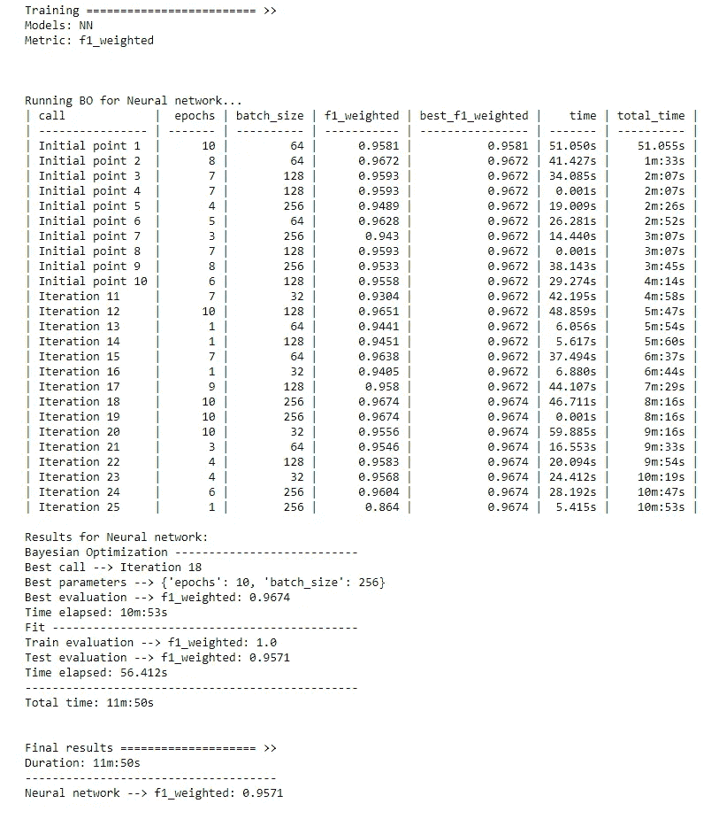
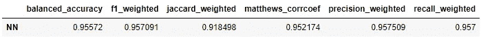
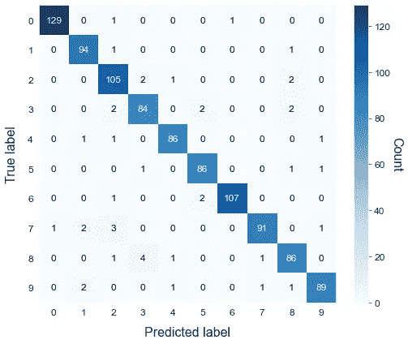

# 深度学习管道的探索变得容易

> 原文：<https://towardsdatascience.com/exploration-of-deep-learning-pipelines-made-easy-e1cf649892bc?source=collection_archive---------31----------------------->

## 关于如何使用正确的包在 Python 中执行快速 DL 实验的简单指南


艾莉娜·格鲁布尼亚克在 [Unsplash](https://unsplash.com?utm_source=medium&utm_medium=referral) 上的照片

# 介绍

在项目的探索阶段，数据科学家试图为他的特定用例找到最佳的管道。在这个故事中，我将解释如何使用 [ATOM](https://github.com/tvdboom/ATOM) 包来快速帮助你在任何给定的数据集上训练和评估深度学习模型。ATOM 是一个开源的 Python 包，旨在帮助数据科学家加快机器学习管道的探索。如果你想对图书馆有一个温和的介绍，请阅读这个故事。

# 例子

展示 ATOM 如何帮助您的最简单方法是通过一个示例。这个故事带你浏览一个笔记本，它训练并验证了一个用 [Keras](https://keras.io/) 实现的卷积神经网络。该模型使用 [MNIST](https://keras.io/api/datasets/mnist/) 进行训练，这是一个众所周知的图像数据集，其目标是对手写数字进行分类。

我们从必要的导入和定义模型开始:一个简单的神经网络，具有两个卷积层和一个输出层，由 10 个神经元组成，每个神经元对应一个数字。数据集包含 28x28 灰度图像，因此每个图像的数组都有形状(28，28，1)。之后，我们加载数据集。请注意，我们需要对数据进行整形，以与模型的输入保持一致。

```
from atom import ATOMClassifier, ATOMModel
from keras.datasets import mnist
from keras.models import Sequential
from keras.layers import Dense, Flatten, Conv2D
from keras.wrappers.scikit_learn import KerasClassifier *# Create the convolutional neural network*
def neural_network():
    model = Sequential()
    model.add(
        Conv2D(
            filters=64,
            kernel_size=3,
            activation="relu",
            input_shape=(28, 28, 1),
        )
    )
    model.add(Conv2D(filters=64, kernel_size=3, activation="relu"))
    model.add(Flatten())
    model.add(Dense(units=10, activation="softmax"))
    model.compile(
        optimizer="adam",
        loss="categorical_crossentropy",
        metrics=["accuracy"],
    )

    return model*# Download the MNIST dataset*
(X_train, y_train), (X_test, y_test) **=** mnist**.**load_data()*# Reshape data to fit model*
X_train **=** X_train**.**reshape(60000,28,28,1)
X_test **=** X_test**.**reshape(10000,28,28,1)

data **=** (X_train, y_train), (X_test, y_test)
```

因为 ATOM 使用 sklearn 的 API，所以我们为我们的模型使用了 [KerasClassifier](https://www.tensorflow.org/api_docs/python/tf/keras/wrappers/scikit_learn/KerasClassifier) 包装器。然后，我们将模型传递给 [ATOMModel](https://tvdboom.github.io/ATOM/API/ATOM/atommodel/) 函数，该函数向类添加一个名称和一个缩写词(用于从 atom 中访问模型)。

```
# Wrap the model to use sklearn’s API
model **=** KerasClassifier(neural_network, verbose=0)

*# Add useful attributes to the model*
model **=** ATOMModel(model, acronym**=**"NN", fullname**=**"Neural network")
```

现在我们已经准备好了模型，让我们从 atom 的管道开始。我们初始化 ATOM，以(X_train，y_train)，(X_test，y_test)的形式提供我们想要训练的数据。注意，我们只使用了 10%的数据来加速计算。

```
atom = ATOMClassifier(*data, n_rows=0.1, warnings=False, verbose=2)
```

输出显示了数据集及其类别分布的概述。

```
<< ================== ATOM ================== >>
Algorithm task: multiclass classification.
Parallel processing with 10 cores.

Dataset stats ==================== >>
Shape: (7000, (28, 28, 1), 2)
-------------------------------------
Train set size: 6000
Test set size: 1000
-------------------------------------
|    |     dataset |       train |        test |
| -- | ----------- | ----------- | ----------- |
| 0  |   745 (1.2) |   614 (1.1) |   131 (1.5) |
| 1  |   764 (1.2) |   668 (1.2) |    96 (1.1) |
| 2  |   694 (1.1) |   584 (1.1) |   110 (1.2) |
| 3  |   679 (1.1) |   589 (1.1) |    90 (1.0) |
| 4  |   701 (1.1) |   612 (1.1) |    89 (1.0) |
| 5  |   631 (1.0) |   542 (1.0) |    89 (1.0) |
| 6  |   714 (1.1) |   604 (1.1) |   110 (1.2) |
| 7  |   714 (1.1) |   616 (1.1) |    98 (1.1) |
| 8  |   641 (1.0) |   548 (1.0) |    93 (1.0) |
| 9  |   717 (1.1) |   623 (1.1) |    94 (1.1) |
```

当输入数据超过 2 维时，ATOM 会将数据集转换为只有一个形状特征的数据帧(n_samples，shape_sample)。该特征被自动称为*多维特征*。这就是为什么形状被表示为(7000，(28，28，1)，2)。请注意，末尾的 2 代表数据集包含的两列:功能列和目标列。让我们快速检查一下这个看起来怎么样。

`atom.dataset.head()`

```
Multidimensional feature                              Target
0  [[[0], [0], [0], [0], [0], [0], [0], [0], [0],...       5
1  [[[0], [0], [0], [0], [0], [0], [0], [0], [0],...       8
2  [[[0], [0], [0], [0], [0], [0], [0], [0], [0],...       8
3  [[[0], [0], [0], [0], [0], [0], [0], [0], [0],...       3
4  [[[0], [0], [0], [0], [0], [0], [0], [0], [0],...       9
```

列中的每一行都包含一个 shape=(28，28，1)的数组，该数组中的数据对应于一幅图像。

现在我们准备开始训练。为了自动执行超参数调整，我们首先定义我们想要在其中尝试参数的自定义空间。ATOM 使用[贝叶斯优化算法进行超参数调整](https://tvdboom.github.io/ATOM/user_guide/training/#hyperparameter-tuning)。确保超参数空间与 [skopt 的 API](https://scikit-optimize.github.io/stable/) 一致。

```
from skopt.space.space import Integer, Categoricalhyperparameter_space **=** [
    Integer(1, 10, name**=**"epochs"),
    Categorical([32, 64, 128, 256], name**=**"batch_size"),
]
```

下一步是训练模型。

```
atom**.**run(
    models=model,  # Our neural network
    metric**=**"f1_weighted",
    n_calls**=**25,  # Number of trials of the optimizer
    n_initial_points=10,  # Number of initial random trials
    bo_params**=**{"dimensions": hyperparameter_space},
)
```

输出如下所示:



就这样，使用优化器找到的最佳超参数来训练模型。

```
atom.evaluate()
```



可以通过我们定义的缩写词 nn 从 atom 访问该模型。

```
atom.nn.plot_confusion_matrix()
```



# 结论

我们已经学习了如何使用 ATOM 包来快速探索神经网络在给定数据集上的表现。然而，这个例子非常简单。ATOM 的能力远不止这些！其他有用的功能有:

*   多种数据清理和特征工程方法
*   30 多个分类和回归模型(逻辑回归、随机森林、xgboost、lightgbm 等)
*   轻松比较模型和管线
*   35 个以上的图来分析数据和模型性能

要了解更多信息，请看软件包的文档[。对于 bug 或功能请求，请不要犹豫，在](https://tvdboom.github.io/ATOM/) [GitHub](https://github.com/tvdboom/ATOM) 上发表问题或给我发电子邮件。

相关故事:

*   [https://towards data science . com/atom-a-python-package-for-fast-exploration-of-machine-learning-pipelines-653956 a16 e7b](/atom-a-python-package-for-fast-exploration-of-machine-learning-pipelines-653956a16e7b)
*   [https://towards data science . com/how-to-test-multiple-machine-learning-pipelines-with-just-the-less-lines-of-python-1 a16 CB 4686d](/how-to-test-multiple-machine-learning-pipelines-with-just-a-few-lines-of-python-1a16cb4686d)
*   [https://towards data science . com/from-raw-data-to-we B- app-deployment-with-atom-and-streamlit-d 8df 381 aa 19 f](/from-raw-data-to-web-app-deployment-with-atom-and-streamlit-d8df381aa19f)

引用:

*   邓，2012 年。用于机器学习研究的手写数字图像 mnist 数据库。 *IEEE 信号处理杂志*，29(6)，第 141–142 页。(麻省理工学院许可证)