# 探索性数据分析

> 原文：<https://towardsdatascience.com/exploratory-data-analysis-21c06b8f669?source=collection_archive---------33----------------------->

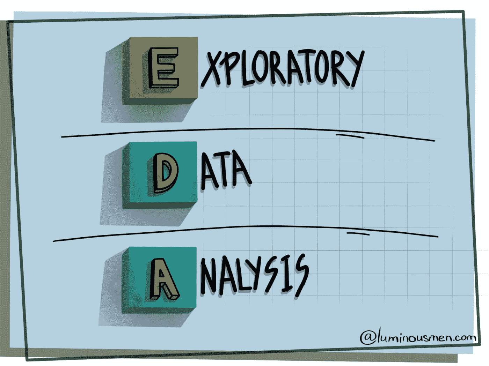

有很多工程师从未涉足统计学或数据科学领域。但是，为了构建数据科学管道或者将数据科学家产生的代码重写为适当的、易于维护的代码，工程方面会出现许多细微差别和误解。对于那些数据/ML 工程师和数据科学家新手，我做这个系列的帖子。我将尝试用简单的英语解释一些基本方法，并在此基础上解释一些数据科学的基本概念。

整个系列:

*   [数据科学。概率](https://luminousmen.com/post/data-science-probability)
*   [数据科学。贝叶斯定理](https://luminousmen.com/post/data-science-bayes-theorem)
*   [数据科学。概率分布](https://luminousmen.com/post/data-science-probability-distributions)
*   [数据科学。措施](https://luminousmen.com/post/data-science-measures)
*   [数据科学。相关性](https://luminousmen.com/post/data-science-correlation)
*   [数据科学。中心极限定理与抽样](https://luminousmen.com/post/data-science-central-limit-theorem)
*   [揭开假设检验的神秘面纱](https://luminousmen.com/post/demystifying-hypothesis-testing)
*   [DS 中的数据类型](https://luminousmen.com/post/data-types-in-ds)
*   [描述性和推断性统计](https://luminousmen.com/post/descriptive-and-inferential-statistics)
*   [探索性数据分析](https://luminousmen.com/post/exploratory-data-analysis)

急于迅速打动那些对商业感兴趣的人，数据科学家往往会完全错过了解数据的过程。这是一个非常严重且不幸的常见错误，可能会导致以下问题:

*   失去了洞察力，因此导致了项目的不幸结果。
*   由于不清楚的数据结构、数据中的异常值、数据中的偏差而产生不准确的模型；
*   基于不正确的数据创建准确的模型；
*   为模型选择了错误的属性；
*   资源利用效率低下。

探索性数据分析的目的是熟悉数据:了解数据结构，检查缺失值，检查数据中的异常，形成关于总体的假设，定义和阐明将用于机器学习的变量特征的选择，等等。

你会感到惊讶(讽刺)，但有时你根本不需要机器学习，一个简单的启发式方法就可以轻松击败所有模型。为了找到启发，你还需要知道数据。

数据分析是有价值的，因为它让你更有信心，未来的结果将是可靠的，正确的解释和应用在理想的业务环境。

大多数 EDA 方法本质上都是图形化的。强烈依赖图形的原因是，就其本质而言，EDA 的主要角色是在开放研究中，图形与我们都拥有的自然模式识别功能相结合，为分析师提供了理解数据的前所未有的能力。

有无限多种可能的图表、图形和图形，但您只需要其中的少数几种就足以很好地了解数据并进行处理。

# 谁是亿万富翁？

让我们试着在[亿万富翁的数据集](https://corgis-edu.github.io/corgis/csv/billionaires/)上说明 EDA 方法。数别人的钱总是很有趣，不是吗？

# 工具

EDA 的工具可能会有所不同。我们将结合 Python 使用以下工具:

*   Jupyter 笔记本，用于实时编码和可视化
*   任何从事数据工作的人的标准工具——pandas、numpy
*   可视化工具— matplotlib、seaborn、plotly、

# 从基础开始

从回答简单的问题开始:

*   数据集上有多少条目？
*   我们有多少列/功能？
*   我们的特征中有哪些类型的数据？
*   数据集中的所有列都有意义吗？
*   我们有目标变量吗？

```
df = pd.read_csv('billionaires.csv') 
df.shape 
df.columns 
df.head()
```

显示数据集中的示例的目的不是为了进行彻底的分析。它是为了获得我们所拥有的数据的定性“感觉”。

# 描述统计学

[描述性统计](https://luminousmen.com/post/descriptive-and-inferential-statistics)的目标是对您的数据有一个概括的看法，以便您可以开始以不同的方式查询和可视化您的数据。

pandas 中的函数`describe()`对于获取各种汇总统计数据非常方便，它返回数量、平均值、标准偏差、最小值和最大值，以及数据分位数

```
df.describe().T
```

*   值得注意的是，财富的 75%和最大值之间有很大的差异。
*   我们马上就能明白，我们有 1996 年到 2014 年的数据，2014 年也是中位数，也就是我们有很多专门针对 2014 年的数据。
*   百万富翁出生的年份显然有一些奇怪的值，如-47 年。

在这个阶段，你应该开始记录你想做的潜在的修正。如果有些东西看起来不合适，比如你的某个特性可能有偏差，现在是询问客户/关键利益相关者的好时机，或者再深入一点。

我们第一次看到了数据。现在让我们通过一些绘图来研究数据。

# 绘制定量数据

通常一个快速的直方图就足以理解数据。

先说有趣的事——*大家都有多少钱？*

```
plt.figure(figsize=(15,10)) 
sns.distplot(df['wealth.worth in billions']) 
plt.xscale('log')
```

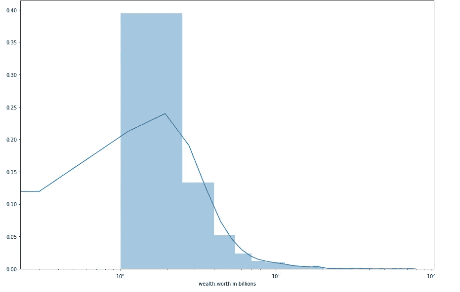

我用对数标度至少显示了一些分布。显然，有更多的人没有巨额资金，但也有一个长尾巴，表明有很多人非常有钱。

我们继续吧。*我们的亿万富翁年龄有多大？*

我们记得这一栏有离群值，我们把它们清理一下，看右图。

```
df = df[df['demographics.age'] > 0] # drop the records with incorrect age 
plt.figure(figsize=(15,10)) 
sns.distplot(df['demographics.age'], bins=15) 
plt.show()
```

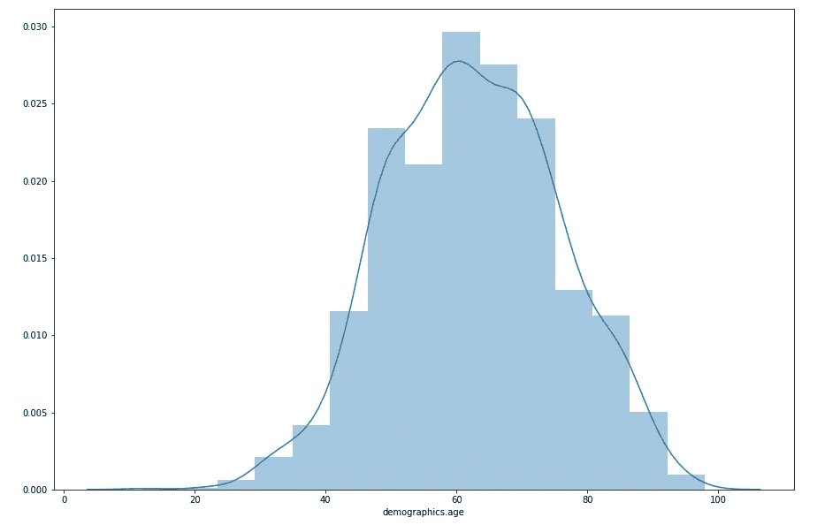

分布与正态相似，左边的尾部略大。

让我们以同样的方式按行业进行划分。

```
plt.figure(figsize=(15,10))
g = sns.FacetGrid(data=df, hue='wealth.how.industry', aspect=3, height=4)
g.map(sns.kdeplot, 'demographics.age', shade=True)
g.add_legend(title='wealth.how.industry')
```

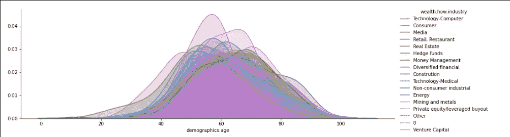

```
industries = ['Hedge funds', 'Consumer', 'Technology-Computer']
plt.figure(figsize=(15,10))
g = sns.FacetGrid(
    data=df[(df['wealth.how.industry'] != '0') & (df['wealth.how.industry'].isin(industries))], 
    hue='wealth.how.industry', 
    aspect=3, 
    height=4)
g.map(sns.kdeplot, 'demographics.age', shade=True)
g.add_legend(title='wealth.how.industry')
```

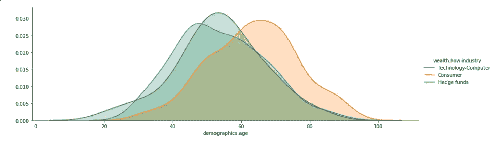

你可以看到钱流向了数据集中较老的部分。此外，可以看出科技公司更偏向年轻人，而消费行业则偏向老年人。还有一个行业，出于某种原因，一个人可以在 20 岁之前变得富有。

# 绘制定性数据

分类特征不能通过直方图可视化。相反，您可以使用条形图。

让我们来回答这个问题— *比较有钱的亿万富翁都是在什么行业？*

```
city = df['wealth.how.industry'].value_counts(ascending=False)

df_city = df.filter(['wealth.how.industry'], axis=1)
df_city['count'] = 1

grouped_city = df_city.groupby('wealth.how.industry', as_index=False,sort=False).sum()
grouped_city.sort_index(ascending=False)

grouped_city = grouped_city.sort_values('count', ascending=False)                            

plt.figure(figsize=(15,8))
sns.barplot(data=grouped_city, x='count', y='wealth.how.industry')
plt.title('Industries of billioners', fontsize=17)
```

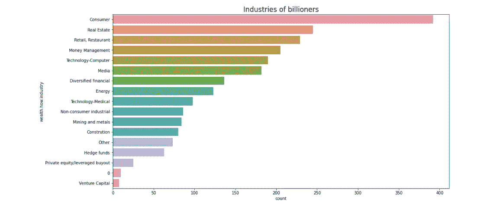

从顶部的情节来看，是以消费者为目标的行业。我很难得出任何结论，但正是这种洞察力让我可以告诉企业。此外，还有一些行业“0”——我们可以假设这些人根本没有行业或者行业混杂。

*亿万富翁中男性多还是女性多？*

```
plt.figure(figsize=(7,5)) 
sns.countplot(data=df, x='demographics.gender') 
plt.title('Gender', fontsize=17)
```

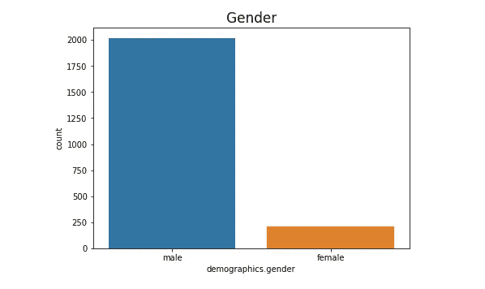

刚好大部分都是男的。

*让我们来看看亿万富翁国家。*

```
column = 'location.citizenship'
fig  = go.Figure(data = [
    go.Pie(
        values = df[column].value_counts().values.tolist(),
        labels = df[column].value_counts().keys().tolist(),
        name = column,
        marker = dict(line = dict(width = 2, color = 'rgb(243,243,243)')),
    hole = .3
    )],
    layout=dict(title = dict(text="Billionaire countries"))

)
fig.update_traces(textposition='inside', textinfo='percent+label')
fig.show()
```

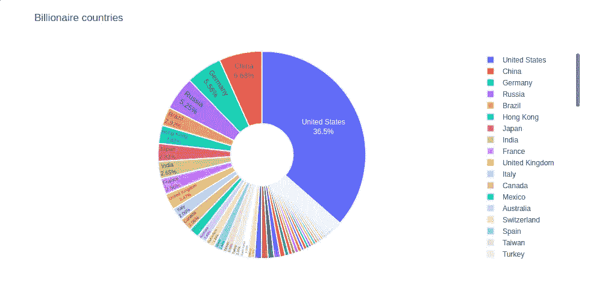

超过三分之一的亿万富翁来自美国。

可以看到，有些行业，还有性别，数据很少。这些是罕见的课程。在构建模型时，它们通常会有问题。它们要么导致阶级失衡(取决于什么将是目标)，从而导致过度适应模型。

# 箱线图

盒状图(也称为盒须图)是一种基于五个数字汇总显示数据分布的标准化方法:

如果以非图形格式呈现，上述关于箱线图的信息几乎同样容易评估。箱线图是有用的，因为在实践中，所有上述内容以及更多内容都可以一目了然。

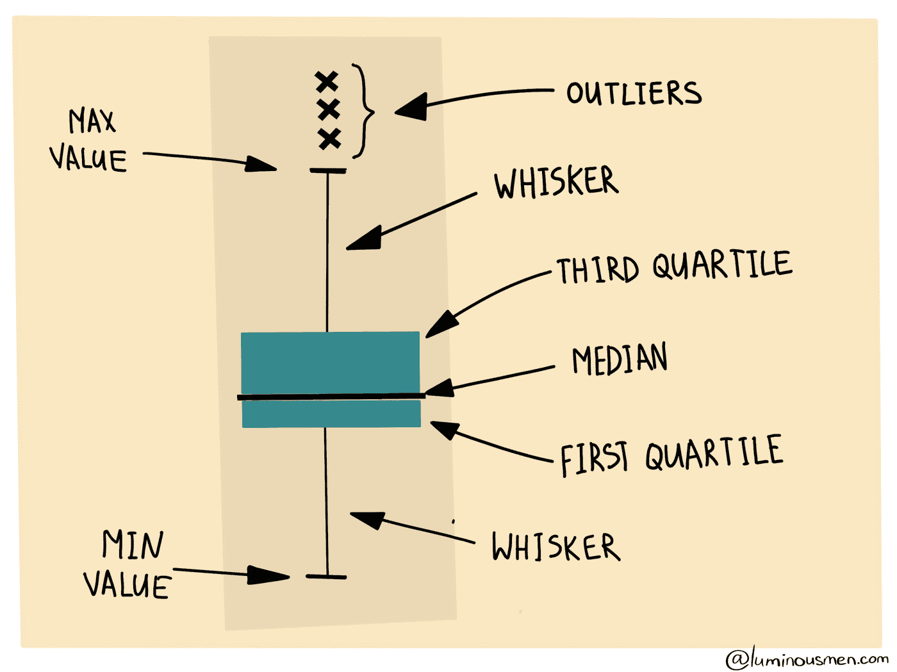

人们可以注意到分布的对称性和“肥尾”的可能迹象。你可以通过观察中线是否在盒子的中心以及胡须的长度是否相等来估计对称性。在偏斜分布中，中间值将被推向短须的方向。此外，箱线图有助于发现数据中的异常值——从其他数据中脱颖而出的数据。

让我们浏览所有的定量数据，并建立它们的箱线图。

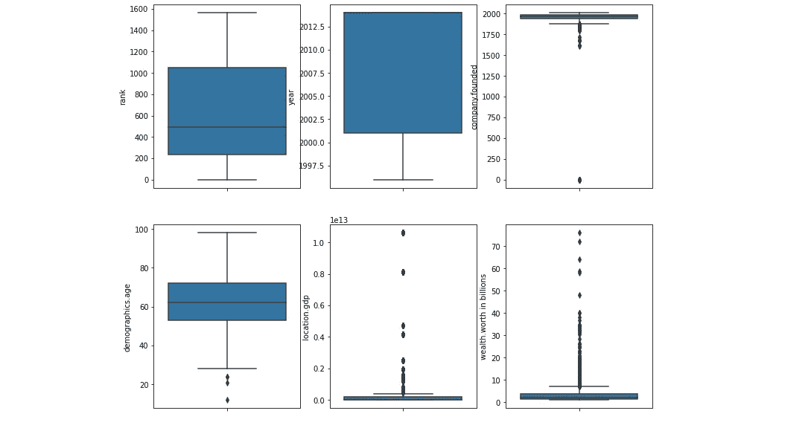

它似乎显示了人类在整个样本中的等级。

`year`。我们可以看到收集亿万富翁的时间段。你可以看到他非常倾向于最近几年，这似乎是合乎逻辑的-如果你很久以前就可以赚到第一个十亿，那么随着时间的推移，你可能会积累更多，你不太可能离开这个名单。

`company.founded`。类似的结论，也可以看出很可能存在一些缺失值。我们以后还得对付他们。

`demographics.age`。很多离群值，你可以看到有零年龄或者负年龄的人，这是不对的。如果你扔掉这样的异常值，你可能会怀疑这个变量分布中有接近正态的东西。我们应该为这个变量绘制一个距离图。

`location.gdp`。很难在这个图表上说些什么——似乎大多数亿万富翁国家都不是很富裕，但很难判断这个栏目到底是什么意思。

`wealth.worth in billions`。大量的异常值，尽管按季度来看，我们可以说大多数都有接近于零的数十亿，这是我们在前面的图中已经看到的。

在最简单的箱线图中，中间的矩形跨越第一个四分位数到第三个四分位数(四分位数间距或 IQR)。通常，异常值要么是第三个四分位数以下的 3 倍 IQR，要么是第一个四分位数以上的 3 倍 IQR。但是对于每个数据集，离群值的定义是不同的。

箱线图非常擅长呈现关于中心趋势、对称性和方差的信息，尽管它们会误导多模态等方面。箱线图的最佳应用之一是并列箱线图(见下面的多变量图形分析)。


# 相关分析

我们已经讨论过什么是[相关性](https://luminousmen.com/post/data-science-correlation)以及为什么需要它。简而言之，相关性允许您查看数字特征和其他数字特征之间的关系。概括地说，相关性取值范围为-1 到 1。负相关意味着当一个特征增加时，另一个特征减少，正相关意味着当一个特征增加时，另一个特征增加。0 没有关系。

在查看数据时，相关性研究非常有用，因为它给出了列之间如何相关的概念。

关联热图有助于您可视化这些信息。

```
cols = ['rank', 'year', 'company.founded', 'demographics.age', 'location.gdp'] 
sns.set(font_scale = 1.25) 
sns.heatmap( df[cols].corr(), annot = True, fmt = '.1f' ) 
plt.show()
```


一般来说，您应该注意:

*   哪些特征与目标变量密切相关？
*   其他特征之间是否存在有趣或意想不到的强相关性？

我从我的数据中看不到任何有趣的见解。

# 不要害怕尝试更多

很明显，这里描述的那些简单的可视化并不能总是描述和显示数据的所有方面并回答所有问题。所以不要害怕实验和尝试其他概念。

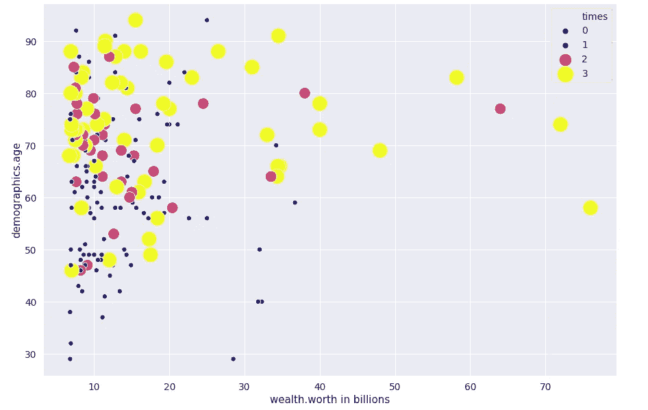

完整的笔记本可以在[这里](https://nbviewer.jupyter.org/gist/luminousmen/3c4d9a221c0e0007e785d02a17689eb5)找到

# 结论

在探索性数据分析步骤结束时，您将对数据集有一个相当好的理解，对数据清理有一些注意，并且可能对要素工程有一些想法。

## 推荐书籍

*   [数据科学从零开始【附属】](https://amzn.to/2M0Jy4r)
*   [数据科学【附属】](https://amzn.to/3sCQbdW)

**感谢您的阅读！**

有什么问题吗？请在下面留下您的评论，开始精彩的讨论！

查看我的博客或者来打个招呼👋在 [Twitter](https://twitter.com/luminousmen) 或订阅[我的电报频道](https://t.me/iamluminousmen)。
规划好自己！