# 探索性数据分析和数据清理实践练习

> 原文：<https://towardsdatascience.com/exploratory-data-analysis-and-data-cleaning-practical-workout-2a20442b42fb?source=collection_archive---------10----------------------->

## 为 ML 算法准备数据的逐步指南


照片由[法比奥](https://unsplash.com/@fabioha?utm_source=medium&utm_medium=referral)在 [Unsplash](https://unsplash.com?utm_source=medium&utm_medium=referral) 上拍摄

探索性数据分析(EDA)是数据科学的重要组成部分，因为它有助于发现我们正在处理的数据实体之间的关系。当我们第一次处理数据时，使用 EDA 很有帮助。它还有助于处理大型数据集，因为实际上不可能确定与大量未知数据的关系。随着我们在 EDA 领域的深入，我们发现了各种模式，这些模式被证明对进一步的数据处理和建模是卓有成效的。

在本文中，我们将尝试揭示影响印度工程专业毕业生薪酬的因素，并随后仅选择对薪酬有较大影响的相关类别。清理后的数据将为任何可以预测工资的回归算法做好准备。

## 资料组

对于这个 EDA，我们将使用 [Kaggle](https://www.kaggle.com/manishkc06/engineering-graduate-salary-prediction) 上的“工程毕业生工资预测”数据集。如果您想了解相同的内容，它包含了关于数据中可用类别的详细信息。

[](https://www.kaggle.com/manishkc06/engineering-graduate-salary-prediction) [## 工科毕业生薪酬预测

### 预测一个印度工科毕业生的工资

www.kaggle.com](https://www.kaggle.com/manishkc06/engineering-graduate-salary-prediction) 

## **导入库**

```
import numpy as np 
import pandas as pd 
import seaborn as sns
import matplotlib.pyplot as plt
```

## 加载数据

```
df = pd.read_csv('../input/engineering-graduate-salary-prediction/Engineering_graduate_salary.csv')
df.head()
```

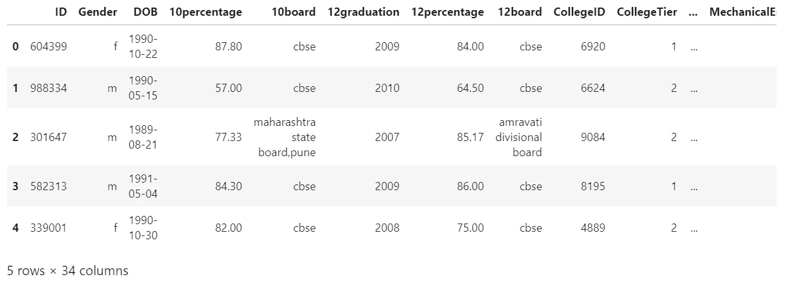

现在，让我们分析数据，并对我们正在处理的问题有一个基本的了解。

```
df.columns
```

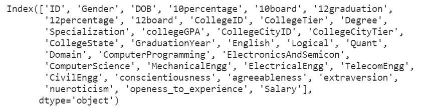

现在，如果我们仔细观察，有一些列显然不会影响工资，如“ID”、“DOB”、“第 10 和第 12 董事会”等。我们将去掉这些多余的列。

```
df = df.drop(['ID', 'DOB', 'CollegeID', '12graduation' ,'GraduationYear','10board', '12board' , 'CollegeState','CollegeCityID', 'CollegeCityTier',],axis = 1)
df.head()
```

现在，我们应该还有 24 列。

让我们检查一下我们的数据中是否有重复的。

```
df.duplicated().sum()
```

在运行这段代码时，我们看到没有重复的代码需要处理。

现在，让我们检查专门化列。

```
df.Specialization.value_counts()
```

输出:

```
electronics and communication engineering      670
computer science & engineering                 557
information technology                         506
computer engineering                           415
computer application                           201
mechanical engineering                         155
electronics and electrical engineering         148
electronics & telecommunications                89
electrical engineering                          63
electronics & instrumentation eng               24
information science engineering                 18
electronics and instrumentation engineering     18
instrumentation and control engineering         18
civil engineering                               15
electronics engineering                         13
biotechnology                                   12
other                                           10
industrial & production engineering              8
chemical engineering                             7
mechanical and automation                        5
applied electronics and instrumentation          5
telecommunication engineering                    4
computer science and technology                  4
automobile/automotive engineering                4
aeronautical engineering                         3
electronics and computer engineering             3
mechatronics                                     3
instrumentation engineering                      3
industrial engineering                           2
biomedical engineering                           2
metallurgical engineering                        2
information & communication technology           1
computer and communication engineering           1
information science                              1
mechanical & production engineering              1
ceramic engineering                              1
computer networking                              1
control and instrumentation engineering          1
electrical and power engineering                 1
embedded systems technology                      1
electronics                                      1
industrial & management engineering              1
Name: Specialization, dtype: int64
```

如果我们观察到这一点，我们可以理解，如果我们试图使用这些数据来训练模型，有许多单个值会不必要地影响模型。让我们将这些数据组合在一起，因为它们并没有给整个“信息”增加多少价值。

```
specialization = df.Specialization.value_counts() #Store the values # in specialization
lessthan10 = specialization[specialization<=10]
lessthan10def correctSpecialization(val):
    if val in lessthan10:
        return 'Others'
    else:
        return valdf['Specialization'] = df['Specialization'].apply(correctSpecialization)df['Specialization'].value_counts()
```

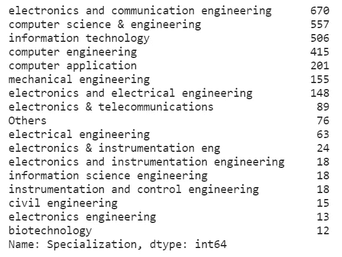

酷毙了。这些数据似乎是我们可以利用的。

让我们现在检查统计数据。

```
df.describe() #Understand the statistics of given data.
```

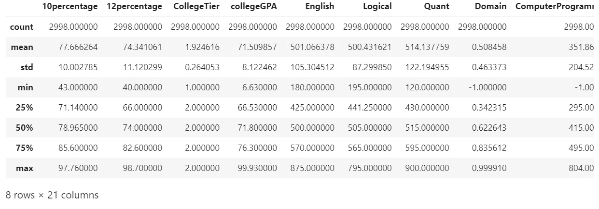

如果我们观察，我们可以看到 GPA 的最大值为 99.93，最小值为 6.63，这是一个很大的范围，6.63 可能是一些错误的值。我们还不知道呢！但是，有些事情似乎肯定是错的！让我们对此进行分析，看看我们是否可以去除异常值(如果有的话)。

```
plt.scatter(df.index,df['collegeGPA'])
```

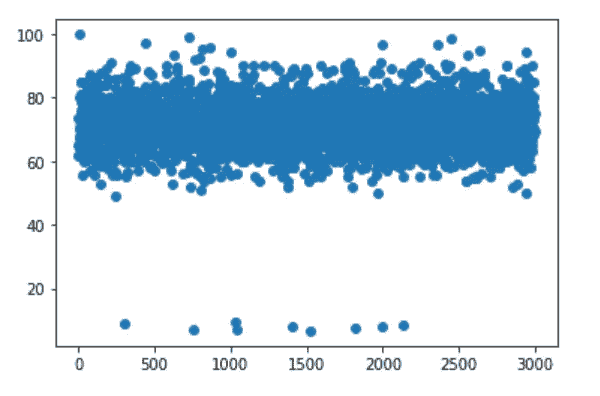

当涉及到 EDA 时，图表和绘图是非常可靠的。这些简单的步骤有助于直观地识别是否有异常值。该图清楚地显示，这些值大部分位于 50–100 范围内，我们可以安全地删除小于 20 的值，这可能会引入不必要的偏差。

```
df = df[(df['collegeGPA'] > 40)]
```

您可以再次绘制相同的图表，并观察数据现在是一致的。

我对其他色谱柱进行了类似的操作，为了节省时间，我只提到了哪些色谱柱需要进一步分析和清洗。其他列都很统一，但是您也可以分析它们进行练习，并使用任何方法来处理相同的问题。

```
plt.figure(figsize = (15,15))plt.subplot(3,3,1)
plt.scatter(df.index, df.ElectronicsAndSemicon)
plt.title('ElectronicsAndSemicon')plt.subplot(3,3,2)
plt.scatter(df.index, df.Domain)
plt.title('Domain')plt.subplot(3,3,3)
plt.scatter(df.index, df.ComputerProgramming)
plt.title('ComputerProgramming')plt.show()
```

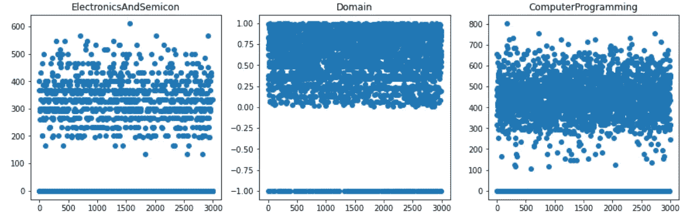

毫无疑问，在所有 3 个图中，我们可以看到异常值的存在。我们来处理一下。

```
df = df.replace(-1,np.nan)cols_with_nan = [col for col in df.columns if df.isna().sum()[col]>0]for col in cols_with_nan:
    df[col] = df[col].fillna(df[col].mean())
```

我首先用 nan 替换了-1 值，然后用这些列的平均值替换了所有这些值。

现在，如果我们将它与原始数据进行比较，我们可以明确地观察到，我们的新数据更加清晰，更易于使用。它包含统一的价值观，并以某种方式影响工资。

让我们检查一下雄性和雌性的数量。

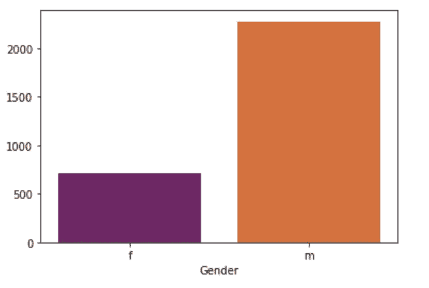

```
sns.countplot(df.Gender,palette = 'inferno')
```

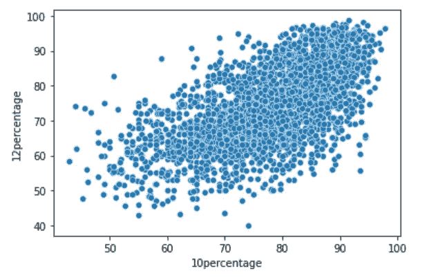

让我们看看第 10 和第 12 个百分比之间是否有任何关系。

```
sns.scatterplot(df[‘10percentage’],df[‘12percentage’])
```

显然，在第 10 和第 12 个百分比之间可以看到线性。

可以使用所有类别对这些数据进行进一步分析，并与工资进行比较。例如:

```
plt.figure(figsize = (10,5))
sns.scatterplot(df.collegeGPA,df.Salary, hue = df.Degree,palette = 'inferno')
```

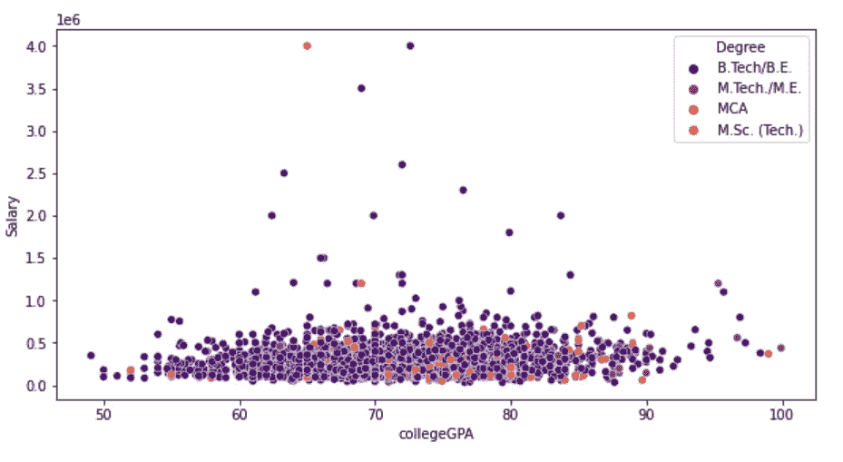

在这里，我们可以看到，大多数 B.Tech/B.E.学生都找到了薪水更高的工作。类似地，其他列可以与薪金进行比较。

现在让我们看看“开放体验”和薪水之间是否有什么联系。可以观察到，分数越高的毕业生薪水越高。

```
plt.figure(figsize = (10,5))
sns.scatterplot(df.openess_to_experience,df.Salary)
```

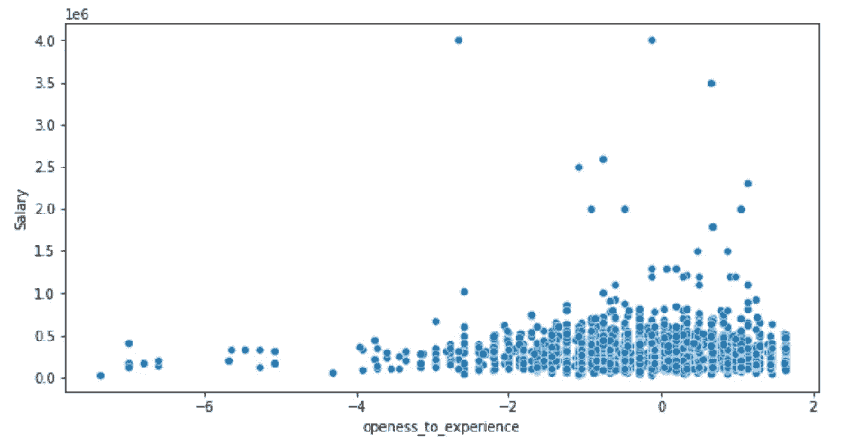

## 数据预处理

这最后一部分已经完成，所以最终的数据已经准备好提供给 ML 模型。

让我们检查数据类型，看看是否需要任何处理。

```
df.info()
```

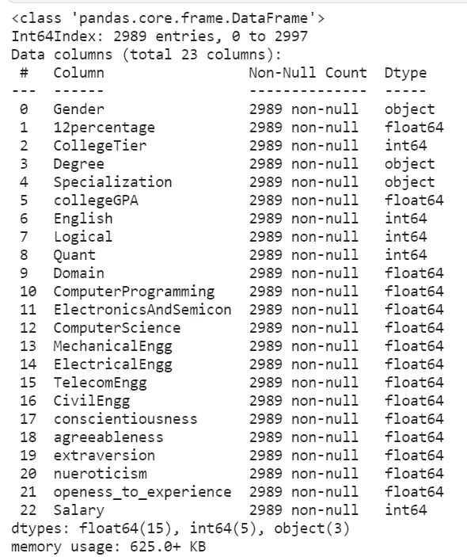

性别、学位、专业需要处理，因为它们属于不适合 ML 模型输入的“对象”类型。

```
from sklearn.preprocessing import LabelEncoder
le = LabelEncoder()df.Gender = le.fit_transform(df.Gender)
df.Degree = le.fit_transform(df.Degree)
df.Specialization = le.fit_transform(df.Specialization)
```

现在，让我们检查最终数据。

```
df.head()
```

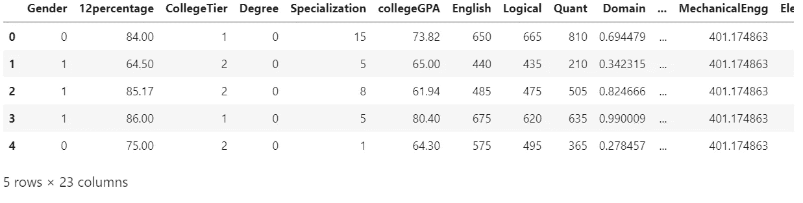

耶！数据终于准备好了。你现在可以在这个数据上尝试各种算法进行薪资预测！这整个过程绝对是重要的，以避免坏的模型预测，只是增加所有的工作全部重来！

我这边就是这样！建议总是受欢迎的。:)