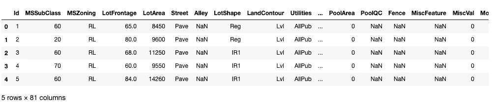
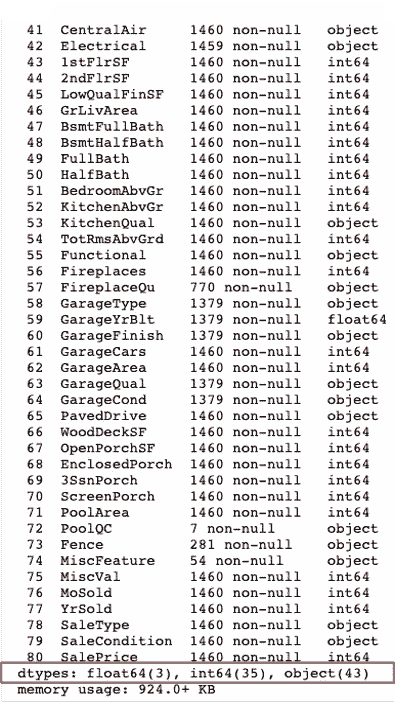
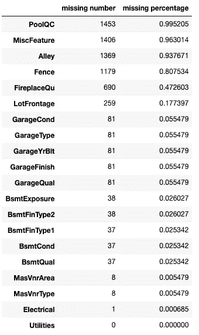
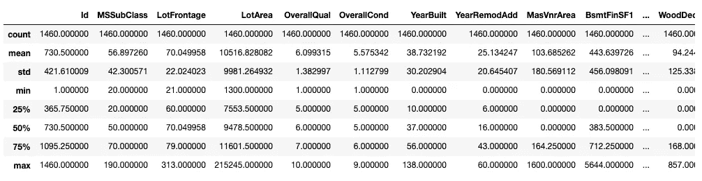
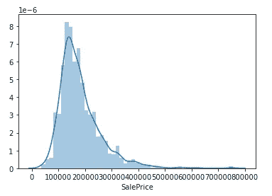
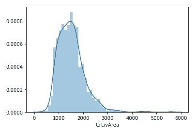
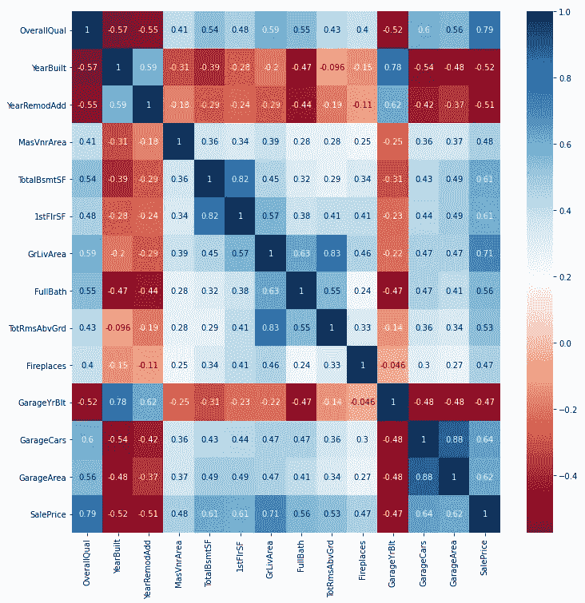
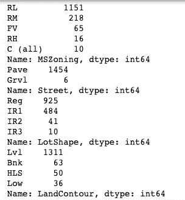
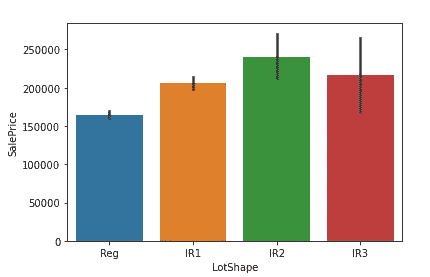
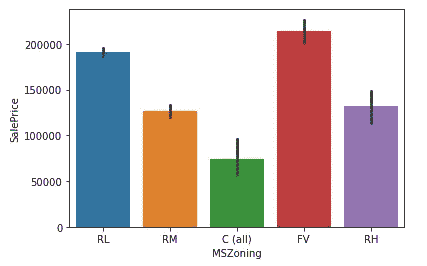

# 探索性数据分析

> 原文：<https://towardsdatascience.com/exploratory-data-analysis-eda-72ba03480417?source=collection_archive---------14----------------------->

## 我如何在建模前调查数据


在 [Unsplash](https://unsplash.com/s/photos/investigation?utm_source=unsplash&utm_medium=referral&utm_content=creditCopyText) 上由 [Adeolu Eletu](https://unsplash.com/@adeolueletu?utm_source=unsplash&utm_medium=referral&utm_content=creditCopyText) 拍摄的照片

人们总说“做建模之前要先了解数据”。“**了解数据**到底是什么意思，有什么具体的步骤可以遵循吗？

> 理解数据的过程称为探索性数据分析(EDA)。它是指在应用机器学习模型之前，对数据集进行初步调查和分析，以了解分布、异常、相关性和其他数据特征的过程。

假设您已经有了包含所有必需数据变量的数据集，并定义了要优化的因变量。本文将介绍如何使用数据集来更好地理解它。

对于如何进行 EDA，没有固定的过程。我觉得以下步骤可能有助于您更好地理解数据，但您可以根据您的数据集对其进行自定义。

# 资料组

我们使用 Kaggle 的[房价数据集。数据的想法很简单——根据房屋特征预测房价。但是，我们从这个数据例子中了解 EDA 过程是非常理想的，因为它有 **80 个自变量**！](https://www.kaggle.com/c/house-prices-advanced-regression-techniques/data)

> H 我们如何更好地理解数据以**选择有用的预测指标**来预测房价将是这项工作的关键。

# EDA 的步骤

## 第一步。查看整个数据概览

```
train.head()
```



查看前 5 行数据，了解每一行的情况。您可以使用 tail 函数查看最后 5 行数据

```
train.shape
#(1460,81)
```

查看数据集的行数和列数

```
train.info()
```



查看每列信息(数据类型，空行)

我们可以看出目标变量(Saleprice)是连续的整数数据类型。

结果的最后一部分(在下面的屏幕截图中用红色突出显示)显示了所有列的数据类型分布。例如，在这种情况下，我们知道我们有 38 列(包括因变量)数字类型(float 或 int)，43 列字符串类型。

## 第二步。查看缺失的数据

在前面的屏幕截图中，我们可以看到某些列有很多空值，这在预测中是不可取的。在这里，我们首先希望**看到数据集中顶部缺失的列**。

```
#count rows of missing data for each column
missing_number=train.isnull().sum().sort_values(ascending=False)#Calculate percentage of null value
missing_percentage=missing_number/len(train)
missing_info=pd.concat([missing_number,missing_percentage],axis=1,keys=['missing number','missing percentage'])
missing_info.head(20)
```



缺失值计数

我们可以看到 19 列缺少记录，6 列缺少超过 15%的数据。

> 就个人而言，我会删除掉**超过 15%缺失记录**的列。然而，这也取决于**有多少数据字段可用**和**字段在预测最终**中有多重要。

```
drop_columns=missing_info.head(6).index
train=train.drop(columns=drop_columns)
```

删除前 6 个缺失的列(缺失超过 15%的 6 列)

## 第三步。将数据集分为数字和分类(字符串)

```
numerics = ['int64', 'float64']
df_num = train.select_dtypes(include=numerics)
```

从数据集中提取数字数据。这里你应该参考 data.info()结果来看看你的数据类型是什么。

```
df_num[['YearBuilt','GarageYrBlt','YrSold','YearRemodAdd']]=2010-df_num[['YearBuilt','GarageYrBlt','YrSold','YearRemodAdd']]
```

**对“错误数字”列的特殊处理:**这里我指的是以数字形式存在但实际上是分类的数据字段。例如，年份或城市等级以数字形式存在，但它们实际上是分类数据。您可以将它们视为数值型(如果 value 有意义)，将它们放入分类桶中，或者将数据转换为数值型。

在我的例子中，我使用的是最后一种方法。例如，在“建造房屋的年份”列中，我使用当前年份减去“建造房屋的年份”来获得房屋建造的年份。这样，它就是一个有效的数值变量。

```
for num_var in df_num.columns:
    df_num[num_var].fillna(df_num[num_var].mean(),inplace=True)
```

替换数字数据中的空值

这里我使用列的**平均值来填充空值。您可以选择对其他一些变量使用中值甚至简单的回归函数(如果在最终模型中也包含这些变量，可能会导致多重共线性)**

```
df_cat= train.select_dtypes(include='object')
```

从数据集中提取字符串值列

```
for cat_var in df_cat.columns:
    df_cat[cat_var].fillna(df_cat[cat_var].mode()[0],inplace=True)
```

在这里，我用列中最常出现的值或模式值来填充分类空值。

## 第四步。查看数字列的数据分布

```
df_num.describe()
```



Describe 命令为您提供了一个关于所有数字列的汇总统计信息的概览表

```
for i, col in enumerate(df_num.columns):
    plt.figure(i)
    ax = sns.distplot(train[col])
```



或者你可以画出所有数字变量(这里包括目标变量)的分布图，看看它们是右偏还是左偏。如果分布过于倾斜，您可能需要进行变换。上面的两个示例图显示，目标变量和地面居住面积都是右偏的，有一个长的右尾。

```
df_num.corr()
```

Corr()将以表格的形式给出所有数值变量的相关矩阵。这对于查看自变量之间或自变量与因变量之间的相关性非常有用。然而，普通表格看起来并不那么用户友好，尤其是有大量预测值的时候。

```
import seaborn as sns
import matplotlib.pyplot as plt#find correlation matrix
corr_mat=df_num.corr()#Select variables have more than 0.4 or less than -0.4 correlation with the dependent variable(SalePrice)
chosen_variable=corr_mat[abs(corr_mat["SalePrice"])>0.4].index#plot the heatmap
plt.figure(figsize=(12,12))
ax = sns.heatmap(df_num[chosen_variable].corr(),annot=True,cmap='RdBu')
```



热图

热图是关联矩阵更直观的表示。在这里，我只选择和想象与销售价格相关度大于 0.4 或小于-0.4 的预测值。这是因为与因变量相关性的绝对值越高，预测值就越重要。

这也有助于你了解预测因子之间的相互关系。例如，地下室总表面和一楼表面具有 0.81 的强相关性。即使它们在预测销售价格方面都非常重要，您也应该只选择一个包含在模型中。

这是选择重要数值特征的好方法，您可以根据预测值的数量来选择边界。如果您不喜欢当前的颜色组合，您也可以通过更改热图功能中的“cmap”参数，在此处参考[选择其他颜色。](https://matplotlib.org/stable/tutorials/colors/colormaps.html)

## 步骤 5:查看文本变量的数据特征

```
for cat_var in df_cat.columns:
    print(df_cat[cat_var].value_counts())
```



结果的前 4 个变量

这将打印出所有字符串变量的分布。如果一个文本变量非常集中在某个值上，如住房数据集中的“街道”,该数据集中有 1454 个 Pave，而 Grvl 上只有 6 个，那么它对预测不会有很大的贡献。

```
for i, col in enumerate(df_cat.columns):
    plt.figure(i)
    ax = sns.barplot(x=col, y="SalePrice", data=train)
```



分类变量和因变量之间的条形图(销售价格)

这部分绘制了每个分类变量类别之间销售价格分布的柱状图。理想情况下，您希望看到不同类别之间销售价格的巨大差异，因为这样分类变量将是预测最终价格的一个很好的预测器。

您还应该查看前面的 value_count 表的结果，以确保每个类别都有足够的数据大小来支持它。例如，即使铺路街道类型的房屋比 Grvl 街道类型的房屋具有明显更高的平均销售价格，也只有 6 所房屋具有 Grvl 街道类型，因此数据大小不具有支持结论的统计意义。

# 最后

**还有几点需要注意:**

1.  这里我假设我们只有一个训练数据集。如果您既有训练数据集又有测试数据集，您应该将它们结合起来用于 EDA，因为它可能涉及一些数据转换
2.  房价的例子就是回归的例子。这里的因变量是连续的和数值的。如果你有一个分类问题，你应该选择绘制条形图分布，而不是相关矩阵来选择数值预测。
3.  如果你有时间序列变量，你也可以用因变量绘制时间趋势图来观察特征的显著性

绘制了变量的相关性和分布之后，如何知道应该处理多重共线性还是正态性问题？你可以从下面我以前的文章中找到更多信息:

[](/multi-collinearity-in-regression-fe7a2c1467ea) [## 回归中的多重共线性

### 为什么这是个问题？如何跟踪和修复它

towardsdatascience.com](/multi-collinearity-in-regression-fe7a2c1467ea) [](/is-normal-distribution-necessary-in-regression-how-to-track-and-fix-it-494105bc50dd) [## 回归中正态分布有必要吗？如何跟踪修复？

### 博克斯-考克斯变换，夏皮罗-维尔克检验，QQ 图

towardsdatascience.com](/is-normal-distribution-necessary-in-regression-how-to-track-and-fix-it-494105bc50dd)