# 使用优步游乐设施数据集的实用方法

> 原文：<https://towardsdatascience.com/exploratory-data-analysis-eda-a-pratical-approach-using-your-uber-rides-dataset-5e9f0e892149?source=collection_archive---------6----------------------->

## Python 中的探索性数据分析


本杰明·沃罗斯拍摄的照片

探索数据无疑是数据科学过程中最重要的阶段之一。尽管它很简单，但它可以成为一个强大的工具，让你在数据和业务背景方面领先，并在创建机器学习模型之前确定关键的处理方法。

为了让事情变得更有趣一点，我决定在我的个人优步骑行数据上玩玩 Python，看看我能提取出哪些见解。

在这篇文章中，我将指导你完成以下步骤:

1.问题定义

2.数据发现

3.数据准备

4.数据分析和讲故事

**注意:数据准备通常是一个需要围绕数据格式化、清理和操作进行大量工作的阶段，但是使数据一致是您的分析和未来建模的一个成功因素。**

# 请求和下载您的个人数据集

优步的数据下载功能为您提供关于您的骑行的深入信息。您可以通过以下链接请求访问您的数据:【https://myprivacy.uber.com/privacy/exploreyourdata/download 

在您的请求完成后，一封带有下载链接的电子邮件将发送给您(通常在同一天)。

*为了安全起见，您的数据只有******7 天*** *。***

# **1.问题定义:第一件事，第一！**

**在开始处理和分析数据之前，你应该做的第一件事是**思考目的**。我的意思是，你应该**想想你为什么要进行这样的分析的原因。如果你不确定这一点，简单地开始制定关于你的主题的问题，如**什么？什么时候？在哪里？谁啊。哪个？怎么会？多少？多少钱？******

**根据您拥有的数据和要素的数量，分析可能会变得无穷无尽。所以这就是为什么(经过思考过程)我决定关注以下问题:**

```
**a. How many trips have I done over the years?
b. How many trips were Completed and Canceled?
c. Where did most of the dropoffs occur?
d. What product type was usually chosen?
e. What was the avg. fare, distance, amount and time spent on rides?
f. Which weekdays had the highest average fares?
g. Which was the longest/shortest and more expensive/cheaper ride?
h. What was the average lead time before begining a trip?**
```

**很明显，这些只是引导你分析的问题。但是，让我们假设我是一名经理，我的问题定义是: ***我对业务主要指标(问题)没有可见性，无法开始推动对业务(目的)的见解和决策。*****

**为了更好地指导您，请始终尝试思考 3 个主要问题:**

**什么？(**问题:**需求是什么，意图是什么，痛苦是什么？)**

**为什么？(**目的:**为什么要这样？你的目标是什么？)**

**怎么会？(**产品:**如何解决你的问题？哪个工具？)**

**注意:在你清楚问题和目的之前，不要进入下一阶段。**

# **2.数据发现**

**导入库和数据集。**

**检查基本数据集信息(数据类型和维度)**

```
**<class 'pandas.core.frame.DataFrame'>
RangeIndex: 554 entries, 0 to 553
Data columns (total 13 columns):
 #   Column                Non-Null Count  Dtype  
---  ------                --------------  -----  
 0   City                  554 non-null    int64  
 1   Product Type          551 non-null    object 
 2   Trip or Order Status  554 non-null    object 
 3   Request Time          554 non-null    object 
 4   Begin Trip Time       554 non-null    object 
 5   Begin Trip Lat        525 non-null    float64
 6   Begin Trip Lng        525 non-null    float64
 7   Dropoff Time          554 non-null    object 
 8   Dropoff Lat           525 non-null    float64
 9   Dropoff Lng           525 non-null    float64
 10  Distance (miles)      554 non-null    float64
 11  Fare Amount           554 non-null    float64
 12  Fare Currency         551 non-null    object 
dtypes: float64(6), int64(1), object(6)
memory usage: 56.4+ KB**
```

****T6。rename( )** 方法允许你重命名轴标签(索引和列)。在这种情况下，我决定规范化列名以清理编码，因为我以后可以通过键入`**<data_frame>.<column>**`轻松地调用列**

**使用 ***。head( )*** 方法获得更多关于数据格式的敏感性，并了解数据集值的整体结构。**

**看一看**连续变量**，我们注意到一些异常值的存在。然而，**这些异常值似乎并没有反映出任何异常值**(例如，fare_amount = 1000 BRL)，这可能会让我们稍微舒服一点。**

***附注:如果发现异常值，可能需要考虑一些处理措施(例如异常值替换/移除)。***

**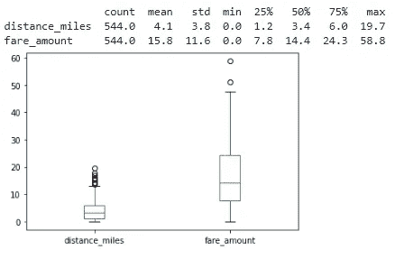**

**下面的图表从不同的角度展示了变量的分布。在这种情况下，我们看到两个变量都呈现出**不对称分布(正)**。对于距离，我们注意到频率值越高，距离越短，对于费用金额，我们有相同的行为。**

**此外，我们还注意到**标准偏差较高**，以“平均值”作为我们的参考。这意味着两个变量中的**值非常分散**。**

**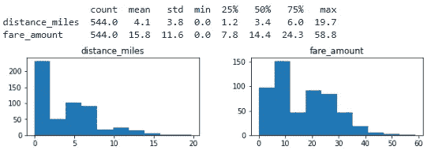**

**毫不奇怪，我们在“票价 _ 金额”和“距离 _ 英里数”之间有很强的相关性，推断出你在旅途中停留的时间越长，票价就越高。**

```
**sns.scatterplot(x='distance_miles',y='fare_amount',data=df1);**
```

**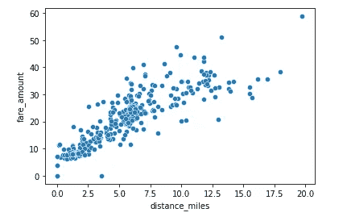**

# **3.数据准备**

**我决定删除列 **fare_currency** ，因为我所有的旅行都发生在同一个国家(巴西)。**

**现在让我们检查 ***缺失值*** 的存在。**

**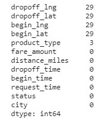**

**尽管 Lng 和 Lat 值为空(总共 29 个)，但发现 3 个记录没有`product_type`。如下所示，这些记录对我的数据集来说无关紧要，因为实际上没有满足任何列。**

**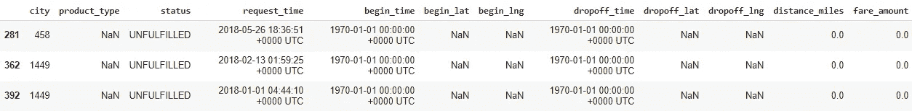**

**现在，让我们在继续之前去掉这 3 条记录。**

# **3.1 数据清理:分类特征**

**在分析第一个分类列`**<product_type>**`时，我可以清楚地看到一些工作是必要的，因为我可以找到引用同一类别的不同值。然后，我**总结了 5 个**中的 15 个原创类别。**

**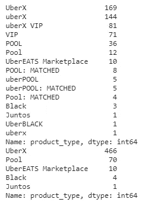**

**由于该分析的范围仅围绕优步的游乐设施，所以我从数据集中删除了 ***UberEATS*** 记录。**

**我们的第二个分类特征`<status>`似乎可以分为三种状态，不需要任何治疗。**

**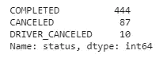**

# **3.2 数据转换:处理日期**

**日期通常会大大增强你的分析能力，因为你可以把它分解成不同的部分，从不同的角度获得洞察力。如前所示，我们的日期特性实际上是**对象数据类型**，所以我们需要**将它们转换成*日期时间*格式**。**

**现在，让我们将`<request_time>`特性分解成不同的日期部分。我只是为`<request_time>`这样做，因为我假设所有的游乐设施都在同一天 ***(相信我，我已经检查过了！*:D)**。**

# **3.3 特征工程:创建新特征**

**基于`<fare_amount>`和`<distance_miles>`功能，我创建了一个名为`<amount_km>`的新功能，它将帮助我们了解**按公里支付多少费用**。**

**`<request_time>`和`<begin_time>`之间的时间差将让我们知道**我通常等待优步汽车到达我的目的地有多长时间(以分钟计)**。在这种情况下，它是按分钟计算的。**

**类似地，`<dropoff_time>`和`<begin_time>`之间的时间差将让我们知道**每次行程**花费了多少时间(以分钟为单位)。**

**由于具有**已取消**和 **Driver_Cancelled status** 的记录中的特征对我的分析没有用，我将它们设置为空值**以便在我的数据集中进行更多的清理。****

# **4.数据分析和讲故事:表演时间到了！**

****建议:**不要在没有完成业务问题定义的情况下开始你的分析，因为它决定了你分析的重点和质量。除此之外，这个过程将帮助你思考新的可能性/问题，同时尝试回答之前的问题。**

****注意:**为了更好地组织我的分析，我将创建一个额外的数据框，**删除状态为** `**CANCELED**` **和** `**DRIVER_CANCELED**`的所有行程，因为它们应该从一些问题中忽略。**

# **a.这些年来我去过多少次？**

**从 2016 年 4 月到 2016 年 1 月 21 日，共完成 **444 趟**。如果不考虑 2016 年和 2021 年(未满年)，我们可以清楚地看到，从 **2017 年到 2019 年每年的平均乘坐次数为 124 次**，从 2019 年到 2020 年有一个**巨大的下降(-51%)** 。这很容易用 COVID 的爆发来解释。**

***现在，想象一下，如果我们将这个结果推广到所有优步用户…***

**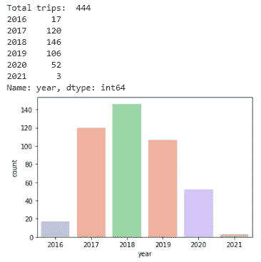**

# **b.完成或取消了多少次旅行？**

**查看下面的堆叠条形图，我们可以看到**不包括 2015 年和 2021 年**(由于出行量低)，2020 年的取消率最高。考虑到 Covid 爆发后对企业造成的巨大影响，这可能是一个令人担忧的指标。总体而言，**取消率为 17.9%** (考虑到骑手和驾驶员取消)。**

**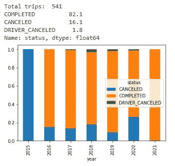**

# **c.大多数辍学发生在哪里？**

**下面的热图以不同的色调和强度动态显示了**最常去的区域**。这可能是优步调整价格和优化某些地区需求的宝贵信息，同时结合时空数据来跟踪用户的行为。**

**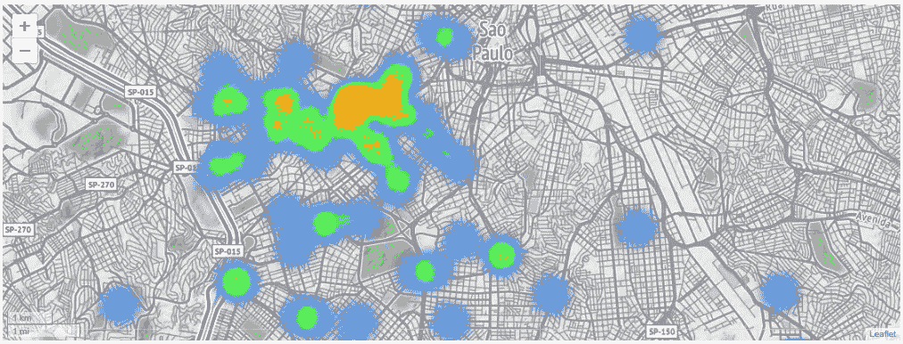**

# **d.通常选择什么类型的产品？**

****UberX** 是目前最受欢迎的产品类型，出现频率为 **90.3%** 。所以我大概可以推断，我是那种通常会寻找实惠价格的用户。**

**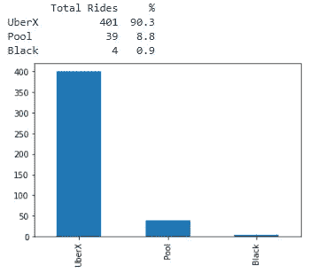**

# **e.乘坐的平均费用、距离、数量和时间是多少？**

**考虑到所有的旅行，每次旅行的平均花费是 **19.2 BRL** ，除去大约。 **8.1 公里**。因此，如果我们在**上做一个快速模拟，我一年要花多少钱**来做每天的往返旅行，我们会:`365 days * 2 trips * 19.2 BRL/fare = 14,016 BRL/year`**

**同样，平均来说，大约花费了**。行程**2.4 BRL/公里和 **21.4 分钟。****

**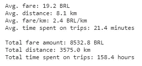**

# **f.哪一个工作日的每公里平均票价最高？**

**根据下面的图表，我们可以看到，平均而言，周一至周三的**、**、**、周五的**、、**周日的**是最贵的**、**。因此，它允许我们更好地理解**周季节性**，并找出优步及其驱动因素盈利能力较高的**天。****

**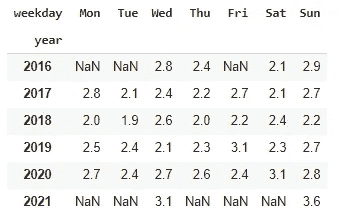****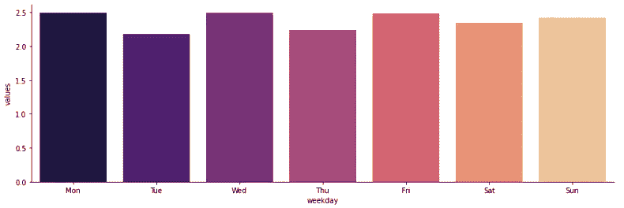**

# **g.最长/最短和最贵/最便宜的旅程是哪一次？**

**下表显示了**最长(31.77 公里)**和**最短(0.24 公里)**的记录。**

**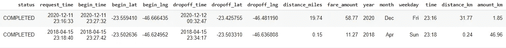**

**分析里程支付的金额，我们有:**贵(46.96 BRL/公里)**和**便宜(0 BRL/公里)**。由于总距离仅为 0.24 公里，这种影响基本上是由**高需求时期**固定最低票价驱动的。**

**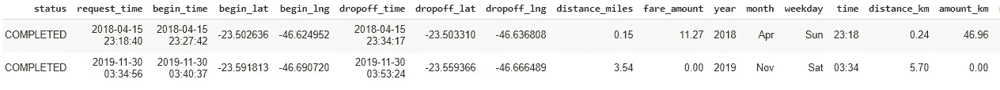**

# **h.开始旅行前的平均准备时间是多少？**

**在发出请求后，大约花了**5 分钟**启动行程。**

```
**4.9 minutes**
```

# **结论**

**探索性数据分析**不是一件小事**！它需要大量的工作和耐心，然而，如果正确地应用到你的商业环境中，它肯定是一个强大的工具。**

**这篇文章简要地展示了一些使分析更容易的技巧和步骤，并且毫无疑问地强调了**一个定义良好的业务问题**的至关重要性，指导所有的编码工作达到一个特定的目标，并且还强调了重要的见解。这个商业案例还试图反映 python 在日常商业活动中的实际应用，展示它可以变得多么有趣、有价值和有趣。**

**非常感谢你来到这里！我希望你喜欢它！😃**